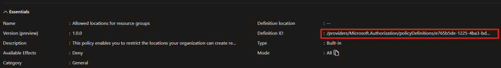

Azure Policy is a critical tool for ensuring governance and compliance within Azure environments. In this blog series, we'll explore how to use [Azure Bicep](https://learn.microsoft.com/en-us/azure/azure-resource-manager/bicep/overview?tabs=bicep), a powerful Infrastructure as Code (IaC) language, to deploy and manage Azure Policy. While the [Enterprise-Scale Azure Policy as Code (EPAC)](https://azure.github.io/enterprise-azure-policy-as-code/) framework is a fantastic, PowerShell-based solution for large-scale policy management, Bicep offers an alternative approach that integrates seamlessly into declarative IaC workflows.

This first post will introduce the key concepts of Azure Policy, including policy definitions and initiatives, and walk through deploying an initiative with built-in policies using Azure Bicep. Let's dive in!

## What is Azure Policy?

[Azure Policy](https://learn.microsoft.com/en-us/azure/governance/policy/overview) is Microsoft's governance service that helps you enforce organisational standards and assess compliance at scale. Whether you're ensuring resources are tagged correctly, restricting resource locations, or monitoring virtual machine configurations, Azure Policy ensures your environment adheres to the rules you define.

### Core Concepts of Azure Policy

- **Policy Definitions**: The rules you define, such as "Allowed resource locations."

- **Policy Initiatives**: Groups of related policy definitions, allowing you to enforce multiple rules as a package.

- **Assignments**: Apply policies or initiatives to specific scopes (e.g., subscriptions, resource groups, management groups).

## Using Azure Bicep for Policy Deployment

Azure Bicep provides a declarative way to define and deploy Azure resources, including Azure Policy. Instead of managing policy deployments with PowerShell, you can use Bicep to integrate policy definitions into your infrastructure codebase.

### Creating a Policy Initiative

Initiatives enable you to group several related policy definitions to simplify assignments and management because you work with a group as a single item. For example, you can group related tagging policy definitions into a single initiative. Rather than assigning each policy individually, you apply the initiative.

We use JSON to create a custom policy initiative. The following example is a policy initiative that restricts the locations allowed for deployments to Azure.

This example utilises two built-in policies, Allowed locations and Allowed locations for resource groups. When creating a policy initiative we need to reference the **policyDefinitionId** of each built-in policy we would like to add to our initiative.

```json
{
  "name": "locations-initiative",
  "displayName": "Allowed resource locations initiative",
  "description": "Policy for restricting the deployment locations.",
  "parameters": {
    "listOfAllowedLocations": {
      "type": "Array",
      "metadata": {
        "description": "The list of locations that can be specified when deploying resources.",
        "strongType": "location",
        "displayName": "Allowed locations"
      },
      "defaultValue": ["australiaeast", "australiasoutheast"]
    }
  },
  "policyDefinitions": [
    {
      "policyDefinitionReferenceId": "Allowed locations",
      "policyDefinitionId": "/providers/Microsoft.Authorization/policyDefinitions/e56962a6-4747-49cd-b67b-bf8b01975c4c",
      "parameters": {
        "listOfAllowedLocations": {
          "value": "[parameters('listOfAllowedLocations')]"
        }
      }
    },
    {
      "policyDefinitionReferenceId": "Allowed locations for resource groups",
      "policyDefinitionId": "/providers/Microsoft.Authorization/policyDefinitions/e765b5de-1225-4ba3-bd56-1ac6695af988",
      "parameters": {
        "listOfAllowedLocations": {
          "value": "[parameters('listOfAllowedLocations')]"
        }
      }
    }
  ]
}
```

### How to Find a Built-In Policy policyDefinitionId

**Azure Portal**:

- Navigate to **Azure Policy** in the portal.

- Select **Definitions** under the "Authoring" section.

  - Filter by "**Definition Type: Policy**" to view a comprehensive list of pre-defined built-in policies.

- Click on a policy to view its details, including its **policyDefinitionId**.



If you prefer command-line tools, you can use Azure CLI or Azure PowerShell to list and retrieve the policyDefinitionId of built-in policies:

**Azure CLI**:

```bash
az policy definition list --query "[?policyType=='BuiltIn']" --output table
```

To fetch the JSON definition of a specific policy:

```bash
az policy definition list --query "[?displayName=='policy-display-name']"
```

**Azure PowerShell**:

```powershell
Get-AzPolicyDefinition | Where-Object { $_.Properties.PolicyType -eq "BuiltIn" }
```

To fetch the JSON definition of a specific policy:

```powershell
Get-AzPolicyDefinition | Where-Object { $_.Properties.DisplayName -eq "policy-display-name" }
```

### Load Policy Initiative in Bicep

Once we have created our policy initiative we can load it in Bicep by utilising the JSON load content function, example below.

```bicep
loadJsonContent('filename.json')
```

### Deploying Policy in Bicep

We can now proceed to deploy the policy initiative. To do so in Bicep we first need to create the initiative and then assign the initiative to the scope of our choosing, example below.

```bicep
var initiative = loadJsonContent('initiative.json')

// Create the initiative
resource policySetDefinition 'Microsoft.Authorization/policySetDefinitions@2023-04-01' = {
  name: initiative.name
  properties: {
    policyType: 'Custom'
    displayName: initiative.displayName
    description: initiative.description
    parameters: initiative.parameters
    metadata: {
      category: 'Example'
      version: '1.0.0'
    }
    policyDefinitions: initiative.policyDefinitions
  }
}

// Assign the initiative
resource policyAssignment 'Microsoft.Authorization/policyAssignments@2023-04-01' = {
  name: 'locations-assignment'
  properties: {
    displayName: initiative.displayName
    description: initiative.description
    enforcementMode: 'Default'
    policyDefinitionId: policySetDefinition.id
    parameters: {
      listOfAllowedLocations: {
        value: initiative.parameters.listOfAllowedLocations.defaultValue
      }
    }
  }
}
```

To demonstrate this, I’ve added a complete example to the repository linked below.

Moving forward, this repository will serve as the central hub for all the code featured in this series, providing a cohesive and practical resource for our Azure Policy and Bicep journey.

[Click here to view an example of a policy initiative with built-in policies using Bicep](https://github.com/tw3lveparsecs/azure-policy-with-bicep/tree/main/initiative-with-builtin-policies)

## Next in the Series

In the next post, we'll dive deeper into creating our very own **custom policy definitions** and how to integrate them with Bicep. Stay tuned for practical examples and tips for scaling governance in Azure using Azure Bicep.
