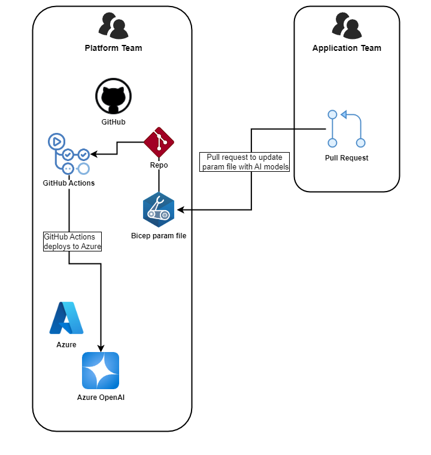

Welcome back to our series on AI and DevOps! In our previous post, we laid the groundwork for deploying AI landing zones within a DevOps framework. Today, we’re going to focus on a critical aspect of this integration: managing AI models using DevOps practices. This involves not only the technical automation of deployments but also ensuring seamless collaboration between the teams involved.

### Who Manages AI Model Deployments: Platform Team or Application Team?

When services like Azure OpenAI or Azure AI Foundry are deployed to Azure, they often follow a shared service model—where the service is accessible to multiple teams for consumption—or a distributed model, where the service is deployed to a specific team or application.

One of the most overlooked aspects of deploying AI models is clarifying responsibility. In a distributed model, ownership is generally more straightforward than in a shared service model. Should the platform team oversee these deployments, or should the application team lead the effort? This decision significantly influences both efficiency and outcomes in your deployment process.

Here are some key considerations for each approach:

**Platform Team Management:**

- Centralised control over resources.
- Ensures consistency across multiple projects.
- May lack specific insights into individual applications.

**App Team Management:**

- Deep understanding of the application’s needs.
- Faster, more tailored deployments.
- Potentially inconsistent practices across different teams.

Ultimately, the best approach depends on your organisation’s structure, culture, and requirements. A hybrid model, where the platform team sets up the codebase to deploy AI models and the application team customises it for their needs, can offer the best of both worlds.

### Automating AI Model Deployments

Automation is a cornerstone of DevOps, and AI model deployments are no exception. By automating the deployment process, we can ensure consistency, reduce errors, and speed up the time to market for our AI models.

We can automate AI model deployments using native tools like Azure Bicep and Azure DevOps or GitHub.

In the following example, we assume that the Landing Zone has been established and Azure OpenAI has been deployed using a shared service model. The platform team is responsible for setting up the codebase for AI model deployments, while the application team can add and manage models as needed. This hybrid approach leverages a GitOps methodology, allowing the application team to make changes to the codebase and deploy AI models through pull requests, subject to the platform team’s approval.

This has been illustrated in the diagram below:



Breaking down the process:

- Set up a GitHub repository to store the Bicep templates for deploying AI models.
- Create a parameter file that specifies the models to deploy to an existing Azure OpenAI instance.
- Use GitHub Actions to build and validate the Bicep templates and deploy the AI models.
- The application team can make changes to the parameter file and submit a pull request to deploy new models.
- The platform team reviews the pull request and approves the deployment.
- GitHub Actions automatically deploys the AI models to the Azure OpenAI instance.
- The platform team can monitor the deployments and manage the resources as needed.
- The application team can access the deployed models and integrate them into their applications.

**Example of Bicep parameter file to manage AI models for an existing Azure OpenAI instance:**

```
param location = 'australiaeast'

param openaiResourceGroupName = 'contoso-openai-rg'

param openaiName = 'contoso-openai-01'

param openaiDeployments = [ // This is where the application team can specify the models to deploy
  {
    model: {
      format: 'OpenAI'
      name: 'gpt-4-32k'
      version: '0613'
    }
    name: 'gpt-4-32k'
    sku: {
      capacity: 10
      name: 'Standard'
    }
  }
]
```

**Example of GitHub Actions workflow to deploy AI models:**

> **NOTE**
>
> This is using the build and deploy GitHub reusable workflows that we discussed in the DevOps and Azure IaC Series (links to posts below).
>
> - [DevOps and IaC Series: Build](https://azurewithaj.com/posts/azure-iac-devops-series-build/)
> - [DevOps and IaC Series: Deploy](https://azurewithaj.com/posts/azure-iac-devops-series-deploy/)

```yaml

name: AI Models

on:
  workflow_dispatch:
  push:
    branches:
      - main
    paths:
      - manage-ai-models/*
  pull_request:
    branches:
      - main
    paths:
      - manage-ai-models/*

env:
  template_folder_path: manage-ai-models # path to directory containing bicep template
  template_file_name: ai-models.bicep # name of the bicep template file including extension
  parameter_file_path: manage-ai-models/ai-demo-instance.bicepparam # path to bicep template parameter file
  location: "australiaeast" # location for resource deployment in azure
  subscription_id: "[ENTER_SUBSCRIPTION_ID]" # azure subscription id (not required for management group level deployments)
  oidc_app_reg_client_id: "[ENTER_CLIENT_ID]" # client id of the azure application registration used to authenticate to azure using oidc, refer to https://learn.microsoft.com/en-us/azure/active-directory/develop/workload-identity-federation-create-trust?pivots=identity-wif-apps-methods-azp#github-actions
  azure_tenant_id: "[ENTER_TENANT_ID]" # azure ad tenant/directory id
  environment: "demo" # name of the github environment
  deployment_name: "deploy_ai_models" # name of the arm deployment"

jobs:
  initialise_vars:
    runs-on: ubuntu-latest
    outputs:
      template_folder_path: $ {{ env.template_folder_path }}
      template_file_name: ${{ env.template_file_name }}
      parameter_file_path: ${{ env.parameter_file_path }}
      location: ${{ env.location }}
      subscription_id: ${{ env.subscription_id }}
      oidc_app_reg_client_id: ${{ env.oidc_app_reg_client_id }}
      azure_tenant_id: ${{ env.azure_tenant_id }}
      environment: ${{ env.environment }}
      deployment_name: ${{ env.deployment_name }}
    steps:
      - name: Initialise Variables
        run: echo "Initialising environment variables"

  build_and_validate:
    needs: initialise_vars
    permissions:
      id-token: write
      contents: read
    uses: tw3lveparsecs/azure-iac-and-devops/.github/workflows/build_template.yml@main
    with:
      test_trigger: ${{ github.event_name }}
      template_file_path: ${{ needs.initialise_vars.outputs.template_folder_path }}/${{ needs.initialise_vars.outputs.template_file_name }}
      parameter_file_path: ${{ needs.initialise_vars.outputs.parameter_file_path }}
      oidc_app_reg_client_id: ${{ needs.initialise_vars.outputs.oidc_app_reg_client_id }}
      azure_tenant_id: ${{ needs.initialise_vars.outputs.azure_tenant_id }}
      location: ${{ needs.initialise_vars.outputs.location }}
      subscription_id: ${{ needs.initialise_vars.outputs.subscription_id }}
      deployment_name: ${{ needs.initialise_vars.outputs.deployment_name }}

  deploy:
    needs: [initialise_vars, build_and_validate]
    if: ${{ github.ref == 'refs/heads/main' }}
    permissions:
      id-token: write
      contents: read
    uses: tw3lveparsecs/azure-iac-and-devops/.github/workflows/deploy_template.yml@main
    with:
      environment: ${{ needs.initialise_vars.outputs.environment }}
      location: ${{ needs.initialise_vars.outputs.location }}
      subscription_id: ${{ needs.initialise_vars.outputs.subscription_id }}
      management_group_id: ${{ needs.initialise_vars.outputs.management_group_id }}
      template_file_name: ${{ needs.initialise_vars.outputs.template_file_name }}
      deployment_name: ${{ needs.initialise_vars.outputs.deployment_name }}
      oidc_app_reg_client_id: ${{ needs.initialise_vars.outputs.oidc_app_reg_client_id }}
      azure_tenant_id: ${{ needs.initialise_vars.outputs.azure_tenant_id }}

```

To demonstrate this, I’ve added a complete example to the repository linked below.

Moving forward, this repository will serve as the central hub for all the code featured in this series, providing a cohesive and practical resource for our AI and DevOps journey.

[Click here to view an example of managing AI models using Azure Bicep and GitHub Actions](https://github.com/tw3lveparsecs/devops-and-ai/tree/main/manage-ai-models)

## Next in the Series

In the next post, we'll dive deeper into testing, validation and integrating AI into your DevOps processes. Stay tuned for more insights on how AI and DevOps can transform your digital landscape!
