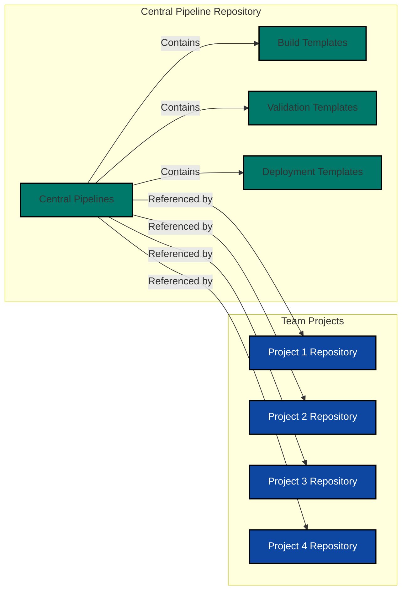
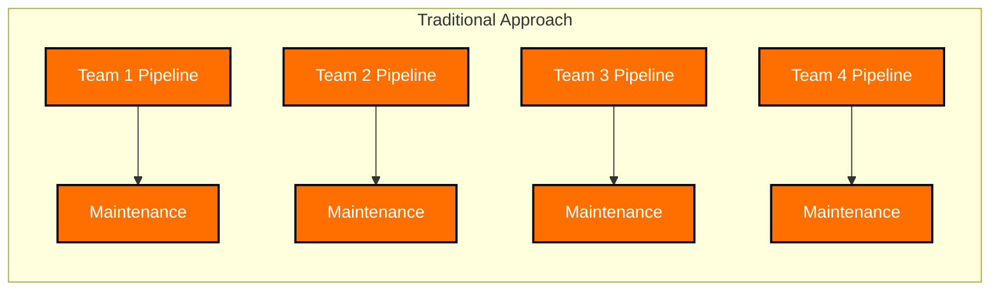
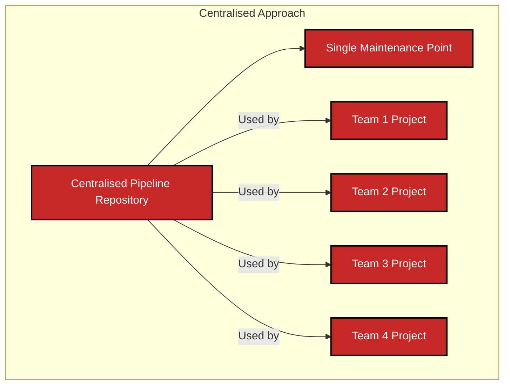
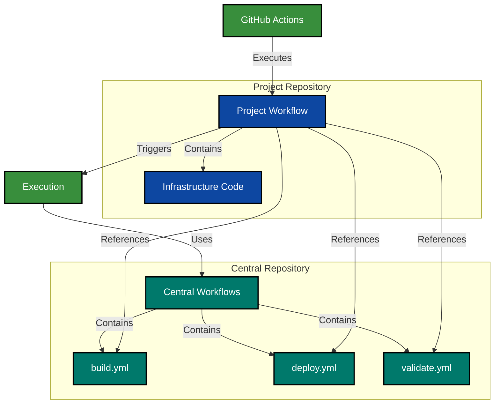
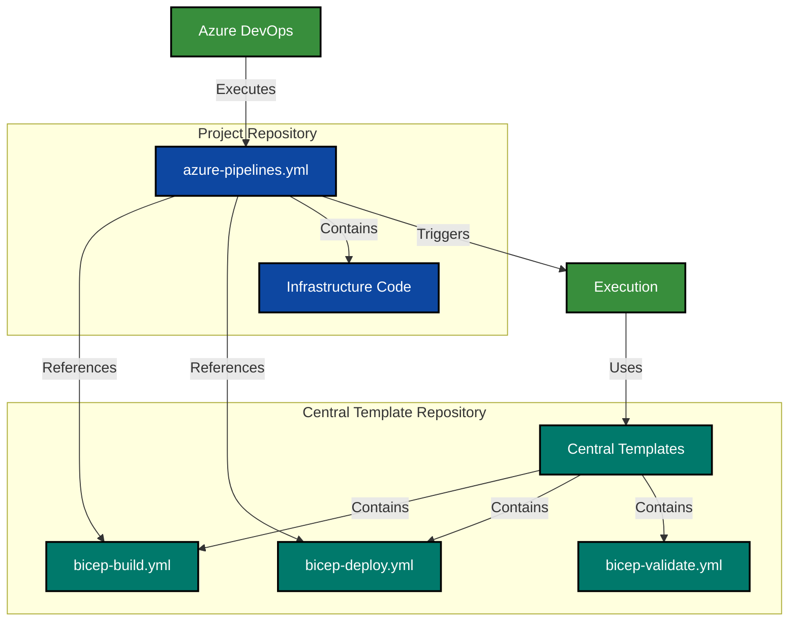
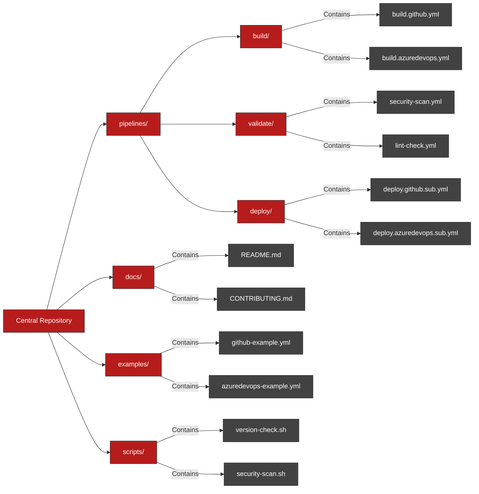
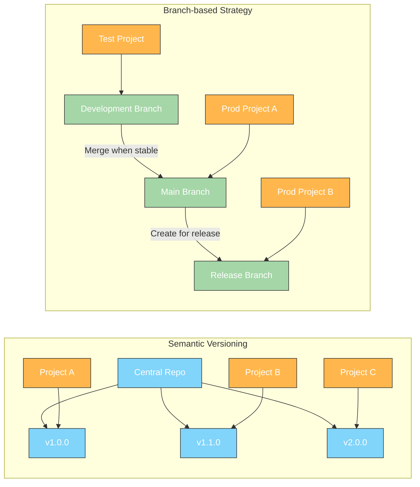
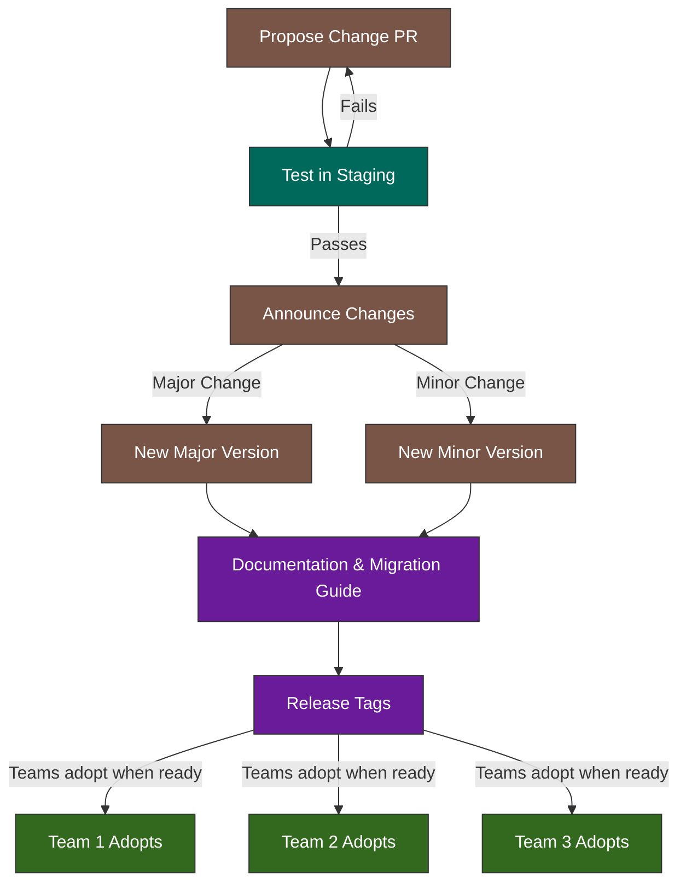

## DevOps and Azure IaC Series: Centralised Pipelines

Welcome back to our DevOps and Azure IaC series! In our previous article, we delved into the Deploy phase, exploring effective approaches for deploying infrastructure using DevOps and Azure IaC. Today, we'll focus on a crucial aspect of DevOps practices: centralised pipelines. These standardised workflows can significantly enhance your team's efficiency, consistency, and governance when managing infrastructure as code.

## What are Centralised Pipelines?

Centralised pipelines are reusable CI/CD workflows that standardise your build, validation, and deployment processes across multiple projects or teams. Rather than having each team create their own unique pipelines, centralised pipelines establish a consistent approach that can be leveraged across your organisation. This is particularly valuable for infrastructure as code, where consistency and standardisation are essential for maintaining security and compliance.

Overview of centralised pipelines:



## Benefits of Centralised Pipelines

Centralised pipelines offer several key benefits for managing infrastructure as code:

- **Consistency and Standardisation:** Centralised pipelines enforce uniform infrastructure deployment practices across all teams. This standardisation prevents inconsistencies and reduces the risk of human error in pipeline setup.

- **Reduced Maintenance Overhead:** With centralised pipelines, you only need to update and maintain one set of workflows rather than updating numerous similar pipelines across projects. When security requirements change or new best practices emerge, you can implement these changes in one place.

- **Built-in Governance:** Centralised pipelines allow you to embed governance controls directly into your deployment processes. These controls can include:

  - Mandatory security scans
  - Policy compliance checks
  - Approval workflows
  - Audit logging
  - Cost management validations

- **Knowledge Sharing:** Centralised pipelines document your organisation's best practices in code, making it easier for new team members to understand deployment standards and quickly become productive.

Illustrating the benefits of centralised pipelines:





## Implementing Centralised Pipelines in GitHub

The example below demonstrates how to implement centralised pipelines using GitHub's reusable workflows feature. This approach allows you to define core workflows that can be called from individual repositories.

This has been illustrated in the following diagram:



Code snippets for implementing centralised pipelines in GitHub:

### Centralised Pipeline Reusable Workflow

Here is an example of a centralised pipeline reusable workflow that deploys a Bicep template:

```yaml

name: deploy

on:
  workflow_call:
    inputs:
      environment:
        description: "github environment for deployment jobs"
        type: string
        required: true
      location:
        description: "location for resource deployment"
        type: string
        default: ""
      subscription_id:
        description: "azure subscription id used for deployments"
        type: string
        default: ""
      template_file_name:
        description: "name of the template file to be deploy (assume its been built from bicep into json)"
        type: string
        required: false
      deployment_name:
        description: "name of the arm deployment"
        type: string
        required: true
      az_deployment_type:
        description: "type of azure deployment"
        type: string
        required: false
        default: subscription
      management_group_id:
        description: "management group id for azure deployment"
        type: string
        required: false
        default: ""
      resource_group_name:
        description: "resource group name for azure deployment"
        type: string
        required: false
        default: ""
      oidc_app_reg_client_id:
        description: "client id of the azure application registration used to authenticate to azure using oidc, refer to https://learn.microsoft.com/en-us/azure/active-directory/develop/workload-identity-federation-create-trust?pivots=identity-wif-apps-methods-azp#github-actions"
        type: string
        required: true
      azure_tenant_id:
        description: "entra id tenant/directory id"
        type: string
        required: true

jobs:
  run_deploy:
    runs-on: ubuntu-latest
    if: github.ref == 'refs/heads/main'
    environment:
      name: ${{ inputs.environment }}
    steps:
      - name: Checkout
        uses: actions/checkout@v4

      - name: Download Artifact
        uses: actions/download-artifact@v4
        with:
          name: deploy
          path: ${{ github.workspace }}/deploy

      - name: Login to Azure
        uses: azure/login@v2
        with:
          client-id: ${{ inputs.oidc_app_reg_client_id }}
          tenant-id: ${{ inputs.azure_tenant_id }}
          allow-no-subscriptions: true

      - name: Deploy to Azure
        run: |
          $ErrorActionPreference = 'stop'
          $paramFile = Get-ChildItem ${{ github.workspace }}/deploy | Where-Object {$_.Name -like "*.parameters.json"} # get the parameters file (assumes only one)
          $template = "${{ inputs.template_file_name }}".Replace(".bicep",".json")

          if ('${{ inputs.az_deployment_type }}' -eq 'subscription' ){
            az account set --subscription ${{ inputs.subscription_id}}
            az deployment sub create `
              --name '${{ inputs.deployment_name }}' `
              --location '${{ inputs.location }}' `
              --subscription '${{ inputs.subscription_id }}' `
              --template-file ${{ github.workspace }}/deploy/$template --parameters $paramFile
          }
          if ('${{ inputs.az_deployment_type }}' -eq 'tenant' ){
            az deployment tenant create `
              --name '${{ inputs.deployment_name }}' `
              --location '${{ inputs.location }}' `
              --template-file ${{ github.workspace }}/deploy/$template --parameters $paramFile
          }
          if ('${{ inputs.az_deployment_type }}' -eq 'managementgroup'){
          az deployment mg create `
            --name '${{ inputs.deployment_name }}' `
            --location '${{ inputs.location }}' `
            --management-group-id '${{ inputs.management_group_id }}' `
            --template-file ${{ github.workspace }}/deploy/$template --parameters $paramFile
          }
          if ('${{ inputs.az_deployment_type }}' -eq 'resourcegroup' ){
            az account set --subscription '${{ inputs.subscription_id }}'
            az deployment group create `
              --name '${{ inputs.deployment_name }}' `
              --resource-group '${{ inputs.resource_group_name }}' `
              --template-file ${{ github.workspace }}/deploy/$template --parameters $paramFile
          }
        shell: pwsh

```

### Calling Centralised Pipelines

Individual repositories can then call these centralised pipelines, providing only the required parameters:

```yaml

name: Azure Infrastructure Deployment

on:
  workflow_dispatch:
  push:
    branches:
      - main
    paths:
      - bicep/infra/*
  pull_request:
    branches:
      - main
    paths:
      - bicep/infra/*

env:
  template_folder_path: bicep/infra
  template_file_name: azure_infra.bicep
  parameter_file_path: bicep/infra/azure_infra.bicepparam
  subscription_id: 00000000-0000-0000-0000-000000000000
  oidc_app_reg_client_id: AppClientId
  azure_tenant_id: EntraTenantId
  environment: demo
  location: eastus
  deployment_name: "deploy_azure_infra"

jobs:
  initialise_vars:
    runs-on: ubuntu-latest
    outputs:
      template_folder_path: ${{ env.template_folder_path }}
      template_file_name: ${{ env.template_file_name }}
      parameter_file_path: ${{ env.parameter_file_path }}
      location: ${{ env.location }}
      subscription_id: ${{ env.subscription_id }}
      oidc_app_reg_client_id: ${{ env.oidc_app_reg_client_id }}
      azure_tenant_id: ${{ env.azure_tenant_id }}
      environment: ${{ env.environment }}
      deployment_name: ${{ env.deployment_name }}
    steps:
      - name: Initialise Variables
        run: echo "Initialising environment variables"

  build_and_validate:
    needs: initialise_vars
    permissions:
      id-token: write
      contents: read
    uses: tw3lveparsecs/central-pipelines/.github/workflows/build.yml@v1.0.0
    with:
      test_trigger: ${{ github.event_name }}
      template_file_path: ${{ needs.initialise_vars.outputs.template_folder_path }}/${{ needs.initialise_vars.outputs.template_file_name }}
      parameter_file_path: ${{ needs.initialise_vars.outputs.parameter_file_path }}
      oidc_app_reg_client_id: ${{ needs.initialise_vars.outputs.oidc_app_reg_client_id }}
      azure_tenant_id: ${{ needs.initialise_vars.outputs.azure_tenant_id }}
      location: ${{ needs.initialise_vars.outputs.location }}
      subscription_id: ${{ needs.initialise_vars.outputs.subscription_id }}
      deployment_name: ${{ needs.initialise_vars.outputs.deployment_name }}

  deploy:
    needs: [initialise_vars, build_and_validate]
    if: ${{ github.ref == 'refs/heads/main' }}
    permissions:
      id-token: write
      contents: read
    uses: tw3lveparsecs/central-pipelines/.github/workflows/deploy.yml@v1.0.0
    with:
      environment: ${{ needs.initialise_vars.outputs.environment }}
      location: ${{ needs.initialise_vars.outputs.location }}
      subscription_id: ${{ needs.initialise_vars.outputs.subscription_id }}
      management_group_id: ${{ needs.initialise_vars.outputs.management_group_id }}
      template_file_name: ${{ needs.initialise_vars.outputs.template_file_name }}
      deployment_name: ${{ needs.initialise_vars.outputs.deployment_name }}
      oidc_app_reg_client_id: ${{ needs.initialise_vars.outputs.oidc_app_reg_client_id }}
      azure_tenant_id: ${{ needs.initialise_vars.outputs.azure_tenant_id }}

```

## Implementing Centralised Pipelines in Azure DevOps

The example below demonstrates how to implement centralised pipelines using Azure DevOps's pipeline template feature. This approach allows you to define core workflows that can be called from individual repositories.

This has been illustrated in the following diagram:



### Centralised Pipeline Template

Here's an example of a reusable template for deploying Bicep files.

```yaml

parameters:
  - name: stage # Stage Name
    type: string
  - name: dependsOn # Stage Dependencies
    type: string
  - name: condition # Stage Conditions
    type: string
  - name: adoEnvironment # Azure DevOps Environment for Deployment Jobs
    type: string
  - name: location # Where the deployment metadata will be saved
    type: string
    default: ""
  - name: subscriptionId # SubscriptionId to deploy to
    type: string
    default: ""
  - name: templateFileName # Name of the file (assume its a built bicep into json)
    type: string
  - name: deploymentName # Name for ARM Deployment
    type: string
  - name: svcConnection # Service Connection
    type: string
  - name: azDeploymentType # Type of Azure deployment
    type: string
    default: subscription
    values:
      - subscription
      - tenant
      - managementGroup
      - resourceGroup
  - name: managementGroupId # Management Group Id to deploy to
    type: string
    default: ""
  - name: resourceGroupName # Name of resource group for RG deployments
    type: string
    default: ""

stages:
  - stage: ${{ parameters.stage }}
    dependsOn: ${{ parameters.dependsOn }}
    condition: ${{ parameters.condition }}
    jobs:
      - deployment: ${{ parameters.stage }}
        displayName: ${{ parameters.stage }}
        pool:
          vmImage: ubuntu-latest
        environment: ${{ parameters.adoEnvironment }}
        strategy:
          runOnce:
            deploy:
              steps:
                - checkout: self

                - download: current
                  artifact: deploy

                - task: AzureCLI@2
                  displayName: Deploy to Azure
                  inputs:
                    azureSubscription: ${{ parameters.svcConnection }}
                    scriptType: "pscore"
                    scriptLocation: "inlineScript"
                    inlineScript: |
                      $ErrorActionPreference = 'stop'
                      $paramFile = Get-ChildItem $(Pipeline.Workspace)/deploy | Where-Object {$_.Name -like "*.parameters.json"}
                      $template = "${{ parameters.templateFileName }}".Replace(".bicep",".json")

                      if ('${{ parameters.azDeploymentType }}' -eq "subscription" ){
                        az account set --subscription ${{ parameters.subscriptionId}}
                        az deployment sub create `
                          --name '${{ parameters.deploymentName }}' `
                          --location '${{ parameters.location }}' `
                          --subscription '${{ parameters.subscriptionId }}' `
                          --template-file $(Pipeline.Workspace)/deploy/$template --parameters $paramFile
                      }
                      if ('${{ parameters.azDeploymentType }}' -eq "tenant" ){
                        az deployment tenant create `
                          --name '${{ parameters.deploymentName }}' `
                          --location '${{ parameters.location }}' `
                          --template-file $(Pipeline.Workspace)/deploy/$template --parameters $paramFile
                      }
                      if ('${{ parameters.azDeploymentType }}' -eq "managementGroup" ){
                      az deployment mg create `
                        --name '${{ parameters.deploymentName }}' `
                        --location '${{ parameters.location }}' `
                        --management-group-id '${{ parameters.managementGroupId }}' `
                        --template-file $(Pipeline.Workspace)/deploy/$template --parameters $paramFile
                      }
                      if ('${{ parameters.azDeploymentType }}' -eq "resourceGroup" ){
                        az account set --subscription '${{ parameters.subscriptionId }}'
                        az deployment group create `
                          --name '${{ parameters.deploymentName }}' `
                          --resource-group '${{ parameters.resourceGroupName }}' `
                          --template-file $(Pipeline.Workspace)/deploy/$template --parameters $paramFile
                      }

```

### Using Templates in Azure DevOps Pipelines

Here's how to reference and use the template from a project pipeline:

```yaml

resources:
  repositories:
    - repository: central-pipelines
      type: git
      name: azure/central-pipelines
      ref: refs/heads/main

pr:
  branches:
    include:
      - main
  paths:
    include:
      - bicep/infra

trigger:
  branches:
    include:
      - main
  paths:
    include:
      - bicep/infra

variables:
  templateFolderPath: $(Pipeline.Workspace)/s/bicep/infra
  templateFileName: azure_infra.bicep
  parameterFilePath: $(Pipeline.Workspace)/s/bicep/infra/azure_infra.bicepparam
  location: "eastus"
  subscriptionId: "00000000-0000-0000-0000-000000000000"
  svcConnection: "ServiceConnection"
  adoEnvironment: "demo"
  deploymentName: "deploy_azure_infra"

stages:
  - template: /azure-pipelines/templates/build.yml@central-pipelines
    parameters:
      templateFilePath: "$(templateFolderPath)/$(templateFileName)"
      parameterFilePath: $(parameterFilePath)
      svcConnection: $(svcConnection)
      location: $(location)
      subscriptionId: $(subscriptionId)
      deploymentName: $(deploymentName)

  - template: /azure-pipelines/templates/deploy.yml@central-pipelines
    parameters:
      stage: Deploy
      dependsOn: "Build_and_Validate"
      condition: and(succeeded(), or(eq(variables['Build.SourceBranch'], 'refs/heads/main'), eq(variables['Build.Reason'], 'Manual')))
      svcConnection: $(svcConnection)
      subscriptionId: $(subscriptionId)
      location: $(location)
      adoEnvironment: $(adoEnvironment)
      templateFileName: "$(templateFileName)"
      deploymentName: $(deploymentName)

```

## Building a Central Pipeline Repository

To effectively implement centralised pipelines, create a dedicated repository that contains:

1. Central Pipelines: Core pipeline definitions for common tasks like build, validation, and deployment.
2. Documentation: Clear guidelines explaining how to use the pipelines and their requirements.
3. Templates: Sample implementation templates to help teams get started quickly.
4. Validation Scripts: Common validation tools and scripts that enforce best practices.



## Pipeline Versioning Strategy

When implementing centralised pipelines, it's important to establish a versioning strategy. This allows teams to adopt updates on their own schedule while ensuring stability. Consider these approaches:

1. Semantic Versioning: Tag your pipeline releases (v1.0.0, v1.1.0, etc.) and allow teams to reference specific versions.
2. Branch-Based: Create stable branches (main, release, etc.) that teams can reference.
3. Immutable Tags: Use immutable tags for major versions to prevent breaking changes.



## Change Management

Centralised pipelines require careful change management to avoid disrupting teams who depend on them:

1. Announce Changes: Communicate upcoming changes well in advance.
2. Breaking vs. Non-Breaking: Clearly distinguish between breaking and non-breaking changes.
3. Testing: Thoroughly test changes before releasing them.
4. Migration Guides: Provide documentation to help teams adopt new versions.



## Conclusion

Centralised pipelines are a powerful tool for standardising and scaling your infrastructure as code practices across teams. By implementing these shared workflows, we can enforce governance, reduce maintenance overhead, and accelerate onboarding while maintaining consistency in your deployments.

In our next post, we'll explore how to integrate security scanning and other validation mechanisms into our centralised pipelines to further enhance our governance posture. Stay tuned!

For practical examples and implementation guidance, check out the [DevOps and Azure IaC repository](https://github.com/tw3lveparsecs/azure-iac-and-devops/blob/main/central-pipelines), which contains centralised pipelines in both GitHub reusable workflows and Azure DevOps templates for Azure IaC deployments.
