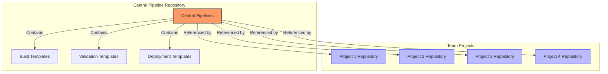
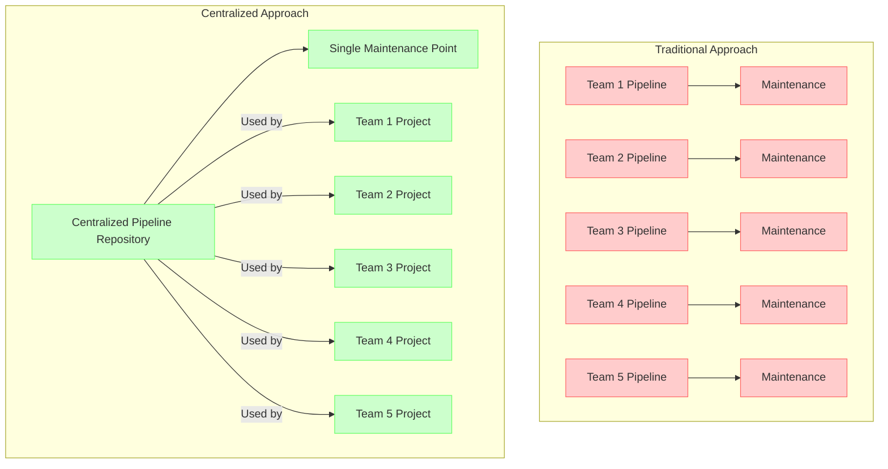
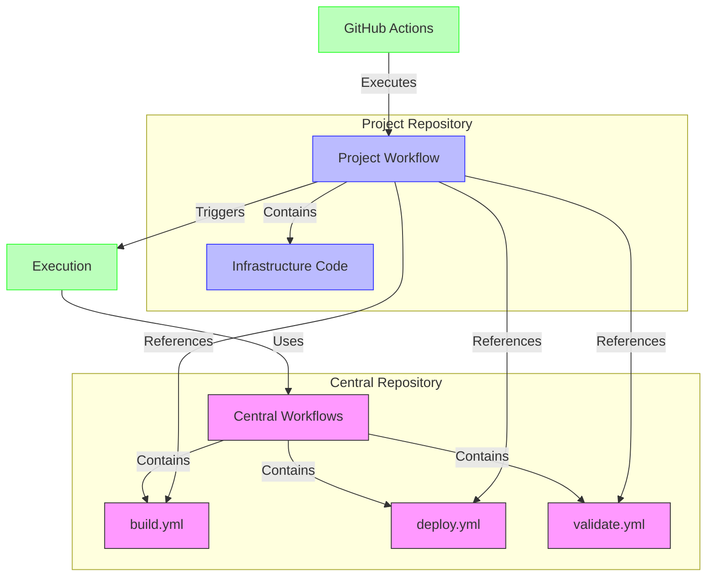
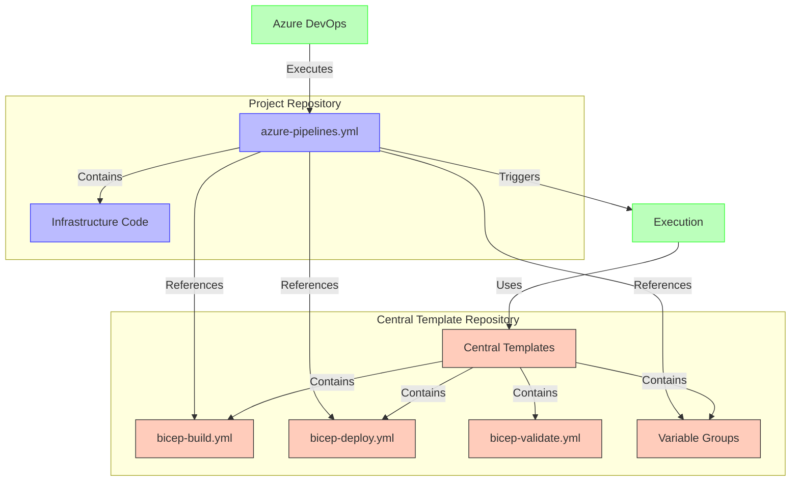
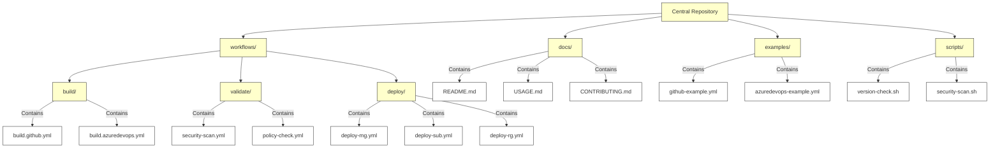
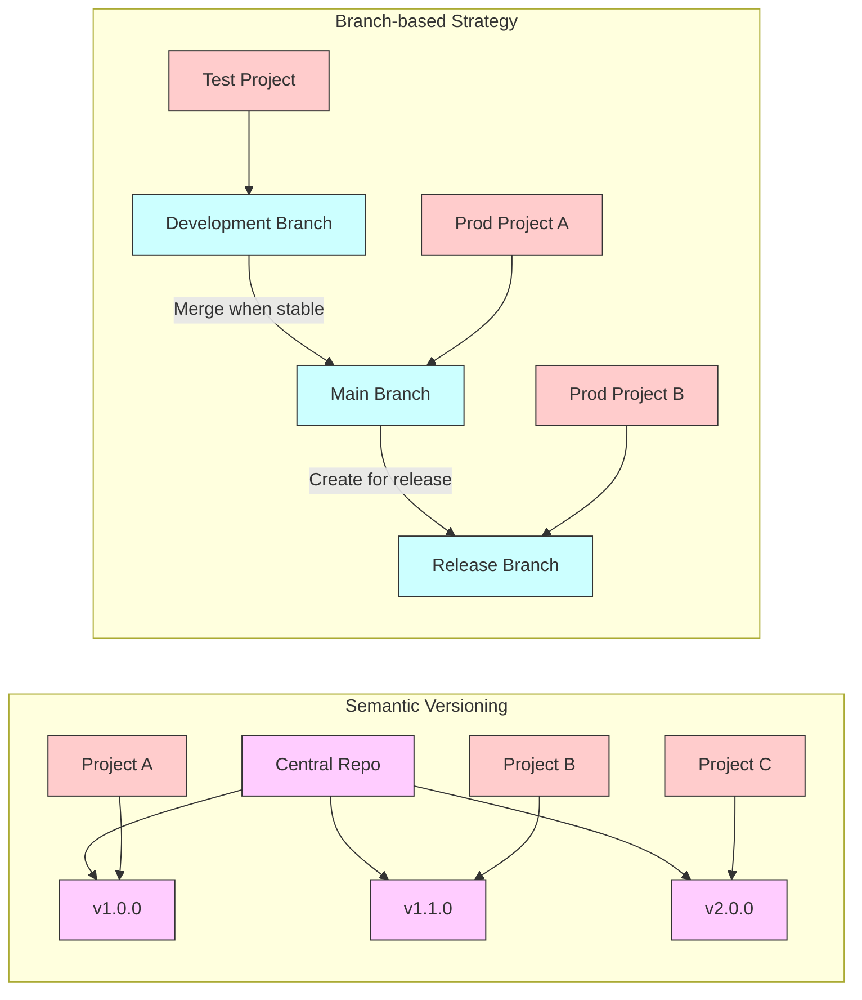
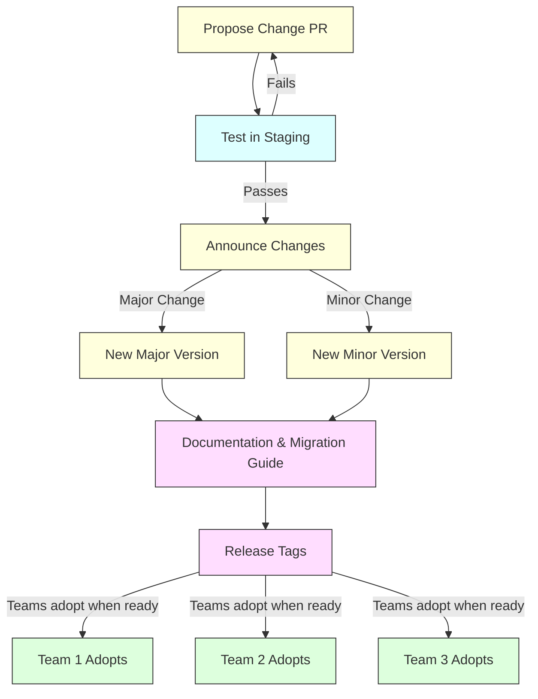

## DevOps and Azure IaC Series: Centralised Pipelines

Welcome back to our DevOps and Azure IaC series! In our previous article, we delved into the Deploy phase, exploring best practices for deploying infrastructure using DevOps and Azure IaC. Today, we'll focus on a crucial aspect of DevOps practices: centralised pipelines. These standardised workflows can significantly enhance your team's efficiency, consistency, and governance when managing infrastructure as code.

## What are Centralised Pipelines?

Centralised pipelines are reusable CI/CD workflows that standardise your build, validation, and deployment processes across multiple projects or teams. Rather than having each team create their own unique pipelines, centralised pipelines establish a consistent approach that can be leveraged across your organisation. This is particularly valuable for infrastructure as code, where consistency and standardisation are essential for maintaining security and compliance.



## Benefits of Centralised Pipelines



### Consistency and Standardisation

By implementing centralised pipelines, you ensure that all teams follow the same best practices for infrastructure deployment. This consistency eliminates configuration drift and reduces the risk of human error in pipeline setup.

### Reduced Maintenance Overhead

With centralised pipelines, you only need to update and maintain one set of workflows rather than updating numerous similar pipelines across projects. When security requirements change or new best practices emerge, you can implement these changes in one place.

### Built-in Governance

Centralised pipelines allow you to embed governance controls directly into your deployment processes. These controls can include:

- Mandatory security scans
- Policy compliance checks
- Approval workflows
- Audit logging
- Cost management validations

### Knowledge Sharing

Centralised pipelines document your organisation's best practices in code, making it easier for new team members to understand deployment standards and quickly become productive.

## Implementing Centralised Pipelines in GitHub

The example below demonstrates how to implement centralised pipelines using GitHub's reusable workflows feature. This approach allows you to define core workflows that can be called from individual repositories.



```yaml

# Main reusable workflow in central repository
name: Central Deploy Pipeline

on:
  workflow_call:
    inputs:
      environment:
        required: true
        type: string
      location:
        required: true
        type: string
      subscription_id:
        required: true
        type: string
      management_group_id:
        required: false
        type: string
      template_file_name:
        required: true
        type: string
      deployment_name:
        required: true
        type: string
    secrets:
      AZURE_CREDENTIALS:
        required: true

jobs:
  deploy:
    runs-on: ubuntu-latest
    environment: ${{ inputs.environment }}

    steps:
      - name: Download build artifacts
        uses: actions/download-artifact@v3
        with:
          name: bicep-templates

      - name: Azure Login
        uses: azure/login@v1
        with:
          creds: ${{ secrets.AZURE_CREDENTIALS }}

      - name: Deploy Bicep Template
        uses: azure/arm-deploy@v1
        with:
          scope: ${{ inputs.management_group_id != '' && 'managementgroup' || 'subscription' }}
          managementGroupId: ${{ inputs.management_group_id }}
          subscriptionId: ${{ inputs.subscription_id }}
          region: ${{ inputs.location }}
          template: ${{ inputs.template_file_name }}
          deploymentName: ${{ inputs.deployment_name }}

```

### Calling Centralised Pipelines

Individual repositories can then call these centralised pipelines, providing only the required parameters:

```yaml

name: Infrastructure Deployment

on:
  push:
    branches: [main]
  pull_request:
    branches: [main]

jobs:
  build:
    uses: your-org/central-pipelines/.github/workflows/build.yml@main
    with:
      template_path: ./bicep/main.bicep

  deploy:
    needs: build
    if: github.ref == 'refs/heads/main'
    uses: your-org/central-pipelines/.github/workflows/deploy.yml@main
    with:
      environment: production
      location: eastus
      subscription_id: ${{ vars.SUBSCRIPTION_ID }}
      template_file_name: main.bicep
      deployment_name: iac-deployment-${{ github.run_id }}
    secrets:
      AZURE_CREDENTIALS: ${{ secrets.AZURE_CREDENTIALS }}

```

## Implementing Centralised Pipelines in Azure DevOps

The example below demonstrates how to implement centralised pipelines using Azure DevOps's pipeline template feature. This approach allows you to define core workflows that can be called from individual repositories.

Here's an example of a reusable template for deploying Bicep files.



```yaml

# bicep-deploy.yml template in the central repository
parameters:
  environment: ''
  location: ''
  subscriptionId: ''
  managementGroupId: ''
  templateFilePath: ''
  deploymentName: ''
  serviceConnection: ''

steps:
- task: AzureCLI@2
  displayName: 'Deploy Bicep Template'
  inputs:
    azureSubscription: ${{ parameters.serviceConnection }}
    scriptType: bash
    scriptLocation: inlineScript
    inlineScript: |
      # Use management group or subscription scope based on parameter
      if [ -z "${{ parameters.managementGroupId }}" ]; then
        az account set --subscription ${{ parameters.subscriptionId }}
        az deployment sub create \
          --location ${{ parameters.location }} \
          --template-file ${{ parameters.templateFilePath }} \
          --name ${{ parameters.deploymentName }}
      else
        az deployment mg create \
          --management-group ${{ parameters.managementGroupId }} \
          --location ${{ parameters.location }} \
          --template-file ${{ parameters.templateFilePath }} \
          --name ${{ parameters.deploymentName }}
      fi

```

### Using Templates in Azure DevOps Pipelines

Here's how to reference and use the template from a project pipeline:

```yaml

# azure-pipelines.yml in a project repository
trigger:
  - main

resources:
  repositories:
    - repository: templates
      type: git
      name: CentralPipelines
      ref: refs/tags/v1.0.0

variables:
  - template: variable-templates/dev-variables.yml@templates
  - name: deploymentName
    value: 'bicep-deployment-$(Build.BuildId)'

stages:
- stage: Build
  jobs:
  - job: BuildBicep
    pool:
      vmImage: 'ubuntu-latest'
    steps:
    - template: templates/bicep-build.yml@templates
      parameters:
        bicepFilePath: './infra/main.bicep'

- stage: Deploy
  dependsOn: Build
  condition: and(succeeded(), eq(variables['Build.SourceBranch'], 'refs/heads/main'))
  jobs:
  - deployment: DeployInfrastructure
    environment: $(environmentName)
    pool:
      vmImage: 'ubuntu-latest'
    strategy:
      runOnce:
        deploy:
          steps:
          - template: templates/bicep-deploy.yml@templates
            parameters:
              serviceConnection: '$(serviceConnectionName)'
              subscriptionId: '$(subscriptionId)'
              location: '$(location)'
              templateFilePath: '$(Pipeline.Workspace)/bicep/main.bicep'
              deploymentName: '$(deploymentName)'

```

## Building a Central Pipeline Repository

To effectively implement centralised pipelines, create a dedicated repository that contains:

1. Reusable Workflows: Core pipeline definitions for common tasks like build, validation, and deployment.
2. Documentation: Clear guidelines explaining how to use the pipelines and their requirements.
3. Templates: Sample implementation templates to help teams get started quickly.
4. Validation Scripts: Common validation tools and scripts that enforce best practices.



## Pipeline Versioning Strategy

When implementing centralised pipelines, it's important to establish a versioning strategy. This allows teams to adopt updates on their own schedule while ensuring stability. Consider these approaches:

1. Semantic Versioning: Tag your pipeline releases (v1.0.0, v1.1.0, etc.) and allow teams to reference specific versions.
2. Branch-Based: Create stable branches (main, release, etc.) that teams can reference.
3. Immutable Tags: Use immutable tags for major versions to prevent breaking changes.



## Change Management

Centralised pipelines require careful change management to avoid disrupting teams who depend on them:

1. Announce Changes: Communicate upcoming changes well in advance.
2. Breaking vs. Non-Breaking: Clearly distinguish between breaking and non-breaking changes.
3. Testing: Thoroughly test changes before releasing them.
4. Migration Guides: Provide documentation to help teams adopt new versions.



## Conclusion

Centralised pipelines are a powerful tool for standardising and scaling your infrastructure as code practices across teams. By implementing these shared workflows, you can enforce governance, reduce maintenance overhead, and accelerate onboarding while maintaining consistency in your deployments.

In our next post, we'll explore how to integrate security scanning and policy validation into your centralised pipelines to further enhance your governance posture. Stay tuned!

For practical examples and implementation guidance, check out the azure-iac-and-devops repository, which contains reusable workflows for Azure IaC deployments.
