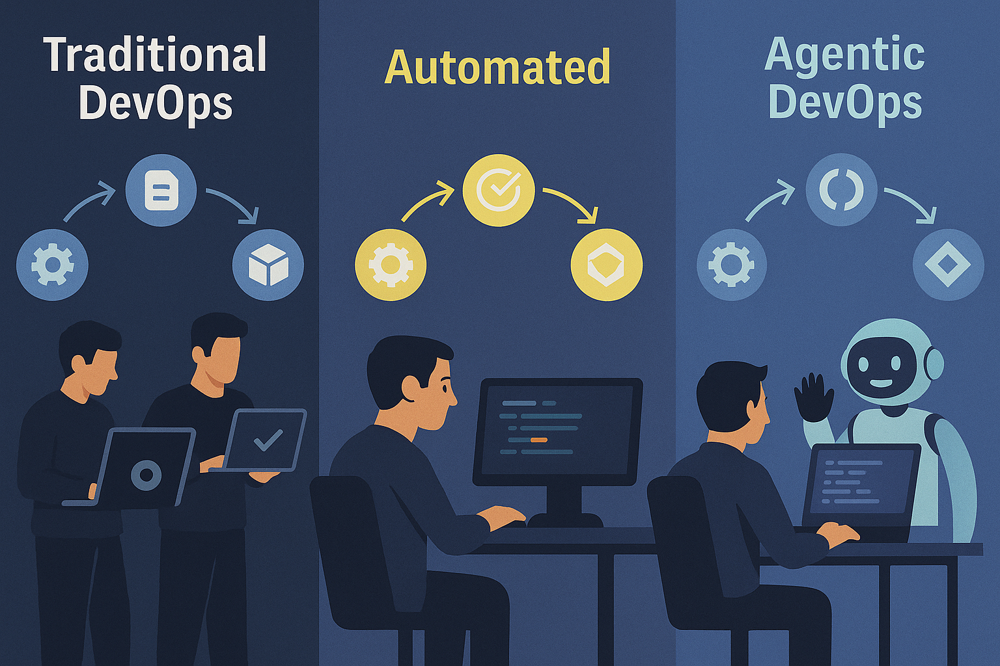
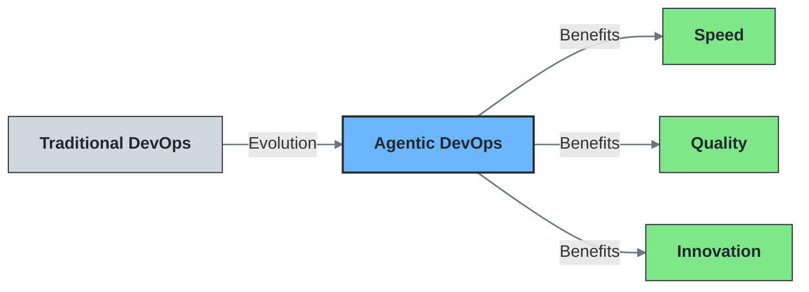

# DevOps: Dead or Evolved?

For years, DevOps was the buzzword that transformed how we build software. It united developers and IT operations, breaking down silos, improving collaboration, and accelerating delivery. But lately, the conversation has shifted dramatically with the rise of AI. You might've heard whispers like:

> “AI is taking over DevOps…”
>
> “Copilot does my job now.”
>
> “Is DevOps even relevant anymore?”

So, is DevOps dead?

Not quite. But it's definitely _evolved_.

## The Evolution of DevOps

Traditional DevOps focused on automating the SDLC (software delivery lifecycle): CI/CD pipelines, infrastructure as code, observability, and collaborative workflows across dev and ops teams. We were already on a path of automating the repetitive and scaling what humans couldn’t do fast enough.

But now, AI has supercharged that evolution.

With the rise of **Agentic DevOps**, we’re entering a new era where AI agents don’t just automate tasks. They _collaborate_ as part of your team.

## Enter the Agents: DevOps Meets AI

Microsoft is leading this evolution with groundbreaking announcements at [Microsoft Build 2025](https://news.microsoft.com/build-2025/). They've introduced autonomous and semi-autonomous agents in GitHub and Azure that function as active members of development and operations teams. These AI agents are fundamentally transforming how software is built, tested, deployed, and maintained.

Here’s what this looks like in practice:

### GitHub Copilot as Your Coding Companion

The new **GitHub Copilot Coding Agent** is no longer just suggesting code snippets, it can now take on entire tasks:

- Refactor legacy code
- Improve test coverage
- Fix defects
- Implement features autonomously

Developers assign tasks, and Copilot gets to work. For complex jobs, it even collaborates with other agents across the SDLC. What used to take hours now takes minutes. This isn’t replacement, it’s reinforcement.

👉 [Explore GitHub Copilot Coding Agents](https://docs.github.com/en/enterprise-cloud@latest/copilot/using-github-copilot/using-copilot-coding-agent-to-work-on-tasks/about-assigning-tasks-to-copilot)

### Modernising Legacy Apps? AI’s Got This

Modernising large .NET or Java apps used to be painful and consist of tedious assessments and config tweaks. Now, GitHub Copilot’s modernisation agent can:

- Analyse app code and dependencies
- Recommend and implement updates
- Refactor and fix compatibility issues

Tasks that used to take _weeks or months_ can now be done in _hours_.

### The Rise of the SRE Agent

Meanwhile, on the ops side, the new **SRE agent** is flipping the script on incident management:

- Monitors app health continuously across Azure (Kubernetes, PaaS, serverless, DBs)
- Automatically mitigates issues and runs root cause analysis (RCA)
- Reduces time-to-resolution from hours to minutes

And it doesn’t stop there, the SRE agent can collaborate with software engineering agents to fix problems _before_ they even hit production.

👉 [Learn about the Azure SRE Agent](https://techcommunity.microsoft.com/blog/azurepaasblog/introducing-azure-sre-agent/4414569)

## But… Is AI Taking My Job?

It’s a valid concern.

Yes, AI is doing more. But no, it’s not taking away your _value_. It’s amplifying it. AI is removing the toil, the repetitive work, the cognitive overhead. It’s giving you back time and mental space to:

- Innovate and architect smarter systems
- Focus on business-critical priorities
- Improve security and reliability
- Drive greater customer impact

Just like DevOps didn’t kill SysAdmins, AI won’t kill DevOps. But it _will_ transform it.

## DevOps: From Culture Shift to Capability Shift

DevOps was always about **culture** and **collaboration**, not just pipelines. Agentic DevOps adds a new dimension:

- **Human + AI Collaboration** as the new norm
- **Autonomous Agents** that handle routine and complex tasks
- **Shift from manual response to proactive prevention**

This isn’t the death of DevOps, it's the next evolution. It’s faster, smarter, and more creative.

## Navigating the Transition

Of course, embracing Agentic DevOps isn't without challenges:

- **Skills evolution**: Teams need to develop prompt engineering and AI collaboration skills
- **Trust building**: Establishing confidence in AI recommendations takes time
- **Governance considerations**: New questions around code ownership, security and review processes

Organisations that proactively address these challenges will be better positioned to reap the benefits of AI-powered DevOps.

## Getting Started with Agentic DevOps

If you're looking to begin this transition in your organisation:

1. **Start small**: Identify repetitive tasks that can benefit from AI assistance
2. **Build skills**: Invest in prompt engineering and AI collaboration training
3. **Establish guardrails**: Create clear guidelines for AI review and validation
4. **Measure impact**: Track time saved and quality improvements from AI integration

Remember, successful adoption is iterative, not revolutionary.

## Final Thought

So, is DevOps dead?

No. But it _has evolved_. Dramatically.

The AI-powered future of DevOps isn’t about replacing humans, it’s about augmenting our abilities. The teams that embrace agentic collaboration will move faster, build better, and innovate more.

Looking ahead, we'll likely see specialised AI agents for security, cost optimisation, and sustainability joining the DevOps ecosystem. Organisations that embrace this evolution will gain significant competitive advantages in speed, quality, and innovation capacity.

DevOps isn’t gone. It has just leveled up.

### What do you think?

Is your team embracing AI in your DevOps workflows yet? Are you excited or skeptical about Agentic DevOps? Drop your thoughts below or share how you’re evolving with it.
