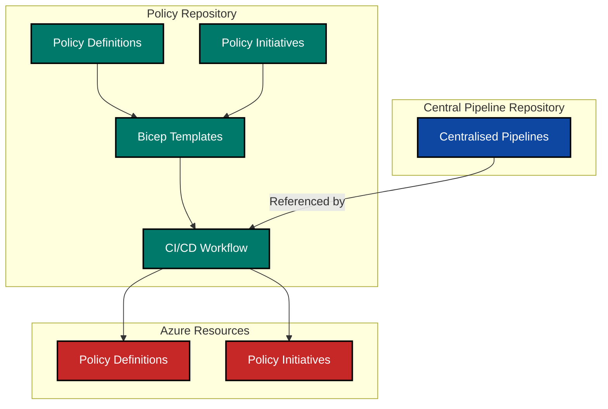

Welcome to the second instalment of our DevOps and Azure Policy series! In our [previous post](https://azurewithaj.com/posts/azure-policy-bicep-series-deploy/), we explored how to deploy policy initiatives with built-in policies using Bicep. Today, we're taking it a step further by diving into custom policy definitions and implementing a robust CI/CD pipeline for Azure Policy deployments. We'll leverage the centralised pipelines concept discussed in our [DevOps and Azure IaC Series](https://azurewithaj.com/posts/devops-azure-iac-series-central-pipelines/) to create a streamlined, consistent approach to policy deployment.

## Understanding Custom Policy Definitions

While Azure offers numerous built-in policies, many organisations have specific compliance requirements that necessitate custom policy definitions. Custom policies allow us to define rules tailored to our unique governance needs, whether that's enforcing specific naming conventions or implementing security controls not covered by built-in policies.

### Anatomy of a Custom Policy Definition

Let's examine the structure of a custom Azure Policy definition:

```json
{
  "name": "resource-lock-enabled",
  "displayName": "Resource Lock should be enabled on resources",
  "description": "Applies a CanNotDelete resource locks on resources to prevent accidental deletion.",
  "mode": "Indexed",
  "metadata": {
    "category": "Lock",
    "version": "1.0.0"
  },
  "parameters": {
    "effect": {
      "type": "String",
      "metadata": {
        "displayName": "Effect",
        "description": "DeployIfNotExists, AuditIfNotExists or Disabled the execution of the Policy"
      },
      "allowedValues": ["DeployIfNotExists", "AuditIfNotExists", "Disabled"],
      "defaultValue": "DeployIfNotExists"
    }
  },
  "policyRule": {
    "if": {
      "allOf": [
        {
          "not": {
            "field": "type",
            "equals": "Microsoft.Resources/resourceGroups"
          }
        }
      ]
    },
    "then": {
      "effect": "[parameters('effect')]",
      "details": {...shortened for brevity...}
    }
  }
}
```

Key components of a custom policy definition:

- **name and displayName**: Unique identifiers for the policy
- **mode**: Determines which resource types the policy applies to (Indexed, All)
- **parameters**: Input values that can be provided when assigning the policy
- **policyRule**: The core logic, consisting of:
  - **if**: The condition that triggers the policy evaluation
  - **then**: The action to take when the condition is met (e.g., audit, deny, modify)

## Creating Custom Policy Definitions with Bicep

Now, let's implement a custom policy definition using Bicep.

1. First lets create a Bicep module that allows us to create a custom policy definition:

```bicep
// create-custom-policy-definition.bicep

targetScope = 'managementGroup'

@sys.description('Required. Specifies the name of the policy definition. Maximum length is 64 characters.')
@maxLength(64)
param name string

@sys.description('Required. The display name of the policy definition. Maximum length is 128 characters.')
@maxLength(128)
param displayName string

@sys.description('Required. The policy definition description.')
param description string

@sys.description('Optional. The policy definition mode. Default is All, Some examples are All, Indexed.')
@allowed([
  'All'
  'Indexed'
])
param mode string = 'All'

@sys.description('Optional. The policy Definition metadata. Metadata is an open ended object and is typically a collection of key-value pairs.')
param metadata object = {}

@sys.description('Optional. The policy definition parameters that can be used in policy definition references.')
param parameters object = {}

@sys.description('Required. The Policy Rule details for the Policy Definition.')
param policyRule object

resource policyDefinition 'Microsoft.Authorization/policyDefinitions@2025-01-01' = {
  name: name
  properties: {
    policyType: 'Custom'
    mode: mode
    displayName: displayName
    description: description
    metadata: !empty(metadata) ? metadata : null
    parameters: !empty(parameters) ? parameters : null
    policyRule: policyRule
  }
}

@sys.description('Policy Definition Name.')
output name string = policyDefinition.name

@sys.description('Policy Definition resource ID.')
output resourceId string = policyDefinition.id
```

2. Next, we can create a custom policy definition using the module we just created. We'll implement an approach that enables us to store policy definitions as JSON files and manage multiple policies easily:

```bicep
// policy-definitions.bicep

targetScope = 'managementGroup'

@description('Required. Policy definition files to be deployed.')
param policyFiles array

module policyDefinition 'create-custom-policy-definition.bicep' = [
  for definition in policyFiles: {
    name: 'policy-definition-${uniqueString(deployment().name, definition.name)}'
    params: {
      name: definition.name
      description: definition.description
      displayName: definition.displayName
      mode: definition.mode
      metadata: definition.metadata
      parameters: definition.parameters
      policyRule: definition.policyRule
    }
  }
]
```

```bicep
// policy-definitions.bicepparam

using './policy-definitions.bicep'

param policyFiles = [
  loadJsonContent('../policy-definitions/policy-file-1.json')
  loadJsonContent('../policy-definitions/policy-file-2.json')
]
```

## Creating Custom Policy Initiatives

Once you have created multiple custom policies, you'll likely want to group them into initiatives for easier management. Here's how we create an initiative that combines custom and built-in policies:

```bicep
// security-initiative.bicep

targetScope = 'managementGroup'

@sys.description('Required. The name of the policy initiative. Maximum length is 64 characters.')
@maxLength(64)
param initiativeName string

@sys.description('Required. The display name of the policy initiative. Maximum length is 128 characters.')
@maxLength(128)
param displayName string

@sys.description('Required. The policy initiative description. Maximum length is 256 characters.')
@maxLength(256)
param description string

@sys.description('Optional. The custom policy definitions to include in the initiative. The policy definition must be created in the management group specified by the managementGroupId parameter.')
param customPolicyIds array = []

@sys.description('Required. The management group ID where the policy definitions are stored.')
param policyDefinitionManagementGroupId string

var builtInPolicies = [
  {
    policyDefinitionId: '/providers/Microsoft.Authorization/policyDefinitions/405c5871-3e91-4644-8a63-58e19d68ff5b' // Azure Key Vault should disable public network access
    parameters: {}
  }
  {
    policyDefinitionId: '/providers/Microsoft.Authorization/policyDefinitions/a4af4a39-4135-47fb-b175-47fbdf85311d' // App Service apps should only be accessible over HTTPS
    parameters: {}
  }
]

var customPolicyReferences = [
  for policy in customPolicyIds: {
    policyDefinitionId: '/providers/Microsoft.Management/managementGroups/${policyDefinitionManagementGroupId}/providers/Microsoft.Authorization/policyDefinitions/${policy.name}'
  }
]

var allPolicyReferences = concat(builtInPolicies, customPolicyReferences)

resource policyInitiative 'Microsoft.Authorization/policySetDefinitions@2025-01-01' = {
  name: initiativeName
  properties: {
    displayName: displayName
    description: description
    policyType: 'Custom'
    metadata: {
      category: 'Security'
      version: '1.0.0'
    }
    policyDefinitions: allPolicyReferences
  }
}

output initiativeId string = policyInitiative.id
```

```bicep
// security-initiative.bicepparam

using './security-initiative.bicep'

param initiativeName = 'security-baseline-initiative'
param displayName = 'Organisation Security Baseline'
param description = 'Security baseline requirements for organisational compliance'
param customPolicyIds = [
  loadJsonContent('../policy-definitions/policy-file-1.json')
  loadJsonContent('../policy-definitions/policy-file-2.json')
]
param policyDefinitionManagementGroupId = 'platform-mg'
```

## CI/CD for Azure Policy Using Centralised Pipelines

Now that we've established how to create and deploy custom policies with Bicep, let's implement a CI/CD pipeline to automate their deployment. We'll leverage the centralised pipeline approach discussed in our [DevOps and Azure IaC Series](https://azurewithaj.com/posts/devops-azure-iac-series-central-pipelines).

### Workflow Overview

Let's visualise the CI/CD workflow for Azure Policy deployment:



### Implementation with GitHub Actions

Here's how to implement a CI/CD pipeline for Azure Policy using GitHub Actions and our centralised pipeline approach:

```yaml
# deploy-custom-policy-definitions.yml

name: Custom Policy Definition Deployment

on:
  workflow_dispatch:
  push:
    branches:
      - main
    paths:
      - "policy-definitions/**"
      - "bicep-templates/**"
  pull_request:
    branches:
      - main
    paths:
      - "policy-definitions/**"
      - "bicep-templates/**"

env:
  custom_policies_template: initiative-with-custom-policies/bicep-templates/policy-definitions.bicep
  custom_policies_template_parameter: initiative-with-custom-policies/bicep-templates/policy-definitions.bicepparam
  management_group_id: "<MANAGEMENT_GROUP_ID>"
  oidc_app_reg_client_id: "<OIDC_APP_REG_CLIENT_ID>"
  azure_tenant_id: "<AZURE_TENANT_ID>"
  environment: "<ENVIRONMENT>"
  location: australiaeast
  deployment_name_policies: "deploy_custom_policies"
  az_deployment_type: "managementgroup"

jobs:
  initialise_vars:
    runs-on: ubuntu-latest
    outputs:
      custom_policies_template: ${{ env.custom_policies_template }}
      custom_policies_template_parameter: ${{ env.custom_policies_template_parameter }}
      location: ${{ env.location }}
      management_group_id: ${{ env.management_group_id }}
      oidc_app_reg_client_id: ${{ env.oidc_app_reg_client_id }}
      azure_tenant_id: ${{ env.azure_tenant_id }}
      environment: ${{ env.environment }}
      deployment_name_policies: ${{ env.deployment_name_policies }}
      az_deployment_type: ${{ env.az_deployment_type }}
      custom_policies_template_filename: ${{ steps.extract_filenames.outputs.custom_policies_template_filename }}
    steps:
      - name: Initialise Variables
        run: echo "Initialising environment variables"

      - name: Extract Filenames
        id: extract_filenames
        run: |
          echo "custom_policies_template_filename=$(basename ${{ env.custom_policies_template }})" >> $GITHUB_OUTPUT

  build_custom_policies:
    needs: initialise_vars
    permissions:
      id-token: write
      contents: read
    uses: tw3lveparsecs/azure-iac-and-devops/.github/workflows/build_template.yml@main
    with:
      test_trigger: ${{ github.event_name }}
      template_file_path: ${{ needs.initialise_vars.outputs.custom_policies_template }}
      parameter_file_path: ${{ needs.initialise_vars.outputs.custom_policies_template_parameter }}
      oidc_app_reg_client_id: ${{ needs.initialise_vars.outputs.oidc_app_reg_client_id }}
      azure_tenant_id: ${{ needs.initialise_vars.outputs.azure_tenant_id }}
      location: ${{ needs.initialise_vars.outputs.location }}
      management_group_id: ${{ needs.initialise_vars.outputs.management_group_id }}
      deployment_name: ${{ needs.initialise_vars.outputs.deployment_name_policies }}
      az_deployment_type: ${{ needs.initialise_vars.outputs.az_deployment_type }}

  deploy_custom_policies:
    needs: [initialise_vars, build_custom_policies]
    permissions:
      id-token: write
      contents: read
    uses: tw3lveparsecs/azure-iac-and-devops/.github/workflows/deploy_template.yml@main
    with:
      environment: ${{ needs.initialise_vars.outputs.environment }}
      location: ${{ needs.initialise_vars.outputs.location }}
      template_file_name: ${{ needs.initialise_vars.outputs.custom_policies_template_filename }}
      oidc_app_reg_client_id: ${{ needs.initialise_vars.outputs.oidc_app_reg_client_id }}
      azure_tenant_id: ${{ needs.initialise_vars.outputs.azure_tenant_id }}
      management_group_id: ${{ needs.initialise_vars.outputs.management_group_id }}
      deployment_name: ${{ needs.initialise_vars.outputs.deployment_name_policies }}
      az_deployment_type: ${{ needs.initialise_vars.outputs.az_deployment_type }}
```

```yaml
# deploy-custom-policy-initiative.yml

name: Custom Policy Initiative Deployment

on:
  workflow_dispatch:
  push:
    branches:
      - main
    paths:
      - "policy-initiatives/**"
      - "bicep-templates/**"
  pull_request:
    branches:
      - main
    paths:
      - "policy-initiatives/**"
      - "bicep-templates/**"

env:
  initiative_template: initiative-with-custom-policies/policy-initiatives/security-initiative.bicep
  initiative_template_parameter: initiative-with-custom-policies/policy-initiatives/security-initiative.bicepparam
  management_group_id: "<MANAGEMENT_GROUP_ID>"
  oidc_app_reg_client_id: "<OIDC_APP_REG_CLIENT_ID>"
  azure_tenant_id: "<AZURE_TENANT_ID>"
  environment: "<ENVIRONMENT>"
  location: australiaeast
  deployment_name_initiative: "deploy_security_initiative"
  az_deployment_type: "managementgroup"

jobs:
  initialise_vars:
    runs-on: ubuntu-latest
    outputs:
      initiative_template: ${{ env.initiative_template }}
      initiative_template_parameter: ${{ env.initiative_template_parameter }}
      location: ${{ env.location }}
      management_group_id: ${{ env.management_group_id }}
      oidc_app_reg_client_id: ${{ env.oidc_app_reg_client_id }}
      azure_tenant_id: ${{ env.azure_tenant_id }}
      environment: ${{ env.environment }}
      deployment_name_initiative: ${{ env.deployment_name_initiative }}
      az_deployment_type: ${{ env.az_deployment_type }}
      initiative_template_filename: ${{ steps.extract_filenames.outputs.initiative_template_filename }}
    steps:
      - name: Initialise Variables
        run: echo "Initialising environment variables"

      - name: Extract Filenames
        id: extract_filenames
        run: |
          echo "initiative_template_filename=$(basename ${{ env.initiative_template }})" >> $GITHUB_OUTPUT

  build_initiative:
    needs: initialise_vars
    permissions:
      id-token: write
      contents: read
    uses: tw3lveparsecs/azure-iac-and-devops/.github/workflows/build_template.yml@main
    with:
      test_trigger: ${{ github.event_name }}
      template_file_path: ${{ needs.initialise_vars.outputs.initiative_template }}
      parameter_file_path: ${{ needs.initialise_vars.outputs.initiative_template_parameter }}
      oidc_app_reg_client_id: ${{ needs.initialise_vars.outputs.oidc_app_reg_client_id }}
      azure_tenant_id: ${{ needs.initialise_vars.outputs.azure_tenant_id }}
      location: ${{ needs.initialise_vars.outputs.location }}
      management_group_id: ${{ needs.initialise_vars.outputs.management_group_id }}
      deployment_name: ${{ needs.initialise_vars.outputs.deployment_name_initiative }}
      az_deployment_type: ${{ needs.initialise_vars.outputs.az_deployment_type }}

  deploy_initiative:
    needs: [initialise_vars, build_initiative]
    if: ${{ github.ref == 'refs/heads/main' }}
    permissions:
      id-token: write
      contents: read
    uses: tw3lveparsecs/azure-iac-and-devops/.github/workflows/deploy_template.yml@main
    with:
      environment: ${{ needs.initialise_vars.outputs.environment }}
      location: ${{ needs.initialise_vars.outputs.location }}
      management_group_id: ${{ needs.initialise_vars.outputs.management_group_id }}
      template_file_name: ${{ needs.initialise_vars.outputs.initiative_template_filename }}
      deployment_name: ${{ needs.initialise_vars.outputs.deployment_name_initiative }}
      oidc_app_reg_client_id: ${{ needs.initialise_vars.outputs.oidc_app_reg_client_id }}
      azure_tenant_id: ${{ needs.initialise_vars.outputs.azure_tenant_id }}
      az_deployment_type: ${{ needs.initialise_vars.outputs.az_deployment_type }}
```

To demonstrate this, I’ve added a complete example to the repository linked below.

[Click here to view an example of a policy initiative with custom policies using Bicep](https://github.com/tw3lveparsecs/azure-policy-with-bicep/tree/main/initiative-with-custom-policies)

## Conclusion

Custom Azure Policy definitions deployed through CI/CD pipelines using Bicep provide a powerful mechanism for enforcing governance at scale. By leveraging centralised pipelines, we can ensure consistent, version-controlled policy deployments across our Azure environment.

This approach offers several advantages:

1. **Version Control**: All policy definitions are stored in git, providing history and auditability
2. **Automation**: CI/CD eliminates manual policy deployment steps
3. **Consistency**: Centralised pipelines ensure standardised deployment approaches
4. **Scalability**: Easy to manage multiple custom policies by loading them from JSON files into Bicep

In our next article, we'll explore advanced Azure Policy scenarios, including policy exemptions. Stay tuned!
