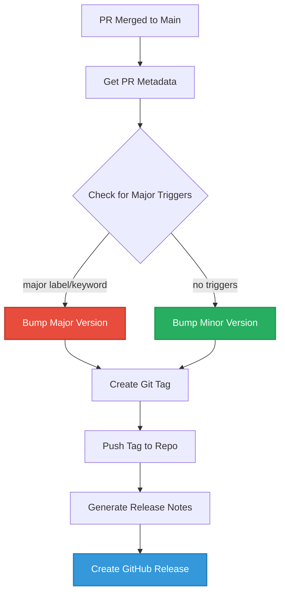

Recently, I was tasked with developing a consistent strategy for managing releases and tags in a GitHub repository that had grown organically without any version tracking system. The repository had been accumulating features and fixes for months, but there was no way to track versions, identify what changes belonged to which release, or even determine what was the current deployed "version".

## The Challenge

In our project, we wanted to:

- Create clear versioned tags that followed semantic versioning (v1.0.0, v1.1.0, etc.)
- Automatically generate GitHub Releases from these tags, with proper release notes
- Avoid manual tagging or release creation
- Include a flexible way to bump major versions

## The Solution

To achieve this, a GitHub Actions Workflow was implemented to handle tagging, and release management seamlessly. Illustrated below is the flow of the automated release process:



### Key Features of the Solution

#### 🔄 **Automated Trigger**

- **Push to Main**: Automatically runs after a pull request has been merged to the main branch

### 🎯 **Versioning Logic**

- **SemVer Compliant**: Follows semantic versioning principles and creates tag 1.0.0 if no previous tags exist
- **Tagging**: Reads the latest Git tag and increments the version, typically a minor bump but can also bump major or patch depending on context.

### 🏷️ **Flexible Major Version Bumping**

- **Labels**: Bumps the major version if pull request includes a major label
- **PR Title/Description**: Bumps the major version if the PR title or description contains `[major]`
- **Commit Message**: Bumps the major version if a commit message includes `[major]`

### 📜 **Release Notes Generation**

- **Changelog**: It auto-generates changelog content for a GitHub Release based on the PR title and description

Here's the GitHub Action that was developed to automate our entire release process:

```yaml

name: Tag and Release on PR Merge

on:
  push:
    branches:
      - main

jobs:
  tag-and-release:
    runs-on: ubuntu-latest
    permissions:
      contents: write
      pull-requests: read

    steps:
      - name: Checkout code
        uses: actions/checkout@v4

      - name: Get latest PR merged
        id: pr
        uses: actions/github-script@v7
        with:
          script: |
            const prs = await github.rest.pulls.list({
              owner: context.repo.owner,
              repo: context.repo.repo,
              state: 'closed',
              sort: 'updated',
              direction: 'desc',
              per_page: 1
            });
            const pr = prs.data.find(pr => pr.merged_at && pr.merge_commit_sha === context.sha);
            if (!pr) throw new Error('No merged PR found for this commit.');
            core.setOutput('pr_number', pr.number);
            core.setOutput('pr_title', pr.title);
            core.setOutput('pr_body', pr.body);

      - name: Check for major release trigger
        id: major_trigger
        uses: actions/github-script@v7
        with:
          script: |
            const prNumber = Number(process.env.PR_NUMBER || '${{ steps.pr.outputs.pr_number }}');
            let isMajor = false;
            if (prNumber) {
              const pr = await github.rest.pulls.get({
                owner: context.repo.owner,
                repo: context.repo.repo,
                pull_number: prNumber
              });
              const labels = pr.data.labels.map(l => l.name.toLowerCase());
              if (labels.includes('major-release')) isMajor = true;
              if (pr.data.title.includes('[major]') || (pr.data.body && pr.data.body.includes('[major]'))) isMajor = true;
            } else {
              // Fallback: check commit message
              const commit = await github.rest.repos.getCommit({
                owner: context.repo.owner,
                repo: context.repo.repo,
                ref: context.sha
              });
              if (commit.data.commit.message.includes('[major]')) isMajor = true;
            }
            core.setOutput('major', isMajor ? 'true' : 'false');

      - name: Get latest tag
        id: get_tag
        run: |
          git fetch --tags
          latest_tag=$(git tag --sort=-v:refname | head -n 1)
          echo "latest_tag=$latest_tag" >> $GITHUB_OUTPUT

      - name: Bump version and create tag
        id: bump_tag
        run: |
          latest_tag=${{ steps.get_tag.outputs.latest_tag }}
          is_major=${{ steps.major_trigger.outputs.major }}
          if [[ -z "$latest_tag" ]]; then
            new_tag="v1.0.0"
          else
            IFS='.' read -r major minor patch <<< "${latest_tag#v}"
            if [[ "$is_major" == "true" ]]; then
              new_tag="v$((major+1)).0.0"
            else
              new_tag="v$major.$minor.$((patch+1))"
            fi
          fi
          git config user.name "github-actions"
          git config user.email "github-actions@github.com"
          git tag "$new_tag"
          git push origin "$new_tag"
          echo "new_tag=$new_tag" >> $GITHUB_OUTPUT

      - name: Check if major version
        id: is_major
        run: |
          tag=${{ steps.bump_tag.outputs.new_tag }}
          major=$(echo $tag | cut -d'.' -f1 | tr -d 'v')
          minor=$(echo $tag | cut -d'.' -f2)
          patch=$(echo $tag | cut -d'.' -f3)
          if [[ "$minor" == "0" && "$patch" == "0" ]]; then
            echo "major=true" >> $GITHUB_OUTPUT
          else
            echo "major=false" >> $GITHUB_OUTPUT
          fi

      - name: Generate release summary
        id: release_notes
        if: steps.is_major.outputs.major == 'true'
        run: |
          pr_title="${{ steps.pr.outputs.pr_title }}"
          pr_body="${{ steps.pr.outputs.pr_body }}"
          echo -e "# Release Summary\n\n**PR Title:** $pr_title\n\n**PR Description:**\n$pr_body" > release-notes.txt

      - name: Create GitHub Release
        if: steps.is_major.outputs.major == 'true'
        env:
          GITHUB_TOKEN: ${{ secrets.GITHUB_TOKEN }}
        run: |
          gh release create "${{ steps.bump_tag.outputs.new_tag }}" \
            --title "Release ${{ steps.bump_tag.outputs.new_tag }}" \
            --notes-file release-notes.txt

```

## Conclusion

The beauty of this solution lies in its simplicity and reliability. Once set up, it runs invisibly in the background, ensuring that every meaningful change to our codebase gets properly versioned, tagged, and documented.

Have you implemented automated release management in your projects? I'd love to hear about your experiences and any creative variations you've developed!
