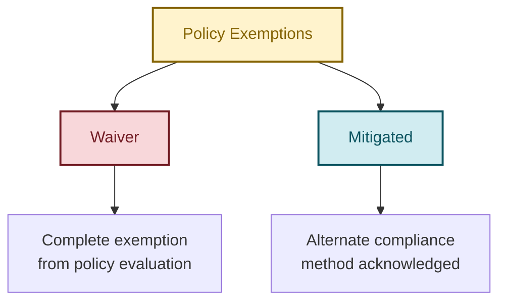
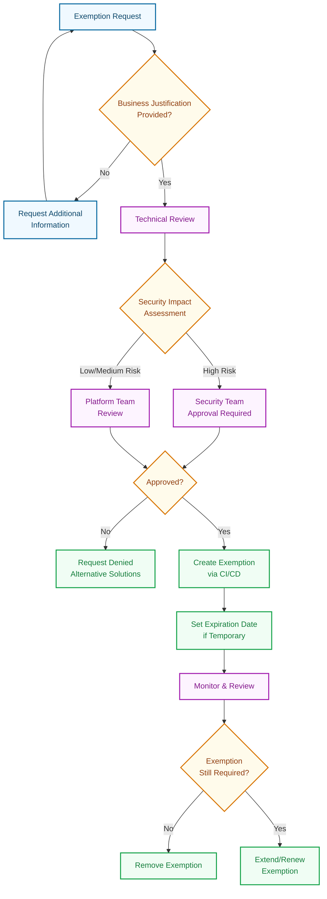

Welcome to the third instalment of our DevOps and Azure Policy series! In our [previous post](https://azurewithaj.com/posts/devops-azure-policy-series-custom-policies/), we explored how to create and deploy custom policy definitions using Bicep and CI/CD pipelines. Today, we're diving into a critical but often overlooked aspect of Azure Policy governance: policy exemptions. We'll explore what they are, when to use them, and how to implement them through Infrastructure as Code (IaC) using Bicep and automated CI/CD pipelines.

## Understanding Azure Policy Exemptions

Policy exemptions provide a controlled mechanism to exclude specific resources from policy evaluation. While this might seem counterintuitive to governance principles, there are legitimate scenarios where temporary or permanent exemptions are necessary for business continuity and operational flexibility.

### Why Policy Exemptions Are Necessary

Consider these real-world scenarios where exemptions become essential:

1. **Legacy Systems**: Older applications that cannot be immediately updated to meet current compliance standards
2. **Emergency Deployments**: Critical business systems that need immediate deployment before full compliance review
3. **Testing Environments**: Development resources that require different governance rules than production
4. **Vendor Limitations**: Third-party solutions with specific configuration requirements that conflict with organisational policies
5. **Phased Compliance**: Gradual roll out of new governance requirements across large organisations

### Types of Policy Exemptions

Azure Policy supports two types of exemptions:



- **Waiver**: Complete exemption from policy evaluation where the resource is not evaluated against the policy at all
- **Mitigated**: Acknowledges that compliance is achieved through alternative means not detectable by the policy

## Anatomy of a Policy Exemption

Let's examine the structure of an Azure Policy exemption:

```json
{
  "name": "emergency-deployment-exemption",
  "type": "Microsoft.Authorization/policyExemptions",
  "properties": {
    "displayName": "Emergency Deployment - Legacy App Migration",
    "description": "Temporary exemption for legacy application during migration phase",
    "exemptionCategory": "Waiver",
    "expiresOn": "2025-12-31T23:59:59Z",
    "policyAssignmentId": "/subscriptions/{subscription-id}/providers/Microsoft.Authorization/policyAssignments/security-baseline",
    "policyDefinitionReferenceIds": [
      "require-https-only",
      "require-latest-tls-version"
    ],
    "metadata": {
      "requestedBy": "platform-team@organisation.com",
      "approvedBy": "security-team@organisation.com",
      "businessJustification": "Legacy application requires HTTP during migration phase",
      "ticketReference": "CHANGE-12345"
    }
  }
}
```

Key components of a policy exemption:

- **exemptionCategory**: Either "Waiver" or "Mitigated"
- **expiresOn**: Optional expiration date for time-bound exemptions
- **policyAssignmentId**: The policy assignment being exempted from
- **policyDefinitionReferenceIds**: Specific policies within an initiative (optional)
- **metadata**: Additional context for governance and audit purposes

## Creating Policy Exemptions with Bicep

Now let's implement policy exemptions using Bicep. We can create policy exemptions at the management group, subscription, resource group or resource level.

### Management Group Level Exemption

In this example, we'll focus on management group level exemptions, which are commonly used for broad governance scenarios.

```bicep
// policy-exemption-mg.bicep

targetScope = 'managementGroup'

@description('Creates a policy exemption for a policy assignment.')
param exemptions array = []

var maxExemptionNameLength = 54 // deployment names have a max length limit of 64, this is to allow for the additional characters added to the name

// Create policy exemptions at Management Group level
module policyExemption_mg 'br/public:avm/ptn/authorization/policy-exemption:0.1.1' = [
  for (exemption, i) in exemptions: if (!empty(exemption.?managementGroupId)) {
    name: '${take(exemption.policyExemptionName, maxExemptionNameLength)}-${i}-mg'
    scope: managementGroup(exemption.managementGroupId!)
    params: {
      name: toLower(replace(exemption.policyExemptionName, ' ', '-'))
      displayName: exemption.?displayName ?? ''
      description: exemption.?policyExemptionDescription ?? ''
      metadata: exemption.?metadata ?? {}
      exemptionCategory: exemption.?exemptionCategory!
      policyAssignmentId: exemption.policyAssignmentId
      policyDefinitionReferenceIds: exemption.?policyDefinitionReferenceIds ?? []
      expiresOn: exemption.?expiresOn ?? null
      managementGroupId: exemption.?managementGroupId
    }
  }
]
```

```bicep
// policy-exemption-mg.bicepparam

using './policy-exemption-mg.bicep'

param exemptions = [
    {
    policyExemptionName: 'legacy-app-https-exemption'
    displayName: 'Legacy Application HTTPS Exemption'
    policyExemptionDescription: 'Temporary exemption for legacy application during migration to HTTPS'
    exemptionCategory: 'Waiver'
    policyAssignmentId: '/subscriptions/12345678-1234-1234-1234-123456789012/providers/Microsoft.Authorization/policyAssignments/security-baseline'
    policyDefinitionReferenceIds: [
      'require-https-only'
    ]
    expiresOn: '2025-12-31T23:59:59Z'
    managementGroupId: 'landing-zone-legacy-app-mg'
    metadata: {
      requestedBy: 'platform-team@organisation.com'
      approvedBy: 'security-team@organisation.com'
      businessJustification: 'Legacy application requires HTTP during migration phase'
      ticketReference: 'CHANGE-12345'
      reviewDate: '2025-09-30'
    }
  }
]
```

### Resource Level Exemption

For resource-level exemptions, we need to take a different approach. Azure Bicep doesn't natively support creating policy exemptions at the individual resource level, so we'll leverage deployment scripts to achieve this functionality.

Here is an example of how to create a resource-level exemption using a deployment script. It involves creating a Bicep module that uses the `Microsoft.Resources/deploymentScripts` resource type to execute a script that creates the exemption.

Here is the Bicep module for creating a policy exemption at the resource level:

```bicep
// module policy-exemption-resource.bicep

targetScope = 'resourceGroup'

@description('The name of the deployment script.')
param name string

@description('The location of the deployment script.')
param location string

@description('Specifies the name of the policy exemption. Maximum length is 64 characters.')
param policyExemptionName string

@description('Optional. The display name of the policy exemption. Maximum length is 128 characters.')
param displayName string = ''

@description('Optional. The policy exemption description.')
param policyExemptionDescription string = ''

@description('Optional. The policy exemption metadata. Metadata is an open ended object and is typically a collection of key-value pairs.')
param metadata object = {}

@description('The policy exemption category.')
@allowed([
  'Mitigated'
  'Waiver'
])
param exemptionCategory string

@description('The policy assignment ID.')
param policyAssignmentId string

@description('Optional. The policy definition display names.')
param policyDefinitionDisplayNames array = []

@description('Optional. The expiration date of the policy exemption.')
param expiresOn string = ''

@description('The resource group name for the resource.')
param resourceGroupName string

@description('The subscription ID for the resource.')
param subscriptionId string

@description('The resource name.')
param resourceName string

@description('The resource ID of the managed identity.')
param managedIdentityId string

resource deploymentScript 'Microsoft.Resources/deploymentScripts@2023-08-01' = {
  name: name
  location: location
  kind: 'AzurePowerShell'
  identity: {
    type: 'userAssigned'
    userAssignedIdentities: {
      '${managedIdentityId}': {}
    }
  }
  properties: {
    azPowerShellVersion: '9.7'
    scriptContent: '''
    param(
      [object] $metadata,
      [string] $exemptionCategory,
      [string] $policyAssignmentId,
      [array] $policyDefinitionDisplayNames,
      [string] $subscriptionId,
      [string] $resourceGroupName,
      [string] $resourceName
      )

      if ($subscriptionId) {
        Set-AzContext -Subscription $subscriptionId
      }

      $resource = Get-AzResource -ResourceGroupName $resourceGroupName -ResourceName $resourceName
      $assignment = Get-AzPolicyAssignment -Id $policyAssignmentId

      $arguments = @{
        Name = ${Env:policyExemptionName}
        PolicyAssignment = $assignment
        Scope = $resource.Id
      }
      if (${Env:policyExemptionDescription}) {
        $arguments.Description = ${Env:policyExemptionDescription}
      }
      if (${Env:expiresOn}) {
        $arguments.ExpiresOn = $expiresOn
      }
      if ($policyDefinitionDisplayNames) {
        $policyDefinitionReferenceIds=@()
        foreach ($policy in $policyDefinitionDisplayNames){
          $policyformatted = $policy.replace('[',"").replace(']',"")
          $policyDefinitionReferenceIds+=$policyformatted
        }
        $arguments.PolicyDefinitionReferenceId = $policyDefinitionReferenceIds
      }
      if (${Env:displayName}) {
        $arguments.displayName = ${Env:displayName}
      }
      if ($exemptionCategory) {
        $arguments.exemptionCategory = "Waiver"
      }

      New-AzPolicyExemption @arguments
    '''
    arguments: '-metadata ${metadata} -exemptionCategory ${exemptionCategory} -policyAssignmentId ${policyAssignmentId} -policyDefinitionDisplayNames ${policyDefinitionDisplayNames} -subscriptionId ${subscriptionId} -resourceGroupName ${resourceGroupName} -resourceName ${resourceName}'
    environmentVariables: [
      // the values below are configured as environment variables as parsing as arguments in the script does not parse correctly (when they contain special characters or spaces,etc.)
      {
        name: 'displayName'
        value: displayName
      }
      {
        name: 'policyExemptionName'
        value: policyExemptionName
      }
      {
        name: 'policyExemptionDescription'
        value: policyExemptionDescription
      }
      {
        name: 'expiresOn'
        value: expiresOn
      }
    ]
    timeout: 'PT15M'
    retentionInterval: 'PT1H'
    cleanupPreference: 'Always'
  }
}
```

Now let's create a template that leverages this module to deploy resource-level exemptions:

```bicep
// policy-exemption-resource.bicep

targetScope = 'managementGroup'

@description('Creates a policy exemption for a policy assignment.')
param exemptions exemptionsType[] = []

@description('Management group ID.')
param managementGroupId string

@description('The name of the managed identity.')
param managedIdentityName string

@description('The location of the managed identity.')
param managedIdentityLocation string

@description('Optional. The location of the deployment script resource. This is only used when creating a resource exemption.')
param deploymentScriptLocation string = ''

@description('Optional. The subscription ID for the deployment of the deployment script resource. This is only used when creating a resource exemption.')
param deploymentScriptSubscriptionId string = ''

@description('Optional. The resource group name for the deployment of the deployment script resource. This is only used when creating a resource exemption.')
param deploymentScriptResourceGroupName string = ''

var maxExemptionNameLength = 54 // deployment names have a max length limit of 64, this is to allow for the additional characters added to the name

// Create a user assigned identity used by a deployment script
module userAssignedIdentity 'br/public:avm/res/managed-identity/user-assigned-identity:0.4.1' = {
  scope: resourceGroup(deploymentScriptSubscriptionId, deploymentScriptResourceGroupName)
  name: '${uniqueString(managedIdentityName, managedIdentityLocation)}-umi'
  params: {
    name: managedIdentityName
    location: managedIdentityLocation
  }
}

// Create Resource Policy Contributor role assignment for the user assigned identity used by a deployment script
module policyContribRa 'br/public:avm/ptn/authorization/role-assignment:0.2.2' = {
  scope: managementGroup(managementGroupId)
  name: 'policy-contrib-role-mg-${uniqueString(deployment().name, managedIdentityLocation, managementGroupId, 'Resource Policy Contributor')}'
  params: {
    roleDefinitionIdOrName: 'Resource Policy Contributor'
    principalId: userAssignedIdentity.outputs.principalId
  }
}

// Create Reader role assignment for the user assigned identity used by a deployment script
module ReaderRa 'br/public:avm/ptn/authorization/role-assignment:0.2.2' = {
  scope: managementGroup(managementGroupId)
  name: 'reader-role-mg-${uniqueString(deployment().name, managedIdentityLocation, managementGroupId, 'Reader')}'
  params: {
    roleDefinitionIdOrName: 'Reader'
    principalId: userAssignedIdentity.outputs.principalId
  }
}

// Create policy exemptions at Resource level using a deployment script
@batchSize(1) // This is to cater for policy exemptions that utilise the same name but a different display name as you cant update at the same time
module policyExemption_resource 'modules/policy-exemption-resource.bicep' = [
  for (exemption, i) in exemptions: if (empty(exemption.?managementGroupId) && !empty(exemption.?resourceName) && !empty(exemption.?resourceGroupName) && !empty(exemption.?subscriptionId)) {
    dependsOn: [
      policyContribRa
      ReaderRa
    ]
    name: '${take(exemption.policyExemptionName, maxExemptionNameLength)}-${i}-rsrc'
    scope: resourceGroup(deploymentScriptSubscriptionId, deploymentScriptResourceGroupName)
    params: {
      name: '${toLower(replace(exemption.policyExemptionName, ' ', '-'))}-policy-exemption'
      location: deploymentScriptLocation
      policyExemptionName: toLower(replace(exemption.policyExemptionName, ' ', '-'))
      displayName: exemption.?displayName ?? ''
      policyExemptionDescription: exemption.?policyExemptionDescription ?? ''
      metadata: exemption.?metadata ?? {}
      exemptionCategory: exemption.exemptionCategory!
      policyAssignmentId: exemption.policyAssignmentId
      policyDefinitionDisplayNames: exemption.?policyDefinitionDisplayNames ?? null
      expiresOn: exemption.?expiresOn ?? ''
      subscriptionId: exemption.subscriptionId!
      resourceGroupName: exemption.resourceGroupName!
      resourceName: exemption.resourceName!
      managedIdentityId: userAssignedIdentity.outputs.resourceId
    }
  }
]
```

```bicep
// policy-exemption-resource.bicepparam

using './policy-exemption-resource.bicep'

param exemptions = [
    {
    policyExemptionName: 'legacy-app-https-exemption'
    displayName: 'Legacy Application HTTPS Exemption'
    policyExemptionDescription: 'Temporary exemption for legacy application during migration to HTTPS'
    exemptionCategory: 'Waiver'
    policyAssignmentId: '/subscriptions/12345678-1234-1234-1234-123456789012/providers/Microsoft.Authorization/policyAssignments/security-baseline'
    policyDefinitionReferenceIds: [
      'require-https-only'
    ]
    expiresOn: '2025-12-31T23:59:59Z'
    subscriptionId: '12345678-1234-1234-1234-123456789012'
    resourceGroupName: 'legacy-app-rg'
    resourceName: 'legacy-app-vm'
    metadata: {
      requestedBy: 'platform-team@organisation.com'
      approvedBy: 'security-team@organisation.com'
      businessJustification: 'Legacy application requires HTTP during migration phase'
      ticketReference: 'CHANGE-12345'
      reviewDate: '2025-09-30'
    }
  }
]
```

## Governance Workflow for Policy Exemptions

Implementing a robust governance workflow is crucial for maintaining security and compliance while providing necessary flexibility. Here's an example workflow:



## CI/CD Pipeline for Policy Exemptions

Let's implement a CI/CD pipeline using GitHub Actions for managing policy exemptions using our centralised pipeline approach:

```yaml

# deploy-policy-exemptions.yml

name: Policy Exemption Deployment

on:
  workflow_dispatch:
  push:
    branches:
      - main
  pull_request:
    branches:
      - main

env:
  bicep_template: policy-exemption.bicep
  bicep_template_parameter: policy-exemption.bicepparam
  management_group_id: "<MANAGEMENT_GROUP_ID>"
  oidc_app_reg_client_id: "<OIDC_APP_REG_CLIENT_ID>"
  azure_tenant_id: "<AZURE_TENANT_ID>"
  environment: "<ENVIRONMENT>"
  location: australiaeast
  deployment_name: "deploy_policy_exemptions"
  az_deployment_type: "managementgroup"

jobs:
  initialise_vars:
    runs-on: ubuntu-latest
    outputs:
      bicep_template: ${{ env.bicep_template }}
      bicep_template_parameter: ${{ env.bicep_template_parameter }}
      location: ${{ env.location }}
      management_group_id: ${{ env.management_group_id }}
      oidc_app_reg_client_id: ${{ env.oidc_app_reg_client_id }}
      azure_tenant_id: ${{ env.azure_tenant_id }}
      environment: ${{ env.environment }}
      deployment_name: ${{ env.deployment_name }}
      az_deployment_type: ${{ env.az_deployment_type }}
    steps:
      - name: Initialise Variables
        run: echo "Initialising environment variables"

  build_policy_exemptions:
    needs: initialise_vars
    permissions:
      id-token: write
      contents: read
    uses: tw3lveparsecs/azure-iac-and-devops/.github/workflows/build_template.yml@main
    with:
      test_trigger: ${{ github.event_name }}
      template_file_path: ${{ needs.initialise_vars.outputs.bicep_template }}
      parameter_file_path: ${{ needs.initialise_vars.outputs.bicep_template_parameter }}
      oidc_app_reg_client_id: ${{ needs.initialise_vars.outputs.oidc_app_reg_client_id }}
      azure_tenant_id: ${{ needs.initialise_vars.outputs.azure_tenant_id }}
      location: ${{ needs.initialise_vars.outputs.location }}
      management_group_id: ${{ needs.initialise_vars.outputs.management_group_id }}
      deployment_name: ${{ needs.initialise_vars.outputs.deployment_name }}
      az_deployment_type: ${{ needs.initialise_vars.outputs.az_deployment_type }}

  deploy_policy_exemptions:
    needs: [initialise_vars, build_policy_exemptions]
    permissions:
      id-token: write
      contents: read
    uses: tw3lveparsecs/azure-iac-and-devops/.github/workflows/deploy_template.yml@main
    with:
      environment: ${{ needs.initialise_vars.outputs.environment }}
      location: ${{ needs.initialise_vars.outputs.location }}
      template_file_name: ${{ needs.initialise_vars.outputs.bicep_template_filename }}
      oidc_app_reg_client_id: ${{ needs.initialise_vars.outputs.oidc_app_reg_client_id }}
      azure_tenant_id: ${{ needs.initialise_vars.outputs.azure_tenant_id }}
      management_group_id: ${{ needs.initialise_vars.outputs.management_group_id }}
      deployment_name: ${{ needs.initialise_vars.outputs.deployment_name }}
      az_deployment_type: ${{ needs.initialise_vars.outputs.az_deployment_type }}

```

To demonstrate this, I’ve added a complete example to the repository linked below.

[Click here to view an example of a policy exemption using Bicep](https://github.com/tw3lveparsecs/azure-policy-with-bicep/tree/main/policy-exemptions)

## Conclusion

Policy exemptions are a powerful tool for maintaining governance flexibility while ensuring compliance. When implemented correctly with proper CI/CD pipelines, approval workflows, and monitoring, they provide a controlled mechanism for handling legitimate exceptions to organisational policies.

Key takeaways from this article:

1. **Strategic Use**: Exemptions should be used judiciously and only when absolutely necessary
2. **Time-Bounded**: Implement expiration dates and regular review cycles
3. **Comprehensive Documentation**: Maintain detailed records of business justification and approval
4. **Automated Governance**: Use CI/CD pipelines and monitoring to ensure consistent processes
5. **Regular Auditing**: Implement reporting and alerting for exemption lifecycle management

By following these practices and leveraging the Bicep templates and CI/CD patterns demonstrated in this article, we can implement a robust policy exemption management system that balances governance requirements with operational flexibility.

In our next article, we'll explore advanced Azure Policy scenarios including policy remediation. Stay tuned!
