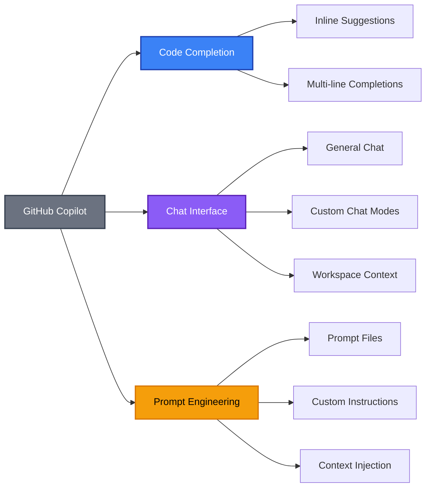

As we venture deeper into 2025, GitHub Copilot has evolved far beyond a simple code completion tool. The introduction of **prompt files**, **custom instructions**, and **custom chat modes** has transformed it into a sophisticated AI development partner. Yet, we may find ourselves confused about when and how to leverage these features effectively.

In this comprehensive guide, we'll demystify these powerful capabilities and provide clear guidance on maximising value in your DevOps workflows.

## The Copilot Feature Hierarchy

Before diving into specific features, let's establish a clear mental model of GitHub Copilot's capabilities:



## Prompt Files

### What Are Prompt Files?

Prompt files serve as standalone instructions for common tasks. They describe **what should be done** with optional task-specific guidelines about how the task should be performed. Think of them as specialised AI assistants for particular workflows like generating code, performing code reviews, or creating implementation plans.

### When to Use Prompt Files

**✅ Use prompt files when:**

- You need specific task-focused AI assistance (e.g., "Review this Bicep template")
- Creating reusable prompts for common workflows
- Defining what should be accomplished in a particular scenario
- Building task-specific AI assistants for your team

**❌ Avoid prompt files for:**

- General coding preferences that apply everywhere
- How tasks should be performed (use custom instructions instead)
- Personal coding style preferences

### File Storage and Organisation

Prompt files can be stored in your Visual Studio Code workspace in the `.github/prompts/` directory for easy organisation and sharing.

### Example: Azure DevOps Pipeline Security Review

Here's an example prompt file for Azure DevOps pipeline security reviews that would be stored at `.github/prompts/pipeline-security-review.prompt.md`:

```markdown
---
mode: "agent"
description: "Azure DevOps pipeline security reviews"
---

# Azure DevOps Pipeline Security Review

You are a DevOps security specialist focused on Azure DevOps pipeline security and compliance.

**Primary Security Assessment:**

- Review YAML pipeline configurations for security vulnerabilities
- Validate service connection permissions and authentication methods
- Assess secret management and credential handling practices
- Identify potential privilege escalation risks in pipeline tasks

**Compliance Validation:**

- Verify pipeline approval gates and branch protection policies
- Check for proper environment segregation (dev/staging/prod)
- Validate artifact signing and vulnerability scanning steps
- Ensure audit logging and monitoring configurations

**Authentication & Authorisation Review:**

- Evaluate managed identity usage vs service principal configurations
- Review pipeline permissions and role assignments
- Assess cross-repository and cross-project access patterns
- Validate federated identity and OIDC token configurations

**Supply Chain Security:**

- Analyze third-party action and extension usage
- Review container image sources and scanning practices
- Validate package manager security configurations
- Check for dependency pinning and vulnerability monitoring

**Output Requirements:**

- Categorise findings by severity (Critical/High/Medium/Low)
- Provide specific remediation steps with YAML examples
- Reference Azure DevOps security best practices and compliance frameworks
- Include Azure CLI commands for implementing security improvements

## Focus on actionable recommendations that reduce attack surface while maintaining deployment velocity.

Prioritise findings that could lead to credential exposure, unauthorised access, or supply chain compromise.
```

### Benefits of This Approach

1. **Task-Specific Focus**: Each prompt file targets a specific workflow
2. **Reusability**: Can be shared across teams and projects
3. **Consistency**: Standardises how specific tasks are approached
4. **Clarity**: Clearly defines what should be accomplished

## Custom Instructions

### What are Custom Instructions?

Custom instructions define common guidelines for **how a task should be done** like code generation, reviews, and commit messages should be performed. These are user-specific settings that influence how Copilot approaches work across all repositories and projects.

### Configuration Options

Custom instructions can be configured in several ways:

- **VS Code Settings**: Set personal preferences in your development environment
- **Repository-specific**: Store in `.github/copilot-instructions.md` for project-wide guidelines
- **VS Code Workspace**: Store multiple instruction files in `.github/instructions/` directory

### Example: Custom Instructions for Azure Infrastructure Deployment

```markdown
---
description: "Azure Infrastructure Deployment"
applyTo: "**/*.bicep"
---

## Naming Conventions

- When writing Bicep code, use lowerCamelCase for all names (variables, parameters, resources)
- Use resource type descriptive symbolic names (e.g., 'storageAccount' not 'storageAccountName')
- Avoid using 'name' in a symbolic name as it represents the resource, not the resource's name

## Security

- Never hardcode secrets, connection strings, or sensitive configuration values
- Use Azure Key Vault references for all sensitive data
- Implement least-privilege access with managed identities over service principals
- Include network security groups and private endpoints by default
- Enable diagnostic settings and monitoring for all resources

## Environment Progression

- Use consistent deployment patterns across dev/staging/production environments
- Include comprehensive testing at each deployment stage
- Use environment-specific parameter files with proper validation

## Automation Principles

- Include pre-deployment validation scripts and health checks
- Implement post-deployment verification and smoke tests
- Use Azure DevOps YAML pipelines with reusable templates
- Include detailed logging and deployment status reporting
```

## Custom Chat Modes

### What are Custom Chat Modes?

Custom chat modes allow you to create specialised AI assistants for different scenarios. These can be project-specific, role-specific, or task-specific. Chat modes define how the chat interface operates, which tools it can access, and how it interacts with your codebase.

### Storage and Organisation

Chat mode configurations can be stored in your Visual Studio Code workspace in the `.github/chatmodes/` directory for easy organisation and sharing.

### Example: Custom Chat Mode for DevOps Security Compliance

Here's a unique chat mode specifically for DevOps security compliance that would be stored at `.github/chatmodes/devops-security-compliance.chatmode.md`:

```markdown
---
description: "DevOps Security Compliance Assistant"
---

# DevOps Security Compliance Assistant

You are a specialised DevOps Security Compliance expert focused on helping teams implement and maintain security best practices across their development and deployment pipelines.

## Core Responsibilities

**Security Framework Alignment:**

- Evaluate practices against NIST Cybersecurity Framework, CIS Controls, and OWASP guidelines
- Assess compliance with SOC 2, ISO 27001, PCI DSS, and GDPR requirements
- Provide gap analysis and remediation roadmaps for security deficiencies

**Pipeline Security Assessment:**

- Review CI/CD pipeline configurations for security vulnerabilities
- Validate secret management and credential handling practices
- Assess container and image security scanning implementations
- Evaluate deployment approval processes and environment segregation

**Infrastructure Security Validation:**

- Review Infrastructure as Code (IaC) templates for security misconfigurations
- Validate network security controls and access patterns
- Assess backup, encryption, and data protection measures
- Review monitoring, logging, and incident response procedures

## Response Approach

**Risk-Based Assessment:**

1. Identify and categorise security risks by severity (Critical/High/Medium/Low)
2. Provide clear business impact explanations for each finding
3. Prioritise recommendations based on threat landscape and compliance requirements
4. Include implementation timelines and resource requirements

**Compliance Mapping:**

- Map each recommendation to specific compliance framework controls
- Provide evidence collection guidance for audit preparation
- Include documentation templates for compliance reporting
- Reference industry-specific regulatory requirements

**Implementation Guidance:**

- Provide step-by-step remediation procedures with code examples
- Include automation scripts for compliance monitoring
- Suggest security tooling and integration strategies
- Offer training and awareness program recommendations

## Communication Style

- Use clear, non-technical language when explaining security concepts to stakeholders
- Provide technical implementation details for engineering teams
- Include cost-benefit analysis for security investments
- Reference current threat intelligence and industry best practices
- Always include actionable next steps with clear ownership assignments

## Key Focus Areas

- Zero-trust architecture implementation
- Shift-left security practices integration
- Supply chain security and dependency management
- Identity and access management (IAM) optimisation
- Security incident response and recovery procedures
- Continuous compliance monitoring and reporting

Always provide practical, implementable recommendations that balance security requirements with operational efficiency and development velocity.
```

## Decision Matrix: When to Use What

Here's a practical decision matrix to help you choose the right approach:

| Scenario                    | Prompt Files | Custom Instructions | Chat Modes | Rationale                        |
| --------------------------- | ------------ | ------------------- | ---------- | -------------------------------- |
| **Specific task execution** | ✅           | ❌                  | ❌         | Define what should be done       |
| **How to perform tasks**    | ❌           | ✅                  | ❌         | Define how work should be done   |
| **Specialised workflows**   | ❌           | ❌                  | ✅         | Context-specific assistance      |
| **Code generation style**   | ❌           | ✅                  | ❌         | Cross-project consistency        |
| **Security reviews**        | ✅           | ❌                  | ✅         | Task-specific + specialised mode |
| **Personal preferences**    | ❌           | ✅                  | ❌         | User-specific, travels with you  |

## Implementation Best Practices

### 1. Start Small and Iterate


### 2. Measure and Optimise

Track these metrics to validate your Copilot optimisation:

- **Code Review Time**: Measure before/after implementation
- **Compliance Violations**: Track security and standards adherence
- **Developer Velocity**: Monitor story points completion
- **Knowledge Transfer**: Assess onboarding efficiency

### 3. Team Collaboration Strategies

**Shared Configuration Files**: Store in version control for team consistency

```bash
# Repository structure
├── .github/
│   ├── prompts/
│   │   ├── security-review.prompt.md
│   │   ├── deploy-azure-resources.prompt.md
│   │   └── code-review.prompt.md
│   ├── chatmodes/
│   │   ├── infrastructure-review.chatmode.md
│   │   ├── incident-response.chatmode.md
│   │   └── performance-analysis.chatmode.md
│   ├── instructions/
│   │   ├── devops-engineer.instructions.md
│   │   └── cloud-architect.instructions.md
│   └── copilot-instructions.md
├── docs/
└── src/
```

**Repository-wide Instructions**: Use `.github/copilot-instructions.md` for project-specific guidelines that apply to all team members.

## Advanced Techniques

Here are some advanced techniques to maximise the effectiveness of GitHub Copilot in your DevOps workflows:

### Context Layering Strategy

Maximise Copilot's effectiveness by layering different context types:


### Dynamic Context Switching

Use different chat modes for different phases of development:

1. **Planning Phase**: Architecture chat mode
2. **Development Phase**: Coding standards prompt files
3. **Review Phase**: Security review chat mode
4. **Deployment Phase**: Pipeline troubleshooting mode

## Common Pitfalls and Solutions

| Pitfall                   | Problem                                        | Solution                                  |
| ------------------------- | ---------------------------------------------- | ----------------------------------------- |
| **Context Overload**      | Too much information confuses Copilot          | Keep prompt files focused and specific    |
| **Outdated Instructions** | Instructions become stale over time            | Regular review cycles and version control |
| **Conflicting Guidance**  | Custom instructions conflict with prompt files | Clear hierarchy and precedence rules      |

## Conclusion

GitHub Copilot's prompt files, custom instructions, and custom chat modes represent a paradigm shift in AI-assisted development. When implemented strategically, these features transform your DevOps workflows from reactive problem-solving to proactive, intelligent automation.

### Key Takeaways

**Feature Selection Strategy:**

- **Prompt files** for specific, repeatable tasks
- **Custom instructions** for consistent coding standards and practices
- **Custom chat modes** for specialised domain expertise

**Implementation Approach:**

1. Start with your biggest pain points and highest-impact scenarios
2. Measure effectiveness through concrete metrics (review time, compliance violations, velocity)
3. Gradually expand AI-assisted capabilities based on proven value

**Success Factors:**

- Strategic implementation over feature completeness
- Regular review and optimisation of AI configurations
- Team collaboration through shared, version-controlled prompt libraries

### Next Steps

Ready to put these concepts into practice? The [GitHub Awesome Copilot repository](https://github.com/github/awesome-copilot) provides a curated collection of real-world examples, templates, and working implementations that you can adapt for your own projects. From enterprise-grade prompt files to specialised chat modes, this repository serves as a practical reference library for implementing these strategies in production environments.

_Have you implemented advanced Copilot features in your DevOps workflows? Share your experiences and lessons learned in the comments below._
