The evolution of DevOps continues to accelerate, and we're now entering the era of **Agentic DevOps** where AI agents don't just assist with code completion, but actively participate in the entire development lifecycle. GitHub Copilot's Coding Agent represents a significant leap forward, transforming how we approach backlog management, code reviews, and development workflows.

In this post, I'll share insights from real-world usage, explore the security considerations, and demonstrate how to maximise efficiency while maintaining quality standards.

## What is GitHub Copilot's Coding Agent?

GitHub Copilot's Coding Agent goes beyond traditional AI assistance. Instead of just suggesting code completions, it can:

- **Analyse GitHub issues** and understand requirements
- **Create complete pull requests** with working implementations
- **Navigate complex codebases** to understand existing patterns
- **Apply consistent coding standards** across your organisation
- **Work within your security constraints** and branch protection rules

The key difference? This isn't just autocomplete, it's an AI developer that can take ownership of entire tasks.

## Behind the Scenes: How the Coding Agent Works

Understanding what happens when the coding agent takes on a task helps you optimise your workflow. Here's the complete journey from issue assignment to merged code:

### The Complete Workflow


### Phase 1: Understanding Your Request

When you assign the coding agent to an issue, here's what happens in the first few seconds:

```mermaid
flowchart LR
    A[📋 Issue Assignment] --> B[🔍 Read Issue Details]
    B --> C[📚 Scan Repository Files]
    C --> D[🧠 Build Context Map]
    D --> E[📋 Create Task Plan]

    subgraph "Agent Analysis"
        B1[Parse requirements]
        B2[Extract acceptance criteria]
        B3[Identify file types mentioned]
    end

    B --> B1
    B --> B2
    B --> B3

    style A fill:#4A90E2,stroke:#2E5F87,stroke-width:2px,color:#FFFFFF
    style B fill:#E8E8E8,stroke:#B0B0B0,stroke-width:2px,color:#000000
    style C fill:#E8E8E8,stroke:#B0B0B0,stroke-width:2px,color:#000000
    style D fill:#E8E8E8,stroke:#B0B0B0,stroke-width:2px,color:#000000
    style E fill:#50C878,stroke:#3A9B5C,stroke-width:2px,color:#FFFFFF
```



### Phase 2: Implementation in Action

The coding agent works autonomously in its sandboxed environment, following a systematic approach:

```mermaid
graph TD
    A[🌿 Create Branch: copilot/issue-123] --> B[📁 Explore Codebase Structure]
    B --> C[🔍 Find Related Files]
    C --> D[📖 Study Existing Patterns]
    D --> E[✍️ Write Code Changes]
    E --> F[🧪 Run Tests]
    F --> G{Tests Pass?}
    G -->|❌ No| H[🔧 Debug & Fix Issues]
    H --> F
    G -->|✅ Yes| I[📝 Update Documentation]
    I --> J[💾 Commit Changes]
    J --> K[📤 Push to Branch]

    style A fill:#4A90E2,stroke:#2E5F87,stroke-width:2px,color:#FFFFFF
    style B fill:#E8E8E8,stroke:#B0B0B0,stroke-width:2px,color:#000000
    style C fill:#E8E8E8,stroke:#B0B0B0,stroke-width:2px,color:#000000
    style D fill:#E8E8E8,stroke:#B0B0B0,stroke-width:2px,color:#000000
    style E fill:#E8E8E8,stroke:#B0B0B0,stroke-width:2px,color:#000000
    style F fill:#E8E8E8,stroke:#B0B0B0,stroke-width:2px,color:#000000
    style H fill:#E8E8E8,stroke:#B0B0B0,stroke-width:2px,color:#000000
    style I fill:#E8E8E8,stroke:#B0B0B0,stroke-width:2px,color:#000000
    style J fill:#E8E8E8,stroke:#B0B0B0,stroke-width:2px,color:#000000
    style G fill:#FFB347,stroke:#E6A042,stroke-width:2px,color:#000000
    style K fill:#50C878,stroke:#3A9B5C,stroke-width:2px,color:#FFFFFF
```



### Phase 3: Collaboration & Review

The final phase brings human expertise back into the loop:

```mermaid
graph TD
    A[🤖 Agent Creates Pull Request] --> B[📝 Auto-generates PR description]
    B --> C[� Triggers CI/CD Checks]
    C --> D{All Checks Pass?}
    D -->|❌ No| E[�️ Agent fixes failing tests]
    E --> C
    D -->|✅ Yes| F[👨‍💻 Human Review Requested]
    F --> G[� Developer reviews changes]
    G --> H{Approved?}
    H -->| Feedback| I[📝 Developer leaves comments]
    I --> J[🤖 Agent reads feedback]
    J --> K[🔄 Agent implements changes]
    K --> C
    H -->|✅ Yes| L[🎉 Pull Request Merged]

    style A fill:#4A90E2,stroke:#2E5F87,stroke-width:2px,color:#FFFFFF
    style B fill:#E8E8E8,stroke:#B0B0B0,stroke-width:2px,color:#000000
    style C fill:#E8E8E8,stroke:#B0B0B0,stroke-width:2px,color:#000000
    style D fill:#E8E8E8,stroke:#B0B0B0,stroke-width:2px,color:#000000
    style E fill:#E8E8E8,stroke:#B0B0B0,stroke-width:2px,color:#000000
    style G fill:#E8E8E8,stroke:#B0B0B0,stroke-width:2px,color:#000000
    style I fill:#E8E8E8,stroke:#B0B0B0,stroke-width:2px,color:#000000
    style J fill:#E8E8E8,stroke:#B0B0B0,stroke-width:2px,color:#000000
    style K fill:#E8E8E8,stroke:#B0B0B0,stroke-width:2px,color:#000000
    style F fill:#FFB347,stroke:#E6A042,stroke-width:2px,color:#000000
    style L fill:#50C878,stroke:#3A9B5C,stroke-width:2px,color:#FFFFFF
    style H fill:#7B68EE,stroke:#5A4FCF,stroke-width:2px,color:#FFFFFF
```



## Best Practices for Maximising Efficiency

### 1. Write Detailed Issues

Transform this:

```markdown
## Issue

Add internet fallback to DNS module
```

Into this:

```markdown
## Issue: Enable Internet Fallback for Private DNS Zones

### Context

Our Bicep module `modules/private-dns-zones` currently creates Azure Private DNS zones
without internet fallback capability.

### Requirements

- Add a boolean parameter `enableInternetFallback` (default: false)
- When enabled, configure the DNS zone to allow internet fallback
- Update parameter documentation
- Add example usage to README.md

### Acceptance Criteria

- [ ] New parameter added with proper type and description
- [ ] Internet fallback configuration implemented
- [ ] Documentation updated
- [ ] Example provided showing both scenarios

### Technical Notes

- Reference: https://docs.microsoft.com/en-us/azure/dns/private-dns-overview
- Follow existing parameter naming conventions in the module
```

### 2. Leverage Issue Templates

Create templates that guide both humans and AI to provide necessary details:

```markdown
---
name: Feature Request - Infrastructure
about: Request new infrastructure features or enhancements
title: "[FEATURE] "
labels: ["enhancement", "infrastructure"]
assignees: []
---

## Feature Request Template

Please provide detailed information to help the coding agent understand your requirements.

**Module/Component Name:**

<!-- e.g., modules/private-dns-zones, bicep/patterns/landing-zone -->

**Detailed Requirements:**

<!-- Describe exactly what functionality you need -->

**Use Case:**

<!-- Explain why this feature is needed and how it will be used -->

**Acceptance Criteria:**

<!-- List specific requirements that must be met -->

- [ ]
- [ ]
- [ ]

**Additional Context:**

<!-- Add any other context, screenshots, or examples about the feature request -->
```

### 3. Add Custom Instructions to your Repository

To guide the coding agent's behaviour, create a `.github/copilot-instructions.md` file:

```markdown
---
description: "Infrastructure as Code with Bicep"
applyTo: "**/*.bicep"
---

## Naming Conventions

- When writing Bicep code, use lowerCamelCase for all names (variables, parameters, resources)
- Use resource type descriptive symbolic names (e.g., 'storageAccount' not 'storageAccountName')
- Avoid using 'name' in a symbolic name as it represents the resource, not the resource's name
- Avoid distinguishing variables and parameters by the use of suffixes

## Structure and Declaration

- Always declare parameters at the top of files with @description decorators
- Use latest stable API versions for all resources
- Use descriptive @description decorators for all parameters
- Specify minimum and maximum character length for naming parameters

## Parameters

- Set default values that are safe for test environments (use low-cost pricing tiers)
- Use @allowed decorator sparingly to avoid blocking valid deployments
- Use parameters for settings that change between deployments

## Variables

- Variables automatically infer type from the resolved value
- Use variables to contain complex expressions instead of embedding them directly in resource properties

## Resource References

- Use symbolic names for resource references instead of reference() or resourceId() functions
- Create resource dependencies through symbolic names (resourceA.id) not explicit dependsOn
- For accessing properties from other resources, use the 'existing' keyword instead of passing values through outputs

## Resource Names

- Use template expressions with uniqueString() to create meaningful and unique resource names
- Add prefixes to uniqueString() results since some resources don't allow names starting with numbers

## Child Resources

- Avoid excessive nesting of child resources
- Use parent property or nesting instead of constructing resource names for child resources

## Security

- Never include secrets or keys in outputs
- Use resource properties directly in outputs (e.g., storageAccount.properties.primaryEndpoints)

## Documentation

- Include helpful // comments within your Bicep files to improve readability
```

### 4. Preconfigure the Development Environment for the Agent

To ensure the coding agent operates effectively, preconfigure its development environment by creating a `copilot-setup-steps.yml` file in your repository:

```yaml
name: "Copilot Setup Steps"

# Automatically run the setup steps when they are changed to allow for easy validation, and
# allow manual testing through the repository's "Actions" tab
on:
  workflow_dispatch:
  push:
    paths:
      - .github/workflows/copilot-setup-steps.yml
  pull_request:
    paths:
      - .github/workflows/copilot-setup-steps.yml

jobs:
  # The job MUST be called `copilot-setup-steps` or it will not be picked up by Copilot.
  copilot-setup-steps:
    runs-on: ubuntu-latest

    # Set the permissions to the lowest permissions possible needed for your steps.
    # Copilot will be given its own token for its operations.
    permissions:
      # If you want to clone the repository as part of your setup steps, for example to install dependencies, you'll need the `contents: read` permission. If you don't clone the repository in your setup steps, Copilot will do this for you automatically after the steps complete.
      contents: read

    # You can define any steps you want, and they will run before the agent starts.
    # If you do not check out your code, Copilot will do this for you.
    steps:
      - name: Checkout code
        uses: actions/checkout@v4

      - name: Set up Node.js
        uses: actions/setup-node@v4
        with:
          node-version: "20"
          cache: "npm"

      - name: Install JavaScript dependencies
        run: npm ci
```

## Real-World Success Story: Azure Private DNS Zones Enhancement

Let me share a concrete example that demonstrates the transformative power of agentic DevOps in action.

### The Challenge

I had a growing backlog of Bicep module improvements, including what seemed like a simple task: enabling internet fallback on a Bicep module that deployed Azure Private DNS zones. This feature enhances DNS resiliency by allowing queries to fall back to internet DNS servers when private resolution fails ([Microsoft's technical deep-dive here](https://techcommunity.microsoft.com/blog/azureinfrastructureblog/enhancing-azure-private-dns-resiliency-with-internet-fallback/4386791)).

While the implementation was technically straightforward, my focus was elsewhere on higher-priority initiatives. This "simple" task remained stuck in the backlog for weeks, a typical example of how good ideas get delayed by resource constraints.

### The Solution: Delegating to the Coding Agent

Instead of letting this improvement sit in the backlog indefinitely, I decided to experiment with GitHub Copilot's Coding Agent. Here's exactly what happened:

#### **Step 1: Issue Assignment**

I assigned `copilot` to the existing GitHub issue. No special setup required just a simple issue assignment.

#### **Step 2: Autonomous Analysis**

Within seconds, the GitHub Copilot Coding Agent began analysing:

- The existing Bicep module structure
- Current parameter patterns and naming conventions
- Related documentation files
- Test files and examples

#### **Step 3: Implementation**

In under 5 minutes, a pull request appeared with:

- ✅ New `resolutionPolicy` parameter
- ✅ Appropriate default value (for backward compatibility)
- ✅ Updated parameter documentation
- ✅ Modified DNS zone resource configuration

#### **Step 4: Standard Review Process**

I reviewed the PR exactly as I would with any team member checking code quality, testing approach, and documentation completeness.

### The Learning: Details Matter

Here's where it gets interesting: **my first attempt wasn't perfect.**

The initial PR implemented internet fallback, but not quite how I envisioned it. The agent had made reasonable assumptions, but they didn't align with my specific architectural preferences. This taught me a crucial lesson that applies to any development collaboration:

> **Whether you're working with a human developer or an AI agent, vague requirements lead to either suboptimal results or requests for clarification.**

After adding comments to the PR and a bit of back-and-forth discussion, the coding agent quickly iterated on the feedback. It was clear that providing more detailed requirements upfront would have saved time and improved the initial implementation.

### The Results

With clearer understanding of my requirements from the feedback, the coding agent produced a final implementation that met all my expectations:

- ✅ **Perfect Implementation**: Exactly matched my architectural vision
- ✅ **Testing**: Included updates to testing files to validate both scenarios (with and without internet fallback)
- ✅ **Documentation Excellence**: Clear examples and usage guidance
- ✅ **Zero Rework**: Ready to merge without further changes

I also tested the implementation as we would with any human developer, ensuring it met all acceptance criteria and worked as expected.

The end result was a high-quality, production-ready feature that would have taken hours to implement manually now delivered in under 20 minutes.

## Security Considerations and Enterprise Readiness

Security is a fundamental consideration when enabling Copilot's coding agent in your organisation. GitHub has built comprehensive security protections into the system, which you can supplement with additional enterprise-grade controls.

### Built-in Security Protections

The coding agent comes with robust security measures out of the box:

#### **Governance and Access Control**

- **Subject to Existing Governance**: Organisation settings and enterprise policies automatically apply to the coding agent
- **User Permission Requirements**: Only users with write access can assign tasks or provide feedback to Copilot
- **Comments from unauthorised users are ignored**: Users without write access cannot interact with the agent

#### **Restricted Development Environment**

- **Sandboxed Environment**: Copilot works in an isolated development environment with controlled internet access
- **Read-only Repository Access**: The agent can only read from the assigned repository
- **GitHub Actions Powered**: Uses GitHub's secure, ephemeral runners for all operations

#### **Branch and Code Security**

- **Limited Branch Access**: Can only create and push to branches beginning with `copilot/`
- **Cannot Push to Main**: Direct pushes to `main` or `master` branches are blocked
- **Branch Protection Compliance**: Respects all existing branch protection rules and rulesets
- **Draft PR Security**: Pull requests require approval before GitHub Actions workflows can run

#### **Compliance and Attribution**

- **Co-authored Commits**: All commits are co-authored by the developer who assigned the task
- **Review Requirements**: The person who requested the PR cannot approve it, maintaining separation of duties
- **Audit Trail**: Complete session logs provide transparency for compliance requirements

### Advanced Security Configuration

To further enhance security, you can customise the coding agent's behaviour and internet access:

#### **Custom Firewall Management**

For enterprise environments, you can customise the agent's internet access:

```yaml
# Repository Settings > Copilot > Coding Agent
firewall:
  enabled: true
  recommended_allowlist: true # GitHub's curated safe sites
  custom_allowlist:
    domains:
      - "packages.company.com" # Internal package repository
      - "artifacts.internal.corp" # Corporate artifact storage
    urls:
      - "https://api.internal.com/v1/" # Specific API endpoints
```

#### **Firewall Configuration Options**

1. **Recommended Allowlist** (Default): Allows access to common development resources
2. **Custom Allowlist**: Add your organisation's internal resources
3. **Firewall Disabled**: Complete internet access (⚠️ **Not recommended**)

#### **Repository-Level Controls**

Enhance security with repository-specific settings:

```markdown
# .github/copilot-instructions.md

## Security Guidelines

### Code Standards

- Never include API keys, passwords, or secrets in code
- Use environment variables for configuration
- Follow secure coding practices for [language]

### Testing Requirements

- All changes must include unit tests
- Integration tests required for API changes
- Security scan must pass before PR approval

### Compliance

- GDPR compliance required for data handling
- SOC2 requirements must be met
- Document any breaking changes
```

### Monitoring and Session Tracking

#### **Session Transparency**

Every coding agent session provides complete visibility:


#### **Session Log Contents**

- **Internal Reasoning**: See Copilot's decision-making process
- **Tool Usage**: Track what tools and commands were used
- **Code Changes**: Complete diff of all modifications
- **Test Results**: Output from automated testing and validation
- **Error Handling**: How issues were identified and resolved

You can see session logs of running and past agent sessions on the Agents page available at: [https://github.com/copilot/agents](https://github.com/copilot/agents) or via VS Code using the GitHub Pull Requests extension.

## Key Benefits of Agentic DevOps

### 1. Focus on What Matters Most

The coding agent excels at handling:

- **Routine maintenance tasks**
- **Feature implementations with clear requirements**
- **Bug fixes with reproducible steps**
- **Documentation updates**

This frees up your team to focus on:

- **Architecture decisions**
- **Complex problem-solving**
- **Strategic initiatives**
- **Innovation and research**

### 2. Consistent Quality and Standards

Unlike human developers who might have different coding styles or overlook certain patterns, the coding agent:

- Consistently follows established patterns in your codebase
- Applies coding standards uniformly
- Never forgets to update related documentation
- Maintains consistent commit message formats

### 3. 24/7 Development Capacity

The agent works around the clock, making progress on backlog items while your team sleeps. This is particularly valuable for:

- Global teams across time zones
- Urgent hotfixes outside business hours
- Continuous improvement initiatives

## The Future of Agentic DevOps

As we continue to integrate AI agents into our development workflows, several trends are emerging:

### 1. Intelligent Task Routing

Future systems will automatically route tasks to the most appropriate resource human or AI, based on complexity, risk, and expertise required.

### 2. Multi-Agent Collaboration

We're moving toward scenarios where multiple specialised agents collaborate:

- **Code Agent**: Handles implementation
- **Security Agent**: Performs security reviews
- **Documentation Agent**: Maintains technical documentation
- **Testing Agent**: Creates comprehensive test suites

### 3. Continuous Learning

Agents will learn from your organisation's patterns, preferences, and historical decisions to provide increasingly personalised assistance.

## Conclusion

Agentic DevOps with GitHub Copilot's Coding Agent isn't about replacing developers, it's about amplifying human capability and focusing our expertise where it matters most. By delegating routine tasks to AI agents, we can:

- **Accelerate delivery** of standard features and fixes
- **Maintain consistency** across our codebase
- **Focus human creativity** on complex problems and innovation
- **Scale our development capacity** without proportional team growth

The key to success lies in treating the coding agent like a new team member: provide clear requirements, establish good communication patterns, and gradually build trust through successful collaborations.

As we've seen with the Private DNS zones example, the quality of input directly correlates with the quality of output. Invest time in creating detailed issues and clear documentation, and you'll find that agentic DevOps becomes a powerful multiplier for your team's productivity.

The future of DevOps is not just automated, it's intelligent, collaborative, and surprisingly human in its need for clear communication and well-defined requirements.

---

_Have you experimented with GitHub Copilot's Coding Agent in your organisation? I'd love to hear about your experiences and lessons learned._
