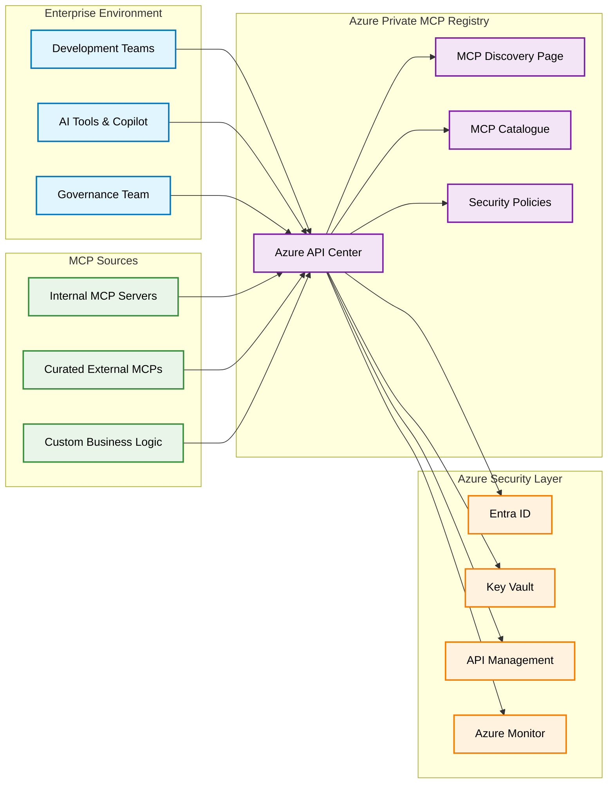
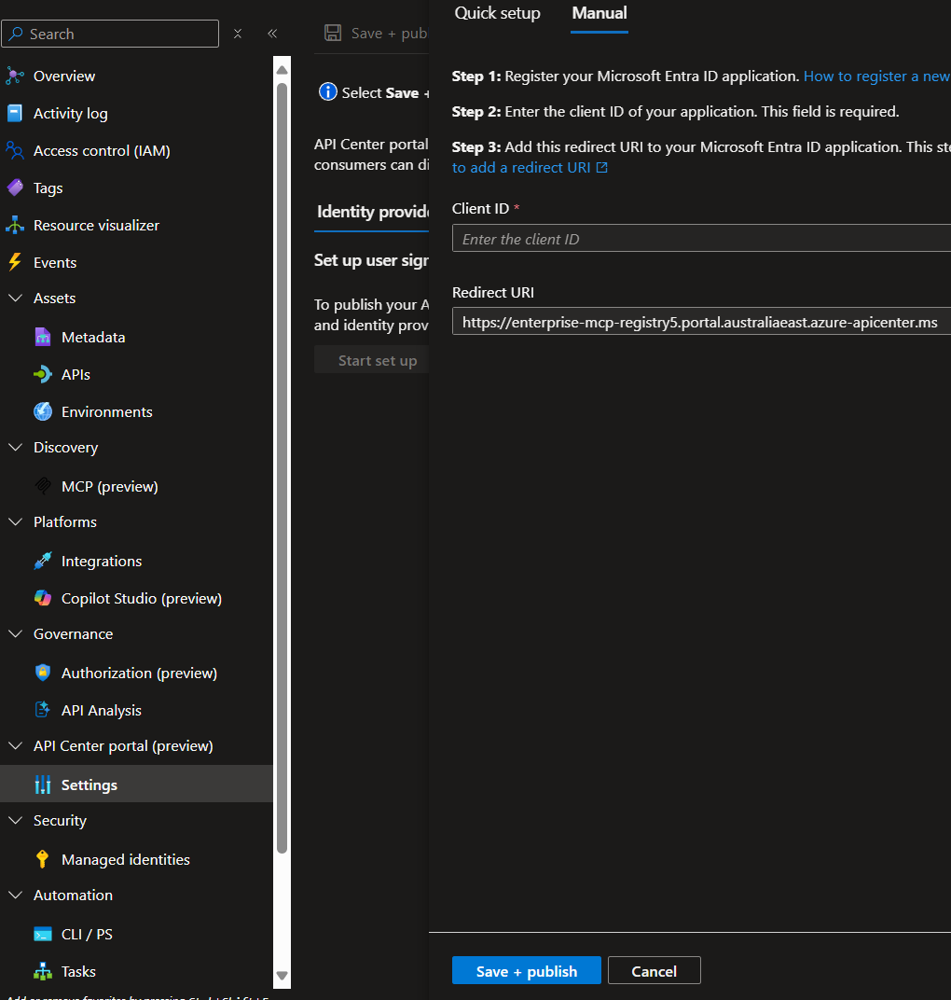
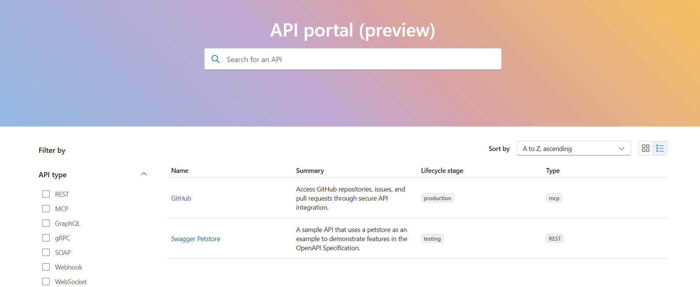
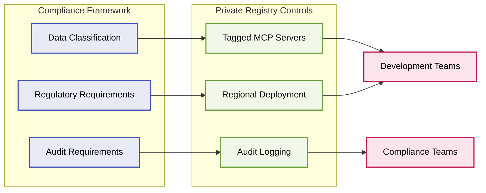

The rapid adoption of AI-powered development tools has fundamentally changed how organisations approach software delivery. As teams increasingly rely on Model Context Protocol (MCP) servers to enhance their AI capabilities, the need for secure, governed, and centralised management of these resources has become critical. Today, we'll explore how to build an enterprise-ready private MCP registry using Azure API Center, ensuring your organisation can harness AI power while maintaining security and compliance standards.

## The Enterprise AI Challenge: Beyond Public Repositories

Organisations are discovering that while public MCP servers offer tremendous value, they also introduce significant governance challenges. Consider the reality facing most enterprises today:

- **Security Concerns**: Public MCP servers may not meet enterprise security standards or compliance requirements
- **Version Control**: Managing dependencies and updates across multiple teams becomes complex
- **Performance**: External dependencies can introduce latency and availability concerns
- **Intellectual Property**: Sensitive organisational knowledge requires controlled access
- **Audit Requirements**: Compliance frameworks demand visibility into AI tooling usage

Microsoft's approach with [Azure MCP Center](https://github.com/Azure/mcp-center) provides a compelling solution framework, demonstrating how Azure API Center can serve as the foundation for a private enterprise MCP registry.

## Understanding the Azure MCP Architecture

Azure API Center transforms from a traditional API management platform into a comprehensive MCP governance hub. This architectural shift enables organisations to treat MCP servers as first-class citizens within their enterprise software catalogue.



### Core Architecture Components

**Azure API Center as MCP Registry**

- Centralised catalogue for all organisational MCP servers
- Version management and lifecycle governance
- Integration with existing Azure security infrastructure
- Built-in discovery and consumption workflows

**Security and Access Control**

- Entra ID integration for authentication
- Role-based access control (RBAC) for MCP server access
- Azure Key Vault for secure credential management
- API Management for advanced security policies

**Operational Excellence**

- Azure Monitor for MCP server health and usage analytics
- Automated compliance scanning and reporting
- Integration with existing DevOps pipelines
- Cost management and optimisation insights

## Building Your Private MCP Registry: Implementation Guide

By following this implementation guide, you can establish a private MCP registry tailored to your organisation's needs.

### Phase 1: Foundation Setup

Start by establishing the core Azure API Center instance that will serve as your MCP registry foundation.

> **Note**: We're using Azure CLI for API Center creation since Azure Bicep doesn't currently provide native support for configuring SKU settings.

```powershell
# Create resource group for MCP registry
az group create --name rg-mcp-registry --location "Australia East"

# Create Azure API Center instance
az apic create `
    --resource-group rg-mcp-registry `
    --name "enterprise-mcp-registry" `
    --location "Australia East" `
    --identity '{type:systemassigned}'

az apic update `
    --resource-group rg-mcp-registry `
    --name "enterprise-mcp-registry" `
    --location "Australia East" `
    --set sku.name=Standard
```

**Key Configuration Considerations:**

- **Region Selection**: Choose regions that align with your data residency requirements
- **SKU Planning**: Standard tier provides higher throughput and advanced features such as semantic search
- **Naming Convention**: Establish consistent naming patterns for multiple environments

### Phase 2: MCP Server Governance

Transform your MCP server registrations into a well-governed enterprise system by setting clear rules for how they're documented using metadata.

Instead of letting teams register MCP servers with inconsistent information, you create mandatory fields that everyone must complete. These include basic details like who owns the server, what stage of development it's in, and how sensitive the data it handles is.

When someone tries to register a new MCP server, the system automatically checks that all required information is provided and follows your standards. If something is missing or incorrect, the registration is rejected. This means only properly documented, compliant MCP servers make it into your registry.

The result is a clean, consistent catalogue where you can easily find information about any MCP server, track ownership, manage lifecycles, and ensure security requirements are met across your entire organisation.

Let's implement this governance pattern step by step:

1. Create required governance metadata definitions (in this scenario we are using schema files, you can use Azure CLI and PowerShell also):

Save the following to `lifecycleStage.schema.json`:

```json
{
  "type": "string",
  "oneOf": [
    { "const": "experimental", "description": "" },
    { "const": "beta", "description": "" },
    { "const": "production", "description": "" },
    { "const": "deprecated", "description": "" }
  ]
}
```

Save the following to `owner.schema.json`:

```json
{ "type": "string", "pattern": "^[A-Za-z0-9]+$" }
```

Save the following to `dataClassification.schema.json`:

```json
{
  "type": "string",
  "oneOf": [
    { "const": "public", "description": "" },
    { "const": "internal", "description": "" },
    { "const": "confidential", "description": "" },
    { "const": "restricted", "description": "" }
  ]
}
```

2. Then create the metadata definitions using Azure CLI:

```powershell
# Lifecycle Stage (required)
az apic metadata create `
  -g rg-mcp-registry `
  -n enterprise-mcp-registry `
  --metadata-name lifecycleStage `
  --schema @lifecycleStage.schema.json `
  --assignments '[{"entity":"api","required":true}]'

# Owner (required)
az apic metadata create `
  -g rg-mcp-registry `
  -n enterprise-mcp-registry `
  --metadata-name owner `
  --schema @owner.schema.json `
  --assignments '[{"entity":"api","required":true}]'

# Data Classification (required)
az apic metadata create `
  -g rg-mcp-registry `
  -n enterprise-mcp-registry `
  --metadata-name dataClassification `
  --schema @dataClassification.schema.json `
  --assignments '[{"entity":"api","required":true}]'
```

Other additional metadata definitions you may want to consider:

- **authMethod**: Authentication type (`none`, `apiKey`, `oauth2`, `aad`, `mTLS`)
- **runtime**: Hosting environment (`aks`, `appService`, `functions`, `containerApps`, `vm`, `other`)
- **repository**: Source code repository URL
- **contact**: Primary contact email address
- **tags**: Categorisation tags (`compliance`, `healthcare`, `fintech`, `government`, `experimental`)
- **criticality**: Business impact level (`low`, `medium`, `high`, `missionCritical`)
- **slaTier**: Service level agreement (`bronze`, `silver`, `gold`, `platinum`)

### Phase 3: MCP Server Registration

Once the governance metadata is defined, you can register MCP servers into your private registry. This process will enforce the required metadata attributes, ensuring compliance with organisational standards.

Before we can register MCP servers, we need to configure an environment and a deployment for our MCP servers. The environment is the location of the MCP server, such as an API management platform or a compute service, and the deployment is a runtime URL for the MCP service.

We can then register our MCP servers into the private registry.

Now that we have our governance framework in place, let's register MCP servers into our private registry. The following Azure Bicep template demonstrates how to systematically register MCP servers.

```bicep
@description('API Center (APIC) service name to create (must be globally unique within constraints).')
param serviceName string

@description('Workspace name')
param workspaceName string

@description('MCP API (server) resource name')
param mcpApiName string

@description('API title')
param mcpApiTitle string

@description('API summary/description text')
param mcpApiSummary string

@description('API lifecycle stage (preview model, plain string)')
param lifecycleStage string

@description('API version name')
param apiVersionName string

@description('Definition name')
param definitionName string

@description('Environment name')
param environmentName string

@description('Environment kind (e.g. development, test, production)')
param environmentKind string

@description('Deployment name')
param deploymentName string

@description('Runtime endpoint(s) for the MCP server')
param runtimeUris array

@description('Workspace title displayed in API Center')
param workspaceTitle string = 'MCP Workspace'

@description('Workspace description')
param workspaceDescription string = 'Workspace for MCP assets'

@description('Environment title')
param environmentTitle string

@description('Environment description')
param environmentDescription string

@description('API version title')
param apiVersionTitle string

@description('Definition title')
param definitionTitle string

@description('Definition description')
param definitionDescription string

@description('Deployment title')
param deploymentTitle string

resource service 'Microsoft.ApiCenter/services@2024-06-01-preview' existing = {
  name: serviceName
}
resource workspace 'Microsoft.ApiCenter/services/workspaces@2024-06-01-preview' = {
  name: workspaceName
  parent: service
  properties: {
    title: workspaceTitle
    description: workspaceDescription
  }
}
resource mcpApi 'Microsoft.ApiCenter/services/workspaces/apis@2024-06-01-preview' = {
  name: mcpApiName
  parent: workspace
  properties: {
    title: mcpApiTitle
    summary: mcpApiSummary
    description: mcpApiSummary
    kind: 'mcp'
    externalDocumentation: []
    contacts: []
  }
}

resource environment 'Microsoft.ApiCenter/services/workspaces/environments@2024-06-01-preview' = {
  name: environmentName
  parent: workspace
  properties: {
    title: environmentTitle
    kind: environmentKind
    description: environmentDescription
  }
}

resource apiVersion 'Microsoft.ApiCenter/services/workspaces/apis/versions@2024-06-01-preview' = {
  name: apiVersionName
  parent: mcpApi
  properties: {
    title: apiVersionTitle
    lifecycleStage: lifecycleStage
  }
}

resource definition 'Microsoft.ApiCenter/services/workspaces/apis/versions/definitions@2024-06-01-preview' = {
  name: definitionName
  parent: apiVersion
  properties: {
    title: definitionTitle
    description: definitionDescription
  }
}

resource deployment 'Microsoft.ApiCenter/services/workspaces/apis/deployments@2024-06-01-preview' = {
  name: deploymentName
  parent: mcpApi
  properties: {
    title: deploymentTitle
    environmentId: '/workspaces/${workspaceName}/environments/${environmentName}'
    definitionId: '/workspaces/${workspaceName}/apis/${mcpApiName}/versions/${apiVersionName}/definitions/${definitionName}'
    server: {
      runtimeUri: runtimeUris
    }
  }
  dependsOn: [
    definition
    environment
  ]
}

output serviceResourceId string = service.id
output mcpApiId string = mcpApi.id
output deploymentId string = deployment.id
```

This template pattern can be replicated for any MCP server in your organisation, ensuring consistent governance and security standards across your entire AI tooling landscape.

### Phase 4: Enable API Center Portal

With your MCP APIs registered, we now need to enable the API Center portal so internal users can discover and explore approved MCP servers.

There are two options:

1. **Quick Setup**: Use the automated setup process to configure the API Center portal with minimal manual steps.
2. **Manual Setup**: Create the required resources such as app registration and configure the API Center portal settings.

Details on the quick setup process can be found in the API Center documentation [here](https://learn.microsoft.com/en-us/azure/api-center/set-up-api-center-portal#set-up-the-app-registration-manually).

Outlined below are the steps for the manual setup backed with automation commands.

1. Create the App Registration in your Microsoft Entra ID tenant. (The app registration enables the API Center portal to access data from your API center on behalf of a signed-in user.)

```powershell
$serviceName = "<your-service-name>"
$location = "<your-service-location>"
$tenantId = az account show --query tenantId -o tsv
$appName = "$serviceName-apic-portal"
$portalBase = "https://$serviceName.portal.$location.azure-apicenter.ms"

$app = az ad app create `
  --display-name $appName `
  --sign-in-audience AzureADMyOrg `
  --query '{appId:appId,objectId:id}' -o json | ConvertFrom-Json

$objectId = $app.objectId
$appId = $app.appId

# Set redirect URIs for VS Code extension
az ad app update `
  --id $appId `
  --public-client-redirect-uris "https://vscode.dev/redirect" "http://localhost" "ms-appx-web://Microsoft.AAD.BrokerPlugin/$appId"

# Set SPA redirect URI
$graphUrl = "https://graph.microsoft.com/v1.0/applications/$objectId"

az rest --method PATCH `
  --uri $graphUrl `
  --headers 'Content-Type=application/json' `
  --body ("{`"spa`":{`"redirectUris`": [`"$portalBase`"]}}" | ConvertTo-Json)
```

2. Configure and publish the API Center Portal

Currently there is no command lines available to automate the configuration and publishing of the API Center Portal. This process must be completed manually through the Azure portal.

- Open the Azure portal and navigate to the API Center resource.
- Select the Identity provider tab, select Start set up.
- On the Manual tab, in Client ID, enter the Application (client) ID from the app registration you created in the previous section (the value of variable $appId).
- Confirm that the Redirect URI is the value you configured in the app registration.
- Select Save + publish.



To enable sign-in to the API Center portal to access APIs, assign the **Azure API Center Data Reader** role to users or groups in your organisation, scoped to your API center.

You will then end up with a secure and governed API Center portal that allows your internal users to discover and explore approved MCP servers, example below.



## Real-World Problems and Private Registry Solutions

Organisations adopting AI-powered development tools face several critical challenges that a private MCP registry directly addresses. Let's examine the most common scenarios and how this architecture provides practical solutions.

### Challenge 1: Shadow IT and Uncontrolled AI Tool Adoption

**The Problem:**
Development teams are rapidly adopting AI tools and MCP servers without central oversight. This creates security blind spots, compliance risks, and operational fragmentation across the organisation.

**Private Registry Solution:**

- **Centralised Discovery**: Provide a curated catalogue of approved MCP servers
- **Self-Service Access**: Enable teams to find and consume AI tools through governed channels
- **Usage Visibility**: Monitor what tools are being used and by whom

### Challenge 2: Regulatory Compliance and Data Sovereignty

**The Problem:**
Organisations in regulated industries (financial services, healthcare, government) need to maintain strict control over data flows and ensure AI tools meet compliance requirements.

**Private Registry Solution:**

- **Data Classification**: Tag MCP servers with appropriate data handling classifications
- **Geographic Controls**: Implement region-specific MCP server availability
- **Audit Trails**: Comprehensive logging of all AI tool interactions
- **Compliance Templates**: Pre-configured MCP servers that meet regulatory standards



### Challenge 3: Cost Control and Resource Optimisation

**The Problem:**
Uncontrolled AI tool usage can lead to unexpected costs, especially with cloud-based MCP servers that charge per API call or usage volume.

**Private Registry Solution:**

- **Usage Monitoring**: Real-time tracking of MCP server consumption and costs
- **Budget Controls**: Ability to implement budget alerts for visibility into spending
- **Resource Optimisation**: Identification of underutilised or redundant MCP servers
- **Chargeback Models**: Enablement of cost allocation to business units

### Challenge 4: Developer Productivity and Tool Discovery

**The Problem:**
Developers waste time recreating functionality that already exists in other MCP servers, or struggle to find the right AI tools for their specific needs.

**Private Registry Solution:**

- **Intelligent Search**: Semantic search across MCP server capabilities and documentation
- **Recommendation Engine**: Suggest relevant MCP servers based on project context
- **Community Ratings**: Internal feedback and rating system for MCP server quality

## Measuring Success: Key Performance Indicators

Organisations implementing private MCP registries should track these metrics to validate the investment:

**Security Metrics:**

- Reduction in security incidents related to AI tools
- Percentage of AI tools meeting security standards

**Productivity Metrics:**

- Developer time saved through improved tool discovery
- Reduction in duplicate MCP server development
- Increased AI tool adoption across development teams

**Operational Metrics:**

- Cost optimisation through usage visibility
- Reduction in operational overhead for AI tool management
- Improved mean time to resolution for AI-related issues

## Conclusion

Building an enterprise-ready private MCP registry using Azure API Center transforms how organisations approach AI governance and security. By implementing the patterns and practices outlined in this post, you can:

- **Enhance Security**: Comprehensive control over AI tooling access and usage
- **Improve Compliance**: Automated governance and audit capabilities
- **Accelerate Innovation**: Self-service AI capabilities with built-in guardrails
- **Optimise Costs**: Centralised management and usage analytics

The investment in a private MCP registry pays dividends not just in security and compliance, but in enabling your organisation to confidently embrace AI-powered development at scale.

---

Ready to bring your private MCP registry to life? [Click here to view an end-to-end DevOps example that registers the GitHub Remote MCP server](https://github.com/tw3lveparsecs/devops-and-ai/tree/main/register-mcp-servers).
