Agentic DevOps promises AI agents that understand requirements, write code, and manage workflows. GitHub Copilot Coding Agent is the next step. The enterprise question isn’t ‘can AI help?’, it’s ‘can it help safely within organisational security boundaries?’

After working with GitHub Copilot and agentic DevOps across enterprise environments, I've learned that the key to successful adoption isn't about giving AI unlimited access. It's about creating **secure guardrails** that enable AI assistance while maintaining human oversight and control over critical systems.

In this post, I'll share some insights for implementing "Agentic DevOps Safe Mode" specifically focused on GitHub Copilot Coding Agent that addresses the primary concerns security teams raise while maximising productivity benefits AI agents can provide.

## The Security Challenge: Trust but Verify

Enterprise security teams have legitimate concerns about AI agents in software delivery:

- **Code Quality**: How do we ensure AI-generated code meets security standards?
- **Access Control**: What prevents AI from accessing sensitive systems or data?
- **Compliance**: How do we maintain audit trails and regulatory compliance?
- **Secrets Management**: How do we prevent AI from inadvertently exposing credentials?
- **Production Safety**: What stops AI from making changes that could impact live systems?

The solution isn't to avoid AI, it's to implement it with **security-first principles** that address these concerns systematically.

## Agentic DevOps Safe Mode (Defence in Depth)

Agentic DevOps Safe Mode is a pragmatic framework that lets teams adopt GitHub Copilot Coding Agent securely by layering isolation, least‑privilege identity, automated security checks, controlled egress, and human approval.

Agentic DevOps Safe Mode applies the principle of "defence in depth" to AI integration, creating multiple layers of protection that work together to maintain security while enabling productivity.

### Layer 1: Environmental Isolation

```mermaid
graph TD
    A[🏢 Enterprise Environment] --> B[🔒 Secure Boundary]
    B --> C[🤖 AI Agent Sandbox]
    C --> D[📦 Isolated Development Environment]
    D --> E[🧪 Test & Validation Layer]
    E --> F[👥 Human Review Gate]
    F --> G[🔒 Production Boundary]
    G --> H[🏭 Production Environment]

    subgraph "Safe Zone"
        C
        D
        E
    end

    subgraph "Human Control"
        F
        G
    end

    style A fill:#E8E8E8,stroke:#B0B0B0,stroke-width:2px,color:#000000
    style B fill:#FF6B6B,stroke:#E55A5A,stroke-width:3px,color:#FFFFFF
    style C fill:#4ECDC4,stroke:#45B7B8,stroke-width:2px,color:#FFFFFF
    style D fill:#4ECDC4,stroke:#45B7B8,stroke-width:2px,color:#FFFFFF
    style E fill:#4ECDC4,stroke:#45B7B8,stroke-width:2px,color:#FFFFFF
    style F fill:#FFE66D,stroke:#FFD93D,stroke-width:2px,color:#000000
    style G fill:#FF6B6B,stroke:#E55A5A,stroke-width:3px,color:#FFFFFF
    style H fill:#E8E8E8,stroke:#B0B0B0,stroke-width:2px,color:#000000
```



_Diagram: Safe Mode isolates AI activity from production. Follow the flow from enterprise boundary to sandboxed development, through test/validation, then a human review gate before crossing the production boundary. Notice the coloured “Safe Zone” vs “Human Control” regions and the enforced production fence._

**Key Principles:**

- **Sandboxed Execution**: AI agents operate in isolated environments with no direct access to production systems
- **Network Segmentation**: Controlled internet access through allow-listed domains and APIs
- **Resource Limits**: CPU, memory, and storage quotas prevent resource exhaustion attacks
- **Ephemeral Infrastructure**: Development environments are disposable and automatically cleaned up

### Layer 2: Identity and Access Management

```mermaid
graph LR
    A[👤 Developer] --> B[🎫 Authentication]
    B --> C[🔐 Authorisation]
    C --> D[🤖 AI Agent Proxy]
    D --> E[📋 Permission Check]
    E --> F[⚡ Action Execution]

    subgraph "IAM Controls"
        B
        C
        E
    end

    style A fill:#4A90E2,stroke:#2E5F87,stroke-width:2px,color:#FFFFFF
    style B fill:#50C878,stroke:#3A9B5C,stroke-width:2px,color:#FFFFFF
    style C fill:#50C878,stroke:#3A9B5C,stroke-width:2px,color:#FFFFFF
    style D fill:#FFB347,stroke:#E6A042,stroke-width:2px,color:#000000
    style E fill:#50C878,stroke:#3A9B5C,stroke-width:2px,color:#FFFFFF
    style F fill:#E8E8E8,stroke:#B0B0B0,stroke-width:2px,color:#000000
```



_Diagram: IAM flow for agent actions. Authentication and authorisation occur before the AI agent proxy, which executes only after a permission check. Look for inherited human permissions (no elevation), RBAC enforcement, and the deny‑by‑default control point._

**Implementation Details:**

- **Proxy Authentication**: AI agents inherit developer permissions, never exceeding human access levels
- **Role-Based Access Control (RBAC)**: Granular permissions based on repository, environment, and operation type
- **Just-in-Time (JIT) Access**: Temporary elevation for specific tasks with automatic expiration
- **Multi-Factor Authentication (MFA)**: Required for all administrative actions, even AI-initiated ones

### Layer 3: Code and Content Security

The most critical aspect of safe mode is ensuring that AI-generated code meets enterprise security standards. This requires automated scanning, policy enforcement, and human validation at multiple checkpoints.

## Implementing Repository-Level Security Controls

### 1. Security-First Repository Configuration

Start by configuring your repository with security controls that apply to both human and AI contributors, example below:

```yaml
# .github/security-policies.yml
branch_protection:
  main:
    required_reviews: 2
    dismiss_stale_reviews: true
    require_code_owner_reviews: true
    restrict_pushes: true

ai_agent_controls:
  branch_prefix: "copilot/"
  require_status_checks: true
  auto_merge: false
```

### 2. Enhanced Copilot Instructions for Security

Create comprehensive security instructions that guide AI agents toward secure coding practices, example below:

```markdown
# .github/copilot-instructions.md

---

description: "Enterprise Security Standards for AI-Generated Code"
applyTo: "\*\*"

---

## Security Requirements

### Secrets and Credentials

- NEVER hardcode API keys, passwords, or connection strings
- Use Azure Key Vault, AWS Secrets Manager, or similar for secret storage
- Reference secrets through environment variables or secure configuration
- Add TODO comments for manual secret configuration

### Input Validation and Sanitisation

- Validate all user inputs using approved libraries
- Implement proper escaping for SQL queries (use parameterised queries)
- Sanitise data before rendering in web interfaces
- Use allow-lists rather than deny-lists for validation

### Authentication and Authorisation

- Implement proper session management
- Use secure session storage (HttpOnly, Secure, SameSite cookies)
- Implement RBAC with principle of least privilege
- Add rate limiting for authentication endpoints

### Error Handling

- Never expose sensitive information in error messages
- Log security events for monitoring and alerting
- Implement proper exception handling without information disclosure
- Use structured logging with correlation IDs

### Dependencies and Vulnerabilities

- Use only approved and up-to-date dependencies
- Include dependency vulnerability scanning in CI/CD
- Provide upgrade paths for security patches
- Document all third-party integrations

### Compliance Requirements

- GDPR: Implement data minimisation and retention policies
- SOX: Maintain audit trails for all data modifications
- HIPAA: Encrypt all PII/PHI data at rest and in transit
- PCI-DSS: Follow secure payment processing standards

## Testing Requirements

### Security Testing

- Include unit tests for authentication and authorisation
- Implement integration tests for security boundaries
- Add negative testing for injection vulnerabilities
- Test error handling and information disclosure

### Code Quality Gates

- Security scanning must pass before PR approval
- Code coverage must exceed 80% for new code
- No high or critical severity vulnerabilities allowed
- Documentation must be updated for security-relevant changes

## Review Process

### Mandatory Reviews

- Security team review required for authentication changes
- Data classification review required for new data handling
- Compliance review required for PII/PHI processing
- Architecture review required for new external integrations
```

### 3. Code Scanning and Protection for AI Branches

Run code scanning on AI branches to ensure security compliance before merging.

See example below of a minimal CodeQL workflow that scans AI branches (`copilot/**`):

```yaml
# .github/workflows/codeql.yml
name: CodeQL

on:
  push:
    branches:
      - "copilot/**"
  pull_request:
    branches:
      - "copilot/**"

jobs:
  analyze:
    name: Analyze (${{ matrix.language }})
    runs-on: ubuntu-latest
    permissions:
      security-events: write
      contents: read
    strategy:
      fail-fast: false
      matrix:
        language: ["javascript-typescript", "python", "csharp"]
    steps:
      - name: Checkout repository
        uses: actions/checkout@v4

      - name: Initialize CodeQL
        uses: github/codeql-action/init@v3
        with:
          languages: ${{ matrix.language }}

      - name: Perform CodeQL Analysis
        uses: github/codeql-action/analyze@v3
        with:
          category: "/language:${{ matrix.language }}"
```

### 4. Quality Gates

Quality gates are a set of criteria that must be met before code can be merged into the main branch. These gates help ensure that security, quality, and compliance requirements are met. Examples include:

- CodeQL analysis passes with no high/critical alerts for changed code paths
- Secret scanning and push protection show no exposed credentials or tokens
- Dependency review with no high/critical vulnerabilities introduced
- Infrastructure as Code scanning (Bicep/Terraform/ARM/GitHub Actions) has no high‑severity misconfigurations
- Unit and integration test suites pass
- Linting/formatting passes
- CODEOWNERS review required for protected paths
- Environment protection rules satisfied (required reviewers/approvals for staging/prod)

### 5. Enterprise Firewall Configuration

One of the most powerful security features is the ability to control AI agent internet access. This prevents data exfiltration while allowing access to necessary development resources.

#### Example Allow-list Configuration

```yaml
# GitHub Organization Settings > Copilot > Firewall
firewall:
  enabled: true
  policy: "allowlist"

  # GitHub's curated safe list (includes npm, DockerHub, etc.)
  recommended_allowlist: true

  # Enterprise-specific additions
  custom_allowlist:
    # Package repositories
    - "packages.company.com"
    - "registry.company.com"

    # Documentation and standards
    - "docs.company.com"
    - "wiki.company.com"
    - "aka.ms"

    # Development tools
    - "jira.company.com"
    - "blob.core.windows.net"
    - "bicep.azure.com"

    # Security and compliance
    - "vault.company.com"
```

## Track Sessions

Monitor and analyse AI agent sessions to audit for compliance and detect anomalies. With GitHub Copilot Coding Agent, track sessions on the [Agents page](https://github.com/copilot/agents) or in Visual Studio Code, and review session logs in either interface to inspect activity and session details.

## Limitations

As of Aug 2025, the following limitations apply (check GitHub documentation [here](https://docs.github.com/en/enterprise-cloud@latest/copilot/concepts/coding-agent/coding-agent?versionId=enterprise-cloud%40latest&productId=copilot&restPage=how-tos%2Cuse-copilot-agents%2Ccoding-agent%2Ccustomize-the-agent-firewall#limitations-of-copilot-coding-agent) for updates).

While Agentic DevOps Safe Mode provides a robust framework for secure AI integration, it's important to recognise current limitations with GitHub Copilot Coding Agent:

- When Copilot is assigned an issue, it can only make changes in the repository where that issue is located. In addition, Copilot cannot make changes across multiple repositories in one run.
- Copilot can only access context in the same repository as the assigned issue
- Copilot will open exactly one pull request to address each task it is assigned.
- Copilot cannot work on an existing pull request that it didn't create. If you would like Copilot to provide feedback on an existing pull request, you can add it as a reviewer.

Other related limitations with Copilot include:

- If you have the "Require signed commits" rule or branch protection enabled, you must rewrite the commit history in order to merge Copilot's pull requests.
- Copilot does not work with self-hosted GitHub Actions runners.
- Copilot coding agent does not work in personal repositories owned by managed user accounts.
- Content exclusions allow administrators to configure Copilot to ignore certain files. When using Copilot coding agent, Copilot will not ignore these files, and will be able to see and update them.
- Copilot may still produce suggestions matching public code, even if the "Suggestions matching public code" policy is set to "Block."
- Copilot coding agent is not available in GitHub Enterprise Cloud with data residency.
- Copilot coding agent only works with repositories hosted on GitHub.

## Conclusion: Secure by Design, Productive by Default

Agentic DevOps Safe Mode isn't about limiting AI capabilities, it's about **enabling them responsibly**. By implementing comprehensive security controls, monitoring, and governance frameworks, organisations can harness the transformative power of AI agents while maintaining the security posture the organisation requires.

The key insights from implementing Safe Mode across multiple enterprises:

### What Works

- **🔒 Security-First Architecture**: Building security into the foundation, not bolting it on afterward
- **📊 Comprehensive Monitoring**: Real-time visibility into AI behaviour and performance
- **🏗️ Graduated Trust Model**: Building confidence through demonstrated competence
- **👥 Human-AI Collaboration**: AI handles routine tasks, humans make critical decisions

### What Doesn't Work

- **❌ Complete AI Autonomy**: Production systems require human oversight
- **❌ One-Size-Fits-All Policies**: Security controls must be context-aware
- **❌ Set-and-Forget Monitoring**: Continuous adaptation is essential
- **❌ Ignoring Cultural Change**: Teams need training and support for AI collaboration
- **❌ Over-Restrictive Controls**: Excessive limitations defeat the purpose

### The Path Forward

The future of enterprise development lies in **intelligent collaboration** between human expertise and AI capability. Agentic DevOps Safe Mode provides the framework to achieve this vision while maintaining the security, compliance, and governance standards that enterprise environments require.

### Next steps

- [Configure organisation-level Copilot coding agent settings and firewall](https://docs.github.com/en/enterprise-cloud@latest/copilot/how-tos/use-copilot-agents/coding-agent/customize-the-agent-firewall?versionId=enterprise-cloud%40latest&productId=copilot&restPage=concepts%2Ccoding-agent%2Ccoding-agent)

- [Set up CodeQL code scanning in your repositories](https://codeql.github.com/docs/)

_Have a guardrail pattern that worked well in your organisation? Share it in the comments so others can learn from it._
