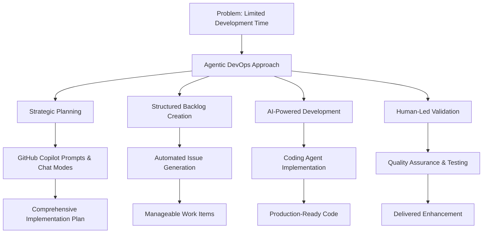

As a busy professional, I found myself in a familiar situation, needing to deliver a major enhancement to an internal solution while managing my regular day-to-day responsibilities. The challenge wasn't a lack of capability or resources, but rather finding the sustained focus time that complex development work typically demands.

This is the story of how I successfully delivered that enhancement without writing a single line of code myself, using agentic DevOps principles and GitHub Copilot's coding agent capabilities to transform my development approach.

## The Challenge: Maximising Development Impact Alongside Daily Operations

The enhancement I needed to deliver was substantial, the kind that typically requires sustained focus and deep technical thinking. However, my reality involved managing a full schedule of meetings, stakeholder communications, and immediate delivery needs. My challenge wasn't just finding time to work on the enhancement, but optimising how I could make meaningful progress within the time constraints I had.

Every traditional development session resulted in:

- **Context rebuilding**: Spending significant time re-establishing where I left off
- **Fragmented thinking**: Difficulty maintaining the full architectural vision across interrupted sessions
- **Inefficient progress**: Short development windows that weren't sufficient for complex problem-solving
- **Cognitive overhead**: Mental energy divided between the enhancement and immediate responsibilities

I needed a development approach that could work with my schedule, not against it, one that would allow me to make consistent progress while fulfilling my daily operational responsibilities.

## The Solution: Agentic DevOps as a Personal Force Multiplier

This is where I utilised agentic DevOps, a methodology where AI agents become integral partners in your development workflow. Rather than replacing my technical expertise, these agents would amplify it, handling the implementation heavy lifting while I focused on strategic decisions and quality oversight.

My key realisation? Success with agentic DevOps isn't about having AI write perfect code immediately. It's about creating the right structures, processes, and feedback loops that enable AI agents to deliver value consistently while working around my existing responsibilities.



## The Foundation: Strategic Planning with AI

### How I Leveraged GitHub's Awesome Copilot Resources

My first step was pretty straightforward but made all the difference: I needed a solid plan that would set up the coding agent for success. Without getting this foundation right first, even the smartest AI would have a tough time delivering the complex enhancement I was after.

This is where I accessed the wealth of proven prompts and methodologies from [GitHub's Awesome Copilot repository](https://github.com/github/awesome-copilot) (There is also a MCP server that can be used to interact with GitHub's Awesome Copilot repository to integrate prompts, instructions and chat modes into your workflow). Among the many resources available, two stood out as particularly relevant to my needs.

I specifically chose to use:

- **Create Implementation Plan prompt**: A well-structured prompt to generate a comprehensive technical plan for the enhancement
- **Implementation Plan chat mode:** A persona designed to iteratively refine and expand on the initial plan, ensuring it was detailed and actionable

### How I Created a Meaningful Plan

I learned that the key to success with coding agents is providing them with rich, contextual information. I used GitHub Copilot's prompts and chat modes to develop a plan that included:

1. **Functional Requirements**: Detailed feature list and user stories
2. **Dependencies**: External services and internal components affected
3. **Testing & Validation Criteria**: Clear, measurable outcomes for validation
4. **Risks & Assumptions**: Identification of potential challenges and underlying assumptions

```markdown
<!-- Example implementation plan (shortened for brevity) -->

# Create Enhancement Implementation Plan

## Introduction

This implementation plan outlines the creation of a enhancement that follows the same structure and conventions as the existing example pattern. The new pattern will provide X enhancement to the solution, while maintaining consistency with the established pattern architecture.

## 1. Requirements & Constraints

### Functional Requirements

- **REQ-001**: Create enhancement X that mirrors the structure of the existing example pattern
- **REQ-002**: Support the same subscription model
- **REQ-003**: Include all the same core components as example pattern but adapted for X enhancement architecture
  ... (Additional functional requirements as needed)

### Security Requirements

- **SEC-001**: Implement secure connectivity patterns following Azure Well-Architected Framework
- **SEC-002**: Support for network security and traffic inspection
- **SEC-003**: Ensure proper network segmentation and traffic flow control
  ... (Additional security requirements as needed)

### Technical Constraints

- **CON-001**: Must use the same folder structure as example pattern
- **CON-002**: Must integrate with existing Bicep module registry
- **CON-003**: Must support the same diagnostic and monitoring capabilities
  ... (Additional constraints as needed)

### Guidelines

- **GUD-001**: Follow established naming conventions for resources and parameters
- **GUD-002**: Maintain consistency with existing pattern documentation structure
- **GUD-003**: Use modular approach for different components
  ... (Additional guidelines as needed)

### Patterns to Follow

- **PAT-001**: Mirror the folder structure of example pattern
- **PAT-002**: Use the same subscription-scoped deployment approach
- **PAT-003**: Implement similar parameter validation and metadata
  ... (Additional patterns as needed)

## 2. Implementation Steps

### Implementation Phase 1: Core Structure Setup

- GOAL-001: Establish the foundational structure and main pattern files

| Task     | Description                                                                          | Completed | Date |
| -------- | ------------------------------------------------------------------------------------ | --------- | ---- |
| TASK-001 | Create new folder structure at `bicep/patterns/<enhancement>/`                       |           |      |
| TASK-002 | Copy and adapt the main.bicep from example pattern as the orchestrator               |           |      |
| TASK-003 | Create `<enhancement>.bicepparam` template file for parameter configuration          |           |      |
| TASK-004 | Create comprehensive README.md for the pattern with architecture overview            |           |      |
| TASK-005 | Set up examples folder with three example configurations (basic, standard, advanced) |           |      |

### Implementation Phase 2: Enhancement Component

- GOAL-002: Implement the enhancement component identical to example pattern

| Task     | Description                                                         | Completed | Date |
| -------- | ------------------------------------------------------------------- | --------- | ---- |
| TASK-006 | Copy management module from example pattern (example/example.bicep) |           |      |
| TASK-007 | Verify module compatibility with architecture                       |           |      |
| TASK-008 | Update any specific documentation and README                        |           |      |
| TASK-009 | Test module deployment independently                                |           |      |

... (Additional phases would follow similarly)

## 3. Alternatives

- **ALT-001**: Modify existing example pattern to support both topologies - Rejected due to complexity and potential breaking changes
- **ALT-002**: Create a unified pattern with topology selection parameter - Rejected due to maintenance complexity and different architectural requirements
- **ALT-003**: Use existing archived example pattern as-is - Rejected due to structural inconsistencies with current standards
  ... (Additional alternatives as needed)

## 4. Dependencies

- **DEP-001**: Access to Bicep registry for network modules
- **DEP-002**: Existing shared-modules for common functionality
- **DEP-003**: Access to test Azure subscriptions for validation
  ... (Additional dependencies as needed)

## 5. Files

### New Files to Create

- **FILE-001**: `bicep/patterns/enhancement/main.bicep` - Main orchestrator template
- **FILE-002**: `bicep/patterns/enhancement/enhancement.bicepparam` - Parameter template
- **FILE-003**: `bicep/patterns/enhancement/README.md` - Pattern documentation
  ... (Additional files as needed)

### Files to Reference/Adapt

- **FILE-013**: Source example pattern files for structure and parameter reference
- **FILE-014**: Archived example pattern files for specific configuration
- **FILE-015**: Existing shared modules for common functionality

## 6. Testing

- **TEST-001**: Bicep template compilation and linting validation
- **TEST-002**: Parameter validation and type checking
- **TEST-003**: Deployment testing in development environment with basic example
  ... (Additional tests for standard and advanced examples, component-specific tests)

## 7. Risks & Assumptions

### Risks

- **RISK-001**: pricing model may be significantly different from example solution, affecting cost comparisons
- **RISK-002**: Some features available in example solution may not have direct enhancement equivalents
- **RISK-003**: enhancement may require different configuration approaches than traditional example solution
  ... (Additional risks as needed)

### Assumptions

- **ASSUMPTION-001**: The same subscription model applies to enhancement pattern
- **ASSUMPTION-002**: Enhancement service is available in target regions
- **ASSUMPTION-003**: Current Bicep registry contains necessary modules
  ... (Additional assumptions as needed)

## 8. Related Specifications / Further Reading

- Links to Microsoft articles relating enhancement
```

## How I Transformed My Plan into Action: Creating an Actionable Backlog

With my solid implementation plan in hand, I faced the next challenge of breaking it down into manageable work items that I could effectively delegate to the coding agent. Here's where the **create-github-issues-feature-from-implementation-plan** prompt became invaluable to my workflow.

### How I Generated My Automated Backlog

This prompt transformed my comprehensive plan into exactly what I needed:

- **Discrete GitHub issues**: Each representing a focused development task that could be completed independently

  Each issue included:

  - **Description**: A detailed overview of the task
  - **Tasks to complete**: Specific steps required to complete the issue
  - **Requirements**: Any specific conditions or prerequisites for the issue
  - **Definition of Done**: Clear criteria for when the issue can be considered complete
  - **Dependencies**: Any related issues or tasks that must be completed first
  - **Related Files**: Links to any relevant documentation or code
  - **Implementation Plan Reference**: Links back to the original implementation plan for context
  - **Next Phase**: Reference to the subsequent phase in the implementation plan

The result? I had a backlog of 10 well-defined issues, each scoped perfectly for completion within a focused development session, exactly what I needed for my agentic DevOps approach.

## The Game Changer: The Coding Agent as My Development Partner

Here's where this approach truly transformed my productivity. Instead of trying to carve out large blocks of focused development time from my busy schedule, I assigned each backlog item to GitHub Copilot's coding agent. The agent essentially became my dedicated developer, working through issues while I continued with my regular responsibilities.

### How The Coding Agent Workflow Functioned

The process became simple:

1. **Issue Assignment**: I would assign a backlog item to the coding agent
2. **Autonomous Development**: The agent implemented features based on my detailed requirements while I focused on other tasks
3. **Pull Request Creation**: Completed work was submitted for my review, ready when I had time to evaluate it
4. **Iterative Improvement**: I provided feedback through the standard PR review process during natural breaks in my day

## How I Maintained Quality: The Human Touch in the Workflow

While the coding agent handled implementation, my role evolved to quality oversight, which I found to be more valuable and engaging than writing code myself. This shift allowed me to focus on the strategic aspects of development that truly required my expertise.

### The Review Process

I treated each pull request with the same rigour I would apply to work from any team member:

- **Code quality assessment**: Evaluating architecture, readability, and maintainability
- **Functional testing**: Verifying implementation against my acceptance criteria
- **Integration validation**: Ensuring compatibility with our existing systems
- **Security review**: Following our established security guidelines

### What I Learned About Effective Feedback

Through this process, I discovered that providing specific, actionable feedback yielded the best results:

- **What worked for me**: "Resolve Bicep warning errors related to value could be null"
- **What was less effective**: "Resolve all warning errors in Bicep file" (too vague, led to generic solutions that required iteration)

## What I Learned: The Reality of Human-AI Partnership

### What Worked Exceptionally Well for Me

**A Structured Approach**: The combination of detailed planning and incremental delivery proved highly effective. I found the coding agent performed best when I provided clear, specific requirements upfront.

**Context Preservation**: Unlike my previous fragmented development attempts, the agent maintained full context across all work items, ensuring consistency and coherence throughout the enhancement.

**Quality Consistency**: Code quality remained high throughout my project, as each PR received focused review attention during convenient moments in my schedule.

### My Challenges and Key Learnings

**Communication Precision Matters**: I learned that vague feedback led to suboptimal solutions that required additional iterations. Specific, actionable guidance consistently yielded better results faster.

**Tool Integration Quirks I Encountered**:

- VS Code's GitHub PR extension currently doesn't recognise @mentions, this occasionally caused issues when trying to assign the coding agent where I had typos and caused delays
- The GitHub.com interface refreshed faster than the VS Code extension, so I often switched to the web interface
- I sometimes needed to force refresh to see updates in VS Code
- When Copilot created pull requests it defaulted to the base branch rather than my feature branch, so I had to manually change it each time

These are minor inconveniences that I expect will improve as the tools evolve.

**Why Human Oversight Remained Critical**: I discovered that while the coding agent is incredibly capable, it still required my guidance for:

- Strategic architectural decisions that impacted other systems
- Complex business logic interpretation specific to our domain
- Edge case handling based on operational experience
- Integration complexity management with our existing infrastructure
- Security considerations that required nuanced understanding
- Testing and validation to ensure functionality met real-world needs

## The Results: Successfully Delivering the Major Enhancement

After two weeks of applying this agentic DevOps approach, I successfully delivered the complete enhancement without writing a single line of code myself. The final solution I delivered included:

- **Full feature implementation**: All planned functionality working exactly as I specified
- **Comprehensive testing**: Both automated and manual test coverage that I validated
- **Complete documentation**: Technical documentation and user guides ready for the team
- **Production readiness**: Code that met all our organisational standards and passed our quality gates

## The Future of Development: Agentic DevOps Adoption

### Immediate Benefits

This experience demonstrated several immediate advantages of agentic DevOps:

- **Parallel processing**: Development continues while handling other responsibilities
- **Consistent quality**: Dedicated focus on each work item
- **Reduced cognitive load**: Less context switching and mental overhead
- **Scalable approach**: Methodology applicable to projects of various sizes

### Strategic Implications

For development teams and organisations, this approach suggests:

- **Resource multiplication**: Senior developers can guide multiple parallel work streams
- **Knowledge transfer**: AI agents can implement patterns and practices consistently
- **Risk reduction**: Incremental delivery with continuous validation
- **Innovation enablement**: More time for strategic thinking and architectural decisions

## Getting Started: Your Agentic DevOps Implementation

### Essential Prerequisites

1. **Access to GitHub Copilot**: Particularly the coding agent functionality
2. **Structured project management**: Clear issue tracking and PR workflows
3. **Quality gates**: Established code review and testing processes
4. **Planning discipline**: Investment in upfront requirement definition

### Recommended First Steps

1. **Start small**: Choose a well-defined enhancement or feature
2. **Leverage proven prompts**: Use resources from the Awesome Copilot repository
3. **Establish feedback patterns**: Develop clear communication styles with AI agents
4. **Measure and iterate**: Track time savings and quality metrics

## Conclusion: Redefining What's Possible in Development

This experience fundamentally changed my perspective on software development productivity. I realised that my constraint wasn't my coding ability or technical knowledge, it was optimising how I used my available time and focus. Agentic DevOps allowed me to solve both challenges simultaneously.

By shifting my role from code writer to architect and reviewer, I was able to deliver more value in less time while maintaining the high quality standards I demand. The coding agent became my ideal development partner: tireless, consistent, and focused, requiring only strategic guidance and quality oversight from me.

I've learned that the future of software development isn't about replacing developers with AI, it's about augmenting our capabilities to achieve outcomes that were previously difficult given our time and context constraints. Agentic DevOps provided me with the framework for that augmentation.

**Ready to transform your own development approach?** I recommend starting with your next enhancement or feature. Create a detailed plan, break it into manageable issues, and let a coding agent handle the implementation while you focus on strategy and quality. You might be surprised by what becomes possible when you shift from writing code to orchestrating development.

---

_Have you experimented with agentic DevOps approaches in your own projects? I'd love to hear about your experiences and lessons learned in the comments below._
