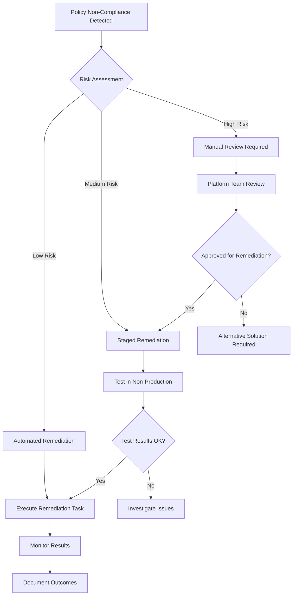

Welcome to the fourth instalment of our DevOps and Azure Policy series! In our [previous post](https://azurewithaj.com/posts/devops-azure-policy-series-exemptions/), we explored how to manage policy exemptions using Infrastructure as Code (IaC) and CI/CD pipelines. Today, we're diving into another critical aspect of Azure Policy governance: **policy remediation tasks**.

While exemptions help us handle exceptions to policies, remediation tasks take the opposite approach they actively fix non-compliant resources to bring them into alignment with our organisational standards. We'll explore what remediation tasks are, when to use them, and how to implement them through automated PowerShell scripts and CI/CD pipelines.

## Understanding Azure Policy Remediation

Policy remediation is the process of automatically correcting non-compliant resources to ensure they adhere to our defined policies. Think of it as the "auto-fix" capability for our governance rules. When Azure Policy identifies resources that don't meet our standards, remediation tasks can automatically apply the necessary changes to bring them into compliance.

### How Policy Remediation Works

The remediation process follows this workflow:

1. **Policy Evaluation**: Azure Policy continuously evaluates resources against assigned policies
2. **Compliance Assessment**: Resources are marked as compliant or non-compliant
3. **Remediation Task Creation**: You create a remediation task for a specific policy assignment
4. **Resource Discovery**: Azure identifies all non-compliant resources within the scope
5. **Automatic Correction**: The remediation task applies the necessary changes to fix non-compliant resources

### Types of Remediation

Azure Policy supports two main types of remediation:

| Remediation Type          | Description                                                                                | Use Case                                               |
| ------------------------- | ------------------------------------------------------------------------------------------ | ------------------------------------------------------ |
| **Manual Remediation**    | Administrators manually review and fix non-compliant resources                             | Complex changes requiring human judgment               |
| **Automatic Remediation** | Azure Policy automatically applies predefined configurations or deploy a specific resource | Standard compliance fixes that can be safely automated |

### When to Use Remediation Tasks

Remediation tasks are particularly valuable in these scenarios:

1. **Tag Governance**: Automatically applying missing mandatory tags to resources
2. **Security Baseline**: Enabling required security features like encryption or monitoring
3. **Cost Optimisation**: Implementing cost-saving configurations across resources
4. **Compliance Enforcement**: Ensuring resources meet regulatory requirements
5. **Operational Standards**: Applying consistent operational configurations

## Limitations and Considerations

Before implementing remediation tasks, it's important to understand their current limitations:

### Bicep Support Limitation

At the time of writing, **policy remediation tasks are not currently supported for deployment via Azure Bicep**. This means that while you can define and assign policies using Bicep, the remediation tasks themselves must be managed through other means such as:

- Azure Portal
- Azure CLI
- Azure PowerShell
- REST API

Due to this limitation, we'll focus on a PowerShell-based approach.

### Remediation Scope

Remediation tasks can be created at different scopes:

- **Management Group Level**: Remediate across multiple subscriptions
- **Subscription Level**: Remediate within a specific subscription
- **Resource Group Level**: Remediate within a specific resource group

### Resource Discovery Modes

Azure Policy offers two resource discovery modes for remediation:

- **ExistingNonCompliant**: Only remediate resources that are currently non-compliant
- **ReEvaluateCompliance**: Re-evaluate all resources and remediate any that become non-compliant

## Implementing Remediation with PowerShell

Let's examine a PowerShell script that automates the creation and execution of policy remediation tasks. This script provides a standardised approach to managing remediation across your Azure environment.

### The Core Remediation Script

```powershell
[CmdletBinding()]
param (
  [Parameter(Mandatory)]
  [string] $remediationFile
)

begin {
  # Import policies to remediate from JSON file
  $remediations = Get-Content -Path $remediationFile | ConvertFrom-Json
}

process {
  # Policy Remediation
  foreach ($remediation in $remediations) {
    Write-Host "------------------------------------------"
    # Create arguments for Start-AzPolicyRemediation
    $arguments = @{
      Name                  = ($remediation.name + " - " + (Get-Date -Format "yyyyMMddHHmmss"))
      PolicyAssignment      = $remediation.policyAssignmentId
      ResourceDiscoveryMode = "ReEvaluateCompliance"
    }

    if ($remediation.managementGroup) {
      $arguments.managementGroup = $remediation.managementGroup
      $arguments.ResourceDiscoveryMode = "ExistingNonCompliant"
    }
    if ($remediation.subscriptionId) {
      Set-AzContext -Subscription $remediation.subscriptionId | Out-Null
    }
    if ($remediation.resourceGroup) {
      $arguments.ResourceGroupName = $remediation.resourceGroup
    }
    if ($remediation.policyDefinitionReferenceId) {
      $arguments.PolicyDefinitionReferenceId = $remediation.policyDefinitionReferenceId
    }

    # Start remediation task
    try {
      $pa = Get-AzPolicyAssignment -Id $arguments.PolicyAssignment -ErrorAction Stop
      if ($pa) {
        Write-Host "Starting remediation task for: $($arguments.Name)"
        Start-AzPolicyRemediation @arguments
      }
    }
    catch {
      Write-Host "Failed to create policy remediation task $($arguments.Name)"
      Write-Error $error[0].Exception.Message
    }
  }
  Write-Host "------------------------------------------"
}
```

### Key Script Features

**Dynamic Naming**: Each remediation task gets a unique name with a timestamp to avoid conflicts:

```powershell
Name = ($remediation.name + " - " + (Get-Date -Format "yyyyMMddHHmmss"))
```

**Scope Flexibility**: The script handles different remediation scopes:

**Error Handling**: Comprehensive error handling ensures failed remediation tasks don't break the entire process.

## Configuration Management

The script uses a JSON configuration file to define which policies to remediate. This approach provides several benefits:

### Configuration Structure

```json
[
  {
    "name": "Application Name Tag Remediation",
    "managementGroup": "production-mg",
    "policyAssignmentId": "/providers/microsoft.management/managementgroups/production-mg/providers/microsoft.authorization/policyassignments/tag-governance",
    "policyDefinitionReferenceId": "require-application-name-tag"
  },
  {
    "name": "Storage Encryption Remediation",
    "subscriptionId": "12345678-1234-1234-1234-123456789012",
    "policyAssignmentId": "/subscriptions/12345678-1234-1234-1234-123456789012/providers/microsoft.authorization/policyassignments/security-baseline",
    "policyDefinitionReferenceId": "storage-encryption-required"
  },
  {
    "name": "Resource Group Tag Remediation",
    "subscriptionId": "12345678-1234-1234-1234-123456789012",
    "resourceGroup": "production-rg",
    "policyAssignmentId": "/subscriptions/12345678-1234-1234-1234-123456789012/providers/microsoft.authorization/policyassignments/tag-governance",
    "policyDefinitionReferenceId": "require-environment-tag"
  }
]
```

### Configuration Parameters

| Parameter                     | Required | Description                                              |
| ----------------------------- | -------- | -------------------------------------------------------- |
| `name`                        | Yes      | Descriptive name for the remediation task                |
| `managementGroup`             | Optional | Management group ID (for MG-level remediation)           |
| `subscriptionId`              | Optional | Subscription ID (for subscription/RG-level remediation)  |
| `resourceGroup`               | Optional | Resource group name (for RG-level remediation)           |
| `policyAssignmentId`          | Yes      | Full resource ID of the policy assignment                |
| `policyDefinitionReferenceId` | Yes      | Reference ID of the specific policy within an initiative |

### Finding Required IDs

**Policy Assignment ID**:

1. Navigate to the Azure Portal → Policy → Assignments
2. Select the policy assignment
3. Copy the Assignment ID from the overview blade

**Policy Definition Reference ID**:

1. Open the policy assignment in the Azure Portal
2. Click "View Definition"
3. Locate the Policy Definition Reference IDs (usually match the display names)

## DevOps Integration and Best Practices

### CI/CD Pipeline Integration

While we can't use Bicep for remediation tasks, we can still integrate them into our DevOps workflows using PowerShell and CI/CD pipelines.

```yaml
# Example GitHub Actions workflow for policy remediation
name: Policy Remediation

on:
  workflow_dispatch:
    inputs:
      remediation_scope:
        description: "Remediation scope (management-group, subscription, resource-group)"
        required: true
        default: "subscription"
        type: choice
        options:
          - management-group
          - subscription
          - resource-group

jobs:
  remediate_policies:
    runs-on: ubuntu-latest
    permissions:
      id-token: write
      contents: read

    steps:
      - name: Checkout code
        uses: actions/checkout@v4

      - name: Azure Login
        uses: azure/login@v1
        with:
          client-id: ${{ secrets.AZURE_CLIENT_ID }}
          tenant-id: ${{ secrets.AZURE_TENANT_ID }}
          subscription-id: ${{ secrets.AZURE_SUBSCRIPTION_ID }}

      - name: Run Policy Remediation
        shell: pwsh
        run: |
          ./policy-remediation/policy-remediations.ps1 -remediationFile ./policy-remediation/policy-remediations.json
```

### Best Practices for Remediation

**1. Test Before Production**

- Always test remediation tasks in non-production environments first
- Use resource group level testing to validate behaviour
- Monitor remediation results closely during initial deployments

**2. Scope Appropriately**

- Start with narrow scopes (resource groups) before expanding to subscriptions or management groups
- Use management group level remediation only for well-tested, low-risk policies

**3. Configuration Management**

- Keep remediation configurations in source control
- Use descriptive names that clearly indicate the purpose
- Document the business justification for each remediation task

**4. Timing Considerations**

- Run remediation tasks during maintenance windows when possible
- Consider the impact on running workloads
- Stagger large-scale remediation across multiple time periods

## Governance Workflow for Remediation

Implementing a structured workflow ensures remediation tasks are executed safely and effectively:



### Workflow Stages

**1. Risk Assessment**

- Evaluate the potential impact of automated remediation
- Consider the criticality of affected resources
- Assess the complexity of the required changes

**2. Approval Process**

- Low-risk changes: Automated approval
- Medium-risk changes: Platform team review
- High-risk changes: Security and business stakeholder approval

**3. Execution Strategy**

- Phased rollout for large-scale remediation
- Monitoring and rollback capabilities
- Communication to affected teams

**4. Post-Execution Review**

- Verify compliance improvement
- Document any issues encountered
- Update procedures based on lessons learned

## Complete Example

The PowerShell script, JSON configuration, and CI/CD pipeline integration we've explored provide a comprehensive solution for automated policy remediation. To help you implement this approach in your own environment, I've created a complete working example:

[Click here to view the policy remediation example](https://github.com/tw3lveparsecs/azure-policy-with-bicep/tree/main/policy-remediation)

## Conclusion

Policy remediation tasks provide automated compliance enforcement for Azure environments, ensuring non-compliant resources are automatically corrected rather than simply identified. While Bicep support isn't available yet, PowerShell-based remediation workflows integrated with CI/CD pipelines offer a robust governance solution.

This approach offers several advantages:

1. **Automated Compliance**: Non-compliant resources are fixed automatically without manual intervention
2. **Scalable Governance**: Apply consistent standards across large Azure environments through configuration-driven remediation
3. **Risk Management**: Structured workflows ensure appropriate oversight while enabling automation for low-risk changes
4. **DevOps Integration**: JSON configuration and PowerShell scripts integrate seamlessly with modern CI/CD practices

The combination of automated remediation with policy exemptions creates a comprehensive governance framework that balances compliance requirements with operational flexibility.

In our next article, we'll continue exploring advanced Azure Policy scenarios. Stay tuned!
