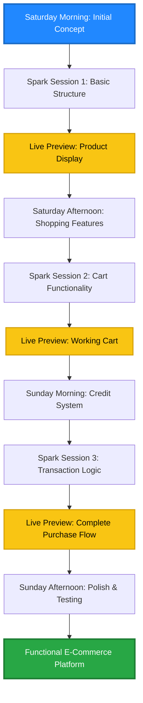
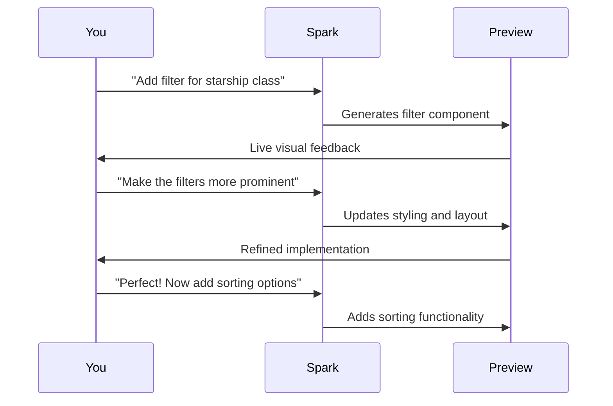
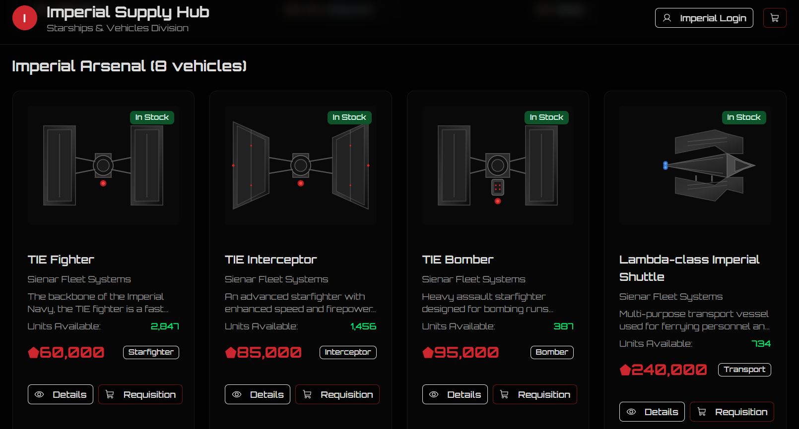

As a DevOps professional whose primary expertise lies in infrastructure, automation, and operational excellence rather than frontend development, I've always faced a persistent challenge: creating functional, presentable web applications for demos and presentations. This gap became particularly evident when conducting demonstrations and end-to-end workflows at community meetups and in my day-to-day job, where I needed to showcase the complete picture, not just the infrastructure layer.

Enter GitHub Spark, a tool that promises to transform ideas into full-stack intelligent applications through natural language. This is the story of how I built a fully functional Star Wars-themed e-commerce platform in a single weekend, juggling personal commitments while giving it only 50% of my attention, and the valuable lessons I learned about AI-powered development along the way.

## The Challenge: Frontend Development for DevOps Professionals

My professional world revolves around CI/CD pipelines, infrastructure as code, container orchestration, and automated deployments. I excel at building the engines that power software delivery, but creating the user-facing interfaces that demonstrate these capabilities? That's historically been my Achilles' heel.

This skill gap created several challenges:

- **Demo Limitations**: Showcasing infrastructure concepts without compelling frontends meant relying on PowerPoint slides and command-line demonstrations
- **Presentation Impact**: Audience connecting more readily with visual, interactive demonstrations rather than terminal outputs
- **Time Investment**: The learning curve for modern frontend frameworks (React, Vue, Angular) requiring significant time investment
- **Rapid Prototyping**: Needing to quickly spin up functional demos for presentations and workshops

I needed a solution that would allow me to create production quality frontends without becoming a full-time frontend developer. GitHub Spark seemed to offer exactly that promise.

## The Experiment: Building for the Galactic Empire

### Why Star Wars E-Commerce?

I needed to build a fully functional e-commerce application for an upcoming demo. Being a lifelong Star Wars fan, there was never any question about the theme, of course it had to be Star Wars themed. Why build a generic shopping cart when you could be procuring Imperial starships for the Empire?

So I set out to create a Star Wars themed e-commerce platform where I could purchase Imperial starships on behalf of the Empire. The application needed to be more than just a pretty mock up with a Star Wars skin, it required genuine functionality:

- **Product Catalogue**: Display various Imperial starships with descriptions and specifications
- **Shopping Cart**: Add and remove items with persistent state
- **Credit System**: Track available Imperial credits and deduct them after purchases
- **Transaction Management**: Handle the complete purchase flow from selection to confirmation
- **Responsive Design**: Work seamlessly across different devices

This project would serve multiple purposes:

1. Test GitHub Spark's capabilities with a real-world application
2. Create a reusable demo platform for presentations
3. Explore the boundaries of AI-powered development
4. Fill the gap in my skillset without weeks or months of learning

### The Weekend Build: From Concept to Functional Application

What impressed me most wasn't just that GitHub Spark could build the application, it was the speed and quality of what it produced while I was multitasking with personal commitments throughout the weekend.



### What GitHub Spark Delivered

The platform Spark created included:

**Core E-Commerce Functionality**:

- Product listing with detailed starship specifications
- Functional shopping cart with add/remove capabilities
- Imperial credit tracking system
- Complete checkout and purchase flow
- Order confirmation

**Visual Design**:

- Star Wars themed interface with appropriate styling
- Responsive layout that worked across devices
- AI generated imagery fitting the Imperial aesthetic
- Consistent design language throughout

**Technical Implementation**:

- React-based frontend with proper component structure
- State management for cart and user data
- Local storage persistence
- Clean, maintainable code structure

The most remarkable aspect? I achieved all this while simultaneously handling weekend family commitments, checking in periodically to review progress and provide the next set of instructions.

## The Power of Natural Language Development

### How GitHub Spark Actually Works

GitHub Spark operates on a fundamentally different paradigm from traditional development:

**Traditional Development**:

```javascript
// You write: Component structure, state management, event handlers
import React, { useState } from "react";

function ShoppingCart() {
  const [items, setItems] = useState([]);
  const [credits, setCredits] = useState(10000);

  const addItem = (item) => {
    setItems([...items, item]);
  };

  // ... 50+ lines of implementation logic
}
```

**GitHub Spark Development**:

```
You write: "Add a shopping cart that tracks Imperial starships.
Users should be able to add ships, see the total cost, and have
their available credits updated after purchase."

Spark delivers: Fully functional component with all the logic implemented
```

This shift from **implementation** to **specification** represents a fundamental change in how we approach application development.

### The Iteration Loop

What makes Spark particularly powerful is the rapid iteration cycle:

1. **Describe**: Use natural language to explain what you want
2. **Preview**: Instantly see the live implementation
3. **Refine**: Provide feedback and adjustments
4. **Repeat**: Continue until the feature matches your vision



The preview updates in real-time, allowing you to see your ideas take shape immediately. This instant feedback loop accelerates development exponentially compared to traditional code-test-debug cycles.

## Lessons Learned: The Hard-Earned Wisdom

### Lesson 1: Prompt Engineering is Critical (Just Like Any AI Tool)

My biggest mistake early on was using basic, vague prompts:

**Bad Prompt**:

```
"Add credits"
"Make it work"
"Try again"
```

These generic instructions led to:

- Spark making assumptions that didn't align with my vision
- Implementing features that conflicted with existing functionality
- Getting stuck in loops trying to fix issues it created

**Good Prompt**:

```
"Implement an Imperial credit system with the following specifications:
- Starting balance: 10,000 credits
- Display current balance prominently in the header
- Deduct the exact cart total when purchase is confirmed
- Show transaction confirmation with remaining balance
- Persist balance in local storage
- Prevent purchases if insufficient credits"
```

The comprehensive prompt provided:

- **Clear Requirements**: Specific functionality expected
- **Implementation Details**: How the feature should behave
- **Edge Cases**: What should happen when credits are insufficient
- **Persistence**: How data should be stored

**Key Insight**: Treat GitHub Spark prompts with the same care and detail you would bring to writing technical specifications. The quality of your output directly correlates to the quality of your input.

### Lesson 2: The Loop Trap is Real (And Expensive)

I hit my free plan limits alarmingly quickly when I got stuck in what I call the "Try Harder Loop":

**The Destructive Pattern**:

```
Issue occurs → "Try again"
Still broken → "Try harder"
Different error → "Fix this"
New problem → "Still have the same issue"
Plan limits exhausted → Frustration
```

This happened specifically with the credit system. Spark would add the total credits, but the deduction logic wouldn't work correctly. I kept asking it to "try again" or "fix the credit deduction," which led to:

1. Multiple failed attempts consuming premium requests
2. Spark making random changes hoping something would stick
3. Spark looping through the same flawed logic
4. The problem getting worse, not better

**The Solution That Worked**:

I completely removed the credit system:

```
"Remove the entire credit tracking system."
```

Then rebuilt with a detailed specification:

```
"Add a credit system with these exact requirements:
1. Initialise each user with Imperial credits aligned to ship costs
2. Store in React state
3. Display current balance in header component
4. On purchase confirmation:
   - Calculate total from cart items
   - Deduct total from balance and clear cart
   - If insufficient credits: show relevant error message
5. Update balance in local storage after each transaction"
6. Add a reset button to restore initial credits only visible for specific users
```

**Key Insight**: When stuck in a loop, reset and approach with better specifications rather than repeatedly asking the AI to "try harder." Each iteration in a loop consumes your request quota without making meaningful progress.

### Lesson 3: Plan Limits are Generous But Not Infinite

GitHub Spark operates on a premium request model:

**Free Plan Reality**:

- 50 premium requests per month
- Each Spark message uses 4 premium requests
- Getting stuck in loops exhausts quota rapidly
- No ability to purchase additional requests

**Copilot Pro+ Plan**:

- 375 Spark messages included per month (1,500 premium requests)
- Option to purchase additional messages
- 10 active app building sessions simultaneously
- Unlimited app building overall

My recommendation? **If you're serious about using Spark for multiple projects or complex applications, review Copilot plans carefully from the start.** The free tier is excellent for experimentation and small projects, but any substantial development work will quickly hit the limits, especially while you're learning optimal prompting techniques.

### Lesson 4: Let Spark Handle the Visuals (If You Want)

I intentionally chose not to provide custom images or assets for my Star Wars theme. I wanted to test whether Spark could handle the complete visual design independently.

**The Result**: Spark generated appropriate imagery, maintained consistent styling, and created a cohesive visual experience that genuinely felt like an Imperial procurement system.

**When This Approach Works**:

- Prototyping and proof-of-concept development
- Internal tools and demos
- Quick mock ups for stakeholder feedback
- Testing functionality before investing in design assets

**When to Provide Your Own Assets**:

- Production applications requiring brand consistency
- Client work with specific design requirements
- Applications where visual design is a differentiator
- When you have professional assets readily available

**Key Insight**: Spark's AI generated visuals are remarkably good for functional applications and demos, but don't expect them to replace professional design work for customer facing products.

### Lesson 5: Incremental Development Still Wins

Even with AI powered development, building incrementally remains the most effective approach:

**My Successful Pattern**:

1. **Core Framework First**: Basic app structure and routing
2. **Single Feature**: Product display working perfectly
3. **Next Feature**: Shopping cart functionality
4. **Integration**: Cart and products working together
5. **Transaction Logic**: Purchase and credit system
6. **Polish**: Refinements and edge cases

**Failed Approach**:

```
"Build a complete e-commerce platform with products, cart,
checkout, user accounts, order history, and admin panel."
```

This "kitchen sink" approach led to:

- Overwhelming Spark with too many simultaneous requirements
- Features implemented half-way
- Conflicting functionality between different components
- Difficult to identify where things went wrong

**Key Insight**: Even with AI assistance, incremental development with clear milestones produces better results than trying to build everything at once.

## The Practical Impact: Filling the Gap

This weekend experiment with GitHub Spark fundamentally changed my approach to demos and presentations. I now have:

**A Reusable Demo Platform**:

- Functional transaction flows demonstrating end-to-end processes
- Visual interface that resonates with technical and non-technical audiences
- Platform I can adapt for various presentation needs

**A New Development Capability**:

- Ability to prototype frontend ideas rapidly
- Tool for creating functional mock ups without deep frontend expertise
- Platform for testing UX concepts before formal development
- Bridge between infrastructure expertise and user-facing applications

**Confidence in AI Assisted Development**:

- Understanding of how to effectively collaborate with AI tools
- Experience with prompt engineering for development tasks
- Knowledge of when AI assistance is most valuable
- Realistic expectations for AI powered development

## The Bigger Picture: AI as a Force Multiplier

My weekend with GitHub Spark reinforced a fundamental truth about AI in development: it's not about replacement, but amplification.

**What AI Didn't Replace**:

- My understanding of application architecture
- My ability to break down complex requirements
- My judgment about user experience and functionality
- My testing and validation expertise
- My domain knowledge

**What AI Amplified**:

- My ability to implement ideas quickly
- My capacity to create functional prototypes
- My power to bridge skill gaps in frontend development
- My efficiency in iterating on designs
- My capability to deliver professional demos

This represents a shift from **being limited by implementation skills** to **being limited only by ideas and specifications**. As a DevOps professional, I'm no longer constrained by my frontend expertise when I need to create compelling demonstrations.

## Conclusion: The Future of Specialised Development

GitHub Spark demonstrates that we're entering an era where deep technical specialists can operate effectively across broader domains without sacrificing their core expertise. I didn't become a frontend developer over a weekend, I became a DevOps professional who can effectively leverage AI to create functional frontends when needed.

**Key Takeaways**:

1. **Prompt Quality Matters**: Invest time in comprehensive, specific prompts
2. **Avoid the Loop Trap**: Reset and respecify rather than repeatedly asking AI to "try harder"
3. **Understand Plan Limits**: Choose the right tier for your usage pattern
4. **Incremental Wins**: Build features progressively, validating each step
5. **AI Generated Visuals**: Surprisingly effective for demos and prototypes
6. **Specialisation + AI**: Powerful combination that expands capabilities without diluting expertise

For fellow DevOps professionals, infrastructure engineers, and backend specialists who need to create compelling frontends for demos, presentations, or internal tools, GitHub Spark offers a genuine solution. It won't replace dedicated frontend developers for production applications, but it absolutely fills the gap for creating functional, presentable interfaces without months of learning modern frontend frameworks.

The Empire's procurement system is now operational, and I built it in a weekend while barely paying full attention. That's the power of AI assisted development when approached with the right strategies and realistic expectations.

Here is a few screenshots of the final application in action:




---

_Have you experimented with GitHub Spark or similar AI-powered development tools? What challenges or successes have you experienced? Share your experiences in the comments below_
