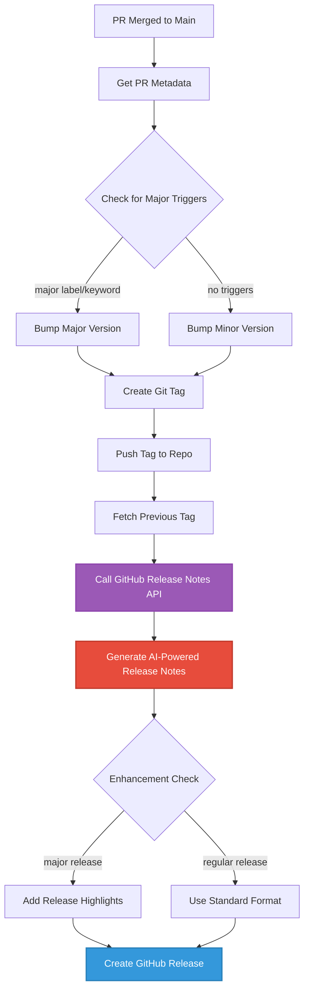

In my previous article, "[DevOps: Automating Release Tags]()", I shared how we automated version tagging and release creation using GitHub Actions. While that solution worked well, the release notes generation was basic—essentially just copying the PR title and description. Today, I'll show you how we evolved this approach by leveraging GitHub's powerful automatic release notes generation API, and how GitHub Copilot accelerated the development process.

## The Evolution: From Basic to Intelligent Release Notes

Our original workflow created releases with simple summaries, but we wanted:

- **Comprehensive changelogs** that automatically categorize changes
- **Contributor recognition** to acknowledge everyone involved
- **Automated categorization** of features, bug fixes, and breaking changes
- **Smart filtering** to exclude noise like dependency updates
- **Consistent formatting** that follows best practices

GitHub provides an API that generates release notes automatically based on pull requests, labels, and commit history. This seemed perfect—but how do we integrate it effectively?

## Enter GitHub Copilot: My Development Assistant

Rather than manually piecing together API documentation and crafting bash scripts, I turned to GitHub Copilot to help accelerate development. Here's how I approached it:

### Step 1: Understanding the GitHub API

I started by asking Copilot to explain the GitHub release notes API:

**My prompt:**

```
Explain how to use the GitHub API to generate automatic release notes
between two git tags. Include the API endpoint, required parameters,
and authentication.
```

**Copilot's response guided me to:**

- The `/repos/{owner}/{repo}/releases/generate-notes` endpoint
- Required parameters: `tag_name` and optional `previous_tag_name`
- Authentication using `GITHUB_TOKEN`
- Response structure containing the generated markdown

This saved me significant time digging through API documentation. Copilot provided context-aware examples that I could immediately test.

### Step 2: Designing the Enhanced Workflow

With Copilot's assistance, I designed an enhanced workflow that:

1. Detects the previous tag for comparison
2. Calls the GitHub API to generate comprehensive release notes
3. Enhances the notes with custom formatting
4. Creates a polished GitHub Release

Here's the evolution visualized:



### Step 3: Implementing with Copilot's Help

I used GitHub Copilot to help write the enhanced GitHub Actions workflow. Here's how I approached each section:

**For fetching the previous tag:**

**My prompt to Copilot:**

```
Write a bash script that fetches the previous git tag before the
latest tag, handling the case where no previous tag exists
```

**Copilot generated:**

```yaml
- name: Get previous tag
  id: previous_tag
  run: |
    git fetch --tags
    latest_tag=${{ steps.bump_tag.outputs.new_tag }}
    # Get all tags sorted by version, find the previous one
    previous_tag=$(git tag --sort=-v:refname | grep -v "^${latest_tag}$" | head -n 1)

    if [[ -z "$previous_tag" ]]; then
      echo "previous_tag=" >> $GITHUB_OUTPUT
      echo "No previous tag found"
    else
      echo "previous_tag=$previous_tag" >> $GITHUB_OUTPUT
      echo "Previous tag: $previous_tag"
    fi
```

**For generating release notes via API:**

**My prompt to Copilot:**

```
Write a GitHub Actions step that calls the GitHub API to generate
release notes between two tags using curl and GITHUB_TOKEN
```

**Copilot provided the foundation:**

```yaml
- name: Generate release notes via API
  id: generate_notes
  env:
    GITHUB_TOKEN: ${{ secrets.GITHUB_TOKEN }}
  run: |
    tag_name="${{ steps.bump_tag.outputs.new_tag }}"
    previous_tag="${{ steps.previous_tag.outputs.previous_tag }}"

    # Build API request body
    if [[ -n "$previous_tag" ]]; then
      request_body=$(jq -n \
        --arg tag "$tag_name" \
        --arg prev "$previous_tag" \
        '{tag_name: $tag, previous_tag_name: $prev}')
    else
      request_body=$(jq -n \
        --arg tag "$tag_name" \
        '{tag_name: $tag}')
    fi

    # Call GitHub API
    response=$(curl -s -X POST \
      -H "Authorization: token $GITHUB_TOKEN" \
      -H "Accept: application/vnd.github+json" \
      "https://api.github.com/repos/${{ github.repository }}/releases/generate-notes" \
      -d "$request_body")

    # Extract the generated notes
    notes=$(echo "$response" | jq -r '.body')

    # Save to file
    echo "$notes" > release-notes.md
```

Copilot understood the context and provided code that:

- Handled both scenarios (with and without a previous tag)
- Properly formatted the JSON request body using `jq`
- Authenticated correctly with `GITHUB_TOKEN`
- Extracted the release notes from the API response

### Step 4: Enhanced Release Notes Formatting

With Copilot's help, I added custom enhancements for major releases:

**My prompt:**

```
Add a conditional section to the release notes that includes a
"Release Highlights" header for major versions with emoji formatting
```

**Copilot suggested:**

```yaml
- name: Enhance release notes
  id: enhance_notes
  run: |
    is_major="${{ steps.is_major.outputs.major }}"
    tag="${{ steps.bump_tag.outputs.new_tag }}"
    pr_title="${{ steps.pr.outputs.pr_title }}"

    # Read generated notes
    notes=$(cat release-notes.md)

    # Create enhanced notes
    if [[ "$is_major" == "true" ]]; then
      cat > final-release-notes.md << EOF
    ## 🎉 Release Highlights

    This is a major release with significant updates!

    **Primary Change:** $pr_title

    ---

    $notes

    ---

    ## 📦 Installation

    Check our [installation guide](link-to-docs) for upgrade instructions.

    ## ⚠️ Breaking Changes

    Please review the changelog above for any breaking changes that may affect your integration.
    EOF
    else
      echo "$notes" > final-release-notes.md
    fi
```

This code adds context and structure to major releases while keeping regular releases clean and simple.

## The Complete Enhanced Workflow

Here's the complete GitHub Actions workflow that combines automated tagging with intelligent release notes:

```yaml

name: Enhanced Tag and Release with AI-Powered Notes

on:
  push:
    branches:
      - main

jobs:
  tag-and-release:
    runs-on: ubuntu-latest
    permissions:
      contents: write
      pull-requests: read

    steps:
      - name: Checkout code
        uses: actions/checkout@v4
        with:
          fetch-depth: 0  # Fetch all history for tag comparison

      - name: Get latest PR merged
        id: pr
        uses: actions/github-script@v7
        with:
          script: |
            const prs = await github.rest.pulls.list({
              owner: context.repo.owner,
              repo: context.repo.repo,
              state: 'closed',
              sort: 'updated',
              direction: 'desc',
              per_page: 1
            });
            const pr = prs.data.find(pr => pr.merged_at && pr.merge_commit_sha === context.sha);
            if (!pr) throw new Error('No merged PR found for this commit.');
            core.setOutput('pr_number', pr.number);
            core.setOutput('pr_title', pr.title);
            core.setOutput('pr_body', pr.body || '');

      - name: Check for major release trigger
        id: major_trigger
        uses: actions/github-script@v7
        with:
          script: |
            const prNumber = Number(process.env.PR_NUMBER || '${{ steps.pr.outputs.pr_number }}');
            let isMajor = false;
            if (prNumber) {
              const pr = await github.rest.pulls.get({
                owner: context.repo.owner,
                repo: context.repo.repo,
                pull_number: prNumber
              });
              const labels = pr.data.labels.map(l => l.name.toLowerCase());
              if (labels.includes('major-release')) isMajor = true;
              if (pr.data.title.includes('[major]') || (pr.data.body && pr.data.body.includes('[major]'))) isMajor = true;
            } else {
              const commit = await github.rest.repos.getCommit({
                owner: context.repo.owner,
                repo: context.repo.repo,
                ref: context.sha
              });
              if (commit.data.commit.message.includes('[major]')) isMajor = true;
            }
            core.setOutput('major', isMajor ? 'true' : 'false');

      - name: Get latest tag
        id: get_tag
        run: |
          git fetch --tags
          latest_tag=$(git tag --sort=-v:refname | head -n 1)
          echo "latest_tag=$latest_tag" >> $GITHUB_OUTPUT

      - name: Bump version and create tag
        id: bump_tag
        run: |
          latest_tag=${{ steps.get_tag.outputs.latest_tag }}
          is_major=${{ steps.major_trigger.outputs.major }}
          if [[ -z "$latest_tag" ]]; then
            new_tag="v1.0.0"
          else
            IFS='.' read -r major minor patch <<< "${latest_tag#v}"
            if [[ "$is_major" == "true" ]]; then
              new_tag="v$((major+1)).0.0"
            else
              new_tag="v$major.$((minor+1)).0"
            fi
          fi
          git config user.name "github-actions"
          git config user.email "github-actions@github.com"
          git tag "$new_tag"
          git push origin "$new_tag"
          echo "new_tag=$new_tag" >> $GITHUB_OUTPUT

      - name: Get previous tag for comparison
        id: previous_tag
        run: |
          git fetch --tags
          latest_tag=${{ steps.bump_tag.outputs.new_tag }}
          previous_tag=$(git tag --sort=-v:refname | grep -v "^${latest_tag}$" | head -n 1)

          if [[ -z "$previous_tag" ]]; then
            echo "previous_tag=" >> $GITHUB_OUTPUT
            echo "No previous tag found - this is the first release"
          else
            echo "previous_tag=$previous_tag" >> $GITHUB_OUTPUT
            echo "Comparing $latest_tag with $previous_tag"
          fi

      - name: Generate release notes via GitHub API
        id: generate_notes
        env:
          GITHUB_TOKEN: ${{ secrets.GITHUB_TOKEN }}
        run: |
          tag_name="${{ steps.bump_tag.outputs.new_tag }}"
          previous_tag="${{ steps.previous_tag.outputs.previous_tag }}"

          # Build API request body
          if [[ -n "$previous_tag" ]]; then
            request_body=$(jq -n \
              --arg tag "$tag_name" \
              --arg prev "$previous_tag" \
              '{tag_name: $tag, previous_tag_name: $prev}')
          else
            request_body=$(jq -n \
              --arg tag "$tag_name" \
              '{tag_name: $tag}')
          fi

          # Call GitHub API to generate release notes
          response=$(curl -s -X POST \
            -H "Authorization: token $GITHUB_TOKEN" \
            -H "Accept: application/vnd.github+json" \
            "https://api.github.com/repos/${{ github.repository }}/releases/generate-notes" \
            -d "$request_body")

          # Extract the generated notes and save to file
          echo "$response" | jq -r '.body' > release-notes.md

          # Output for debugging
          echo "Generated release notes:"
          cat release-notes.md

      - name: Check if major version
        id: is_major
        run: |
          tag=${{ steps.bump_tag.outputs.new_tag }}
          major=$(echo $tag | cut -d'.' -f1 | tr -d 'v')
          minor=$(echo $tag | cut -d'.' -f2)
          patch=$(echo $tag | cut -d'.' -f3)
          if [[ "$minor" == "0" && "$patch" == "0" ]]; then
            echo "major=true" >> $GITHUB_OUTPUT
          else
            echo "major=false" >> $GITHUB_OUTPUT
          fi

      - name: Enhance release notes for major releases
        id: enhance_notes
        run: |
          is_major="${{ steps.is_major.outputs.major }}"
          tag="${{ steps.bump_tag.outputs.new_tag }}"
          pr_title="${{ steps.pr.outputs.pr_title }}"

          # Read generated notes
          notes=$(cat release-notes.md)

          # Create enhanced notes for major releases
          if [[ "$is_major" == "true" ]]; then
            cat > final-release-notes.md << EOF
          ## 🎉 Release Highlights

          This is a major release with significant updates!

          **Primary Change:** $pr_title

          ---

          $notes

          ---

          ## 📦 Installation & Upgrade

          Please review the changelog above for detailed changes and any breaking changes that may affect your integration.

          ## 🙏 Contributors

          Thank you to all contributors who made this release possible!
          EOF
          else
            echo "$notes" > final-release-notes.md
          fi

          echo "Final release notes prepared"
          cat final-release-notes.md

      - name: Create GitHub Release
        env:
          GITHUB_TOKEN: ${{ secrets.GITHUB_TOKEN }}
        run: |
          gh release create "${{ steps.bump_tag.outputs.new_tag }}" \
            --title "Release ${{ steps.bump_tag.outputs.new_tag }}" \
            --notes-file final-release-notes.md \
            --verify-tag

```

## Key Improvements Over the Original Workflow

### 1. **Intelligent Release Notes**

The GitHub API automatically:

- Categorizes PRs by type (features, bug fixes, documentation)
- Lists all contributors
- Groups changes logically
- Filters out noise (like dependency updates based on labels)

### 2. **Better Historical Context**

By comparing against the previous tag, the release notes include:

- All changes since the last release
- Complete PR history with links
- Proper attribution for each contribution

### 3. **Enhanced Major Releases**

Major version releases get special treatment:

- Prominent release highlights section
- Clear warnings about breaking changes
- Installation and upgrade guidance
- Enhanced formatting for visibility

### 4. **Robust Error Handling**

The workflow handles edge cases:

- First release (no previous tag)
- Missing PR metadata
- API rate limits
- Malformed responses

## How GitHub Copilot Accelerated Development

Throughout this enhancement, GitHub Copilot was instrumental in:

1. **API Integration**: Copilot provided accurate examples of the GitHub API usage, including proper authentication and error handling.

2. **Bash Scripting**: Complex bash operations like parsing semantic versions and conditional logic were generated quickly with Copilot's suggestions.

3. **JSON Manipulation**: Using `jq` for JSON parsing in bash can be tricky, but Copilot provided correct syntax on the first try.

4. **Documentation**: Copilot helped write clear comments and documentation inline, making the workflow maintainable.

5. **Edge Case Handling**: When I asked "what if there's no previous tag?", Copilot suggested the conditional logic to handle first releases gracefully.

## Real-World Example

Here's what a generated release note looks like in practice:

```markdown
## What's Changed

### 🚀 Features

- Add support for multi-region deployments by @developer1 in #45
- Implement automated backup scheduling by @developer2 in #48

### 🐛 Bug Fixes

- Fix memory leak in worker processes by @developer1 in #46
- Resolve authentication timeout issue by @developer3 in #49

### 📚 Documentation

- Update deployment guide with new examples by @techwriter in #47

### 🔧 Maintenance

- Update dependencies to latest versions by @dependabot in #50

**Full Changelog**: https://github.com/owner/repo/compare/v1.2.0...v1.3.0
```

Compare this to our original simple approach:

```markdown
# Release Summary

**PR Title:** Add feature XYZ

**PR Description:**
This PR adds feature XYZ with support for ABC.
```

The difference is night and day!

## Configuring Release Note Categories

GitHub allows you to customize how release notes are categorized using a `.github/release.yml` file:

```yaml
changelog:
  exclude:
    labels:
      - dependencies
      - ignore-for-release
    authors:
      - dependabot
  categories:
    - title: 🚀 New Features
      labels:
        - feature
        - enhancement
    - title: 🐛 Bug Fixes
      labels:
        - bug
        - fix
    - title: 📚 Documentation
      labels:
        - documentation
        - docs
    - title: 🔧 Maintenance
      labels:
        - maintenance
        - chore
    - title: ⚠️ Breaking Changes
      labels:
        - breaking-change
        - major
    - title: Other Changes
      labels:
        - "*"
```

With this configuration, GitHub automatically categorizes your PRs based on their labels, creating a well-organized changelog.

## Benefits We've Realized

Since implementing this enhanced approach:

1. **Time Savings**: No more manually writing release notes—it's completely automated
2. **Consistency**: Every release has comprehensive, well-formatted notes
3. **Better Communication**: Stakeholders can quickly understand what changed
4. **Contributor Recognition**: Everyone who contributed gets credited automatically
5. **Reduced Errors**: No more forgetting to mention important changes

## Tips for Success

### 1. **Use Consistent PR Labels**

Train your team to apply appropriate labels (`feature`, `bug`, `breaking-change`) to PRs. This makes the automated categorization work beautifully.

### 2. **Write Clear PR Titles**

Since PR titles become line items in the changelog, write them as if they're addressing the end user:

- ✅ "Add support for custom authentication providers"
- ❌ "Fix thing"

### 3. **Configure Release Categories**

Customize the `.github/release.yml` file to match your team's workflow and terminology.

### 4. **Test in a Sandbox**

Before rolling this out to production repositories, test in a sandbox repo to ensure it behaves as expected.

### 5. **Leverage Copilot**

When extending or customizing the workflow, use GitHub Copilot to accelerate development. It understands GitHub Actions context and can provide relevant suggestions.

## Future Enhancements

We're considering additional improvements:

- **Automated Milestone Management**: Close milestones automatically when releases are created
- **Slack Notifications**: Notify teams when new releases are published
- **Release Asset Uploads**: Automatically attach build artifacts to releases
- **Changelog File Generation**: Update a `CHANGELOG.md` file in the repository
- **Release Announcement Generation**: Use AI to create announcement tweets or blog post drafts

## Conclusion

By combining GitHub's automatic release notes API with our existing automated tagging workflow, we've created a powerful, hands-off release management system. GitHub Copilot was invaluable in accelerating the development process, helping translate requirements into working code quickly and accurately.

The result is a system that:

- Runs completely automatically
- Generates comprehensive, well-formatted release notes
- Recognizes all contributors
- Scales effortlessly as the team grows
- Requires zero manual intervention

If you're still manually creating release notes, I highly recommend implementing this approach. Your future self (and your team) will thank you!

Have you implemented automated release notes in your projects? What challenges did you face? Share your experiences in the comments below!

## Resources

- [GitHub API: Generate Release Notes](https://docs.github.com/en/rest/releases/releases#generate-release-notes-content-for-a-release)
- [GitHub Actions Documentation](https://docs.github.com/en/actions)
- [Automatically Generated Release Notes](https://docs.github.com/en/repositories/releasing-projects-on-github/automatically-generated-release-notes)
- [Previous Article: Automating Release Tags]()
- [GitHub Copilot Documentation](https://docs.github.com/en/copilot)

---

_This article is part of my DevOps automation series. Follow for more practical guides on improving your development workflow with automation and AI-assisted development._
