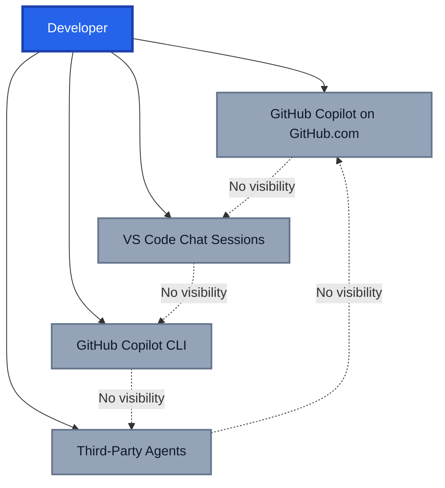
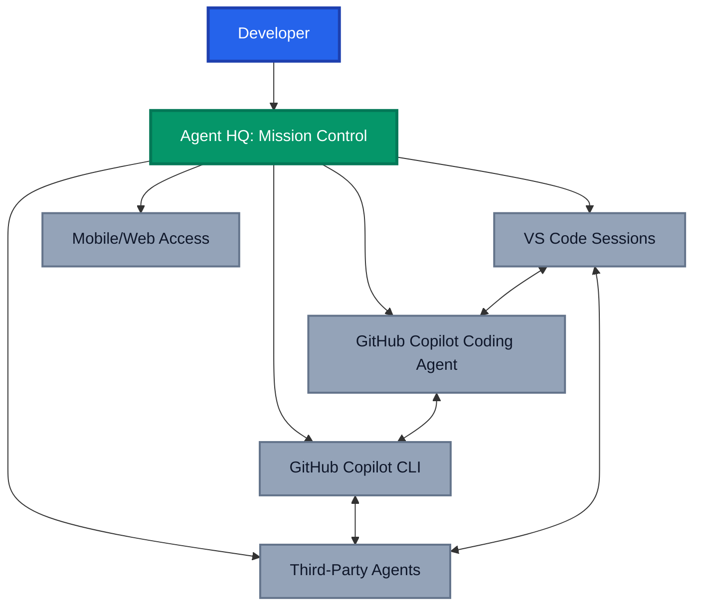
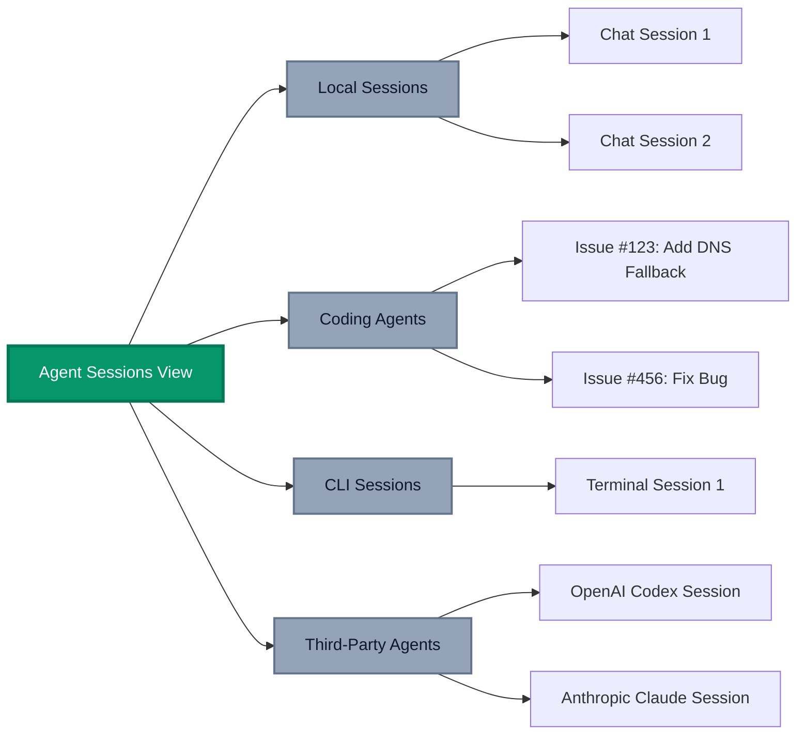
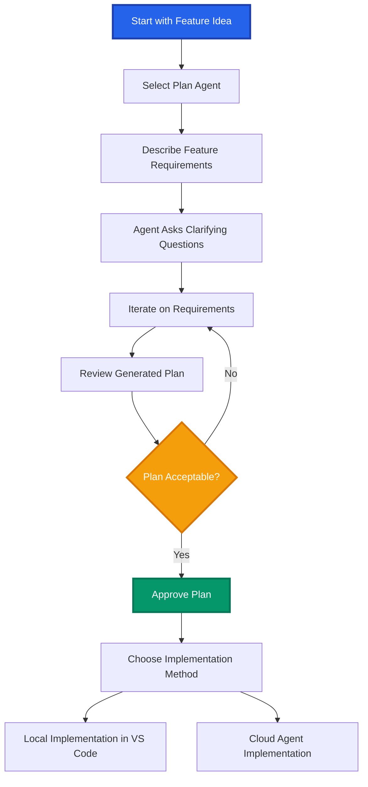
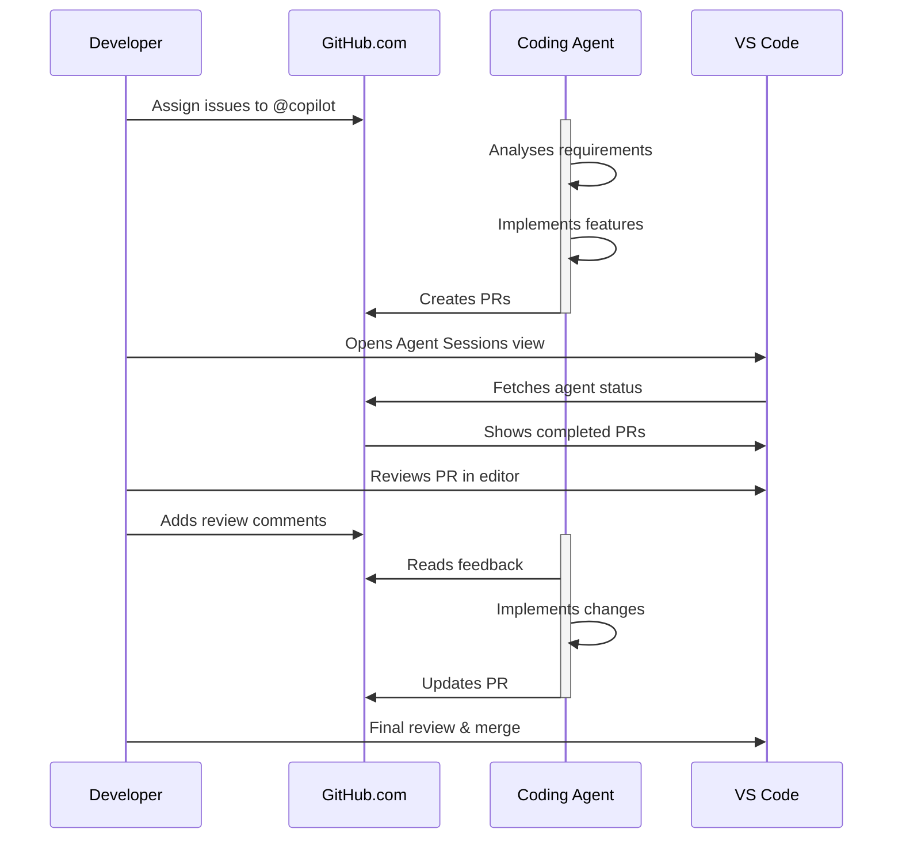
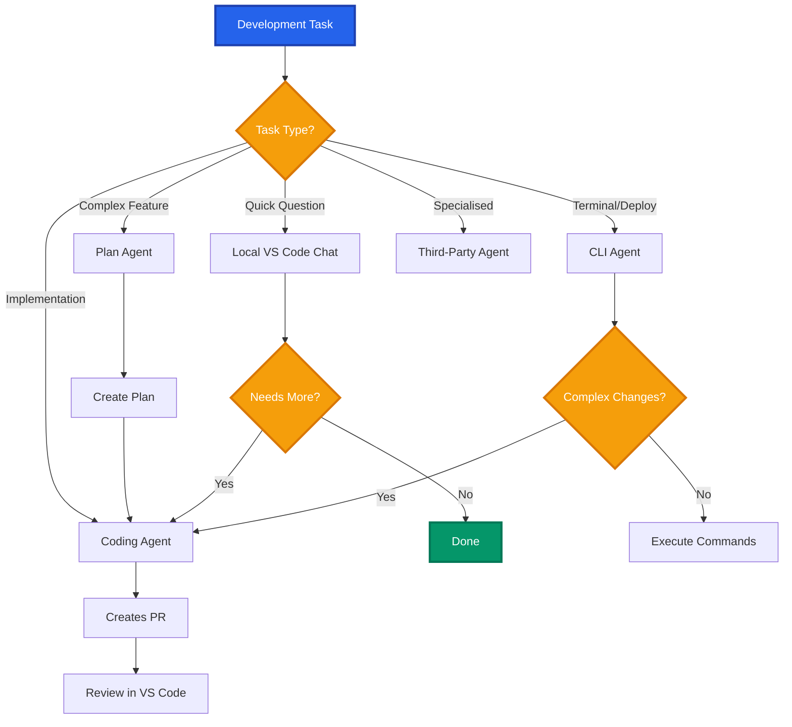
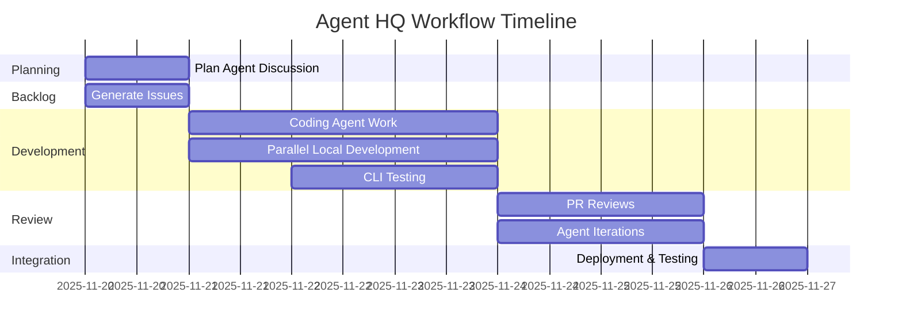

The development landscape has fundamentally shifted. We're no longer working with simple AI assistants that complete our code,we're orchestrating fleets of specialised agents that can take on entire features, collaborate across tools, and work asynchronously while we sleep. GitHub's announcement of **Agent HQ** at Universe 2025 marks a pivotal moment in how we think about development workflows, and the accompanying VS Code updates make this vision tangible today.

After spending the last few months working deeply with GitHub Copilot's coding agent and now experimenting with the latest VS Code agent integrations, I've witnessed firsthand how this transformation changes everything from how we plan work to how we manage our development sessions. This isn't hype,it's a fundamental shift in how development teams operate.

## The Problem: Fragmented Agent Experiences

Before Agent HQ, working with AI agents felt like managing multiple contractors who all used different communication channels, had no visibility into each other's work, and required constant context switching. You might have:

- **GitHub Copilot coding agent** running on GitHub.com
- **VS Code local chat sessions** for immediate help
- **GitHub Copilot CLI** for terminal commands
- **Third-party agents** like OpenAI Codex or Anthropic Claude in their native interfaces

Each operated in its own silo. You'd assign work to a coding agent on GitHub, switch to VS Code to write some code with chat assistance, jump to the terminal for CLI help, and then try to mentally piece together what was happening across all these sessions. The cognitive overhead was immense, and the lack of unified visibility meant agents couldn't benefit from each other's context.



## The Vision: Agent HQ as Your Development Command Centre

[GitHub's Agent HQ](https://github.blog/news-insights/company-news/welcome-home-agents/) fundamentally reimagines this experience. Instead of disconnected tools, you get **mission control**,a unified command centre that follows you wherever you work. Whether you're in VS Code, on GitHub.com, using the CLI, or even on mobile, you have consistent visibility and control over all your agents.

The core principle is elegant: **GitHub is your Agent HQ**. It's where agents live, work, and collaborate, just like human developers do through pull requests and issues.



## The Game Changer: Agent Sessions View in VS Code

The October 2025 VS Code release (v1.106) brings Agent HQ directly into your editor with the **Agent Sessions view**. This is now enabled by default and provides centralised management of all your active agent sessions, both local and remote.

### What the Agent Sessions View Gives You

The Agent Sessions view is organised by source, making it easy to see exactly what's happening across your development environment:

- **Local Chat Sessions**: Your VS Code chat conversations
- **Copilot Coding Agent**: Background agent sessions running on GitHub
- **GitHub Copilot CLI**: Terminal-based agent sessions
- **Third-Party Agents**: Sessions from OpenAI Codex, Anthropic Claude, and others



### Practical Workflow with Agent Sessions

Here's how this changes your daily workflow:

**Morning Stand-up Scenario:**

```markdown
1. Open VS Code
2. Check Agent Sessions view
3. See that the coding agent completed 3 PRs overnight
4. Review the CLI agent's deployment preparation
5. Resume your local chat session from yesterday
6. All without leaving your editor
```

You can search sessions (`Ctrl+Alt+F`), quickly jump between them, and see the status of background work at a glance. The view also supports a consolidated single-view mode if you prefer everything in one place.

## Plan Agent: The Strategic Thinking Partner

One of the most impactful additions is the **Plan Agent**, available via the agents dropdown in the Chat view. This fundamentally changes how I approach complex features.

### Why Planning Matters More Than Ever

I've learned from my agentic DevOps journey that the quality of AI output directly correlates with the quality of planning input. The Plan Agent addresses this by helping you:

1. **Break down complex tasks** into step-by-step implementation plans
2. **Ask clarifying questions** to ensure all requirements are captured
3. **Identify dependencies** and potential issues before code is written
4. **Create a detailed blueprint** that you approve before implementation begins

### How We Can Use the Plan Agent

Here's an example workflow:



The beauty is that you invest time upfront in the plan, catching gaps and missing decisions early, before any code is written. This dramatically reduces rework and improves the final implementation quality.

### Custom Plan Agents for Your Team

VS Code also lets you create custom plan agents tailored to your organization's workflows. Using the "Configure Custom Agent" menu, you can:

- Copy the built-in plan agent as a starting point
- Customise planning style to match your methodology (Agile, Waterfall, etc.)
- Define specific tools and prompts for your domain
- Set organization-specific guidelines and constraints

This means your team can have consistent planning approaches while maintaining flexibility for different project types.

## Cloud Agents: Seamless Background Execution

The October VS Code release migrated the Copilot coding agent integration from the GitHub Pull Request extension directly into the Copilot Chat extension. This might seem like a small technical change, but it's actually huge for the user experience.

### What Changed and Why It Matters

**Before:** Coding agent functionality felt bolted on, living in a separate extension with different behaviours and limited integration.

**Now:** Cloud agents are first-class citizens in VS Code, providing:

- **Native experience**: Same interface patterns as local chat
- **Bidirectional transitions**: Smoothly move between VS Code and GitHub Mission Control
- **Unified context**: Cloud agents benefit from your local workspace context
- **Consistent delegation**: Delegate work to cloud agents using familiar patterns

### Example Cloud Agent Workflow

Here's how cloud agents fit into a typical development day:

```markdown
**Morning:** Assign 3 issues to Copilot coding agent on GitHub.com

**During the Day:** Work on other tasks, occasionally checking Agent Sessions view

**Afternoon:** Coding agent creates PRs for 2 completed issues

**Evening:** Review PRs in VS Code, provide feedback as PR comments

**Overnight:** Coding agent iterates on feedback

**Next Morning:** PRs ready to merge
```

The key insight: **You're not blocked waiting for implementations**. You maintain momentum on strategic work while agents handle the execution heavy lifting.



## CLI Agents: Terminal Intelligence

The GitHub Copilot CLI integration brings agents directly into your terminal workflow. This is particularly powerful for complex command sequences and system administration tasks.

### How CLI Agents Work in VS Code

VS Code now provides two ways to work with CLI agents:

1. **Chat Editor Mode**: Create CLI agent sessions in a dedicated editor
2. **Integrated Terminal Mode**: Run CLI agents directly in your terminal

**Chat Editor Benefits:**

- Full chat interface with message history
- Model switching capabilities
- Context attachment from workspace files
- Persistent sessions across VS Code restarts

**Terminal Mode Benefits:**

- Natural command-line feel
- Immediate execution in your shell environment
- Integration with existing shell history
- Quick access via terminal dropdown

### Practical CLI Agent Use Cases

**Infrastructure Deployment:**

```bash
# In CLI agent terminal
@copilot How do I deploy this Bicep template to multiple regions with different parameters?

# Agent provides step-by-step commands
# You can execute them directly or ask for clarifications
```

**Troubleshooting:**

```bash
# Attach error logs
@copilot /attach error.log
@copilot Why is this Azure Function failing to start?

# Agent analyses logs and suggests fixes
```

### CLI Edit Tracking

A particularly useful feature: chat edit sessions now track edits made by CLI agents. When you create sessions from the Agent Sessions view, you can see edits through:

- **Inline edit pills**: Visual indicators in your code
- **Working set view**: Comprehensive list of all changed files

This means you maintain full visibility into what CLI agents modify, just like you would with local chat sessions or coding agents.

## Agent Delegation: Orchestrating Specialised Work

The delegation model is where Agent HQ truly shines. Instead of doing everything yourself, you can delegate specific tasks to the most appropriate agent for the job.

### How Delegation Works

From any chat session, you can:

1. **Identify specialised work**: "This needs deployment expertise"
2. **Use the cloud button**: Delegates to available agents
3. **Choose the agent**: Select from Copilot coding agent or third-party agents
4. **Monitor progress**: Track in Agent Sessions view

**From CLI to Coding Agent:**

The `/delegate` command in CLI editors or terminal instances allows you to hand off work directly to the Copilot coding agent. This is incredibly useful when you realise a terminal task requires broader codebase changes.

```bash
# In CLI agent session
@copilot Create a deployment script for multi-region failover

# Agent realises this needs code changes
# You delegate to coding agent
/delegate Create the deployment script and integrate with CI/CD pipeline

# Coding agent picks up work, creates branch, implements changes
```

### Delegation Strategy

A strategic mental model for choosing the right agent for each task:

- **Local Chat (VS Code)**: Quick questions, code explanations, immediate assistance
- **Plan Agent**: Strategic planning, requirement refinement, architectural decisions
- **Coding Agent**: Feature implementation, bug fixes, pattern replication
- **CLI Agent**: Deployment commands, system configuration, troubleshooting
- **Third-Party Agents**: Specialised tasks (e.g., OpenAI Codex for Python, Claude for documentation)



## Custom Agents: Tailoring AI to Your Workflow

One of the most powerful features is the ability to create custom agents with `.agent.md` files. These replace the previous "chat modes" and are now compatible across VS Code, GitHub Copilot Cloud Agents, and GitHub CLI.

### Why Custom Agents Matter

Custom agents let you:

- **Encode team knowledge**: Specific patterns, conventions, and best practices
- **Create specialists**: Security-focused agents, testing agents, documentation agents
- **Define workflows**: Multi-step processes unique to your organization
- **Control behaviours**: Precise guardrails and guidelines for AI behaviour

### Creating a Custom Agent

Custom agent files live in `.github/agents/` and use the `.agent.md` suffix:

```markdown
---
description: Generate an implementation plan for new features or refactoring existing code.
name: Planner
target: vscode
tools: ["fetch", "githubRepo", "search", "usages"]
model: Claude Sonnet 4
handoffs:
  - label: Implement Plan
    agent: agent
    prompt: Implement the plan outlined above.
    send: false
---

# Planning instructions

You are in planning mode. Your task is to generate an implementation plan for a new feature or for refactoring existing code.
Don't make any code edits, just generate a plan.

The plan consists of a Markdown document that describes the implementation plan, including the following sections:

- Overview: A brief description of the feature or refactoring task.
- Requirements: A list of requirements for the feature or refactoring task.
- Implementation Steps: A detailed list of steps to implement the feature or refactoring task.
- Testing: A list of tests that need to be implemented to verify the feature or refactoring task.
```

### Custom Agent Metadata

The `target` property is particularly important as it determines how the agent runs:

**`target: vscode`**: Optimised for local VS Code chat with access to:

- `name`: Custom display name
- `description`: Agent purpose
- `argument-hint`: Guidance on prompting
- `model`: Preferred AI model
- `tools`: Available VS Code tools
- `handoffs`: Links to other agents

**`target: github-copilot`**: Prepared for cloud agents and CLI with:

- `name`: Display name
- `description`: Purpose
- `tools`: Limited to `edit`, `search`, `shell`, `custom-agent`, and MCP tools
- `mcp-servers`: Model Context Protocol server access
- `target`: Deployment environment

### Agent Handoffs: Workflow Orchestration

The `handoffs` property enables guided transitions between agents, letting you chain multi-step workflows:

```markdown
---
name: Feature Development Agent
handoffs: [plan-agent, testing-agent, security-agent, documentation-agent]
---

## Workflow

1. Start with plan-agent for requirements
2. Implement features
3. Hand off to testing-agent for test coverage
4. Hand off to security-agent for security review
5. Hand off to documentation-agent for docs
```

This creates a pipeline where each agent specialises in its domain, but they work together seamlessly.

### VS Code Agent File Editing

The VS Code editor now provides rich support for `.agent.md` files:

- **Validation**: Real-time errors for invalid configurations
- **Code completions**: IntelliSense for properties and values
- **Hovers**: Documentation for each property
- **Code actions**: Quick fixes and migrations

There's even an auto-migration feature for older `.chatmode.md` files with a quick fix to convert them to the new format.

## Enterprise Considerations: Control and Governance

With great power comes great responsibility. Agent HQ includes enterprise-grade controls that I consider essential for production use.

### The Agent Control Plane

GitHub's control plane provides centralised governance for AI agents across your organization:

- **Agent Access Control**: Define which agents are allowed in your org
- **Model Access Management**: Control access to specific AI models
- **Security Policies**: Set organization-wide security rules
- **Audit Logging**: Complete audit trails of agent activities
- **Usage Metrics**: Understand Copilot usage across teams

### Branch Controls for Agent-Created Code

Utilise branch controls provide granular oversight:

```markdown
## Branch Protection for Agent PRs

- CI required before allowing any modifications to agent PRs
- Status checks must pass before human review
- Draft PRs block GitHub Actions workflows by default
- Require approval from someone other than the task requester
```

This ensures agent-created code goes through the same rigour as human-written code.

### Identity and Attribution

All agent work is properly attributed:

- **Co-authored commits**: Shows both agent and human collaborator
- **Session logs**: Complete transparency into agent decision-making
- **Review requirements**: Enforces separation of duties
- **Audit trails**: Full compliance documentation

## Security Best Practices with Agent HQ

Working with AI agents introduces new security considerations. Here's how to maintain security hygiene while leveraging Agent HQ's capabilities:

### 1. Start with Recommended Defaults

The built-in security protections are solid:

- Sandboxed execution environments
- Read-only repository access
- Branch naming restrictions (`copilot/*` only)
- Branch protection compliance

### 2. Add Custom Instructions for Security

In your `.github/copilot-instructions.md`:

```markdown
## Security Requirements

- Never commit secrets, API keys, or passwords
- Use Azure Key Vault references for sensitive data
- Implement least privilege access patterns
- All security-sensitive changes require security-agent review
```

### 3. Configure Firewall Settings

For enterprise environments, customise agent internet access:

```yaml
# Recommended: Allow specific internal resources
firewall:
  enabled: true
  recommended_allowlist: true
  custom_allowlist:
    domains:
      - "artifacts.company.internal"
      - "packages.company.internal"
```

### 4. Review Session Logs

Make it a practice to review agent session logs at [github.com/copilot/agents](https://github.com/copilot/agents):

- **Internal reasoning**: Understand the agent's decision-making
- **Tool usage**: What commands were executed
- **Code changes**: Complete diffs
- **Test results**: Validation outputs

## The GitHub MCP Registry: Extending Agent Capabilities

VS Code is the only editor that supports the full Model Context Protocol (MCP) specification, and the October release makes it even better with the GitHub MCP Registry integration.

### What is MCP?

Model Context Protocol allows agents to interact with external services and data sources. Think of it as APIs for AI agents.

### One-Click MCP Server Installation

The GitHub MCP Registry in VS Code lets you:

1. **Discover**: Browse available MCP servers (Stripe, Figma, Sentry, etc.)
2. **Install**: One-click installation directly from VS Code
3. **Enable**: Instant availability for all agents
4. **Configure**: Workspace or user-level installation

This means your agents can interact with your tools and services without custom integration work.

### Creating Custom Agents with MCP Tools

Combine custom agents with MCP servers for powerful workflows:

```markdown
---
name: Deployment Agent
target: github-copilot
tools: [shell, custom-agent]
mcp-servers: [azure-mcp, datadog-mcp]
---

# Deployment Specialist

You handle Azure deployments and monitoring.

When deploying:

1. Use azure-mcp to validate resource configurations
2. Execute deployments via shell tool
3. Use datadog-mcp to set up monitoring
4. Create deployment documentation
```

## Example Workflow: Putting It All Together

Let us walk through how we can use all these features together in a typical development scenario.

### Scenario: Adding a Complex Feature to an Infrastructure Project

**Step 1: Planning with Plan Agent (10 minutes)**

```markdown
Me: I need to add geo-redundant disaster recovery to our Azure landing zone pattern

Plan Agent: [Asks clarifying questions about RPO/RTO requirements, budget constraints, region preferences]

[After discussion...]

Plan Agent: Here's your comprehensive plan with 4 phases, 15 tasks, dependencies mapped...
```

**Step 2: Create Backlog Items**

Using the awesome-copilot prompts (via MCP server):

```markdown
@copilot Use the create-github-issues-from-plan prompt to generate issues from this plan

[Generates 15 detailed GitHub issues with descriptions, acceptance criteria, dependencies]
```

**Step 3: Delegate to Coding Agent**

Assign issues to `@copilot` on GitHub.com. Monitor progress via Agent Sessions view in VS Code.

**Step 4: Parallel Development**

While coding agent works on infrastructure, we use:

- **Local Chat**: Quick questions about Azure services
- **CLI Agent**: Test deployment commands
- **Custom Security Agent**: Review security implications

**Step 5: PR Reviews**

As PRs arrive:

- Review in VS Code
- Use custom testing agent to validate
- Provide feedback as PR comments
- Coding agent iterates automatically

**Step 6: Integration**

Use CLI agent to:

- Deploy to test environment
- Run integration tests
- Monitor with MCP-connected tools

**The Result:** Feature delivered in days instead of weeks, with consistent quality and complete documentation.



## What's Next: The Future of Agent HQ

GitHub's roadmap for Agent HQ is ambitious and exciting:

### Upcoming Third-Party Agents

Over the coming months, agents from these providers will be available:

- **Anthropic Claude**: Deep reasoning and code analysis
- **OpenAI Codex**: Advanced code generation (already available in Insiders)
- **Google Jules**: Google's coding agent capabilities
- **Cognition**: Specialised development workflows
- **xAI**: Elon Musk's AI coding assistant

All accessible through your existing GitHub Copilot subscription, no additional accounts needed.

### Enhanced Mission Control

Upcoming improvements to mission control:

- **Mobile app access**: Monitor agents from anywhere
- **Slack/Linear/Teams integrations**: Agent notifications in your workflow tools
- **Advanced delegation**: More sophisticated task routing
- **Multi-agent collaboration**: Agents working together on complex tasks

### Code Quality Integration

GitHub Code Quality (in public preview) will integrate with Agent HQ to:

- **Pre-review agent code**: Automated quality checks before human review
- **Maintainability scoring**: Org-wide code health visibility
- **Automatic remediation**: Agents fix quality issues proactively

## Conclusion: A New Era of Development

Agent HQ represents a fundamental shift in how we think about development teams. We're moving from a world where developers write all code to one where developers orchestrate specialised agents that handle implementation while humans focus on strategy, architecture, and quality.

The VS Code October 2025 release makes this vision tangible. With the Agent Sessions view, Plan Agent, cloud agents, CLI integration, custom agents, and MCP support, we now have a cohesive environment for agentic development.

What strikes me most is how natural it feels. Yes, there's a learning curve and some rough edges to smooth out, but the core experience of working with agents through Agent HQ feels intuitive. It's not bolted-on AI,it's AI integrated into the development workflow we already know.

The key insight: **This isn't about AI replacing developers. It's about transforming development from a primarily solitary activity to an orchestrated collaboration between humans and specialised agents.** The developer's role evolves from writing every line of code to designing systems, defining requirements, reviewing implementations, and making strategic decisions.

For those of us who have spent years in DevOps, this is the natural evolution we've been working toward: automation that doesn't just handle repetitive tasks but actively participates in the creative process of building software.

**Ready to embrace Agent HQ?** Start small:

1. Enable the Agent Sessions view in VS Code
2. Try the Plan Agent for your next feature
3. Create one custom agent for your team's domain
4. Delegate a well-defined task to the coding agent
5. Reflect on what worked and iterate

The future of development is here. Welcome home, agents.

---

_Have you started working with Agent HQ and the new VS Code agent features? I'd love to hear about your experiences and what patterns you've discovered. Share your thoughts in the comments below._
