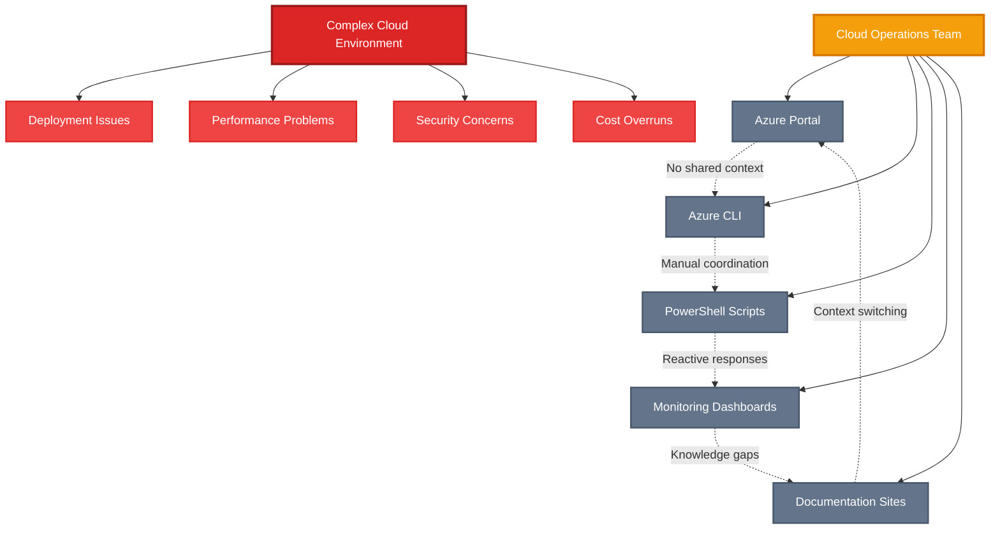
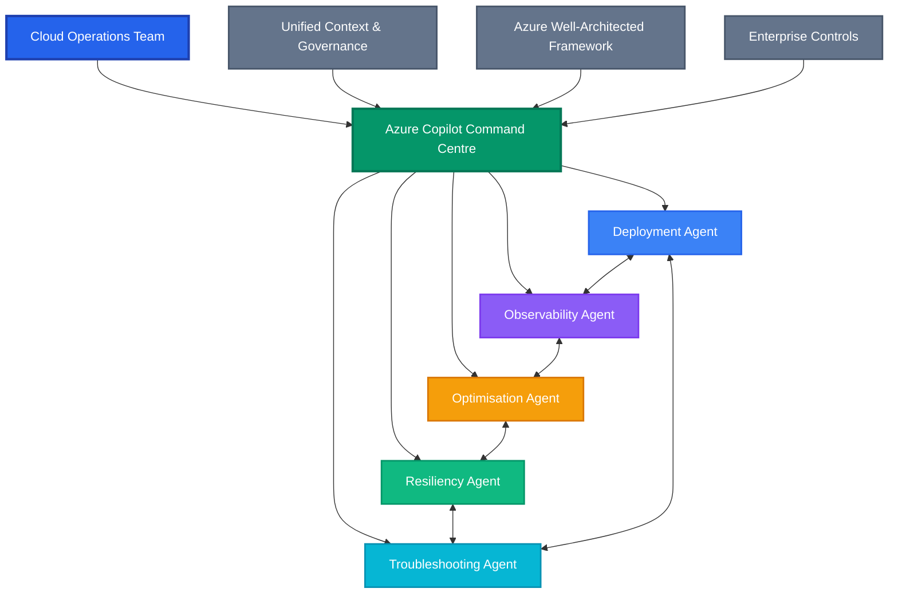
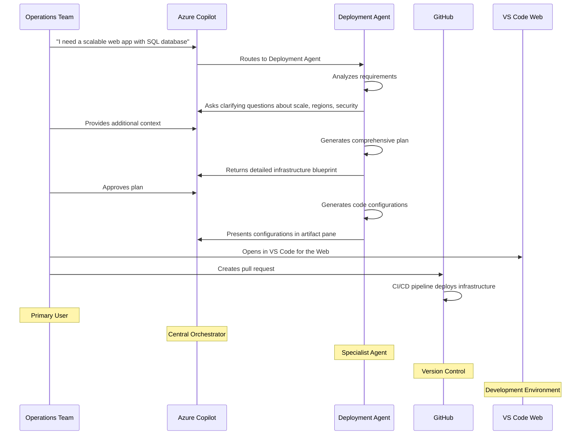
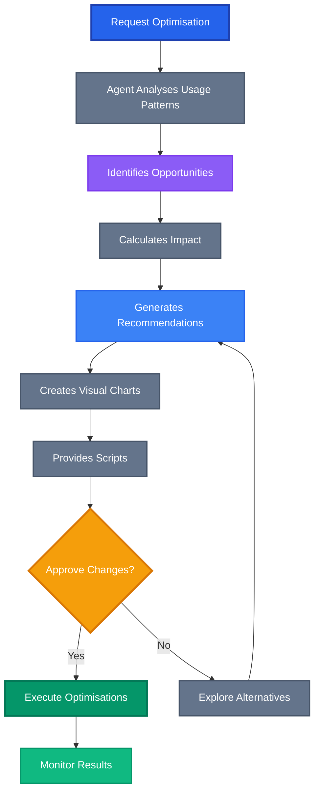
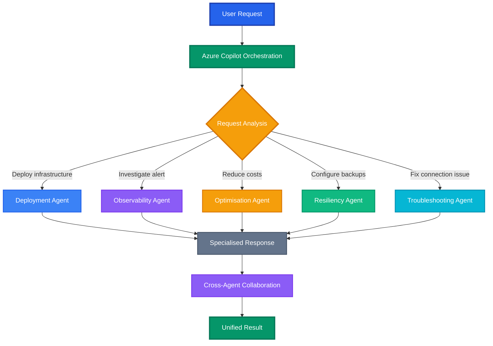

Microsoft Ignite 2025 has delivered what might be the most transformative announcement for cloud operations teams: **Azure Copilot Agents**. This isn't just another AI assistant, it's a fundamental reimagining of how we deploy, monitor, optimise, and troubleshoot cloud infrastructure.

The announcement centres around five specialised agents that work together as an orchestrated team, each bringing deep expertise in their domain while maintaining the context and governance that enterprise cloud operations demand. This is the natural evolution of what we've been building toward in the DevOps space: AI that doesn't just complete our commands, but actively participates in the operational lifecycle.

## The Problem: Cloud Operations Complexity at Scale

Before we dive into the solution, let's acknowledge the reality of modern cloud operations. Today's cloud teams are drowning in complexity:

- **Deployment sprawl**: Managing infrastructure across multiple regions, subscriptions, and resource types
- **Reactive troubleshooting**: Constant fire-fighting instead of proactive optimisation
- **Knowledge silos**: Deep expertise trapped in individual team members
- **Context switching**: Bouncing between Azure Portal, CLI tools, monitoring dashboards, and documentation
- **Compliance burden**: Ensuring security and governance across growing environments

The traditional approach requires teams to master dozens of services, maintain mental models of complex interdependencies, and execute repetitive operational tasks that could be automated if only we had the orchestration capabilities to make it happen safely and reliably.



## The Vision: Azure Copilot as Your Cloud Operations Command Centre

Azure Copilot Agents transforms this fragmented experience into a unified, intelligent operations platform. Instead of managing tools, you're orchestrating specialised agents that bring deep expertise to every aspect of cloud operations.

The core insight is elegant: **Azure Copilot becomes your cloud operations command centre**, intelligently surfacing the right agent at the right time based on your needs. Whether you're deploying new infrastructure, investigating performance issues, or optimising costs, the appropriate specialist agent appears with full context and actionable recommendations.



## The Five Specialised Agents: Your Cloud Operations Dream Team

Let's explore each agent and understand how they transform specific operational workflows.

### 1. Deployment Agent: Your Virtual Cloud Architect

The **Deployment Agent** serves as a virtual cloud solution architect, guiding you through infrastructure planning and deployment with precision and best practices built-in.

#### What Makes It Game-Changing

- **Intelligent planning**: Translates high-level goals into detailed infrastructure blueprints
- **Azure Well-Architected compliance**: All recommendations follow Microsoft's framework
- **Multi-turn conversations**: Clarifies requirements through iterative discussion
- **Complete automation**: Generates ready-to-deploy code configurations
- **Integrated workflows**: Direct integration with GitHub and VS Code for the Web

#### Example Workflow

Here's how the Deployment Agent transforms a typical infrastructure request:



### 2. Observability Agent: Your Investigation Specialist

The **Observability Agent** transforms how you handle Azure Monitor alerts and incident investigation by providing deep, automated analysis and clear remediation paths.

#### Key Capabilities

- **Automated investigations**: Creates Azure Monitor issues and runs root cause analysis
- **Contextual insights**: Leverages your specific environment data
- **Multi-alert correlation**: Identifies patterns across related alerts
- **Actionable remediation**: Provides specific steps to resolve issues
- **Support escalation**: Automatically creates support requests when needed

#### Practical Usage Patterns

**Direct Alert Investigation:**

```bash
# When viewing an alert in Azure Portal
"Can you help investigate this alert?"

# For specific alerts
"Start an investigation for my alert: /subscriptions/[...]/alerts/ALERT_ID"
```

**Proactive Monitoring:**

```bash
"What are the key alerts raised in the last 24 hours?"
"Show me any patterns in Application Insights failures"
```

### 3. Optimisation Agent: Your Cost and Performance Expert

The **Optimisation Agent** focuses on reducing costs and carbon emissions while maintaining performance, a critical capability for sustainable cloud operations.

#### Current Focus Areas

**Resource Types:**
- Virtual Machines (VMs)
- Virtual Machine Scale Sets (VMSS)

**Optimisation Capabilities:**
- **Detailed recommendations**: Specific actions with cost impact analysis
- **Alternative options**: Multiple approaches for comparison
- **Script generation**: Ready-to-execute PowerShell and Azure CLI commands
- **Visual insights**: Charts showing expected results
- **Carbon footprint**: Environmental impact analysis

#### Example Optimisation Workflow



#### Sample Optimisation Requests

**Subscription-wide Analysis:**

```bash
"Show me the top five cost-saving opportunities for subscription [GUID]"
"Summarise total potential cost and carbon reduction from all active recommendations"
```

**Resource-specific Optimisation:**

```bash
"Show me cost saving recommendations for [Resource URI]"
"Is there an alternate recommendation for ContosoVM1?"
"Generate a PowerShell script to apply the recommended optimisations"
```

### 4. Resiliency Agent: Your Business Continuity Guardian

The **Resiliency Agent** helps ensure your Azure resources can recover from failures, cyber attacks, data corruption, and datacentre outages.

#### Core Responsibilities

- **Zonal resiliency configuration**: Multi-zone deployment strategies
- **Backup management**: Azure Backup policy implementation
- **Disaster recovery**: Azure Site Recovery setup and management
- **Security posture**: Recovery services security improvements
- **Compliance monitoring**: Backup and recovery compliance checking

#### Zonal Resiliency Automation

The agent provides ready-to-deploy scripts for configuring zonal resiliency across supported services:

**Supported Services:**
- Virtual Machines
- App Services
- Azure Database for PostgreSQL
- Azure Database for MySQL
- SQL Managed Instance
- Azure Cache for Redis
- Azure Firewall

#### Sample Resiliency Tasks

**Infrastructure Hardening:**

```bash
"Configure zonal resiliency for this resource"
"Which service groups are currently not zonally resilient?"
"Increase the security level of this vault"
```

**Backup and Recovery:**

```bash
"How many backup jobs failed in the last 24 hours?"
"Which data sources don't have a recovery point within the last 7 days?"
"Help me create vault ABC"
```

### 5. Troubleshooting Agent: Your Technical Support Specialist

The **Troubleshooting Agent** accelerates issue resolution by running diagnostics, providing solutions, and creating support requests when needed.

#### Advanced Capabilities

- **Root cause analysis**: Deep diagnostic investigation
- **One-click fixes**: Automated resolution for common issues
- **Support request generation**: Automated ticket creation with full context
- **Resource-specific expertise**: Specialised knowledge for different Azure services

#### Specialised Service Support

**Azure Cosmos DB:**
```bash
"Help me troubleshoot why my Cosmos DB Cassandra API is failing"
"I'm trying to connect to Azure Cosmos DB from my local machine, but I keep getting a timeout"
```

**Virtual Machines:**
```bash
"Help me investigate why my VM is unhealthy"
"I can't connect to my VM, can you help me troubleshoot?"
```

**Azure Kubernetes Service:**
```bash
"Investigate the health of my pods"
"Identify reasons for high CPU or memory usage in my AKS cluster"
```

## Agent Orchestration: The Magic of Intelligent Routing

What makes Azure Copilot Agents truly powerful is the intelligent orchestration. You don't need to manually select which agent to use, the system automatically surfaces the right agent based on your request.

### How Orchestration Works



### Cross-Agent Collaboration

The real magic happens when agents work together. For example:

1. **Troubleshooting Agent** identifies a performance issue
2. **Optimisation Agent** provides cost-effective solutions
3. **Deployment Agent** generates infrastructure changes
4. **Resiliency Agent** ensures the solution includes backup strategies
5. **Observability Agent** sets up monitoring for the new configuration

## Getting Started: Enabling Agent Mode

Using Azure Copilot Agents is straightforward once your tenant has access:

> **NOTE**: Azure Copilot Agents is currently in preview and access will be rolled out gradually over time.

### Step 1: Enable Agent Mode

In Azure Copilot, start a conversation as you normally would, then select the agent mode icon.

### Step 2: Natural Language Requests

Simply describe what you need in natural language:

```bash
"I need to set up a resilient web application with global load balancing"
"Why is my Application Insights showing high response times?"
"What are the biggest cost optimisation opportunities in my environment?"
```

### Step 3: Review and Approve

Agents provide detailed plans and recommendations before taking any action. You maintain full control over what gets implemented.

### Step 4: Monitor and Iterate

Use the unified interface to track agent progress, review results, and provide feedback for continuous improvement.

## Enterprise Considerations: Security and Governance

Microsoft has built enterprise-grade controls into the agent experience, addressing critical concerns for production use.

### Tenant-Level Access Control

- **Gradual rollout**: Access is managed at the tenant level with gradual expansion
- **Administrator control**: IT admins can enable/disable access and manage user groups
- **Audit trail**: Complete logging of all agent activities
- **Compliance integration**: Works within existing Azure governance frameworks

### Security Best Practices

**Built-in Protections:**
- Integration with Azure RBAC
- Compliance with organisational policies

### Privacy and Data Handling

Microsoft has implemented strict data handling practices:

- Conversations are encrypted and secured
- No training data extraction from your environment
- Compliance with enterprise privacy requirements
- Integration with existing Azure security controls

## Current Limitations and Future Roadmap

### Current Preview Limitations

**Deployment Agent:**
- Terraform configurations only (ARM and Bicep coming)
- Greenfield deployments only (existing infrastructure import coming)
- Manual CI/CD integration (automated pipelines coming)

**Optimisation Agent:**
- VMs and VMSS only (more resource types coming)
- No automatic execution (approval workflows coming)
- Limited budget integration (full cost management coming)

**Observability Agent:**
- Application Insights alerts only (broader alert types coming)
- Investigation only (automatic remediation coming)

**Language Support:**
- Full support in English only
- Limited support for other languages

### Expected Enhancements

Microsoft has outlined several areas of active development:

**Expanded Resource Support:**
- More resource types for optimisation
- Broader troubleshooting capabilities
- Enhanced resiliency configurations

**Deeper Integration:**
- Native CI/CD pipeline creation
- Advanced governance controls
- Multi-cloud scenarios

**Advanced Capabilities:**
- Predictive optimisation recommendations
- Automated remediation with approval workflows
- Cross-tenant collaboration for managed service providers

## Strategic Implications: The Future of Cloud Operations

Azure Copilot Agents represents more than just new tooling, it's a fundamental shift toward **agentic cloud operations**. This transformation has several strategic implications:

### 1. Role Evolution

**Cloud Architects** become orchestrators, focusing on:
- Strategic planning and governance
- Agent delegation and oversight
- Cross-platform integration

**Operations Engineers** shift from reactive to proactive:
- Defining automation policies
- Monitoring agent effectiveness
- Continuous improvement processes

### 2. Skill Development

New competencies become critical:
- **Agent prompt engineering**: Crafting effective requests
- **Agentic workflow design**: Orchestrating multi-agent processes
- **AI-human collaboration**: Working effectively with AI partners

### 3. Organisational Changes

**Faster Innovation Cycles:**
- Rapid infrastructure experimentation
- Automated compliance and security
- Continuous optimisation

**Improved Reliability:**
- Proactive issue detection
- Consistent best practices application
- Reduced human error

**Cost Efficiency:**
- Automated optimisation recommendations
- Resource right-sizing
- Predictive capacity planning

## Conclusion: Embracing the Agentic Future

Microsoft Ignite 2025's Azure Copilot Agents announcement signals the beginning of truly agentic cloud operations. This isn't just an incremental improvement, it's a fundamental reimagining of how we interact with cloud infrastructure.

The five specialised agents (Deployment, Observability, Optimisation, Resiliency, and Troubleshooting) work together as an expert team that never sleeps, never forgets best practices, and continuously learns from your environment. The intelligent orchestration means you focus on strategic decisions while agents handle operational execution.

### Key Takeaways

1. **Start experimenting now**: Request preview access and begin familiarising your team
2. **Plan for workflow changes**: Consider how agentic operations will transform your processes
3. **Invest in agent skills**: Begin developing prompt engineering and AI collaboration competencies
4. **Prepare governance frameworks**: Establish controls and approval processes for agent activities
5. **Measure and iterate**: Track efficiency gains and optimise agent utilisation

The transformation is already underway. Organisations that embrace agentic cloud operations now will have a significant advantage in speed, reliability, and cost efficiency. The question isn't whether this future will arrive, it's whether you'll be ready to lead in it.

**Ready to start your agentic cloud operations journey?** Begin by exploring the [Azure Copilot Agents documentation](https://learn.microsoft.com/en-us/azure/copilot/agents-preview) and requesting access for your organisation.

---

_Have you started experimenting with Azure Copilot Agents? I'd love to hear about your experiences and what use cases you're exploring. Share your thoughts and questions in the comments below._