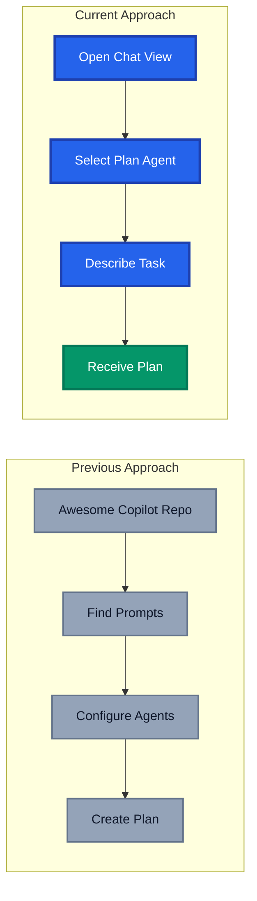
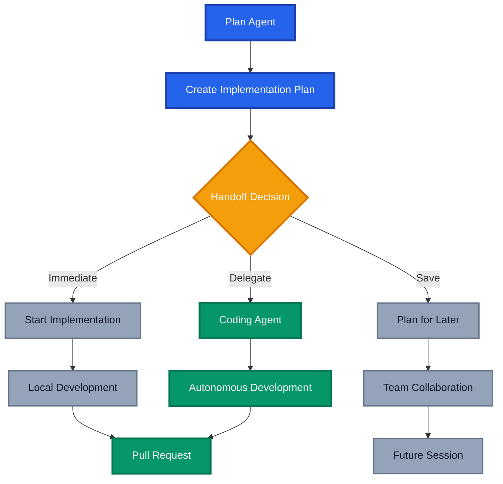

In my [previous post about delivering major enhancements using agentic DevOps](https://azurewithaj.com/posts/agentic-devops-delivered-major-enhancement), I shared how I leveraged [GitHub's Awesome Copilot repository](https://github.com/github/awesome-copilot) to access proven prompts and agents for creating implementation plans. That approach served me well, but GitHub has now introduced something that changes the game entirely: the built-in **Plan agent**.

This post explores how the new Plan agent compares to my previous Awesome Copilot workflow, what's changed in my approach, and whether this native integration delivers on its promise of streamlining complex coding tasks.

## The Evolution: From External Resources to Native Integration

### My Previous Approach with Awesome Copilot

When I wrote about my agentic DevOps journey, my planning workflow relied on external resources:

1. **Accessing the Awesome Copilot repository** for proven prompts and methodologies
2. **Using the Create Implementation Plan prompt** to generate comprehensive technical plans
3. **Applying the Implementation Plan agent (formerly chat mode)** to iteratively refine and expand the plan
4. **Optionally using the MCP server** to integrate these resources into my workflow

This approach worked exceptionally well, but it required:

- Knowledge of where to find these resources
- Manual integration of prompts and agents
- Context switching between resources and VS Code
- Configuration of MCP servers for seamless integration

### The New Built-in Plan Agent

With VS Code 1.105, GitHub introduced the Plan agent as a native feature. Instead of hunting for external prompts or configuring MCP servers, you can now access planning capabilities directly from the Chat view.

## How the Plan Agent Works

The Plan agent is designed to help you analyse tasks, break them down into steps, and generate implementation plans before you start development. This approach helps avoid missing important requirements, something I emphasised heavily in my previous workflow.

### Getting Started with Plan Agent

To use the Plan agent:

1. Open the Chat view (`Ctrl+Alt+I`)
2. Select **Plan** from the agents dropdown
3. Describe your task in detail
4. Review and refine the generated plan

### The Handoff Feature

One of the most powerful features of the Plan agent is the **handoff** capability. After finalising your plan, you can:

- **Start implementation immediately**: Transition directly to coding with context preserved
- **Save the plan for later**: Store the plan for future reference or team collaboration

This handoff feature uses VS Code's new custom chat modes system, creating guided workflows that transition between planning and implementation phases with suggested next steps.

## Comparing the Two Approaches

### What Awesome Copilot Offered

The Awesome Copilot resources provided:

- **Curated prompts**: Community-tested and refined over time
- **Structured templates**: Consistent format for implementation plans
- **Agents**: Persona-driven interactions for specific tasks
- **Flexibility**: Ability to customise and extend prompts
- **MCP integration**: Programmatic access to resources

### What Plan Agent Brings

The built-in Plan agent offers:

- **Zero configuration**: Works out of the box in VS Code
- **Native integration**: Seamless experience within the editor
- **Handoff workflow**: Direct transition from planning to implementation
- **Context preservation**: Plan context carries through to development
- **Subagent support**: Works alongside VS Code's new isolated subagents feature

## My Experience: Plan Agent vs Awesome Copilot

### The Good: Accessibility and Workflow

The Plan agent's greatest strength is its **accessibility**. It's incredibly intuitive and requires virtually no learning curve. Within minutes of opening the Chat view, I was generating comprehensive plans without needing to reference external documentation or configure anything.

The **iterative refinement process** feels natural. Unlike my previous workflow where I'd copy prompts from Awesome Copilot and paste them into chat, the Plan agent maintains conversation context seamlessly. I can ask for more detail on specific steps, request alternative approaches, or drill down into technical considerations without losing the thread of the discussion.

Perhaps most impressive is the **handoff mechanism**. The ability to transition directly from planning to implementation or save the plan to a file while preserving all context eliminates friction.

### The Trade-offs: Structure and Depth

The Plan agent's output differs from what I was accustomed to with Awesome Copilot's structured templates:

**Plan Structure**: The Awesome Copilot "Create Implementation Plan" prompt produced well-structured output with clearly articulated goals and tasks broken down hierarchically, making it suitable for backlog items, stakeholder communication, or sprint ceremonies. In contrast, the Plan agent breaks plans down into detailed bulleted steps focused on technical implementation. While this works well for development, it's less structured for project management purposes.

**Risk and Dependency Analysis**: I've noticed that **dependencies and risks aren't explicitly called out** in the plans. The Awesome Copilot templates had dedicated sections for:

- Technical dependencies and integration points
- Potential risks and mitigation strategies
- Security and compliance considerations
- Performance implications

## Integration with the Broader Agentic Workflow

The Plan agent doesn't exist in isolation. It's part of a broader ecosystem that GitHub introduced at Universe 2025:

### Subagents for Research

The new isolated subagents feature complements the Plan agent perfectly. You can use subagents for:

- **Context gathering**: Research authentication mechanisms, API patterns, or existing implementations
- **Analysis**: Investigate codebase structure or dependency relationships
- **Parallel research**: Delegate research tasks while you focus on planning

### Delegation to Coding Agent

If your repository has the [Copilot coding agent enabled](https://aka.ms/coding-agent-docs), you can delegate directly from your planning session. This mirrors my previous workflow but with better context preservation:

1. Plan with the Plan agent
2. Refine and finalise the plan
3. Delegate to the coding agent
4. Review and merge the PR

## Conclusion

The introduction of the Plan agent signals GitHub's commitment to making agentic workflows more accessible. Rather than requiring developers to discover and configure external resources, core capabilities are being baked into the tools we use daily. The journey from Awesome Copilot prompts to the built-in Plan agent represents a significant step forward in making agentic DevOps accessible to all developers. While Awesome Copilot remains a valuable resource for customised workflows and team-specific templates, the Plan agent provides an excellent starting point that requires zero configuration.

For my workflow, the Plan agent has become my default starting point for new features and enhancements. The seamless integration, handoff capabilities, and context preservation make it a natural fit for the agentic DevOps approach I outlined in my previous post.

Have you tried the Plan agent in VS Code? I'd love to hear how it compares to your existing planning workflows. Share your experiences in the comments below.

## Further Reading

- [VS Code 1.105 Release Notes - Plan Agent](https://code.visualstudio.com/updates/v1_105#_plan-agent)
- [Using the Built-in Plan Agent in VS Code](https://code.visualstudio.com/docs/copilot/chat/chat-planning)
- [GitHub's Awesome Copilot Repository](https://github.com/github/awesome-copilot)
- [Custom Chat Modes and Handoffs](https://code.visualstudio.com/docs/copilot/customization/custom-chat-modes#_handoffs)
- [My Previous Post: Delivering Major Enhancements Without Writing Code](https://azurewithaj.com/posts/agentic-devops-delivered-major-enhancement/)
