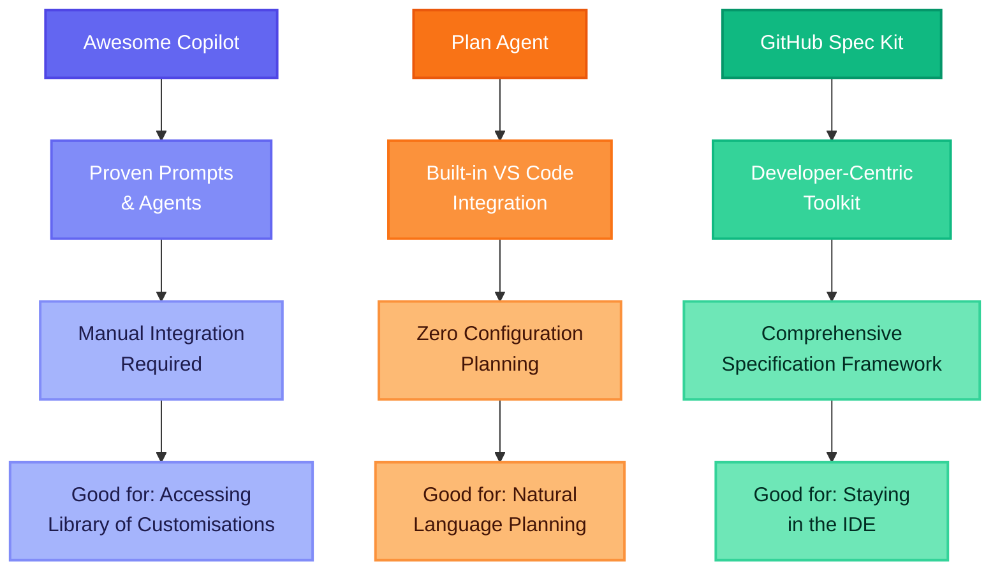

In my journey exploring agentic DevOps tools, I've previously written about [delivering major enhancements using Awesome Copilot](https://azurewithaj.com/posts/agentic-devops-delivered-major-enhancement/) and [GitHub's built-in Plan Agent](https://azurewithaj.com/posts/github-plan-agent/). Each tool has pushed the boundaries of what's possible when AI assists with development workflows. Today, I'm diving into my experience with **GitHub Spec Kit**, a developer-centric toolkit that takes planning and implementation to an entirely new level of detail and sophistication.

This post explores how Spec Kit compares to the other tools I've evaluated, the unique advantages it brings to the developer experience, and why it might be the most comprehensive approach to AI-assisted development I've encountered yet.

## What is GitHub Spec Kit?

[GitHub Spec Kit](https://github.com/github/spec-kit) is an open-source toolkit designed to help developers create detailed specifications and implementation plans directly within their development environment. Unlike the more accessible Plan Agent or the prompt-based Awesome Copilot approach, Spec Kit is purpose-built for developers who want to stay in their IDE while creating incredibly detailed project specifications.

The toolkit provides structured templates, workflows, and methodologies for:

- **Requirements gathering**: Systematic approach to capturing functional and non-functional requirements
- **Technical specification**: Detailed architecture and implementation planning
- **Task breakdown**: Granular work item creation with dependencies and acceptance criteria
- **Implementation tracking**: Progress monitoring and milestone management

## My Demo Project: Visualising Spec Kit in Action

To truly understand how Spec Kit works, I've been building a demo web application that demonstrates the toolkit's capabilities and workflow using GitHub Spec Kit. The project showcases how Spec Kit transforms high-level ideas into detailed, implementable specifications.

> [Demo repository available here](https://github.com/tw3lveparsecs/github-spec-kit-demo-app) _(Note: This project is still in active development as I continue exploring Spec Kit's capabilities)_

The demo includes:

- Interactive visualisation of the Spec Kit workflow
- Sample scenarios showcasing various inputs and their resulting outputs
- Custom scenario builder using your own specifications
- Exploration of tokens and constitution principles

_My demo application showcasing GitHub Spec Kit's workflow and capabilities_

## The Evolution: From Simple Planning to Comprehensive Specification

Let me position Spec Kit within my broader experience with agentic development tools:

Each tool serves different needs:

- **Awesome Copilot**: Flexible, customisable, requires configuration knowledge
- **Plan Agent**: Accessible, integrated, easy to get started
- **Spec Kit**: Requires setup knowledge, developer-focused, keeps you in the IDE

## My Experience: Four Key Observations

### 1. Developer-Centric and IDE-Native

One of Spec Kit's greatest strengths is how it keeps you firmly planted in your development environment. Unlike web-based planning tools or even the Chat view in VS Code, Spec Kit integrates directly into your project structure.

**What I observed:**

- Specifications become part of your repository, versioned alongside your code
- Templates and workflows integrate with your existing development tools
- No context switching between planning and implementation environments
- Natural integration with Git workflows for specification evolution

This approach feels natural for developers who prefer staying in their IDE rather than switching to separate planning tools.

### 2. Barrier to Entry vs Accessibility

While Spec Kit's developer-centric approach is a strength, it also creates a higher barrier to entry compared to something like Plan Agent.

**Plan Agent advantages:**
- Works immediately in VS Code with zero setup
- Natural language interface - just describe what you want
- No need to understand templates or workflow structures
- Easy to get started

**Spec Kit considerations:**
- Requires understanding of the toolkit's structure and methodology
- Initial setup and configuration needed
- Need familiarity with templates and specification formats
- Best suited for developers comfortable with structured approaches

For teams new to AI-assisted development, Plan Agent provides a gentler introduction. Spec Kit is better suited for teams ready to invest in a more comprehensive planning methodology.

### 3. Incredibly Detailed Planning and Implementation

Where Spec Kit truly shines is in the depth and detail of the plans it helps you create.

**Level of detail I experienced:**

- **Requirements**: Not just functional requirements, but detailed acceptance criteria, edge cases, and non-functional requirements
- **Implementation phases**: Granular task breakdown with dependencies, and success criteria
- **Test plans**: Detailed test plans specific to each user story
- **Documentation**: Built-in templates for technical documentation, API specs, and user guides

### 4. Understanding Each Phase and Input Requirements

To get the most out of Spec Kit, I found you need to understand its methodology and provide specific inputs at each phase. This isn't necessarily a limitation, but it does require investment in learning the system.

**Key phases I learned:**

1. **Discovery Phase**: Gathering requirements, stakeholder input, and constraints
2. **Specification Phase**: Creating detailed technical and functional specifications
3. **Planning Phase**: Breaking down work into implementable tasks
4. **Implementation Phase**: Executing against the detailed specifications
5. **Validation Phase**: Testing and verification against original requirements

**Critical inputs for success:**

- **Context**: Detailed background about the system, users, and constraints
- **Requirements**: Clear functional and non-functional requirements
- **Constraints**: Technical, business, and resource limitations
- **Dependencies**: External systems, APIs, and integration requirements
- **Success criteria**: Measurable outcomes and acceptance criteria

## When to Use Each Tool: My Current Thinking

Based on my experience across all three tools, here's my current framework for tool selection:

### Use Plan Agent When:

- **Natural language**: Prefer a natural language centric approach
- **Proof of concepts**: Exploring feasibility of ideas
- **Team onboarding**: Introducing AI-assisted planning
- **Accessibility priority**: Need zero-configuration solutions

### Use Awesome Copilot When:

- **Custom workflows**: Need specific prompt structures or agents
- **Team standards**: Require consistent planning templates
- **Iterative refinement**: Building on proven prompt libraries
- **Flexibility priority**: Need to customise approaches

### Use Spec Kit When:

- **Developer centric** Prefer a developer centric approach
- **Developer teams**: Working with teams comfortable with structured approaches
- **Investment in planning**: Invested in gathering and providing inputs for each phase of the workflow

## The Future of Specification-Driven Development

Spec Kit represents a fascinating evolution in how we think about AI-assisted development. Rather than replacing human planning, it provides structure and methodology to make our planning more comprehensive and actionable.

## Conclusion

The investment in learning Spec Kit's methodology pays dividends in the quality and detail of the resulting specifications. For development teams ready to embrace structured, specification-driven development, Spec Kit provides a powerful framework for transforming ideas into thoroughly planned implementations.

The key insight from my experience across all three tools is that different projects require different levels of planning sophistication. Having access to this spectrum of tools, from the quick accessibility of Plan Agent to the developer centric approach of Spec Kit. It enables us to match our planning approach to our project needs.

Have you experimented with GitHub Spec Kit or similar specification frameworks? I'd love to hear about your experiences and how you're integrating structured planning into your development workflows.

## Further Reading

- [GitHub Spec Kit Repository](https://github.com/github/spec-kit)
- [My Demo Application](https://github.com/tw3lveparsecs/github-spec-kit-demo-app)
- [My Previous Post: From Awesome Copilot to Plan Agent](https://azurewithaj.com/posts/github-plan-agent/)
- [My Previous Post: Delivering Major Enhancements Without Writing Code](https://azurewithaj.com/posts/agentic-devops-delivered-major-enhancement/)
