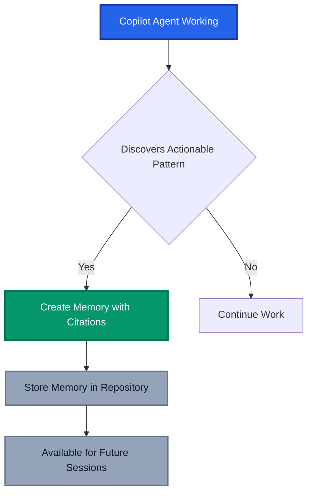
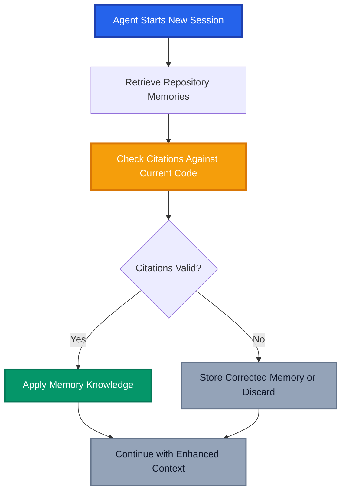

One of the biggest challenges with AI coding assistants has been their stateless nature with every interaction starting from scratch, requiring developers to repeatedly explain coding conventions, architectural patterns, and repository-specific knowledge. GitHub has just changed the game with the public preview of **agentic memory** for GitHub Copilot, a revolutionary capability that allows AI agents to remember and learn from your codebase over time.

This isn't just another incremental improvement, it's a fundamental shift toward truly intelligent AI assistants that grow smarter with every interaction. Let's dive into how this groundbreaking feature works and why it's set to transform how we collaborate with AI in our development workflows.

## The Problem: Context Lost in Translation

Picture this scenario: You're working on a complex enterprise application with specific coding conventions, database connection patterns, and synchronised configuration files. Every time you interact with GitHub Copilot, you find yourself explaining the same architectural decisions and coding standards. The AI produces decent code, but it lacks the deep understanding of your repository's unique patterns and requirements.

Traditional AI assistants suffer from "contextual amnesia" - they can't retain knowledge between sessions. This means:

- **Repetitive explanations**: Constantly re-explaining coding conventions and patterns
- **Inconsistent suggestions**: AI recommendations that don't align with established codebase patterns
- **Missed relationships**: Failing to understand dependencies between files that must stay synchronised
- **Generic responses**: One-size-fits-all solutions that don't respect repository-specific best practices

While we can leverage GitHub Copilot's instructions to provide context, this approach is limited. Instructions can become lengthy, hard to maintain, and still don't solve the problem of retaining knowledge across sessions.

## Introducing Agentic Memory: AI That Learns and Remembers

Agentic memory represents a paradigm shift in how AI assistants work with code. Instead of starting fresh with each interaction, Copilot now builds and maintains a persistent understanding of your repository through "memories". Tightly scoped pieces of knowledge that it discovers and validates over time.

### How Memories Are Created

The memory system works through what GitHub calls "just-in-time verification". Here's the elegant process:



When Copilot discovers something worth remembering, it creates a structured memory entry:

```json
{
  "subject": "API version synchronisation",
  "fact": "API version must match between client SDK, server routes, and documentation.",
  "citations": [
    "src/client/sdk/constants.ts:12",
    "server/routes/api.go:8",
    "docs/api-reference.md:37"
  ],
  "reason": "If the API version is not kept properly synchronised, the integration can fail or exhibit subtle bugs. Remembering these locations will help ensure they are kept synchronised in future updates."
}
```

### Memory Validation and Self-Healing

The brilliant aspect of this system is its self-healing nature. Before applying any stored memory, Copilot validates it against the current codebase:



This real-time verification ensures that memories remain accurate even as code evolves, branches change, and files are refactored.

## Cross-Agent Memory Sharing: The Power Multiplier

Where agentic memory truly shines is in cross-agent collaboration. Different Copilot agents can learn from each other's discoveries, creating a compound intelligence effect:

### Real-World Example: Logging Convention Discovery - REVIEW THIS!!!

1. **Copilot Code Review** discovers a logging convention while reviewing a pull request:
   - Pattern: "Log file names should follow 'app-YYYYMMDD.log' format"
   - Technology: "Use Winston for logging with timestamp, error code, user ID format"

2. **Copilot Coding Agent** later receives a task to implement a new microservice:
   - Sees and validates the logging memory
   - Automatically applies the same logging format
   - Maintains consistency across the codebase

3. **Copilot CLI** helps debug an issue:
   - Uses the learned logging format to locate correct log files
   - Efficiently searches based on the established timestamp patterns

This cross-pollination of knowledge creates an increasingly intelligent AI ecosystem that grows more valuable over time.

## Current Availability and Getting Started

Agentic memory is currently available in public preview for:

- **Copilot Coding Agent**: Enhanced task completion with repository-specific knowledge
- **Copilot Code Review**: Smarter pull request reviews based on learned patterns
- **Copilot CLI**: Context-aware command-line assistance

### Enabling Memory for Your Team

The feature is opt-in and available for all paid Copilot plans:

**For Individual Users (Copilot Pro/Pro+):**

1. Navigate to [Personal Copilot Settings](https://github.com/settings/copilot)
2. Under "Features", find "Copilot Memory"
3. Select "Enabled" from the dropdown

**For Organisations and Enterprises:**

1. Go to Organisation/Enterprise Settings
2. Navigate to Copilot policies
3. Enable Copilot Memory for your team

**Repository Management:**
Repository owners can review and manage stored memories via:
`Repository Settings > Copilot > Memory`

## Privacy and Security: Repository-Scoped Intelligence

GitHub has implemented robust privacy controls for agentic memory:

- **Repository Isolation**: Memories are strictly scoped to individual repositories
- **Permission-Based Creation**: Only contributors with write permissions can create memories
- **Access Control**: Memories are only used for users with appropriate repository access
- **Automatic Expiry**: Memories automatically delete after 28 days unless refreshed through validation

This ensures that sensitive repository knowledge stays within the appropriate boundaries while enabling powerful AI assistance.

## Implementation Best Practices

To maximise the value of agentic memory in your development workflows:

### 1. Start with High-Impact Repositories

Enable memory on repositories with:

- Complex coding conventions
- Synchronised configuration files
- Specific architectural patterns
- Multiple team contributors

### 2. Monitor Memory Quality

Regularly review stored memories to:

- Remove outdated or incorrect memories
- Validate that learned patterns align with current practices
- Ensure memories reflect your team's coding standards

### 3. Leverage Cross-Agent Benefits

Use multiple Copilot features together:

- Let Code Review agents learn from expert developer patterns
- Allow Coding Agent to benefit from review insights
- Use CLI with enhanced repository context

### 4. Educate Your Team

Ensure team members understand:

- How memories are created and validated
- The privacy and security model
- How to review and manage repository memories

## Conclusion: A New Era of Intelligent Development

GitHub Copilot's agentic memory represents a fundamental evolution in AI-assisted development. By solving the "contextual amnesia" problem, it enables AI agents to become true collaboration partners that grow more valuable over time.

The beauty lies not just in the technical implementation, but in how it transforms the developer experience. No more explaining the same patterns repeatedly. No more generic suggestions that miss repository-specific context. Instead, you get AI assistance that truly understands your codebase and respects your team's established practices.

As we embrace this new era of agentic AI, the question isn't whether to adopt these capabilities, but how quickly we can integrate them into our development workflows to unlock their full potential.

_Have you enabled agentic memory in your repositories yet? What patterns do you hope Copilot will learn from your codebase? Share your experiences and thoughts in the comments below._

## References

- [Building an Agentic Memory System for GitHub Copilot](https://github.blog/ai-and-ml/github-copilot/building-an-agentic-memory-system-for-github-copilot/)
- [Agentic Memory Public Preview Announcement](https://github.blog/changelog/2026-01-15-agentic-memory-for-github-copilot-is-in-public-preview/)
- [About Agentic Memory for GitHub Copilot](https://docs.github.com/en/copilot/concepts/agents/copilot-memory)
- [Enabling and Curating Copilot Memory](https://docs.github.com/en/copilot/how-tos/use-copilot-agents/copilot-memory)
