If you've been working with AI agents lately, you've probably hit a limitation: the agent can describe what it found, but it can't show you anything interactive. Your agent finishes scanning a dataset and presents a table in text format. You need to explore further, so you ask it to reorganise the results. Another round trip. Another text response.

MCP Apps change that equation entirely. They let your MCP servers return interactive HTML interfaces such as dashboards, forms, visualisations and configuration panels that render directly inside your AI conversation. No tab switching. No context loss. Just rich, interactive interfaces right where you're having the conversation.

In this post, I'll explain what MCP Apps are, how they work, why they matter, and how you can leverage them in real scenarios like browsing Azure resources with an interactive dashboard.

## What Are MCP Apps?

MCP Apps are an extension to the Model Context Protocol that lets MCP tools declare and serve interactive user interfaces. Rather than returning only text, images, or structured data, a tool can now say "render this HTML interface alongside your response."

The key insight is simple: sometimes showing is better than telling. An agent can describe "your database has performance bottlenecks in query processing," but an interactive graph lets you drill into the call stacks, hover for timing details, and validate the analysis yourself.

MCP Apps bridge the gap between pure text-based AI interactions and rich desktop applications. They give agents a visual voice.

## The Problem MCP Apps Solve

Traditional agent workflows suffer from a classic problem: agents work in text space, but developers think in visual and interactive space. When an agent presents findings, you often want to explore further, but the agent can only respond with more text.

MCP Apps flip this around. Agents can now display:

- **Interactive dashboards**: Visualise metrics, logs, or resource states
- **Forms with validation**: Configure systems with confidence
- **Data tables with sorting and filtering**: Explore large datasets without truncation
- **Visualisations**: Flame graphs, heatmaps, network diagrams, 3D models
- **Terminal-like interfaces**: Real-time monitoring and status updates
- **File pickers and selectors**: Choose resources from rich interfaces

The agent doesn't lose context, and it works alongside the interactive UI. When you interact with the app, it can call MCP tools to fetch fresh data, validate your choices, or execute actions.

## How MCP Apps Work

Understanding the architecture helps explain why MCP Apps are secure and efficient.

```mermaid
graph LR
    A["MCP Server<br/>Registers Tool"] --> B["Tool Description<br/>Includes UI Resource URI"]
    B --> C["Host/Agent<br/>LLM Decides to Call Tool"]
    C --> D["Host Fetches<br/>UI Resource<br/>from Server"]
    D --> E["Sandboxed iframe<br/>Renders HTML/JS"]
    E --> F["Bidirectional<br/>Communication<br/>via postMessage"]
    F --> G["App Calls Tools<br/>Host Updates Display"]
    
    style A fill:#2563eb,stroke:#1e40af,stroke-width:3px,color:#fff
    style B fill:#2563eb,stroke:#1e40af,stroke-width:3px,color:#fff
    style C fill:#94a3b8,stroke:#64748b,stroke-width:2px,color:#0f172a
    style D fill:#94a3b8,stroke:#64748b,stroke-width:2px,color:#0f172a
    style E fill:#059669,stroke:#047857,stroke-width:3px,color:#fff
    style F fill:#059669,stroke:#047857,stroke-width:3px,color:#fff
    style G fill:#2563eb,stroke:#1e40af,stroke-width:3px,color:#fff
```



The flow works in four key steps:

### 1. Tool Registration with UI Metadata

An MCP server registers a tool with a special `_meta.ui.resourceUri` field that points to an HTML interface:

```typescript
registerAppTool(
  server,
  "list-azure-storage",
  {
    title: "List Azure Storage Accounts",
    description: "Browse storage accounts with filtering and drill-down",
    inputSchema: {},
    _meta: { 
      ui: { 
        resourceUri: "ui://storage-dashboard/mcp-app.html" 
      } 
    },
  },
  async () => {
    // Fetch storage account data
    const accounts = await listStorageAccounts();
    return {
      content: [{ type: "text", text: JSON.stringify(accounts) }],
    };
  },
);
```

### 2. UI Preloading and Resource Fetching

When an agent calls the tool, the host can preload the UI resource before the tool even executes. The host fetches the bundled HTML from the server, which is typically a single file containing HTML, CSS, and JavaScript bundled together.

### 3. Sandboxed Rendering

The host renders the HTML in a sandboxed iframe. This is crucial for security, as the app can't access the parent window's DOM, steal cookies, or execute scripts in the parent context. All communication happens through the postMessage API, which is controlled by the host.

### 4. Bidirectional Communication

The app and host communicate via JSON-RPC over postMessage. The app can:

- Receive the initial tool result when rendered
- Call tools on the server (e.g., "fetch more data with these filters")
- Send log messages back to the host
- Update the model's context with structured data
- Request actions like opening URLs

This bidirectional flow means your UI stays dynamic without page reloads.

## Practical Uses: Building an Azure Storage Dashboard

Let me walk through a concrete example: building an interactive dashboard to browse Azure storage accounts.

Instead of asking your agent "list all storage accounts and filter by location," you could have an interactive dashboard where you:

1. See all storage accounts in a table
2. Filter by resource group, region, or storage type
3. Click to view details (access keys, endpoints, configuration)
4. Perform actions (create a new account, update settings, delete a container)
5. Copy information without manual re-typing

Here's an example of how the server implements this:

```typescript
// Server side: register the tool with UI metadata
registerAppTool(
  server,
  "storage-dashboard",
  {
    title: "Azure Storage Dashboard",
    description: "Interactive dashboard for browsing and managing storage accounts",
    inputSchema: {
      type: "object",
      properties: {
        subscriptionId: { type: "string" },
        resourceGroup: { type: "string" },
      },
    },
    _meta: { 
      ui: { 
        resourceUri: "ui://storage-dashboard/app.html" 
      } 
    },
  },
  async (params) => {
    // Fetch storage accounts from Azure
    const accounts = await getStorageAccounts(
      params.subscriptionId,
      params.resourceGroup
    );
    
    return {
      content: [{ 
        type: "text", 
        text: JSON.stringify(accounts)
      }],
    };
  },
);

// Register the UI resource
registerAppResource(
  server,
  "ui://storage-dashboard/app.html",
  { mimeType: RESOURCE_MIME_TYPE },
  async () => {
    const html = await fs.readFile("dist/app.html", "utf-8");
    return {
      contents: [
        { 
          uri: "ui://storage-dashboard/app.html",
          mimeType: RESOURCE_MIME_TYPE,
          text: html 
        },
      ],
    };
  },
);
```

On the UI side, the dashboard receives the storage account data and renders it interactively:

```typescript
// Client side: UI implementation
import { App } from "@modelcontextprotocol/ext-apps";

const app = new App({ 
  name: "Storage Dashboard", 
  version: "1.0.0" 
});

app.connect();

// Receive initial data from the tool
app.ontoolresult = (result) => {
  const accounts = JSON.parse(
    result.content?.find((c) => c.type === "text")?.text || "[]"
  );
  renderStorageTable(accounts);
};

// When user filters, call a tool to fetch filtered data
async function applyFilters(filters) {
  const result = await app.callServerTool({
    name: "storage-dashboard",
    arguments: { 
      subscriptionId: filters.subscription,
      resourceGroup: filters.group 
    },
  });
  
  const accounts = JSON.parse(result.content?.[0]?.text || "[]");
  renderStorageTable(accounts);
}

function renderStorageTable(accounts) {
  // Render interactive table with filtering, sorting, drill-down
  // Users can see all accounts at once, explore details,
  // and perform actions without leaving the UI
}
```

This approach gives you:

- **Instant visual feedback**: Tables, icons, colours communicate status at a glance
- **Exploration without friction**: Filter, sort, drill down without conversation turns
- **Context preservation**: Everything stays in one place—the agent's workspace
- **Reduced latency**: UI interactions feel responsive

Rather than asking your agent "show me storage accounts in the Australia regions" five times with slightly different filters, you see all options at once and click to explore.

## Security Considerations for MCP Apps

MCP Apps run in a sandboxed iframe, which provides strong security isolation, but "sandboxed" does not mean "bulletproof." Here are security practices you should follow:

### Sandboxing Fundamentals

MCP Apps run inside a sandboxed iframe with these restrictions:

- **No DOM access**: The app can't access the parent window's document or modify the main page
- **No cookie theft**: localStorage and sessionStorage are isolated
- **No page navigation**: The app can't redirect the parent window
- **Restricted script execution**: Scripts in the app run only within the sandbox

All communication between the app and host happens through postMessage, which is an explicit, controlled channel.

### Content Security Policy (CSP)

When serving your UI, specify which external origins can load resources. This prevents your app from accidentally (or maliciously) loading scripts from untrusted domains:

```typescript
registerAppResource(
  server,
  "ui://storage-dashboard/app.html",
  { 
    mimeType: RESOURCE_MIME_TYPE,
    _meta: {
      ui: {
        csp: ["https://cdn.jsdelivr.net", "https://cdn.example.com"]
      }
    }
  },
  async () => {
    // Serve HTML
  },
);
```

### Permission Requests

Your app can request permissions (microphone, camera, geolocation), but these go through the host. The user is always in control of what the app can access. If your app doesn't need a permission, don't request it.

### Input Validation and Sanitisation

Since your app receives data from the server and may send data back to the server, validate everything:

```typescript
// On the client: validate server responses
app.ontoolresult = (result) => {
  try {
    const accounts = JSON.parse(result.content?.[0]?.text || "[]");
    
    // Validate the data structure
    if (!Array.isArray(accounts)) {
      throw new Error("Expected array of accounts");
    }
    
    // Sanitise rendered content if it comes from user input
    accounts.forEach(account => {
      account.name = sanitiseHTML(account.name);
    });
    
    renderStorageTable(accounts);
  } catch (e) {
    console.error("Invalid tool result:", e);
  }
};
```

### Tool Call Authorisation

The host controls which tools your app can call. When you call `app.callServerTool()`, the host validates that:

1. The tool exists on the server
2. The host has access to that tool
3. The user has authorised the interaction

You don't need to implement authorisation on the client, as the host enforces it.

### Secure Default Data Handling

MCP Apps can request "rich context" updates to the model. Be careful what data you send:

```typescript
// Good: send only necessary data
app.updateContext({
  type: "resource",
  resource: {
    uri: "azure://storage/account/myaccount",
    name: "myaccount",
    mimeType: "application/json"
  }
});

// Bad: don't send secrets or sensitive tokens
app.updateContext({
  type: "resource",
  resource: {
    data: { accessKey: "very-secret-key" }  // Never do this
  }
});
```

### Server-Side Security

Your MCP server also has security responsibilities:

1. **Validate inputs**: Check tool arguments before executing
2. **Authenticate requests**: Ensure the user has Azure/cloud access
3. **Limit data exposure**: Don't return secrets, access keys, or connection strings to the UI
4. **Rate limiting**: Protect against abuse
5. **Audit logging**: Track who accessed what dashboards and resources

```typescript
registerAppTool(
  server,
  "storage-dashboard",
  { /* ... */ },
  async (params, context) => {
    // Validate inputs
    if (!params.subscriptionId?.match(/^[a-f0-9-]{36}$/)) {
      throw new Error("Invalid subscription ID format");
    }
    
    // Check authentication
    const user = await getCurrentUser(context);
    if (!user) {
      throw new Error("Authentication required");
    }
    
    // Verify user has access to this subscription
    const hasAccess = await verifySubscriptionAccess(
      user, 
      params.subscriptionId
    );
    if (!hasAccess) {
      throw new Error("Access denied");
    }
    
    // Fetch data and return (without secrets)
    const accounts = await getStorageAccounts(params.subscriptionId);
    
    // Remove sensitive data before returning
    const safeAccounts = accounts.map(acc => ({
      id: acc.id,
      name: acc.name,
      location: acc.location,
      type: acc.kind,
      // Never include:
      // primaryEndpoints, accessKey, connectionString, etc.
    }));
    
    return {
      content: [{ type: "text", text: JSON.stringify(safeAccounts) }],
    };
  },
);
```

## Getting Started with MCP Apps

Building an MCP App is straightforward. The MCP team provides several ways to get started:

### Using an AI Coding Agent (Fastest)

> **NOTE:** At the time of writing, MCP Apps are only supported in VS Code Insiders, so you will need the Insiders build to render apps inside the editor.

If you have access to Claude Code, VS Code with GitHub Copilot, or another agent that supports skills, you can leverage the `create-mcp-app` skill:

```bash
# Install the skill (Claude Code example)
/plugin marketplace add modelcontextprotocol/ext-apps
/plugin install mcp-apps@modelcontextprotocol-ext-apps
```

Then ask your agent: "Create an MCP App that displays a live Azure storage account dashboard."

The agent will scaffold a complete project with server, UI, and configuration files ready to run.

### Manual Setup

If you prefer hands-on control, clone the examples repository and modify a starter template:

```bash
git clone https://github.com/modelcontextprotocol/ext-apps.git
cd ext-apps/examples/basic-server-react
npm install && npm run build && npm run serve
```

The [ext-apps repository](https://github.com/modelcontextprotocol/ext-apps) includes starter templates for React, Vue, Svelte, Preact, Solid, and vanilla JavaScript. Choose the framework that matches your preferences.

### Testing Your App

For development, use the basic-host test interface to debug your app locally:

```bash
cd ext-apps/examples/basic-host
SERVERS='["http://localhost:3001/mcp"]' npm start
```

Navigate to `http://localhost:8080` to see your app render in an MCP-compatible host.

## What's Next?

MCP Apps are still early, but adoption is growing rapidly. VS Code, Claude Desktop, Postman, and other AI environments already support them. As more tools and agents integrate MCP, you'll see dashboards and interactive workflows become standard.

The implications for DevOps and cloud engineering are particularly interesting. Instead of describing infrastructure or asking an agent to list resources in text, you could have interactive dashboards for:

- **Resource discovery and filtering**: Browse Azure resources visually
- **Configuration wizards**: Step through deployment decisions with validation
- **Monitoring and alerting**: Real-time dashboards alongside AI analysis
- **Approval workflows**: Review changes and approve with confidence
- **Cost analysis**: Interactive charts and drill-down into spending patterns

The combination of AI agents and interactive dashboards creates a powerful new class of tools.

## Demo: MCP Storage Account App

I built a small demo MCP App that surfaces Azure storage accounts in a simple dashboard so you can explore the list, inspect details, and validate the flow end to end. If you want a practical reference implementation, you can find it here:

[https://github.com/tw3lveparsecs/mcp-apps-demo](https://github.com/tw3lveparsecs/mcp-apps-demo)

## Key Takeaways

1. **MCP Apps solve a real problem**: Text-based agent responses don't scale for exploration, configuration, or monitoring
2. **Security is built-in**: Sandboxed iframes isolate apps from the host, but you still need to validate inputs and protect secrets
3. **The architecture is elegant**: Simple tool registration with UI metadata, bidirectional postMessage communication, and no reinventing the wheel for authentication
4. **Azure integration is practical**: You can build dashboards that replace manual CLI queries and portal browsing
5. **The ecosystem is growing**: With VS Code support and multiple framework options, building MCP Apps is accessible to most developers

Have you started building MCP Apps? What problems are you trying to solve with interactive dashboards? Share your experiences in the comments. I'd love to hear how the community is pushing this technology forward.

## References

- [Model Context Protocol: MCP Apps Documentation](https://modelcontextprotocol.io/docs/extensions/apps)
- [VS Code MCP Apps Support: Official Announcement](https://code.visualstudio.com/blogs/2026/01/26/mcp-apps-support)
- [MCP Apps SDK and Examples: GitHub](https://github.com/modelcontextprotocol/ext-apps)
- [MCP Specification](https://modelcontextprotocol.io/specification)
