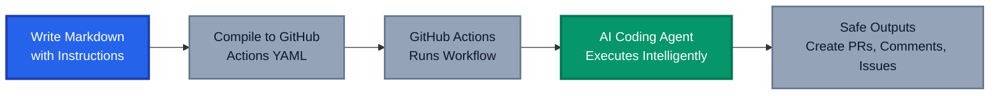
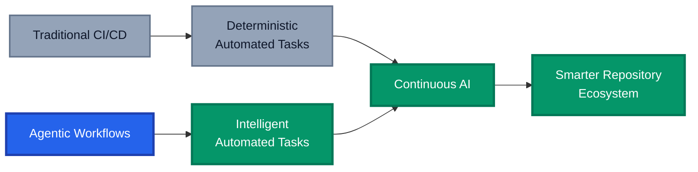

Repository automation works well for deterministic tasks, but struggles with work requiring context understanding and adaptive decision-making. When you need to keep documentation synchronised with code, triage issues intelligently, or verify pull requests comply with guidelines, traditional approaches force you to encode all logic upfront using conditionals, regex patterns, and scripts. But real development is messier than any ruleset can capture.

GitHub Agentic Workflows represent a different approach: describe what you want to happen in natural language, and an AI coding agent reads your instructions, understands your repository context, and takes intelligent actions. This is more than a convenience improvement. Agentic Workflows represent the bridge between "Continuous Integration" and "Continuous AI" - systematic, automated application of intelligence throughout your development lifecycle.

## TL;DR

**Agentic Workflows** let you describe automation tasks in plain English instead of complex configuration. An AI coding agent reads your instructions, understands your repository context, and takes intelligent actions. Instead of encoding every path through conditional logic, you describe intent and the agent adapts. This enables powerful automation for nuanced tasks like intelligent issue triage, continuous documentation updates, compliance checking, and code quality improvements. Workflows remain fully auditable and safe with automatic permission scoping and sandboxed execution.

## The Problem: Current Automation is Still Too Complex

Before we talk about solutions, let's acknowledge why existing automation feels limiting.

Traditional GitHub Actions work well for deterministic tasks. When you know exactly what needs to happen (`if file A changes, run test B`), Actions excels. But real development workflows rarely work that way.

Consider these practical scenarios:

**Scenario 1: Intelligent Issue Triage**

You want to triage new issues automatically, adding appropriate labels, detecting spam, and asking clarifying questions for unclear reports. This requires:

- Reading issue content and understanding context
- Comparing to similar past issues to detect duplicates
- Making judgment calls about relevance and priority
- Phrasing helpful feedback that respects first-time contributors

Today, you'd either write complicated shell scripts with regex patterns or abandon automation entirely and do it manually.

**Scenario 2: Keeping Documentation Current**

Code evolves constantly. Documentation doesn't. You want an agent that runs daily, identifies recent code changes, updates relevant documentation sections, and creates a pull request with those changes. This requires:

- Parsing the git diff to understand what changed
- Finding related documentation files
- Rewriting sections to reflect new functionality
- Creating coherent, well-written updates

Try doing this in traditional Actions: you're either embedding massive Python scripts or chaining together countless workflow steps.

**Scenario 3: Compliance Checking**

When pull requests arrive, you want to verify they follow your contribution guidelines. Different PRs need different feedback. Some might be perfect but need a test plan. Others might be off-topic entirely. You need nuanced judgment, not just pattern matching.

These scenarios share something crucial: they require context understanding and adaptability. They're not "if X then Y" - they're "understand the situation, then do what makes sense."

This is where agentic workflows shine.

## What Are Agentic Workflows?

Agentic Workflows are GitHub Actions workflows written in natural language markdown instead of YAML. When triggered, they run an AI coding agent (like GitHub Copilot, Claude Code, or OpenAI Codex) with access to your repository context, allowing it to make intelligent decisions and take meaningful actions.

The key insight: **Instead of programming every path, you describe the intention and let the agent navigate complexity.**



## How Agentic Workflows Work

Unlike traditional Actions that execute scripts you write, agentic workflows run AI coding agents that interpret your narrative instructions and decide what to do.

### The Execution Model

When an agentic workflow is triggered, here's what happens:

1. **Frontmatter Configuration**: The YAML frontmatter defines:
   - When the workflow runs (schedule, triggers, permissions)
   - What the agent can access (tools, GitHub permissions)
   - What actions are allowed (safe outputs)
   - Resource constraints (timeouts, network access)

2. **Agent Execution**: The AI agent reads:
   - Your markdown instructions
   - Repository context (files, issues, PRs, discussions)
   - Current situation (what issue/PR triggered the workflow)
   - Available tools and permissions

3. **Tool Usage**: The agent can use allowed tools like:
   - GitHub (read pull requests, issues, discussions, code)
   - File editing (modify code or documentation)
   - Bash scripting (run tests, build, analyse code)
   - Web fetching (research external resources)
   - Model Context Protocol (MCP) servers (integrate external services)

4. **Safe Outputs**: The agent doesn't have direct write access. Instead, it uses sanitised "safe outputs":
   - `create-pull-request`: Request a PR be created
   - `add-comment`: Request a comment be added to an issue or PR
   - `add-labels`: Request labels be applied
   - `create-issue`: Request a new issue be created

This safety layer is critical. The agent is sandboxed; it can't silently modify your code. All actions go through controlled paths that leave an audit trail.

### A Concrete Example: Contribution Guidelines Checker

Let's walk through a real example from GitHub's agentics repository. The Contribution Guidelines Checker workflow automatically reviews incoming pull requests and verifies they comply with your `CONTRIBUTING.md`.

**The YAML Front Matter:**

```yaml
---
description: |
  Reviews incoming pull requests to verify they comply with the repository's
  contribution guidelines. Checks CONTRIBUTING.md and similar docs, then either
  labels the PR as ready or provides constructive feedback.

on:
  pull_request:
    types: [opened, synchronize]
  reaction: eyes

permissions: read-all

safe-outputs:
  add-labels:
    allowed: [contribution-ready]
    max: 1
  add-comment:
    max: 1

tools:
  github:
    toolsets: [default]
    lockdown: false

timeout-minutes: 10
---
```

**The Natural Language Instructions:**

```markdown
# Contribution Guidelines Checker

You are a contribution guidelines reviewer. Your task is to analyse PR #${{ github.event.pull_request.number }} 
and verify it meets the repository's contribution guidelines.

## Step 1: Find Contribution Guidelines

Search for contribution guidelines in the repository. Check these locations:
1. `CONTRIBUTING.md` in root
2. `.github/CONTRIBUTING.md`
3. `docs/CONTRIBUTING.md`
4. Contribution sections in `README.md`

## Step 2: Retrieve PR Details

Fetch the full PR details including title, description, changed files, and commit messages.

## Step 3: Evaluate Compliance

Check the PR against the guidelines for:
- PR Title format and clarity
- PR Description completeness
- Commit message format
- Required sections (test plan, changelog)
- Documentation updates
- Other repo-specific requirements

## Step 4: Take Action

**If the PR meets all guidelines:**
- Add the `contribution-ready` label

**If the PR needs improvements:**
- Add a helpful comment that includes:
  - A friendly greeting
  - Specific guidelines not being met
  - Clear, actionable steps to bring it into compliance
```

When a PR is opened:

1. The agent reads your contribution guidelines from the repository
2. It fetches the PR content
3. It evaluates the PR against those guidelines with nuanced judgement
4. If compliant, it adds a label and moves on
5. If not, it writes constructive feedback specific to what's missing

This is work that previously required either manual review or fragile regex-based heuristics. The agent brings genuine understanding to the task.

## Why Agentic Workflows Exist: The Problem They Solve

### Beyond Heuristics

Traditional automation relies on heuristics and pattern matching. These break down when reality is more nuanced than your rules anticipated.

**Example:** Issue triage with traditional Actions requires defining rules for labeling:
```yaml
- if: contains(github.event.issue.title, 'bug')
  run: gh issue edit --add-label bug
```

But what if someone writes: "Something isn't working"? Your heuristic misses it. What about the tenth variation? You're constantly patching rules.

Agentic workflows understand intent. An agent reads "Something isn't working as expected when I follow these steps in the docs" and can classify it appropriately, ask clarifying questions, and even suggest related issues.

### The Continuous AI Vision

GitHub introduced the concept of "Continuous AI" - the systematic application of intelligence throughout development. It builds on years of Continuous Integration and Continuous Deployment.

Where CI/CD automates mechanical tasks ("run tests, deploy if tests pass"), Continuous AI automates decision-making and adaptation ("analyse this issue, understand what's happening, suggest improvements").

Agentic Workflows are GitHub's primary vehicle for bringing Continuous AI to repositories today.



## Practical Use Cases

To understand the value of agentic workflows, consider real scenarios from GitHub's [agentics repository](https://github.com/githubnext/agentics):

### Code Review and Quality

**Daily Test Improver**: Analyses coverage reports and creates PRs that add meaningful tests to under-tested areas.

**Code Simplifier**: Reviews recent code changes and creates PRs that simplify over-engineered or verbose implementations.

**Duplicate Code Detector**: Identifies repeated code patterns and suggests refactoring opportunities.

These aren't running static analysis tools. A coding agent is reading your actual code, understanding what it does, and proposing targeted improvements with reasoning.

### Documentation and Communication

**Daily Documentation Updater**: Watches for code commits, identifies what changed, and updates relevant documentation sections. Creates PRs with coherent, well-written updates.

**Weekly Repository Map**: Generates visualisations of your repository structure and file sizes, creating compelling updates about your codebase.

**Daily Repository Chronicle**: Transforms raw GitHub activity into an engaging narrative summary of what happened this week.

### Issue Management

**Issue Triage**: When issues arrive, automatically add relevant labels, detect spam and duplicates, ask clarifying questions, and provide debugging suggestions.

**Issue Arborist**: Organises issues hierarchically by linking related issues as parent-child relationships, building a more discoverable issue taxonomy.

**Contribution Check**: Reviews open PRs in batches against contribution guidelines and creates summary reports with feedback grouped by readiness.

### Continuous Improvement

**Daily Accessibility Review**: Runs your application automatically, checks WCAG 2.2 compliance, and creates issues with specific accessibility violations and fixes.

**CI Optimiser**: Analyses your GitHub Actions workflows for inefficiencies, identifies slow steps, and creates PRs with optimisations including time and cost reductions.

**Performance Improver**: Runs benchmarks, identifies bottlenecks, and implements targeted performance improvements with measured impact.

These workflows represent automation that genuinely understands your codebase and makes contextual decisions. A human would do many of these tasks manually today. Agentic workflows shift them to asynchronous, background execution.

## Real Example: Diving into Contribution Guidelines Checker

Let's examine how the Contribution Guidelines Checker actually works to illustrate the nuance agentic workflows enable.

The workflow accesses the agent instructions like this:

```yaml
permissions: read-all
```

This permits reading your entire repository. Then the agent:

**1. Locates Your CONTRIBUTING.md**: Not all repos follow the same naming or directory structure. The agent searches multiple standard locations and adapts.

**2. Interprets Guidelines Intelligently**: It reads your guidelines and understands not just the literal rules, but the spirit of them. If your guidelines emphasise "respect for new contributors," the agent considers whether feedback should be more encouraging.

**3. Evaluates with Context**: Rather than checking boxes against a fixed checklist, the agent understands the specific PR. A PR with 1,200 line changes might need different feedback than a 12-line typo fix.

**4. Writes Helpful Feedback**: Instead of generic comments like "PR title must follow format," it writes something like:

> Thanks for this contribution! I noticed the PR title could be more descriptive. Instead of "Update docs," try "Add documentation for the new caching API." This helps maintainers quickly understand what changed.

This is something a human PR reviewer would write. The agent learns to write similarly.

**5. Decides Actions Based on Context**: If contribution guidelines don't exist, the agent assumes compliance rather than failing. It applies judgment about what matters.

The safety boundary is critical here:

```yaml
safe-outputs:
  add-labels:
    allowed: [contribution-ready]  # Only this label can be added
    max: 1  # At most one label per run
  add-comment:
    max: 1  # At most one comment per run
```

The agent cannot directly push code or silently modify PRs. It can propose adding a label or commenting. A human would review the workflow logs and approve. This maintains trust.

## Security and Safety: Building Trust in AI Automation

With AI systems taking actions in your repository, security is paramount. GitHub Agentic Workflows incorporate multiple safety layers:

### 1. Principle of Least Privilege

By default, workflows run with read-only permissions. Write operations must be explicitly enabled through `safe-outputs`:

```yaml
permissions: read-all  # Read everything
safe-outputs:
  create-pull-request:  # Only PRs can be created, nothing else
    draft: true  # Draft PRs by default, require manual review
```

The agent literally cannot push to main branch, delete branches, or modify secrets. It can only use allowed outputs.

### 2. Sandboxed Execution

Agentic workflows run in GitHub-managed container environments with:

- Network isolation (blocked by default)
- Tool allowlisting (agent can only use explicitly allowed tools)
- Bash command restrictions (even `bash` access is sanitised)
- File system isolation (can't access GitHub secrets or other workflows)

### 3. Safe Output Validation

Every action the agent takes goes through sanitised handlers:

```yaml
safe-outputs:
  add-comment:
    max: 5  # Limit to 5 comments per run
    target: "*"  # Can comment on issues/PRs
    hide-older-comments: true  # Clean up previous agent comments
```

These validate the action, check permissions, and log the operation. There's a full audit trail.

### 4. Compilation and Verification

Before an agentic workflow runs, it's compiled from markdown to GitHub Actions YAML:

```bash
gh aw compile
```

This compilation process:
- Validates YAML syntax and configuration
- Applies security hardening (restricts context substitutions, validates tools)
- Generates a lock file with all resolved references
- Creates a reviewable YAML file you can inspect

You review the compiled YAML before committing. No hidden prompts or secret sauce.

### 5. Model-Agnostic Safety

Agentic Workflows support multiple AI coding agents (Copilot, Claude Code, OpenAI Codex). The safety boundaries apply regardless of which agent you're using, ensuring consistent protection across different LLM providers.

### Security Best Practices for Your Workflows

When implementing agentic workflows, follow these practices:

**1. Start with Read-Only Operations**

Begin with workflows that only comment on issues or create discussion posts. Gain confidence before enabling write operations.

```yaml
permissions: read-all
safe-outputs:
  add-comment:  # Safe to experiment with
    max: 1
```

**2. Use Draft PRs and Human Review Gates**

If your workflow creates pull requests, make them drafts by default:

```yaml
safe-outputs:
  create-pull-request:
    draft: true  # Requires explicit approval to mark ready
```

**3. Limit Operations with `max` Settings**

Always set reasonable limits on operations:

```yaml
safe-outputs:
  create-issue:
    max: 1  # Only one issue per run
  add-comment:
    max: 5  # Limited commenting
```

**4. Enable Rate Limiting**

Protect against runaway agents with rate limiting:

```yaml
rate-limit:
  max: 5
  window: 60  # Max 5 operations per 60 seconds
```

**5. Use Protected Files for Critical Edits**

If your workflow edits files, protect critical ones:

```yaml
safe-outputs:
  create-pull-request:
    protected-files: fallback-to-issue  # If can't safely edit, create issue instead
```

This prevents accidental modifications to sensitive files like `package.json` or deployment configurations.

**6. Audit Regularly**

Review workflow logs periodically:

```bash
gh workflow view <workflow-name> --log
```

Check what tools the agent used, what decisions it made, and whether actions align with intent.

This is radically different from handing off automation to a third-party service where you can't see how decisions are made.

## Getting Started: Your First Agentic Workflow

Agentic Workflows require the GitHub Agentic Workflows CLI extension. Here's how to get started:

### Installation

```bash
gh extension install github/gh-aw
gh aw upgrade  # Get latest version
```

### Quick Start: Try a Real Workflow

The easiest way to learn is by adding an existing workflow from the agentics repository:

```bash
cd your-repository
gh aw add-wizard githubnext/agentics/contribution-guidelines-checker
```

This interactive wizard:
- Guides you through setup
- Creates the workflow in `.github/workflows/`
- Compiles it to a runnable YAML file
- Explains what the workflow does

### Creating Your Own Workflow

Create a new file in `.github/agentic-workflows/my-workflow.md`:

```markdown
---
name: Daily Quality Scan
description: Scan for code quality issues
on:
  schedule: daily

permissions:
  contents: read
  issues: read

safe-outputs:
  create-issue:
    title-prefix: "[quality] "
    labels: [automation, quality]
    max: 1

tools:
  github:
    toolsets: [default]
  bash: true

timeout-minutes: 15
---

# Daily Quality Scan

You are a code quality reviewer. Scan the recent code changes and:

1. Identify code patterns that could be simplified
2. Find potential performance issues
3. Check for missing error handling
4. Suggest test coverage improvements

For each finding, create an issue with:
- Clear description of the issue
- Why it matters
- Suggested fix
```

Then compile and commit:

```bash
gh aw compile
git add .github/workflows/my-workflow.md.lock.yml
git commit -m "Add daily quality scan workflow"
```

The `.lock.yml` file is what GitHub Actions actually runs. It's fully inspectable and version controlled.

### Triggering Your Workflow

Once deployed:

```bash
# Trigger manually
gh aw run my-workflow

# View logs
gh run list
gh run view <run-id> --log
```

## Limitations and Considerations

Agentic Workflows are powerful, but they're not a silver bullet:

**1. Tool Reliability**: The agent can only use what's available. If your workflow needs a specific analysis tool that doesn't exist, you'll need to build it or work around it.

**2. Token and Cost Considerations**: Every workflow run consumes LLM tokens. Running agents multiple times daily across teams adds up. Monitor costs and use rate limiting.

**3. Hallucinations**: AI models sometimes generate plausible-sounding but incorrect code or suggestions. This is why human review gates and draft PRs are important.

**4. Context Limitations**: Very large repositories might exceed context windows for some models. Agentic Workflows handle this, but it's a practical constraint to be aware of.

**5. Non-Determinism**: Unlike traditional workflows that produce identical results on identical inputs, agentic workflows may vary slightly between runs because they involve LLM inference.

**6. Learning Curve**: Writing good agentic workflow instructions requires a different mindset than writing traditional automation. You're giving intuitive suggestions, not algorithmic steps.

## Conclusion: The Future is Conversational

Agentic Workflows represent a shift in how we think about repository automation. Instead of programming every detail, we describe intentions and let intelligent systems handle the complexity.

The future of development tooling is increasingly conversational. You don't write long configuration files; you describe what you want. The tools understand context, ask clarifying questions, and adapt to your needs.

GitHub Agentic Workflows are how this future arrives in your repositories today. They're safe, auditable, and in your control. They're practical enough to use today, yet pioneering enough to shape how automation will work across the industry.

If you're managing repositories where documentation drifts, issue triage becomes overwhelming, or contributor experience could be better, agentic workflows offer a path forward. Start small, build confidence, and expand from there.

The age of Continuous AI has arrived. What will you automate?

---

_Have you experimented with agentic workflows yet? What repository problems would you want an AI agent to help solve? Share your thoughts and applications in the comments below._

## Further Reading

- [GitHub Agentic Workflows Documentation](https://github.github.com/gh-aw/)
- [GitHub Next: Agentic Workflows Project](https://githubnext.com/projects/agentic-workflows/)
- [Agentics Repository: Ready-to-Use Workflows](https://github.com/githubnext/agentics)
- [GitHub Blog: Automate Repository Tasks with Agentic Workflows](https://github.blog/ai-and-ml/automate-repository-tasks-with-github-agentic-workflows/)
- [Continuous AI: The GitHub Vision](https://githubnext.com/projects/continuous-ai)
