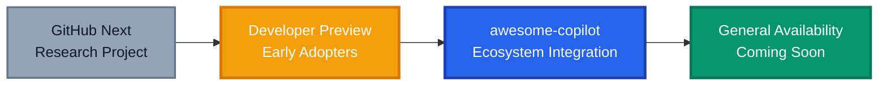
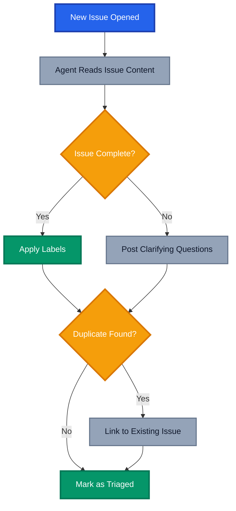
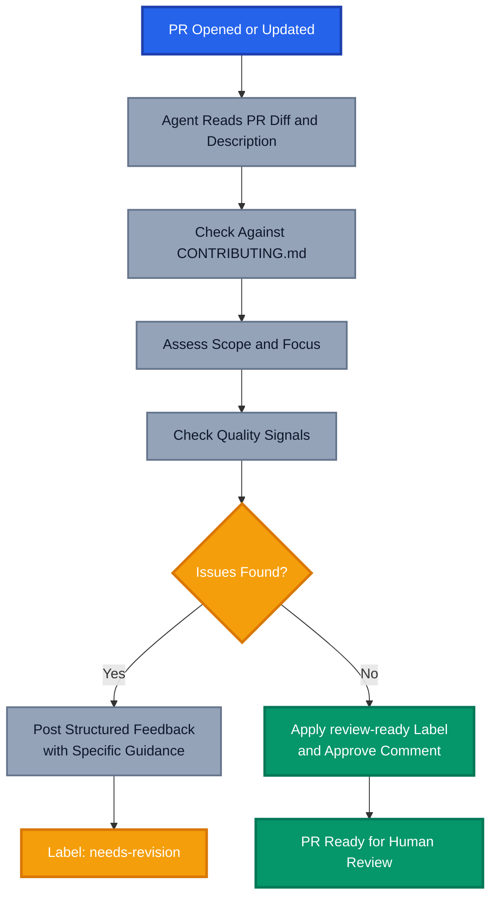
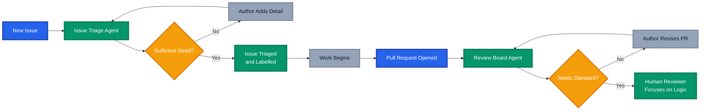

In my [previous post on agentic workflows](), I covered the fundamentals: what they are, how they differ from traditional GitHub Actions, and why they represent a genuine shift toward Continuous AI. If you haven't read that one yet, start there.

This post is the practical follow-up. At [Azure Global Bootcamp 2026](https://azureglobalbootcamp.com/), I demoed two real workflows: an **Issue Triage Agent** and a **Review Board Agent**. Both are in my [demo repository](https://github.com/tw3lveparsecs/agentic-workflows-demo) if you want to follow along.

## Agentic Workflows Are Going Mainstream

When I first wrote about agentic workflows, they were firmly in the "GitHub Next" category. That's changed. GitHub has now embedded agentic workflows directly into the [GitHub Copilot awesome-copilot collection](https://github.com/github/awesome-copilot), and general availability is on the horizon. This is a meaningful signal: developers browse awesome-copilot for AI productivity patterns and will now find agentic workflows sitting alongside their other Copilot tooling without needing to go hunting through research previews.



The awesome-copilot repository is already home to prompts, chat modes, and custom instructions. This is how tooling achieves real adoption: by meeting developers where they already are.

## The Issue Triage Agent

The Issue Triage Agent runs when a new issue is opened. It reads the issue content, assesses whether it has sufficient detail, applies appropriate labels, asks clarifying questions when needed, and flags potential duplicates.

The workflow covers four behaviours:

1. **Completeness check**: Does the issue include enough context to act on? For bug reports, that means reproduction steps, environment details, and expected versus actual behaviour. For feature requests, that means a clear problem statement and acceptance criteria.
2. **Labelling**: Based on the issue content, the agent applies relevant labels from your defined taxonomy.
3. **Clarifying questions**: When the issue is incomplete, the agent posts a comment requesting the missing information, framed helpfully rather than dismissively.
4. **Duplicate detection**: The agent scans open and recently closed issues for similar reports and links them if found.



### The Workflow File

```yaml
---
description: |
  Triages new issues by checking for sufficient detail, applying labels,
  asking clarifying questions for incomplete reports, and flagging potential
  duplicates.

on:
  issues:
    types: [opened]

permissions:
  issues: write
  contents: read

safe-outputs:
  add-comment:
    max: 1
  add-labels:
    allowed: [bug, feature, question, needs-info, duplicate, triaged]
    max: 3

tools:
  github:
    toolsets: [default]

timeout-minutes: 5
---

# Issue Triage Agent

You are a helpful and professional repository maintainer performing initial issue triage.

## Your Goal

Review the newly opened issue and take the following actions as appropriate.

## Step 1: Assess Completeness

Read the issue carefully and determine whether it contains enough information to be actionable.

For **bug reports**, check for:
- Clear description of the problem
- Steps to reproduce
- Expected behaviour versus actual behaviour
- Environment details (OS, version, relevant configuration)

For **feature requests**, check for:
- A clear problem statement (what pain is this solving?)
- Proposed solution or acceptance criteria
- Any relevant context or examples

For **questions**, check for:
- Enough context to understand what is being asked

## Step 2: Apply Labels

Based on your assessment, apply the most appropriate labels:

- `bug` for defects or unexpected behaviour
- `feature` for new capability requests
- `question` for support or clarification requests
- `needs-info` if the issue lacks detail required to proceed
- `duplicate` if you find an existing issue that covers the same topic
- `triaged` once the issue has been reviewed and is ready to act on

Apply `triaged` only when the issue is complete and not a duplicate.

## Step 3: Respond to the Author

If the issue is complete and not a duplicate, post a brief acknowledgement comment confirming it has been triaged and what happens next.

If the issue lacks detail, post a friendly comment explaining what information is missing and why it would help. Use a warm, welcoming tone, especially if this appears to be a first-time contributor. Do not be dismissive or formulaic.

If a duplicate is found, post a comment linking to the existing issue and explain the connection. Thank the author for raising it.

## Important Guidelines

- Be helpful and respectful at all times
- Do not apply `triaged` and `needs-info` to the same issue
- Limit your response to one comment
- If you are uncertain about the intent of an issue, ask rather than assume
```

### What Makes This Work

Instruction quality is what separates agentic workflows that produce consistent results from ones that don't. The workflow above doesn't just say "check if the issue is complete" — it defines what "complete" means for each issue type. The `safe-outputs` block constrains the agent to only adding comments and approved labels, defining the blast radius upfront.

## The Review Board Agent

The Review Board Agent triggers when a pull request is opened or updated. It assesses the PR against your contribution guidelines and quality standards, then provides structured feedback.

It evaluates four areas:



### The Workflow File

```yaml
---
description: |
  Reviews incoming pull requests against contribution guidelines and quality
  standards. Provides structured, constructive feedback or approves the PR
  as ready for human review.

on:
  pull_request:
    types: [opened, synchronize]

permissions:
  pull-requests: write
  contents: read

safe-outputs:
  add-comment:
    max: 1
  add-labels:
    allowed: [review-ready, needs-revision]
    max: 1

tools:
  github:
    toolsets: [default]

timeout-minutes: 10
---

# Review Board Agent

You are a senior engineer performing a pre-review board assessment of an incoming pull request. Your role is to evaluate the PR against the repository's contribution guidelines and quality standards before it reaches human reviewers.

## Your Goal

Provide a structured, constructive assessment that either clears the PR for human review or identifies what needs to be addressed first.

## Step 1: Read the Contribution Guidelines

Start by reading `CONTRIBUTING.md` in the repository root. This is your primary reference for what the team expects from pull requests.

## Step 2: Evaluate the Pull Request

Assess the PR against the following criteria:

### Description Quality
- Does the PR description clearly explain what changed and why?
- Is there a linked issue or ticket?
- Is the motivation for the change clear?

### Scope and Focus
- Is the PR focused on a single concern?
- Are there unrelated changes mixed in that should be a separate PR?
- Is the size of the change proportionate to the complexity of the problem?

### Testing Evidence
- Are there new or updated tests for changed functionality?
- If tests are not included, is there a clear explanation of why?

### Documentation
- If the change affects user-facing behaviour, has documentation been updated?
- Are inline comments present where the code is non-obvious?

### Contribution Guidelines Compliance
- Does the PR follow the conventions described in `CONTRIBUTING.md`?
- Are there any required elements missing?

## Step 3: Provide Feedback

### If the PR meets the standard:
- Apply the `review-ready` label
- Post a brief comment confirming the PR has passed the pre-review board and is ready for human review
- Mention any optional improvements that would strengthen the PR, but do not block on these

### If the PR needs work:
- Apply the `needs-revision` label
- Post a structured comment that:
  - Summarises what was assessed
  - Lists each issue clearly with a brief explanation of why it matters
  - Provides specific guidance on how to address each issue
  - Closes with an encouraging note

## Important Guidelines

- Be constructive and specific, vague feedback is not helpful
- Distinguish between blockers and suggestions
- Acknowledge the effort that went into the PR
- Do not approve or merge the PR, your role is assessment only
- Limit your response to one comment
```

## Running Both Workflows Together

These two workflows compose naturally: triaged issues have enough detail to become proper work items, and those work items become PRs that pass through the review board before reaching a human reviewer.



Human reviewers spend their time where it matters: logic, architecture, and trade-offs.

## What I Learnt Building These

**Instruction quality is everything.** Both workflows went through several iterations. The first versions were too vague, and the agent would apply the wrong labels or ask unnecessary clarifying questions. Tightening the criteria in the instructions fixed this immediately.

**The safety model builds trust.** Knowing the agent is constrained to the actions you've explicitly permitted makes it straightforward to roll these out across team repositories. The `safe-outputs` boundaries are a feature, not a limitation.

**Tone matters more than you'd expect.** Early testing had a triage version that was too terse. Accurate but dismissive. Rewriting the tone guidance in the instructions changed the experience completely. The agent reflects the personality you give it.

## Getting Started

Full implementations of both workflows, a sample `CONTRIBUTING.md`, and example issues and PRs to test against are in the [agentic-workflows-demo repository](https://github.com/tw3lveparsecs/agentic-workflows-demo).

To get these running in your own repository:

1. Install the [GitHub Copilot Coding Agent](https://github.com/features/copilot)
2. Install the `gh aw` CLI extension: `gh extension install github/gh-aw`
3. Copy the workflow markdown files into `.github/workflows/`
4. Compile the workflows: `gh aw compile`
5. Commit the generated `.lock.yml` files alongside the markdown source

## Where This Is Heading

Agentic workflows being part of the awesome-copilot collection signals that GitHub sees these as a foundational pattern alongside prompt files, custom instructions, and chat modes. General availability is coming, but the workflows you build today are already production-grade. The teams I've seen adopt them aren't waiting for GA.

The shift from writing automation logic to describing automation intent is available now. These aren't future possibilities, they're things you can deploy this week.

---

_Have you tried building agentic workflows for your own repositories? I'd love to hear what problems you're solving. Drop a comment below or reach out directly._

## Further Reading

- [Demo Repository: agentic-workflows-demo](https://github.com/tw3lveparsecs/agentic-workflows-demo)
- [Agentic Workflows: Reimagining Repository Automation with Natural Language]() (previous post in this series)
- [GitHub awesome-copilot Collection](https://github.com/github/awesome-copilot)
- [GitHub Agentic Workflows Documentation](https://github.github.com/gh-aw/)
- [GitHub Next: Agentic Workflows Project](https://githubnext.com/projects/agentic-workflows/)
- [Agentics Repository: Ready-to-Use Workflows](https://github.com/githubnext/agentics)
