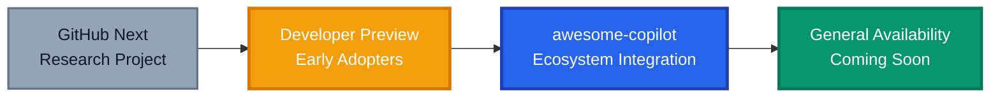
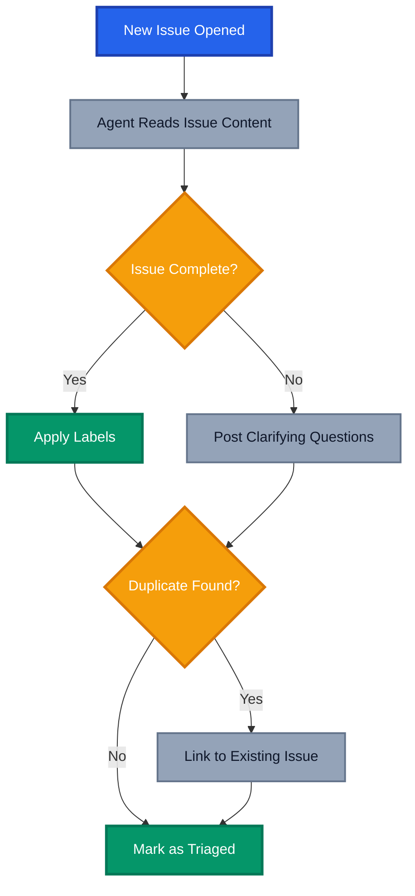
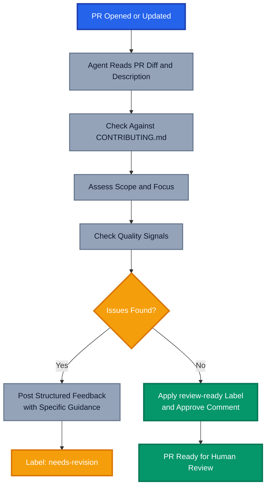
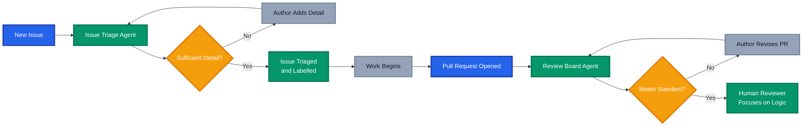

In my [previous post on agentic workflows](), I covered the fundamentals: what agentic workflows are, how they differ from traditional GitHub Actions, and why they represent a genuine shift toward Continuous AI in development. If you haven't read that one yet, it's worth starting there.

This post is the practical follow-up. At the [Azure Global Bootcamp 2026](https://azureglobalbootcamp.com/), I walked through two real agentic workflows I've been using: an **Issue Triage Agent** and a **Review Board Agent**. Both workflows are available in my [demo repository](https://github.com/tw3lveparsecs/agentic-workflows-demo) if you want to follow along or adapt them for your own projects.

But before diving into the implementations, there's something important to talk about: these workflows are no longer a niche experiment. They're becoming a core part of the GitHub ecosystem.

## Agentic Workflows Are Going Mainstream

When I first wrote about agentic workflows, they were firmly in the "GitHub Next" category, powerful and promising but still very much in preview. That's changed. GitHub has now embedded agentic workflows directly into the [GitHub Copilot website's awesome-copilot collection](https://github.com/github/awesome-copilot), and general availability is on the horizon.

This is a meaningful signal. GitHub doesn't add things to the awesome-copilot collection unless they're considered production-worthy patterns that teams should be using. The fact that agentic workflows have landed there tells you everything about the direction of travel.



The awesome-copilot repository is already home to a growing library of prompts, chat modes, and custom instructions. Adding agentic workflows to that collection creates a natural discovery path: developers browse for AI productivity patterns, find agentic workflows alongside their other Copilot tooling, and start putting them to work without needing to go hunting through research projects or preview documentation.

This is how developer tooling achieves real adoption. Not through mandates, but by meeting developers where they already are.

## The Two Workflows I Demoed

For the Azure Global Bootcamp session, I built two workflows that solve problems every team running a shared repository will recognise.

### Why These Two?

Issue triage is universally painful. New issues arrive with inconsistent detail, missing labels, or unclear priority. Someone on the team has to read each one, ask follow-up questions, apply labels, and route it appropriately. It's important work, but it's also repetitive cognitive overhead that compounds as your repository grows.

The review board problem is different but equally real. When pull requests arrive, someone needs to assess them against your contribution guidelines, architectural patterns, and quality standards. The feedback needs to be constructive, consistent, and timely. In practice, review quality varies depending on who's available and how much context they carry about the codebase.

Both problems have traditionally required either dedicated human attention or complex scripted automation that can't handle nuance. Agentic workflows change that equation.

## The Issue Triage Agent

The Issue Triage Agent runs automatically when a new issue is opened. It reads the issue content, assesses whether it has sufficient detail to be actionable, applies appropriate labels, asks clarifying questions when needed, and flags potential duplicates.

### What the Agent Does

The workflow covers four key behaviours:

1. **Completeness check**: Does the issue include enough context to act on? For bug reports, that means reproduction steps, environment details, and expected versus actual behaviour. For feature requests, that means a clear problem statement and acceptance criteria.
2. **Labelling**: Based on the issue content, the agent applies relevant labels from your defined taxonomy.
3. **Clarifying questions**: When the issue is incomplete, the agent posts a comment requesting the missing information, framed helpfully rather than dismissively.
4. **Duplicate detection**: The agent scans open and recently closed issues for similar reports and links them if found.



### The Workflow File

Here's the full triage workflow from the demo repository:

```yaml
---
description: |
  Triages new issues by checking for sufficient detail, applying labels,
  asking clarifying questions for incomplete reports, and flagging potential
  duplicates.

on:
  issues:
    types: [opened]

permissions:
  issues: write
  contents: read

safe-outputs:
  add-comment:
    max: 1
  add-labels:
    allowed: [bug, feature, question, needs-info, duplicate, triaged]
    max: 3

tools:
  github:
    toolsets: [default]

timeout-minutes: 5
---

# Issue Triage Agent

You are a helpful and professional repository maintainer performing initial issue triage.

## Your Goal

Review the newly opened issue and take the following actions as appropriate.

## Step 1: Assess Completeness

Read the issue carefully and determine whether it contains enough information to be actionable.

For **bug reports**, check for:
- Clear description of the problem
- Steps to reproduce
- Expected behaviour versus actual behaviour
- Environment details (OS, version, relevant configuration)

For **feature requests**, check for:
- A clear problem statement (what pain is this solving?)
- Proposed solution or acceptance criteria
- Any relevant context or examples

For **questions**, check for:
- Enough context to understand what is being asked

## Step 2: Apply Labels

Based on your assessment, apply the most appropriate labels:

- `bug` for defects or unexpected behaviour
- `feature` for new capability requests
- `question` for support or clarification requests
- `needs-info` if the issue lacks detail required to proceed
- `duplicate` if you find an existing issue that covers the same topic
- `triaged` once the issue has been reviewed and is ready to act on

Apply `triaged` only when the issue is complete and not a duplicate.

## Step 3: Respond to the Author

If the issue is complete and not a duplicate, post a brief acknowledgement comment confirming it has been triaged and what happens next.

If the issue lacks detail, post a friendly comment explaining what information is missing and why it would help. Use a warm, welcoming tone, especially if this appears to be a first-time contributor. Do not be dismissive or formulaic.

If a duplicate is found, post a comment linking to the existing issue and explain the connection. Thank the author for raising it.

## Important Guidelines

- Be helpful and respectful at all times
- Do not apply `triaged` and `needs-info` to the same issue
- Limit your response to one comment
- If you are uncertain about the intent of an issue, ask rather than assume
```

### What Makes This Work

The key isn't the YAML frontmatter, it's the instruction quality in the markdown body. Notice how the workflow doesn't just say "check if the issue is complete." It defines what "complete" actually means for each issue type, specifying exactly which elements to look for.

This specificity is what separates agentic workflows that work consistently from ones that produce patchy results. You're not programming conditional logic, you're giving the agent enough context to make good judgements. The more precisely you describe what good looks like, the more reliably the agent performs.

The `safe-outputs` section also deserves attention. The agent can only add comments and apply labels from the approved list. It cannot close issues, delete content, or take any other action outside those boundaries. This is the safety model in action: you define the blast radius upfront, and the agent works within it.

## The Review Board Agent

The Review Board Agent is triggered when a pull request is opened or updated. It assesses the PR against your repository's contribution guidelines and architectural standards, then provides structured feedback.

### What the Agent Does

The review board concept comes from formal architecture review processes, where a panel evaluates proposals against a defined set of criteria before they're accepted. Translated to a development workflow, it looks like this:

1. **Guidelines check**: Does the PR follow your `CONTRIBUTING.md`? Does it include the required elements (description, testing evidence, linked issues)?
2. **Scope assessment**: Is the PR focused on a single concern, or is it a sprawling change that mixes unrelated work?
3. **Quality signals**: Are there obvious patterns missing, like tests for new functionality or documentation updates for changed behaviour?
4. **Constructive feedback**: Where issues are found, the agent explains why they matter and what a good fix looks like.



### The Workflow File

```yaml
---
description: |
  Reviews incoming pull requests against contribution guidelines and quality
  standards. Provides structured, constructive feedback or approves the PR
  as ready for human review.

on:
  pull_request:
    types: [opened, synchronize]

permissions:
  pull-requests: write
  contents: read

safe-outputs:
  add-comment:
    max: 1
  add-labels:
    allowed: [review-ready, needs-revision]
    max: 1

tools:
  github:
    toolsets: [default]

timeout-minutes: 10
---

# Review Board Agent

You are a senior engineer performing a pre-review board assessment of an incoming pull request. Your role is to evaluate the PR against the repository's contribution guidelines and quality standards before it reaches human reviewers.

## Your Goal

Provide a structured, constructive assessment that either clears the PR for human review or identifies what needs to be addressed first.

## Step 1: Read the Contribution Guidelines

Start by reading `CONTRIBUTING.md` in the repository root. This is your primary reference for what the team expects from pull requests.

## Step 2: Evaluate the Pull Request

Assess the PR against the following criteria:

### Description Quality
- Does the PR description clearly explain what changed and why?
- Is there a linked issue or ticket?
- Is the motivation for the change clear?

### Scope and Focus
- Is the PR focused on a single concern?
- Are there unrelated changes mixed in that should be a separate PR?
- Is the size of the change proportionate to the complexity of the problem?

### Testing Evidence
- Are there new or updated tests for changed functionality?
- If tests are not included, is there a clear explanation of why?

### Documentation
- If the change affects user-facing behaviour, has documentation been updated?
- Are inline comments present where the code is non-obvious?

### Contribution Guidelines Compliance
- Does the PR follow the conventions described in `CONTRIBUTING.md`?
- Are there any required elements missing?

## Step 3: Provide Feedback

### If the PR meets the standard:
- Apply the `review-ready` label
- Post a brief comment confirming the PR has passed the pre-review board and is ready for human review
- Mention any optional improvements that would strengthen the PR, but do not block on these

### If the PR needs work:
- Apply the `needs-revision` label
- Post a structured comment that:
  - Summarises what was assessed
  - Lists each issue clearly with a brief explanation of why it matters
  - Provides specific guidance on how to address each issue
  - Closes with an encouraging note

## Important Guidelines

- Be constructive and specific, vague feedback is not helpful
- Distinguish between blockers and suggestions
- Acknowledge the effort that went into the PR
- Do not approve or merge the PR, your role is assessment only
- Limit your response to one comment
```

### The Value of Consistent Pre-Review

What I've found running this workflow on my own repositories is that it catches a class of PR problems that human reviewers tend to let slide when they're busy: missing issue links, absent test plans, descriptions that say "made some changes" without any context. These aren't complex judgements, they're checklist items. But checklists get skipped when everyone is under pressure.

The Review Board Agent doesn't get tired and doesn't skip items. It applies the same standard to every PR, which has the secondary effect of educating contributors. When someone receives clear, consistent feedback about what's expected, they internalise it. Over time, the quality of incoming PRs improves because contributors know what the bar looks like.

## Running Both Workflows Together

These two workflows compose naturally. Issues get triaged cleanly, which means the ones that progress to become work items have enough detail. Work items that become PRs then pass through the review board before consuming human review time. The result is a pipeline where quality gates operate earlier and at lower cost.



Human reviewers spend their time where it matters: evaluating logic, architecture, and trade-offs. Not checking whether a PR description exists.

## What I Learnt Building These

A few things stood out during the bootcamp session and in the lead-up to building these workflows.

**Instruction quality is the variable that matters most.** Both workflows went through several iterations before producing consistently good results. The first versions were too vague. The agent would sometimes apply the wrong labels or ask for clarifications that weren't actually needed. Each revision tightened the instructions, made the criteria more explicit, and the output quality improved noticeably.

**The safety model builds trust.** Knowing the agent can only perform the actions you've explicitly permitted makes it much easier to roll these out to team repositories without lengthy approval processes. The `safe-outputs` boundaries are a genuine feature, not a limitation.

**Contributors respond well to agent feedback when the tone is right.** Early testing with the triage workflow had a version that was too terse. The feedback was accurate but felt dismissive. Rewriting the tone guidance in the instructions fixed this immediately. The agent reflects the personality you give it.

**These aren't replacements for human judgement.** The triage agent flags issues and asks questions. The review board agent assesses against defined criteria. Neither makes architectural decisions or exercises the kind of contextual judgement that experienced engineers bring. They're amplifiers, handling the routine so humans can focus on the nuanced.

## Getting Started with the Demo Repo

The full implementations of both workflows, along with a sample `CONTRIBUTING.md` and example issues and PRs to test against, are available in the [agentic-workflows-demo repository](https://github.com/tw3lveparsecs/agentic-workflows-demo).

To get these running in your own repository:

1. Install the [GitHub Copilot Coding Agent](https://github.com/features/copilot)
2. Install the `gh aw` CLI extension: `gh extension install github/gh-aw`
3. Copy the workflow markdown files into `.github/workflows/`
4. Compile the workflows: `gh aw compile`
5. Commit the generated `.lock.yml` files alongside the markdown source

That's it. The workflows activate on the triggers you've defined and start running the next time an issue is opened or a PR is created.

## Where This Is Heading

The fact that agentic workflows are now part of the awesome-copilot collection isn't just a distribution story. It signals that GitHub sees these as a foundational pattern in the Copilot ecosystem, sitting alongside prompt files, custom instructions, and chat modes as tools every team should have access to.

General availability will bring better tooling, broader model support, and deeper integration with GitHub's existing automation surfaces. But the workflows you build today are already production-grade. The teams I've seen adopt them aren't waiting for GA, they're already running triage and review workflows in active repositories and seeing the benefits.

The shift from writing automation logic to describing automation intent is real, and it's available now. The Azure Global Bootcamp was a good reminder that these aren't future possibilities, they're things you can deploy this week.

---

_Have you tried building agentic workflows for your own repositories? I'd love to hear what problems you're solving and how your instruction writing has evolved. Drop a comment below or reach out directly._

## Further Reading

- [Demo Repository: agentic-workflows-demo](https://github.com/tw3lveparsecs/agentic-workflows-demo)
- [Agentic Workflows: Reimagining Repository Automation with Natural Language]() (previous post in this series)
- [GitHub awesome-copilot Collection](https://github.com/github/awesome-copilot)
- [GitHub Agentic Workflows Documentation](https://github.github.com/gh-aw/)
- [GitHub Next: Agentic Workflows Project](https://githubnext.com/projects/agentic-workflows/)
- [Agentics Repository: Ready-to-Use Workflows](https://github.com/githubnext/agentics)
