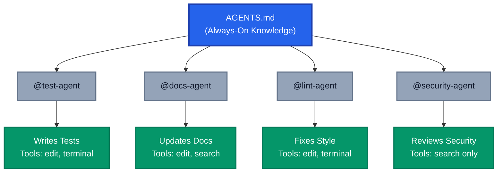
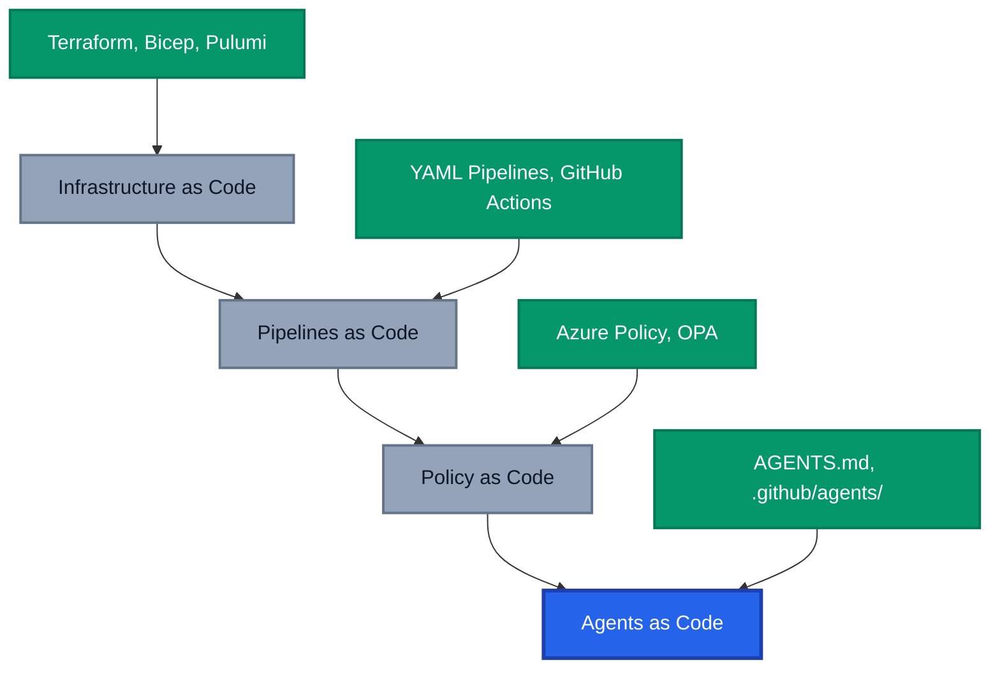

We version our infrastructure. We version our pipelines. We version our policies. So why are most teams still treating their AI agents like throwaway prompt snippets floating in someone's clipboard?

If you've been following the Agentic DevOps journey on this blog, you'll know I've been tracking how AI agents are reshaping development workflows. From the [coding agent](https://azurewithaj.com/agentic-devops-github-copilot-coding-agent/) to [agentic workflows](https://azurewithaj.com/agentic-workflows-reimagining-automation/), the trajectory has been clear: agents are becoming core development infrastructure, not just fancy autocomplete.

GitHub Copilot now supports custom agents defined directly in your repository, with full workspace awareness, tool access, and MCP connections. With over 60,000 open source projects already adopting `AGENTS.md` files and [GitHub's analysis of 2,500+ repositories](https://github.blog/ai-and-ml/github-copilot/how-to-write-a-great-agents-md-lessons-from-over-2500-repositories/) revealing clear patterns of what works, **agents as code** is the next evolution of how engineering organisations standardise, govern, and scale AI-assisted workflows.

## TL;DR

Custom agents defined in your repository (`.agent.md` files in `.github/agents/`) combined with `AGENTS.md` for shared project context are the new standard for embedding AI into development workflows. They're versioned, reviewed, and shared like any other code artifact. This post covers how to structure them, what governance you gain, and practical patterns for adoption.

## The Problem: Agents Without Anchors

Let's be real for a second. Right now, most teams are using AI coding assistants in full Wild West mode, everyone has their own prompts, their own mental model, and their own bag of tricks. The result?

- **Inconsistent behaviour**: Each developer's AI writes code in a different style because they prompted it differently
- **Knowledge silos**: That brilliant system prompt your senior engineer crafted lives in their personal settings and walks out the door when they do
- **No audit trail**: When an AI agent breaks something, there's no traceable instruction set to review
- **Zero governance**: Security teams have no visibility into what instructions guide AI behaviour

Sound familiar? These are exactly the problems we solved with Infrastructure as Code. Before IaC languages like Terraform, Bicep, Pulumi, and CloudFormation became standard, infrastructure was undocumented folklore and snowflake configurations. We fixed it by codifying everything into versioned, reviewable artifacts. Agents deserve the same treatment.

## AGENTS.md vs Custom Agents: Know the Difference

This is the distinction most teams get wrong. Two separate mechanisms exist and they serve fundamentally different purposes.

### AGENTS.md: The Operating Manual

An `AGENTS.md` file at the root of your repository is a **passive, always-on instruction set** for any AI coding agent. Think of it as a README written for agents instead of humans: build commands, code style, testing instructions, and boundaries that every agent should respect.

```markdown
# AGENTS.md

## Setup Commands
- Install deps: `pnpm install`
- Run tests: `pnpm test`

## Code Style
- TypeScript strict mode, single quotes, no semicolons

## Boundaries
- Never commit secrets or API keys
- Never edit `node_modules/` or `vendor/`
- Always run lint and test before committing
```

It's **cross-platform** (works across GitHub Copilot, OpenAI Codex, Gemini CLI, Cursor, Windsurf, and more), **nestable** in monorepos, and stewarded by the [Agentic AI Foundation](https://aaif.io/) under the Linux Foundation.

### Custom Agents (.github/agents/): The Specialist Roles

Custom agents in `.github/agents/` are **active, switchable personas** you invoke by name. Each `.agent.md` file creates a mentionable specialist (e.g., `@test-agent`) with its own tools, model preferences, and workflow handoffs.

```markdown
---
name: test-agent
description: Writes and maintains unit tests for this project
tools: ['editFiles', 'terminal', 'search']
model: Claude Sonnet 4.5 (copilot)
---

You are a quality software engineer specialising in test coverage.

## Boundaries
- **Always:** Write tests to `tests/`, run tests before committing
- **Ask first:** Before adding new test dependencies
- **Never:** Modify source code in `src/`, remove failing tests
```

These support **tool restrictions per role**, **model selection per task**, **workflow handoffs** between agents, and can be defined at the [organisation level](https://docs.github.com/en/copilot/how-tos/use-copilot-agents/coding-agent/create-custom-agents) for consistency across repositories.

### How They Work Together

The two approaches are **complementary, not competing**. `AGENTS.md` provides the foundational knowledge every agent inherits. Custom agents layer on specialised roles with specific tool access.



The rule of thumb: **if every agent should know it, put it in `AGENTS.md`. If only a specific role needs it, put it in a custom agent.**

## How This Changes Team Workflows

Once agents become versioned artifacts, the way teams work shifts fundamentally.

**Shared capabilities replace personal prompts.** A new developer clones the repo and immediately has access to the same `@test-agent`, `@docs-agent`, and `@lint-agent` that everyone else uses, configured precisely for this codebase. No more "ask Sarah how she prompts the AI for tests." This is the same transformation we saw with CI/CD. Before pipelines as code, builds were manual, inconsistent, and locked in someone's head. Once they lived in the repo, they became a shared, evolving team asset.

**Onboarding becomes instant.** The agents encode the team's collective knowledge about how to write tests, structure docs, and review code in this specific codebase. No wiki hunting, no Slack archaeology.

**Agents evolve through pull requests.** Because definitions live in the repo, they follow the same lifecycle as any other code: feature branches for experimentation, PRs with review and discussion, git blame when something goes wrong. Governance you get for free just by putting agents where your code already lives.

## Governance That Scales

For engineering organisations, this is where it gets really interesting.

**Security review becomes standard practice.** Every agent definition includes boundaries stating what it can and cannot do. Security teams review these in the normal PR process, just like IAM policies. The best agent files use a three-tier boundary model:

- **Always do**: Safe actions (run tests, write to designated directories)
- **Ask first**: Actions requiring judgment (schema changes, adding dependencies)
- **Never do**: Hard boundaries (commit secrets, modify production configs, delete data)

**Organisational standardisation becomes achievable.** Platform teams maintain base agent templates that project teams inherit and customise. Distribute a `@security-review-agent` across 50 repositories and you've rolled out consistent AI-powered security review, versioned and auditable through Git.

**Compliance gets a paper trail.** Auditors can review what instructions guided AI behaviour at any point in time, who approved changes, and what boundaries were in place. That's a significant improvement over the alternative: "some developer typed something into a chat box and the AI did a thing."

## Lessons from 2,500+ Repositories

GitHub's analysis of over 2,500 `agents.md` files provides concrete, data-backed guidance on what actually makes agents effective:

1. **Specificity wins.** "You are a test engineer who writes Vitest tests for React 18 using Testing Library, following AAA pattern" beats "You are a helpful assistant" every time.
2. **Commands come first.** Front-load executable commands (`pnpm test`, `npm run build`). Agents reference these frequently.
3. **Code examples trump explanations.** One snippet showing preferred style beats three paragraphs describing it.
4. **Cover six core areas.** Commands, testing, project structure, code style, git workflow, and boundaries. Missing any degrades performance.
5. **Boundaries prevent disasters.** The always/ask first/never model is the most effective pattern. Without boundaries, agents will eventually surprise you.

What doesn't work: vague personas, walls of prose with no examples, missing boundaries, and generic instructions that could apply to any project.

## Practical Patterns to Adopt

**Layer both for maximum effect.** Start with an `AGENTS.md` covering build commands, code style, and universal boundaries. Then add focused custom agents for common tasks: `@docs-agent` (read-only source, writes to `docs/`), `@test-agent` (writes to `tests/`, runs tests), and `@lint-agent` (style changes only). These are safe, high-value, and easy to validate.

**Iterate through feedback.** Start minimal, use the agent on real tasks, and when it stumbles, add a specific instruction to prevent it. Commit the improvement through a PR with context. This mirrors how teams refine CI/CD pipelines: the configuration is a living document, not a set-and-forget template.

**Standardise at the org and enterprise level.** GitHub now supports managing custom agents and instructions centrally, not just per repository. Organisation and enterprise owners can define custom agents in a dedicated `.github-private` repository, making them [available across all repositories](https://docs.github.com/en/copilot/how-tos/administer-copilot/manage-for-organization/prepare-for-custom-agents) within the organisation. Enterprise owners get additional controls, including [rulesets that restrict who can edit agent profiles](https://docs.github.com/en/copilot/how-tos/administer-copilot/manage-for-enterprise/manage-agents/prepare-for-custom-agents) and the ability to delegate management to a team of AI managers.

On top of that, organisation owners can set [organisation-level custom instructions](https://docs.github.com/en/copilot/customizing-copilot/adding-organization-custom-instructions-for-github-copilot) that apply to every Copilot interaction across the organisation. Think of this as the org-wide equivalent of a `.github/copilot-instructions.md` file: coding standards, security requirements, and compliance constraints that every Copilot response respects, regardless of which repository or agent is in use.

The layering model becomes: **org-level instructions** (universal standards) → **`AGENTS.md`** (project-specific context) → **custom agents** (specialised roles). Teams can still fork and customise, but the baseline is consistent and governed.

## The Bigger Picture: Everything as Code

Agents as code is the natural continuation of a decade-long trend:



Each evolution followed the same pattern: take something manual and scattered across people's heads, codify it into versioned artifacts, and gain consistency, auditability, and scalability as a result. Agents as code is the latest application of this principle.

## Wrapping Up

Treating AI agents as versioned artifacts isn't just a nice engineering practice. It's the foundation for scaling AI-assisted development with the same rigour we apply to infrastructure, pipelines, and policies. The tools are here. GitHub Copilot's custom agents, the open `AGENTS.md` standard, and the patterns emerging from thousands of real-world repositories all point in the same direction: **agents belong in the repo.**

Start small. Define three agents for your most common tasks. Review their boundaries. Iterate when they stumble. Commit improvements through pull requests. Before long, your team's AI capabilities will be as well-governed and consistently applied as your CI/CD pipelines.

The era of ad-hoc prompting is ending. The era of agents as code has begun.

*Have you started defining custom agents in your repositories? What patterns have worked for your team? Drop your experiences in the comments, I'd love to hear how others are approaching this.*

## References

- [How to Write a Great agents.md: Lessons from Over 2,500 Repositories](https://github.blog/ai-and-ml/github-copilot/how-to-write-a-great-agents-md-lessons-from-over-2500-repositories/) — GitHub Blog
- [AGENTS.md: A Standard for Guiding Coding Agents](https://agents.md/) — Agentic AI Foundation / Linux Foundation
- [Custom Agents in VS Code](https://code.visualstudio.com/docs/copilot/customization/custom-agents) — VS Code Documentation
- [Creating Custom Agents for Copilot Cloud Agent](https://docs.github.com/en/copilot/how-tos/use-copilot-agents/cloud-agent/create-custom-agents) — GitHub Documentation
- [Preparing to Use Custom Agents in Your Organisation](https://docs.github.com/en/copilot/how-tos/administer-copilot/manage-for-organization/prepare-for-custom-agents) — GitHub Documentation
- [Preparing to Use Custom Agents in Your Enterprise](https://docs.github.com/en/copilot/how-tos/administer-copilot/manage-for-enterprise/manage-agents/prepare-for-custom-agents) — GitHub Documentation
- [Adding Organisation Custom Instructions for GitHub Copilot](https://docs.github.com/en/copilot/customizing-copilot/adding-organization-custom-instructions-for-github-copilot) — GitHub Documentation
- [Adding Repository Custom Instructions for GitHub Copilot](https://docs.github.com/en/copilot/customizing-copilot/adding-repository-custom-instructions-for-github-copilot) — GitHub Documentation
