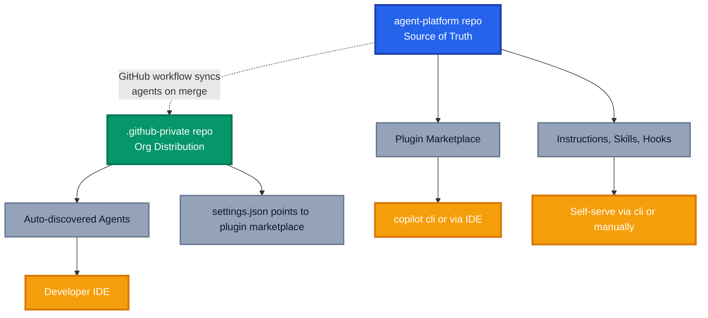

If you're trying to organise GitHub Copilot customisations across an enterprise, the hardest part usually is not creating the agent or the skill. It's deciding where everything should live, how it should be shared, and which pieces should appear automatically versus stay self serve.

After untangling this for my own org, and losing a few hours to one buried prerequisite, I landed on a pattern that is simple enough to operate and structured enough to scale. One source of truth for every customisation, automatic distribution for agents, and marketplace based self serve for everything else.

This post focuses on that operating model. It is not a full catalogue of every Copilot customisation feature, but a practical pattern for organising them in a way platform teams can actually manage.

## TL;DR

Use **two repositories** with **automation** connecting them. A central `agent-platform` repository holds every supported customisation, and acts as your **Copilot plugin marketplace**. A second repository named `.github-private` distributes a curated set of approved agents automatically to every user. A GitHub Actions workflow syncs and flattens those agents on merge, while plugins remain available through the marketplace for optional install.

I validated the behaviour described here against GitHub Copilot enterprise features available in May 2026, because this area is moving quickly and the finer points of distribution can change.

## The Confusion Nobody Talks About

GitHub Copilot has quietly grown a sprawling customisation surface. In the last year alone we've gained:

- Custom agents (`.agent.md`)
- Instruction files (`.instructions.md` and `copilot-instructions.md`)
- Skills (`SKILL.md` bundles)
- Hooks
- Plugins and plugin marketplaces
- `AGENTS.md` for shared project context

Each one has its own discovery rules. Some are repo scoped, some are user scoped, some are org scoped, and some only appear if you enable a setting buried three menus deep. Teams end up with customisations scattered across personal directories, workspaces, teams channels, and probably some other hidden treasure trove nobody can find.

The question I kept asking myself is simple. **Where should this stuff live, and how do I share it across the org without asking every developer to clone five repos?**

## The Pattern: One Source of Truth, Two Distribution Channels

The answer is to separate **storage** from **distribution**. Store everything in one place, then use the right GitHub mechanism to distribute each type.



### Repo 1: `agent-platform` (Source of Truth)

This is where every customisation in your org actually lives. It's a normal repository, structured however makes sense for your team, and it doubles as a **Copilot plugin marketplace**.

A workable layout:

```text
agent-platform/
├── agents/                   # All custom agents (full versioned set)
│   ├── azure-architect/
│   │   ├── azure-architect.agent.md
│   │   └── README.md
│   └── engagement-builder/
├── instructions/             # .instructions.md files
├── skills/                   # Reusable SKILL.md bundles
│   ├── waf-review/
│   │   └── SKILL.md
│   └── bicep-refactor/
├── hooks/                    # Hook scripts
├── plugins/                  # Composable plugins published through the marketplace 
└── .github
    ├── plugin
        ├── marketplace.json  # Plugin marketplace manifest
```

Everything is versioned, reviewed via pull requests, and owned by a CODEOWNERS rule. This is the repo your platform team curates. Everything else flows from here.

### Repo 2: `.github-private` (Automatic Org Distribution)

GitHub treats a repository named `.github-private` in your organisation as a magic distribution channel for Copilot custom agents. Any `.agent.md` file in `.github-private/agents/` automatically appears in every org member's IDE agent picker. No cloning, no installing, no settings to flip on the user side.

This is brilliant, and it has one caveat that will absolutely bite you.

> **The flat structure rule**: `.github-private/agents/` only supports **top level `.agent.md` files**. Nested folders are ignored. If you put `.github-private/agents/azure/architect.agent.md`, it will silently fail to surface.

So `.github-private` looks like this:

```text
.github-private/
├── agents/
│   ├── azure-architect.agent.md       # Surfaces automatically
│   ├── engagement-builder.agent.md    # Surfaces automatically
│   └── code-reviewer.agent.md         # Surfaces automatically
└── .github
    ├── copilot
        ├── settings.json              # Pointer to your plugin marketplace in the agent-platform repo
```

This repo mirrors a **curated subset** of what lives in `agent-platform`. We can also configure a GitHub workflow to automatically sync agents from `agent-platform` into `.github-private` when they're merged and approved, eliminating manual copy-paste and ensuring `.github-private` always stays in sync with the source of truth.

## Linking the Two Repos via the Plugin Marketplace

The `settings.json` in `.github-private` is what stitches it all together. It tells Copilot CLI in every org member's environment where to find your plugin marketplace.

```json
{
  "extraKnownMarketplaces": {
    "MARKETPLACE-NAME": {
      "source": {
        "source": "github",
        "repo": "OWNER/REPO"
      }
    }
  },
  "enabledPlugins": {
    "PLUGIN-NAME@MARKETPLACE-NAME": true
  }
}

```

Once enabled, developers using Copilot CLI can browse and install plugins directly from your marketplace:

```bash
# List available plugins from the org marketplace
copilot plugin marketplace browse MARKETPLACE-NAME

# Install a plugin
copilot plugin install azure-waf-reviewer@MARKETPLACE-NAME
```

For the full marketplace schema and enterprise governance options, see the GitHub docs on [configuring enterprise plugin standards](https://docs.github.com/en/copilot/how-tos/administer-copilot/manage-for-enterprise/manage-agents/configure-enterprise-plugin-standards).

## Referencing Skills and Templates from Agents

Because skills and supporting assets live in `agent-platform` rather than `.github-private`, your distributed agents need a way to pull them in. Two patterns work well.

**Raw GitHub URL references** in the agent definition:

```markdown
---
name: azure-architect
description: Reviews Azure designs against the Well Architected Framework
---

When asked to review an architecture, fetch and apply the WAF review skill:
https://raw.githubusercontent.com/acme/agent-platform/main/skills/waf-review/SKILL.md

Use the bicep refactor skill for any IaC changes:
https://raw.githubusercontent.com/acme/agent-platform/main/skills/bicep-refactor/SKILL.md
```

This pattern is simple, but it depends on the consuming environment being able to read those raw URLs. If `agent-platform` is private, or your enterprise network controls block that access path, package the skill inside a plugin instead. In practice, raw URLs are best for lightweight and openly reachable assets, while plugins are the safer default for governed enterprise distribution.

**Plugin bundles** for anything more complex than a single skill. Bundle the agent, its instructions, skills, and hooks together as a plugin in your marketplace and let developers install the whole package with one command.

## The Caveat That Cost Me Hours

Here's the bit that cost me hours. You can set up `.github-private`, configure `settings.json`, push perfectly formed `.agent.md` files, and **nothing will appear**. No error, no warning, no clue.

The reason: custom agents in `.github-private` only surface if your enterprise has explicitly enabled the org for custom agents in **AI controls**. By default, no org is enabled.

To turn it on:

1. Navigate to your enterprise (from the Enterprises page on GitHub.com).
2. At the top of the page, click **AI controls**.
3. In the **Custom agents** section, select the **Select organization** dropdown.
4. Click the organisation that contains your `.github-private` repo.

That's it. The moment you enable the org, agents start appearing in IDEs across your tenant. Full details are in the GitHub docs on [preparing for custom agents](https://docs.github.com/en/copilot/how-tos/administer-copilot/manage-for-enterprise/manage-agents/prepare-for-custom-agents#enabling-and-protecting-custom-agents-in-your-enterprise).

If you remember nothing else from this post, remember this step. It's the difference between a working rollout and a confusing afternoon staring at empty agent pickers.

## Governance and Ownership

A pattern this powerful needs a few guardrails.

- **CODEOWNERS** on `agent-platform` so every agent change is reviewed by the platform team
- **Branch protection** on `.github-private` to prevent drift since it's generated by workflow automation
- **GitHub workflow** with automated sync that copies vetted agents from `agent-platform` to `.github-private` on merge, with optional filtering by agent tags or directories
- **Workflow approval gates** so sync only happens after maintainer review (optional but recommended for production orgs)
- **Versioning** on all supported copilot customisations so consumers can pin or upgrade deliberately

This mirrors how mature platform teams treat shared infrastructure modules. Agents are infrastructure for developer productivity. Treat them like it.

## Wrapping Up

The reason teams struggle with Copilot customisations isn't because the features are bad. It's because there's no opinionated guidance on **where things should live** and **how they should reach developers**. The pattern I've laid out, one `agent-platform` repo as source of truth, one `.github-private` repo for automatic distribution, and a plugin marketplace stitching them together, gives you the best of both worlds. Centralised governance and frictionless adoption.

If you want to go deeper, the official docs on [preparing for custom agents](https://docs.github.com/en/copilot/how-tos/administer-copilot/manage-for-enterprise/manage-agents/prepare-for-custom-agents) and [configuring enterprise plugin standards](https://docs.github.com/en/copilot/how-tos/administer-copilot/manage-for-enterprise/manage-agents/configure-enterprise-plugin-standards) are essential reading. And if you haven't yet, check out my earlier post on [Agents as Code](https://azurewithaj.com/agents-as-code-versioned-artifacts/) for the philosophy behind treating agents as first class engineering artifacts.

_How is your org organising Copilot customisations today? Have you hit the flat structure rule or the AI controls gotcha? Share your war stories in the comments, I would love to hear them._
