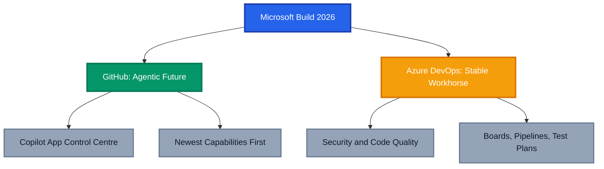
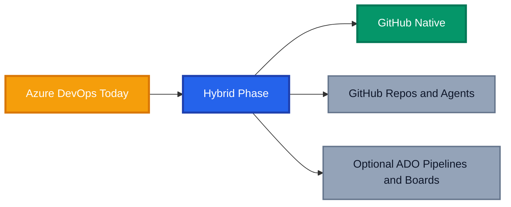

The question I get asked more than almost any other right now is deceptively simple. Azure DevOps vs GitHub, which one should we be standing on in 2026? It used to be a tooling preference. After Microsoft Build 2026, it is a strategy decision.

The short version is that both platforms are alive and supported, but only one of them is where the future is being built. If you read the Microsoft Build 2026 announcements closely, Microsoft drew a line as clean as a lightsaber cut. GitHub is the home of agentic development, and Azure DevOps is the stable, well supported workhorse that keeps doing its job without chasing the frontier.

This post unpacks what was actually announced, what it means for your teams, and how to plan a migration that does not blow up your delivery in the process. No hype, just the practical read.

## TL;DR

- **GitHub** is now the agent native control centre for planning, coding, review, security, and agents.
- **Azure DevOps** continues with incremental improvements, with Microsoft committed to improving code quality in pull requests and helping developers remediate security issues faster. Boards, Pipelines, and Test Plans are not going anywhere.
- Microsoft recommends a **hybrid model**, GitHub repositories with optional Azure DevOps orchestration.
- **Enterprise Live Migrations (ELM)** now enable low downtime repository moves from Azure DevOps to GitHub.
- Azure DevOps basic usage rights are included with **GitHub Enterprise**, so you are not paying twice to run both.
- The industry is shifting from DevOps to **Agentic DevOps**, and your platform choice should reflect that.

## The Real Difference in 2026

For years the comparison was feature for feature. Repos, pipelines, boards, artefacts. Both platforms covered the basics, so teams picked based on history, cost and habit. That framing is now out of date.

The real difference today is intent. GitHub is being built as an AI native platform where agents are first class participants in the software lifecycle. Azure DevOps is being maintained as a mature, predictable suite that prioritises stability over novelty. Neither position is wrong, but they pull in different directions.

If your strategy depends on AI agents doing meaningful work across planning, code, and review, the gap between the two platforms is now wide and growing.

## What Microsoft Really Announced at Build 2026

Build 2026 was not subtle about direction. The headline was that GitHub is the home of agentic development, and the rest of the announcements reinforced it.

### The GitHub Copilot App as the Control Centre

The standout was the GitHub Copilot app positioned as the agent native control centre. Instead of treating agents as a feature bolted onto an editor, the Copilot app becomes the place where you assign work, watch agents collaborate, review their output, and ship the result.

This builds directly on the Agent HQ vision I covered in [Welcome Home, Agents](https://azurewithaj.com/welcome-home-agents). The difference in 2026 is maturity. What felt experimental last year now feels like the default way of working.

### GitHub Gets the Newest Capabilities First

The pattern across the announcements was consistent. The newest capabilities across planning, coding, review, security, and agents land on GitHub first. Agentic planning, autonomous code review, security remediation by agents, and tighter agent collaboration are all GitHub stories.

This is the part engineering leaders need to sit with. It is not that Azure DevOps is being switched off. It is that the innovation budget is clearly pointed at GitHub.

### Azure DevOps Keeps Calm and Carries On

Azure DevOps was not abandoned, and that matters. Microsoft confirmed continued investment, with a clear focus on improving code quality in pull requests and helping developers remediate security issues faster, rather than chasing new frontier features.

Critically, teams can keep using Azure Boards, Azure Pipelines, and Azure Test Plans. If those tools fit how your organisation runs, you are not being forced off them. They remain supported, hardened, and dependable.

## When to Use Each Platform

So how do you choose? Rather than a religious war, think about where each platform earns its place.

**Lean towards GitHub when you want to:**

- Put AI agents at the centre of planning, coding, and review
- Adopt new capabilities as soon as they ship
- Standardise on a single platform for code, security, and collaboration
- Attract engineers who expect a modern, agent native experience

**Stay comfortable with Azure DevOps when you:**

- Rely heavily on Azure Boards for established planning and reporting
- Have mature, business critical Azure Pipelines you do not want to disturb
- Depend on Azure Test Plans for structured, manual test management
- Need a stable surface while you plan a measured transition

The honest summary is this. GitHub is where you invest for the future, and Azure DevOps is where you protect what already works. This is not about choosing a hero and a villain, both have a job to do.

## The Industry Shift: DevOps to Agentic DevOps

None of this happens in a vacuum. The bigger story is the shift from DevOps to Agentic DevOps, a theme I have been tracking since [DevOps: Dead or Evolved](https://azurewithaj.com/devops-dead-or-evolved).

Traditional DevOps automated the pipeline. Agentic DevOps puts intelligent agents inside the workflow, taking on planning, code changes, reviews, and remediation as active collaborators.

When you frame Azure DevOps vs GitHub through that lens, the choice becomes clearer. You are not just picking a repository host. You are deciding how ready your platform is for agents to do real work.

## A Pragmatic Hybrid Migration Path

Here is the reassuring part. You do not have to rip and replace. Microsoft is recommending a hybrid model, and it is genuinely sensible.

The pattern is GitHub repositories for code, security, and agents, with optional Azure DevOps orchestration where Pipelines or Boards still add value. Your source of truth moves to GitHub, while the orchestration you trust keeps running until you are ready to consolidate.

Two announcements make this practical. First, Azure DevOps basic usage rights are included with GitHub Enterprise, so running both during a transition does not double your bill. Second, Enterprise Live Migrations now enable low downtime repository migration from Azure DevOps to GitHub, which removes the classic fear of a big bang cutover.

A migration that respects your delivery looks roughly like this.

1. **Assess and prioritise.** Map your repositories, pipelines, and boards, then rank them by risk and value.
2. **Move code first.** Use Enterprise Live Migrations to bring repositories across with low downtime, starting with lower risk projects.
3. **Run hybrid deliberately.** Keep Azure Pipelines or Boards orchestrating while the team settles into GitHub.
4. **Introduce agents.** Turn on agentic planning, coding, and review in the Copilot app on the migrated repositories.
5. **Consolidate when ready.** Retire the Azure DevOps surfaces you no longer need, on your timeline, not a forced one.

The goal is momentum without disruption. You gain the agentic capabilities of GitHub while protecting the orchestration your teams rely on.

## Key Insights for Engineering Leaders

A few takeaways are worth holding onto.

- **This is a strategy call, not a tooling preference.** The platforms now point in different directions.
- **Stability and innovation are both valid.** Azure DevOps stability is a feature, not a consolation prize.
- **Hybrid is the responsible default.** It lets you adopt the future without betting the quarter on a migration.
- **Agents change the value equation.** The sooner your code lives where agents are first class, the sooner your teams feel the lift.

## Conclusion and Next Steps

Azure DevOps vs GitHub in 2026 is not really a contest of features. It is a question of where you want your engineering organisation to be standing as agentic development becomes the norm.

Build 2026 made the answer plain. GitHub is the agent native future, Azure DevOps is the dependable present, and the hybrid path lets you honour both. Start by mapping your estate, pick a low risk repository, and try a live migration with agents switched on. Let the results make the case, because do or do not when it comes to agents, the teams that commit are the ones the Force favours.

For the wider context on this shift, the official [Microsoft Build](https://news.microsoft.com/build-2026-live-blog/){:target="\_blank" rel="noopener"} announcements and the [Azure DevOps and GitHub AI Era article](https://devblogs.microsoft.com/devops/azure-devops-and-github-journeying-into-the-ai-era/){:target="\_blank" rel="noopener"} are the best places to go deeper.

_Are you planning a move from Azure DevOps to GitHub, or running a hybrid setup already? Share your experiences and questions in the comments below, I would love to hear how your teams are approaching it._
