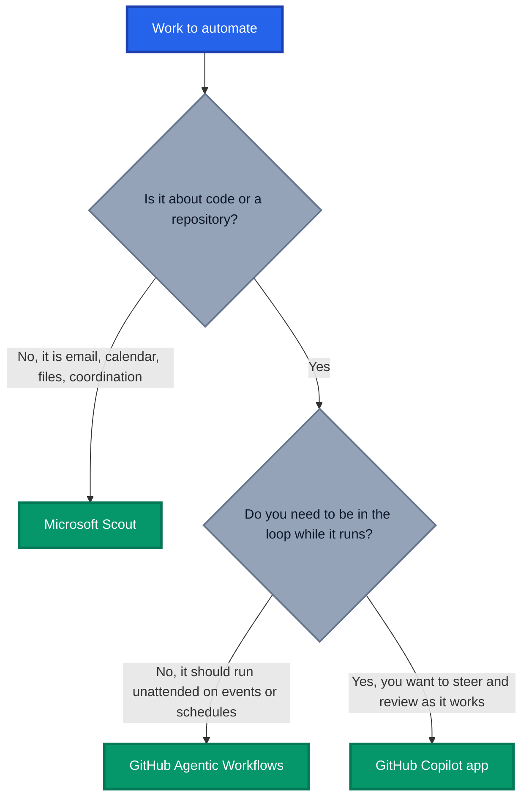

If you have been anywhere near the Microsoft and GitHub ecosystem since Build 2026, you have probably felt it. GitHub Agentic Workflows, Microsoft Scout, and the GitHub Copilot app all landed within weeks of each other, all promise to automate your day to day, and all draw from the same GitHub Copilot credit pool. It is like being handed three lightsabers and being told "you'll know which one to use when the time comes". Helpful, thanks Obi-Wan.

The confusion is understandable. Each of these tools runs AI agents, each connects to GitHub, and each consumes GitHub Copilot AI credits. So which one do you reach for when an issue needs triaging, when your inbox is on fire, or when you have five parallel coding tasks on the go?

In this post I break down what each tool actually is, where Microsoft and GitHub say it fits, and give you a simple decision framework so you stop second guessing yourself. Everything here is drawn from official Microsoft and GitHub documentation and announcements, not speculation.

## TL;DR

- **GitHub Agentic Workflows** automate **repository tasks** that run without you, triggered by events, schedules, or commands inside GitHub Actions.
- **Microsoft Scout** is your **always on personal agent** for Microsoft 365 and your desktop, handling operational and coordination work like email, calendar, files, and follow ups.
- **GitHub Copilot app** is your **desktop control centre for supervised coding sessions**, orchestrating multiple Copilot agents working on code in parallel.
- All three consume **GitHub Copilot AI credits**, so pick the right tool for the job or you will burn budget on the wrong surface.
- Rule of thumb: **repo automation goes to Agentic Workflows, personal productivity goes to Scout, and active coding work goes to the Copilot app.**

## Why the Confusion Exists

Microsoft and GitHub shipped three agentic surfaces in rapid succession. Scout and the Copilot app were both announced at Build 2026 in June, and [GitHub Agentic Workflows entered public preview](https://github.blog/changelog/2026-06-11-github-agentic-workflows-is-now-in-public-preview/) in the same month. Each one was pitched as "agents that do work for you".

The overlap is real on the surface:

- All three run AI agents that plan, reason, and act autonomously.
- All three integrate with GitHub, whether that is issues, pull requests, or repositories.
- All three are metered against your **GitHub Copilot AI credits**, following [Copilot's move to usage based billing](https://github.blog/news-insights/company-news/github-copilot-is-moving-to-usage-based-billing/). Even Scout, a Microsoft 365 product, [requires a GitHub Copilot Business or Enterprise licence](https://learn.microsoft.com/en-us/microsoft-scout/get-started) and bills its AI consumption through GitHub.

Shared billing is exactly why choosing the right tool matters. Agentic tasks can consume significantly more credits than a simple chat prompt, so running the wrong agent for the job is not just inefficient, it is expensive. Beneath the shared plumbing, each tool answers a completely different question.

## GitHub Agentic Workflows: Automation That Runs Without You

[GitHub Agentic Workflows](https://github.blog/ai-and-ml/automate-repository-tasks-with-github-agentic-workflows/) let you describe repository automation in natural language Markdown. The `gh aw` CLI compiles your Markdown into a standard GitHub Actions workflow, so it reuses your existing runners, secrets, and policies.

The defining characteristic is that **nobody is watching**. These workflows trigger on repository events, cron schedules, or slash commands, and an AI coding agent carries out the reasoning step unattended. Think:

- Intelligent issue triage and labelling
- CI failure analysis with suggested fixes
- Keeping documentation synchronised with code changes
- Dependency and security hygiene sweeps

Because agents run unattended, GitHub wrapped them in a [security first architecture](https://github.blog/ai-and-ml/generative-ai/under-the-hood-security-architecture-of-github-agentic-workflows/). Agents run read only by default inside a sandboxed environment with a workflow firewall, and anything that writes back goes through audited safe outputs. Billing covers [GitHub Actions minutes plus AI credits](https://github.github.com/gh-aw/reference/billing/) for the inference itself.

**Use it when:** the task belongs to the repository, repeats over time, and does not need a human in the loop for every run. I covered this in depth in [Agentic Workflows: Reimagining Repository Automation](https://azurewithaj.com/agentic-workflows-reimagining-automation) if you want the full picture.

## Microsoft Scout: Your Always On Personal Agent

[Microsoft Scout](https://www.microsoft.com/en-us/microsoft-365/blog/2026/06/02/introducing-microsoft-scout-your-always-on-personal-agent/) is the first of Microsoft's "Autopilot agents", currently in preview through the Microsoft Frontier program. Where Copilot answers when you ask, Scout keeps working when you are not looking.

Scout runs on your Windows or macOS desktop and can, with your permission:

- Read and write local files and run shell commands
- Automate browser actions like filling forms
- Manage your Microsoft 365 world: email, calendar, Teams, meetings, and files
- Run on schedules or triggers, proactively flagging risks like stalled decisions or overdue tasks

The enterprise story is strong. Each Scout instance carries its own Entra ID identity, every action is policy checked and audited, and sensitive actions require explicit approval. The [prerequisites](https://learn.microsoft.com/en-us/microsoft-scout/get-started) are meaningful: Frontier enrolment, a Microsoft 365 Copilot licence, an Intune managed device, **and** a GitHub Copilot Business or Enterprise licence, because Scout's AI consumption is billed through GitHub Copilot credits.

That last point trips people up. Scout is a Microsoft 365 product that spends your GitHub Copilot budget. It is the clearest signal yet that Microsoft treats Copilot credits as the common currency for agentic work across the whole ecosystem.

**Use it when:** the work is about **you and your day**, not a codebase. Inbox triage, meeting preparation, chasing follow ups, coordinating across Teams and Outlook. Scout is your operational chief of staff, not your pair programmer.

## GitHub Copilot App: Your Agent Orchestration Desk

The [GitHub Copilot app](https://github.blog/news-insights/product-news/github-copilot-app-the-agent-native-desktop-experience/) went [generally available on 17 June 2026](https://github.blog/changelog/2026-06-17-github-copilot-app-generally-available/) for macOS, Windows, and Linux. It is not an IDE and it does not replace VS Code. It is a dedicated desktop surface for **supervising multiple coding agents at once**.

The headline features tell you exactly what it is for:

- **My Work dashboard** showing active agent sessions, issues, and pull requests across repositories
- **Parallel sessions** where each agent works in an isolated git worktree, locally or in the cloud
- **Canvases**, shared spaces where plans, terminals, diffs, and reviews happen in the open rather than buried in a chat thread
- **Agent Merge**, which shepherds pull requests through reviews and checks while you stay in control

The mental model GitHub is pushing is that you shift from writing every line to **directing agents like a project lead**. You kick off three or four coding sessions, review their plans, steer them in canvases, and merge the results. It is available to Copilot Pro, Pro+, Business, and Enterprise subscribers, and yes, those agent sessions consume Copilot credits.

**Use it when:** you have active, interactive coding work and want to run several streams in parallel with you in the loop. This is the Agent HQ vision landing on the desktop, which I explored in [Welcome Home, Agents](https://azurewithaj.com/welcome-home-agents).

## The Decision Framework

Here is the flow I use when deciding where a piece of work should go.

And the side by side view:

| Dimension         | Agentic Workflows                       | Microsoft Scout                                      | Copilot App                             |
| ----------------- | --------------------------------------- | ---------------------------------------------------- | --------------------------------------- |
| **Scope**         | Repository and org automation           | Your personal and Microsoft 365 work                 | Active coding sessions                  |
| **Human in loop** | No, unattended with audited outputs     | Approval gates on sensitive actions                  | Yes, you supervise and steer            |
| **Where it runs** | GitHub Actions runners                  | Your desktop plus Microsoft 365 cloud                | Desktop app, local or cloud sessions    |
| **Trigger**       | Events, schedules, commands             | Always on, schedules, proactive                      | You launch sessions                     |
| **Licensing**     | Copilot plan plus Actions minutes       | M365 Copilot plus GitHub Copilot Business/Enterprise | Copilot Pro, Pro+, Business, Enterprise |
| **Billing**       | Actions minutes plus Copilot AI credits | Copilot AI credits via GitHub                        | Copilot AI credits                      |
| **Availability**  | Public preview                          | Frontier preview                                     | Generally available                     |

## Where They Overlap, and the Official Stance

There are genuine grey areas. Scout can technically touch repositories, the Copilot app can schedule recurring cloud automations, and Agentic Workflows can be triggered manually. So what do Microsoft and GitHub actually recommend?

The positioning in the official material is consistent:

- GitHub frames Agentic Workflows as "[automating repository tasks](https://github.blog/ai-and-ml/automate-repository-tasks-with-github-agentic-workflows/)", continuous automation belonging to the repo, not the person.
- Microsoft positions Scout as "[your always on personal agent](https://www.microsoft.com/en-us/microsoft-365/blog/2026/06/02/introducing-microsoft-scout-your-always-on-personal-agent/)" for eliminating operational and coordination work across Microsoft 365.
- GitHub describes the Copilot app as "[the agent-native desktop experience](https://github.blog/news-insights/product-news/github-copilot-app-the-agent-native-desktop-experience/)" for orchestrating parallel agent driven software work.

In other words, the vendors themselves draw the lines at **repository, person, and coding session**. When you are tempted to bend one tool into another's lane, remember that each is hardened for its own context. Agentic Workflows have the sandbox and safe outputs for unattended repo access. Scout has Entra identity, Purview integration, and Intune controls for personal and enterprise data. The Copilot app has worktree isolation for parallel code changes. Using the right tool is not just cleaner, it keeps you inside the guardrails each team built.

One practical tip on credits: because everything meters against the same Copilot AI credit pool, treat unattended automation with the same discipline as cloud spend. Start Agentic Workflows on a small number of high value tasks, watch the credit reporting, and expand from there.

## Conclusion

The three tools are not competitors, they are three seats at the same agentic table. GitHub Agentic Workflows keep your repositories healthy while you sleep. Microsoft Scout keeps your day moving while you focus. The GitHub Copilot app is where you sit when you are actively directing coding agents.

The confusion melts away once you ask two questions: is this about a repository or about me, and do I need to be in the loop? Answer those and the choice makes itself, and it will match exactly where Microsoft and GitHub are steering each product.

If you want to go deeper, start with [Agentic Workflows: Reimagining Repository Automation](https://azurewithaj.com/agentic-workflows-reimagining-automation) for the repo automation side, and [Azure DevOps vs GitHub: Your 2026 Platform Decision](https://azurewithaj.com/azure-devops-vs-github-build-2026) for the bigger platform picture.

_Have you worked out your own split between these three tools? Are your Copilot credits going where you expected? Share your experiences in the comments._
