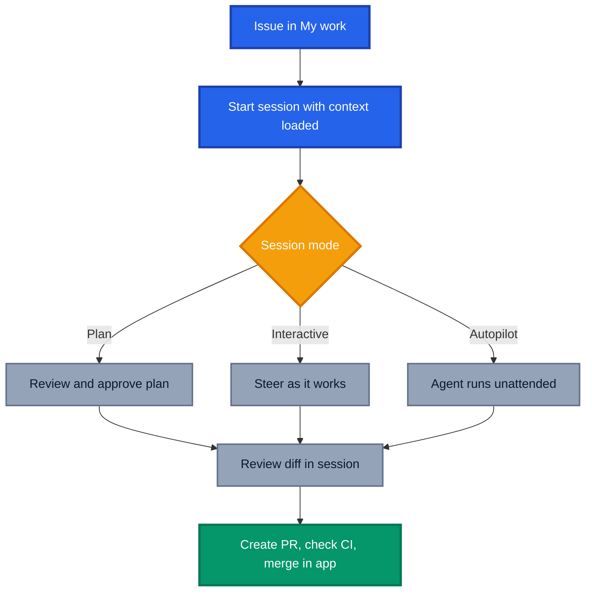

I did not want to like the GitHub Copilot app. I had VS Code tuned exactly how I wanted it, extensions curated over years, keybindings in muscle memory, and a colour theme I will defend to the death. Handing that over for a new desktop app felt like swapping a lightsaber I had built myself for one someone handed me in a shop.

Six weeks later it is open on my machine every single day, and VS Code has quietly become the place I go when I want to read code rather than write it.

This GitHub Copilot app review is my honest experience, the good, the awkward and the genuinely annoying. Everything factual here comes from [GitHub's own documentation](https://docs.github.com/en/copilot/concepts/agents/github-copilot-app){:target="\_blank" rel="noopener"}, everything opinionated is mine.

## What the GitHub Copilot App Actually Is

Before the feelings, the facts. The [GitHub Copilot app](https://docs.github.com/en/copilot/concepts/agents/github-copilot-app){:target="\_blank" rel="noopener"} is a desktop application purpose built for agent driven development, available on macOS, Windows and Linux, and available across all Copilot plans. It is built on GitHub Copilot CLI and integrates natively with GitHub, so repositories, branches, issues, pull requests and CI results work out of the box.

The important word in that description is **agents**, not **editor**. GitHub is explicit that it exists so you can direct multiple agents across parallel workstreams instead of context switching between terminal, IDE and browser tabs. Each session runs in its own isolated workspace with a dedicated git worktree and branch, and you can pick where a session runs, a new working tree, your local repository, or a cloud sandbox.

If you want the wider landscape view, I compared it against other agentic surfaces in [Agentic Workflows vs Scout vs Copilot App](https://azurewithaj.com/agentic-workflows-vs-scout-vs-copilot-app).

## The Part Where I Resisted

My first week was mild frustration. I kept asking myself the obvious question, why would I use this when VS Code already has Copilot in it?

The answer was not obvious, because I was using the app wrong. I started with chat, treating it as a fancier chat window, which is the least interesting thing it does. Then I kicked off real agentic work and the discomfort arrived properly. No folder tree down the left. No extensions bar. No terminal sitting where my eyes expect it. My hands kept reaching for shortcuts that were not there.

That reaction is worth naming, because it is not a product flaw, it is a **model mismatch**. An IDE optimises for you writing lines. The Copilot app optimises for you directing work and reviewing outcomes. The sidebar tells the story, [My work, Automations, Search and Sessions](https://docs.github.com/en/copilot/how-tos/github-copilot-app/getting-started){:target="\_blank" rel="noopener"}. Not a file explorer in sight, because files are what the agent is dealing with, not you.

Once I stopped mourning my folder tree, things got interesting fast.

## The Turning Point: Directing Instead of Typing

The shift happened over a handful of real use cases rather than one dramatic moment. A refactor here, a documentation sync there, an issue picked up on a Friday afternoon that I could not be bothered branching for manually.

What made it stick was **session modes**. You choose how much rope the agent gets, and you can change it mid flight:

- **Interactive**, the agent suggests changes and waits for your input.
- **Plan**, the agent proposes a plan you approve before it executes.
- **Autopilot**, the agent writes code, runs tests and iterates on its own.

Plan mode became my default opener for anything non trivial. Approve the approach, then let it run. Combined with a model picker and reasoning effort control per session, it feels less like prompting a tool and more like briefing a colleague.

I now gravitate to the app naturally for heavy code development. I am not asking it for dinner ideas, that is not what this is. But when I have three streams of work in flight across two repositories, this is where I sit.

## Automations Are the Sleeper Feature

If I had to pick one thing that moved the app from "interesting" to "essential", it is [automations](https://docs.github.com/en/copilot/how-tos/github-copilot-app/using-automations){:target="\_blank" rel="noopener"}.

Automations let you save recurring agent tasks and run them on a schedule or on demand. In the app you get an Automations tab in the sidebar, and each automation shows its name, schedule, associated repository and last run status. There are two flavours, **local automations** that run from your environment, and **cloud automations** that run in a cloud environment so they still fire when your machine is off.

Triggers are refreshingly simple:

- **Manual**, run it whenever you want with the play button on its card.
- **On a schedule**, hourly, daily or weekly.
- **When an issue is created**, with an optional search query filter so you only catch the issues you care about.

For cloud automations you also select the tools Copilot may use, such as pushing changes, updating issue labels or creating a pull request. Selecting only what the task needs is the same least privilege discipline we apply everywhere else, and it is refreshing to see it as a first class dropdown rather than a buried policy.

My favourite detail is the smallest one. Being able to save an automation and just hit run, without waiting for a schedule, means one off jobs get saved rather than retyped. My morning routine is now a scheduled pull request review sweep plus an issue triage run, and I read the results with coffee instead of writing prompts.

If you are building a broader library of agent behaviour to feed these, my post on [organising Copilot customisations at scale](https://azurewithaj.com/organising-copilot-customisations) covers where all that should live.

## Multiple Accounts, or Why My Cross Org Life Got Easier

Working across a personal account and multiple client organisations has always meant an authentication tax. Sign out, sign in, re authorise, forget which identity you were in, push to the wrong remote, feel shame.

Being able to work across accounts and set the identity per repository and session removes what has honestly been a barrier to entry for years. It sounds mundane written down. In practice it is the difference between picking up a cross org task immediately and putting it off until I have the energy for the ceremony.

There is a related nicety in the way work is surfaced. My work aggregates issues and pull requests across your repositories into sections you can edit or extend with your own filters, and you can search with qualifiers like `label:bug` inside any section. Between that and automations, the app has quietly become the place I check for what needs attention, which is a job I used to do across three browser tabs and a notifications page.

## The Rough Edges

Six weeks in, here is what still irritates me. Both feel like maturity problems rather than design problems.

**Customisation still pulls you out of the UI.** The docs say you can add and manage [agent skills and MCP servers](https://docs.github.com/en/copilot/how-tos/github-copilot-app/customize-github-copilot-app){:target="\_blank" rel="noopener"} in app settings, and anything already configured for your repositories or Copilot CLI is picked up automatically. That is true, and there is a catalogue of popular MCP servers. But the moment you go beyond the catalogue, you are back in local configuration files, restarting things and guessing why a server did not appear. For an app whose whole pitch is "stay in one place", the customisation path is the one journey that keeps sending me elsewhere.

**No terminal until a session exists.** Sessions own the workspace, which makes sense architecturally, since each one gets its own worktree. It also means the terminal is not there when you first open the app. If your instinct is to poke around a repository before deciding what to do, that instinct is temporarily homeless. [Quick chats](https://docs.github.com/en/copilot/how-tos/github-copilot-app/agent-sessions){:target="\_blank" rel="noopener"} help for questions, because they open a conversation without creating a branch or worktree, but they are not a shell.

Neither is a deal breaker. Both are the kind of thing I expect to read about in a changelog within a couple of releases.

## Credits and Common Sense

One practical note. Agent sessions consume AI credits, and GitHub publishes [sensible guidance on optimising usage](https://docs.github.com/en/copilot/concepts/agents/github-copilot-app){:target="\_blank" rel="noopener"}, match model capability to task complexity, use Plan mode to validate scope before burning effort, use quick chats for early exploration, and start a fresh session when you switch tasks so you are not dragging irrelevant context along.

Treat autonomous runs like cloud spend. Start narrow, watch the usage, expand what clearly pays for itself.

## Conclusion: Who Should Actually Switch

The GitHub Copilot app did not replace my IDE and I no longer expect it to. It replaced the **orchestration layer** that used to live in my head, spread across terminal tabs, browser windows and half remembered intentions.

I would recommend it to you if:

- You regularly run **more than one stream of work** at a time.
- You live across **multiple organisations or accounts** and are tired of the sign in shuffle.
- You have **recurring repository chores** that would happily run on a schedule.
- You are comfortable **directing and reviewing** rather than typing every line.

I would hold off if you are mostly doing focused single threaded work in one repository, or if your workflow depends heavily on IDE extensions. The app is not trying to win that fight.

Start small. Install it, connect one repository, run one Plan mode session on a real issue, then save one automation. That is a lunch break's worth of effort, and it is enough to know whether the model fits how you work.

If you want more context on where this sits in the wider agent story, read [Welcome Home, Agents](https://azurewithaj.com/welcome-home-agents) next.

_Have you given the GitHub Copilot app a proper go, or are you still loyal to your IDE? Tell me what won you over, or what sent you back, in the comments._
