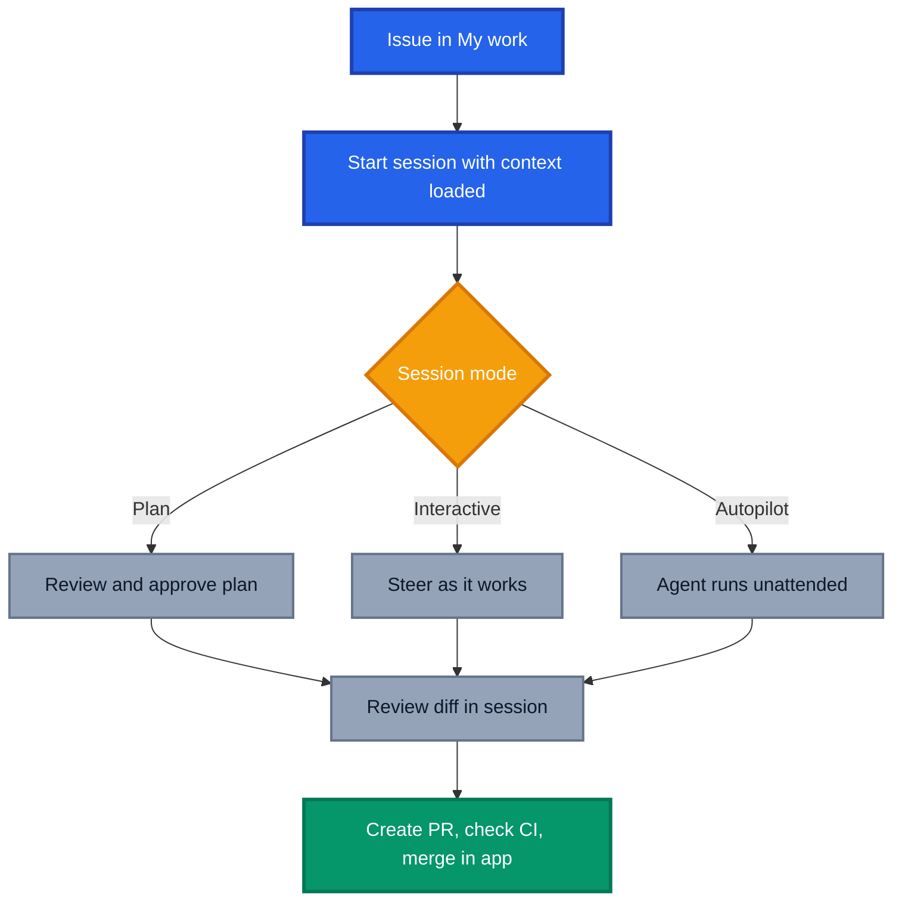

I did not want to like the GitHub Copilot app. I had VS Code tuned exactly how I wanted it, extensions curated over years, keybindings in muscle memory, and a colour theme I will defend to the death. Handing that over for a new desktop app felt like swapping a lightsaber I had built myself for one someone handed me in a shop.

Fast forward and it is open on my machine every single day, sitting alongside VS Code rather than replacing it. VS Code is still where I go for heavy code development, the hands on work where I want the folder tree, the extensions and the debugger. The Copilot app is where I direct the work.

This is not a scorecard, it is my view on why the GitHub Copilot app is now a valid place to do serious work, the good, the awkward and the genuinely annoying. Everything factual here comes from [GitHub's own documentation](https://docs.github.com/en/copilot/concepts/agents/github-copilot-app){:target="\_blank" rel="noopener"}, everything opinionated is mine.

## What the GitHub Copilot App Actually Is

Before the feelings, the facts. The [GitHub Copilot app](https://docs.github.com/en/copilot/concepts/agents/github-copilot-app){:target="\_blank" rel="noopener"} is a desktop application purpose built for agent driven development, available on macOS, Windows and Linux, and available across all Copilot plans. It is built on GitHub Copilot CLI and integrates natively with GitHub, so repositories, branches, issues, pull requests and CI results work out of the box.

The important word in that description is **agents**, not **editor**. GitHub is explicit that it exists so you can direct multiple agents across parallel workstreams instead of context switching between terminal, IDE and browser tabs. Each session runs in its own isolated workspace with a dedicated git worktree and branch, and you can pick where a session runs, a new working tree, your local repository, or a cloud sandbox.

If you want the wider landscape view, I compared it against other agentic surfaces in [Agentic Workflows vs Scout vs Copilot App](https://azurewithaj.com/agentic-workflows-vs-scout-vs-copilot-app).

## The Part Where I Resisted

Early on it was mild frustration. I kept asking myself the obvious question, why would I use this when VS Code already has Copilot in it?

The answer was not obvious, because I was using the app wrong. I started with chat, treating it as a fancier chat window, which is the least interesting thing it does. Then I kicked off real agentic work and the discomfort arrived properly. No folder tree down the left. No extensions bar. No terminal sitting where my eyes expect it. My hands kept reaching for shortcuts that were not there.

That reaction is worth naming, because it is not a product flaw, it is a **model mismatch**. An IDE optimises for you writing lines. The Copilot app optimises for you directing work and reviewing outcomes. The sidebar tells the story, [My work, Automations, Search and Sessions](https://docs.github.com/en/copilot/how-tos/github-copilot-app/getting-started){:target="\_blank" rel="noopener"}. Not a file explorer in sight, because files are what the agent is dealing with, not you.

I was looking for a cockpit and had been handed the war room on Yavin 4. Once I stopped mourning my folder tree, things got interesting fast.

## The Turning Point: From Curiosity to Daily Habit

The shift did not happen in one dramatic moment. It happened over a handful of real use cases, one after another, a refactor here, a documentation sync there, adding a new skill in a repo on a Friday afternoon that I could not be bothered branching for manually. Nothing individually convinced me, but the tally added up quickly, and I noticed I was reaching for the app before I had consciously decided to.

Part of what made experimenting low risk is **session modes**. You choose how much rope the agent gets, and you can change it mid flight:

- **Interactive**, the agent suggests changes and waits for your input.
- **Plan**, the agent proposes a plan you approve before it executes.
- **Autopilot**, the agent writes code, runs tests and iterates on its own.

I will be upfront that Plan mode has not been my own habit, my sessions have mostly lived in Interactive and Autopilot. But it is a genuinely useful option if you want a checkpoint before an agent starts touching your repository, and combined with a model picker and reasoning effort control per session, the range of control on offer is well thought out regardless of which mode you settle on.

What changed is that it slowly became essential for real development work rather than something I dipped into occasionally. When I have three streams of work in flight across two repositories, this is where I sit. When one of those streams needs me elbow deep in the code itself, I drop into VS Code, do the work properly, then come back.

## Automations Are the Sleeper Feature

If I had to pick one thing that moved the app from "interesting" to "essential", it is [automations](https://docs.github.com/en/copilot/how-tos/github-copilot-app/using-automations){:target="\_blank" rel="noopener"}.

Automations let you save recurring agent tasks and run them on a schedule or on demand. In the app you get an Automations tab in the sidebar, and each automation shows its name, schedule, associated repository and last run status. There are two flavours, **local automations** that run from your environment, and **cloud automations** that run in a cloud environment so they still fire when your machine is off.

Triggers are refreshingly simple:

- **Manual**, run it whenever you want with the play button on its card.
- **On a schedule**, hourly, daily or weekly.
- **When an issue is created**, with an optional search query filter so you only catch the issues you care about.

For cloud automations you also select the tools Copilot may use, such as pushing changes, updating issue labels or creating a pull request. Selecting only what the task needs is the same least privilege discipline we apply everywhere else, and it is refreshing to see it as a first class dropdown rather than a buried policy.

My favourite detail is the smallest one. While troubleshooting I was able to schedule a retry for 24 hours later while I was waiting for a system change to propagate, meaning one off jobs can get saved easily rather than retyped from scratch every time I want to repeat them.

The other pleasant surprise was stumbling onto an inbox style view in the app that surfaces reminders and nudges me to run something when it is actually relevant, rather than leaving automations to fire blind on a timer and hoping I remember to check the results. It is a small addition, but it is the difference between an automation running while I am not looking and one that taps me on the shoulder at the right moment.

## Multiple Accounts, or Why My Cross Org Life Got Easier

Working across a personal account and multiple client organisations has always meant an authentication tax. Sign out, sign in, re authorise, forget which identity you were in, push to the wrong remote, feel shame.

Being able to work across accounts and set the identity per repository and session removes what has honestly been a barrier to entry for years. In practice it is the difference between picking up a cross org task immediately and putting it off until I have the energy for the ceremony.

## The Rough Edges

With that said, here is what still irritates me. Both feel like maturity problems rather than design problems.

**Customisation still pulls you out of the UI.** The docs say you can add and manage [agent skills and MCP servers](https://docs.github.com/en/copilot/how-tos/github-copilot-app/customize-github-copilot-app){:target="\_blank" rel="noopener"} in app settings, and anything already configured for your repositories or Copilot CLI is picked up automatically. That is true, and there is a catalogue of popular MCP servers. But the moment you go beyond the catalogue and need to provide in depth customisations , you are back in local configuration files, restarting things and guessing why a server did not appear. For an app whose whole pitch is "stay in one place", the customisation path is the one journey that keeps sending me elsewhere.

**No terminal until a session exists.** Sessions own the workspace, which makes sense architecturally, since each one gets its own worktree. It also means the terminal is not there when you first open the session. If your instinct is to poke around a session before deciding what to do, that instinct is temporarily homeless. [Quick chats](https://docs.github.com/en/copilot/how-tos/github-copilot-app/agent-sessions){:target="\_blank" rel="noopener"} help for questions, because they open a conversation without creating a branch or worktree, but they are not a shell.

Neither is a deal breaker. Both are the kind of thing I expect to read about in a changelog within a couple of releases.

## Credits and Common Sense

One practical note. Agent sessions consume AI credits, and GitHub publishes [sensible guidance on optimising usage](https://docs.github.com/en/copilot/concepts/agents/github-copilot-app#optimizing-ai-usage-in-the-github-copilot-app){:target="\_blank" rel="noopener"}, match model capability to task complexity, use Plan mode to validate scope before burning effort, use quick chats for early exploration, and start a fresh session when you switch tasks so you are not dragging irrelevant context along.

Treat autonomous runs like cloud spend. Start narrow, watch the usage, expand what clearly pays for itself.

## Conclusion: Who Should Actually Switch

The GitHub Copilot app did not replace my IDE and I no longer expect it to. VS Code is still my lightsaber for heavy code development. The Copilot app is the command deck, and it replaced the **orchestration layer** that used to live in my head, spread across terminal tabs, browser windows and half remembered intentions.

I would recommend it to you if:

- You regularly run **more than one stream of work** at a time.
- You live across **multiple organisations or accounts** and are tired of the sign in shuffle.
- You have **recurring repository chores** that would happily run on a schedule.
- You are comfortable **directing and reviewing** rather than typing every line.

I would hold off if you are mostly doing focused single threaded work in one repository, or if your workflow depends heavily on IDE extensions. These are not the droids you are looking for, and the app is not trying to win that fight anyway. Keep VS Code for the deep code work and let the app handle everything around it.

Start small. Install it, connect one repository, run one Plan mode session on a real issue, then save one automation. That is a lunch break's worth of effort, and it is enough to know whether the model fits how you work.

_Have you given the GitHub Copilot app a proper go, or are you still loyal to your IDE? Tell me what won you over, or what sent you back, in the comments._
