Over the past few months, a realisation has set in. I am spending more time creating agents and skills to assist with my day to day work, across the board, than I am writing code.

Actually, that is being generous. I am spending almost no time writing code.

My first thought used to be, "I need to build something, and AI can help me write it." Now it is, "Can I create or reuse a skill or agent that can deliver this outcome?" That shift reaches far beyond software development. I use agents to automate mundane tasks, accelerate Azure and GitHub assessments, support migrations, analyse estates and help paint a clearer picture for executives.

That got me thinking about an idea at the heart of platform engineering: **treat your platform as a product and your developers as customers**. If agents discover tools, call APIs, follow paved roads and produce outcomes on our behalf, are AI agents the new platform engineering customers?

I think the answer is yes. They are not the only customers, and they are definitely not accountable ones, but they are becoming some of the most demanding consumers our platforms have ever seen.

## TL;DR

AI agents are becoming platform engineering customers because they consume the same capabilities as developers, including APIs, templates, policies, documentation and deployment workflows. The difference is that agents operate at machine speed and interpret what the platform exposes very literally.

Platform teams should design for humans and agents together. That means machine consumable interfaces, explicit constraints, observable actions and approval points based on risk. Humans still own intent, judgement and accountability. An agent can recommend an answer, but I need to be willing to put my name against it before it becomes an outcome.

## Why AI Agents Are Platform Engineering Customers

The [CNCF Platforms White Paper](https://tag-app-delivery.cncf.io/whitepapers/platforms/){:target="_blank" rel="noopener"} describes platforms as collections of capabilities intended to meet the needs of their users. Google Cloud makes the product mindset even more explicit in its [platform engineering guidance](https://cloud.google.com/solutions/platform-engineering){:target="_blank" rel="noopener"}, where developers are customers and the platform exists to reduce cognitive load through self service.

That model still holds. What has changed is who, or what, is standing at the counter.

A human developer might browse a portal, read some documentation, choose a template and raise a pull request. An agent can perform the same journey through a CLI, API, MCP server or repository workflow. It can interpret the request, inspect the environment, select a paved road, generate the required artifacts, validate them and prepare the result for review.

```mermaid
graph LR
    H[Human sets intent] --> A[AI agent plans the work]
    A --> P[Platform interfaces]
    P --> G[Guardrails and policy]
    G --> O[Observable outcome]
    O --> R[Human reviews and owns decision]
    R -->|Approved| D[Deliver through Azure and GitHub]
    R -->|Needs work| A

    style H fill:#2563eb,stroke:#1e40af,stroke-width:3px,color:#fff
    style A fill:#94a3b8,stroke:#64748b,stroke-width:2px,color:#0f172a
    style P fill:#94a3b8,stroke:#64748b,stroke-width:2px,color:#0f172a
    style G fill:#f59e0b,stroke:#d97706,stroke-width:3px,color:#fff
    style O fill:#94a3b8,stroke:#64748b,stroke-width:2px,color:#0f172a
    style R fill:#2563eb,stroke:#1e40af,stroke-width:3px,color:#fff
    style D fill:#059669,stroke:#047857,stroke-width:3px,color:#fff
```

## AI Agents Need a Different Developer Experience

We have spent years improving developer experience with portals, documentation and golden paths. Those remain useful for people, but an agent needs the same intent exposed in a form it can reliably consume.

Microsoft's discussion of [how AI coding agents use technology](https://devblogs.microsoft.com/blog/how-ai-coding-agents-actually-use-your-technology/){:target="_blank" rel="noopener"} breaks this down well. An agent works through the context assembled around it, including repository instructions, documentation, API descriptions, tools and the environment supplied by its harness. If those inputs are vague, stale or contradictory, the output will reflect that.

For platform teams, four things become critical:

1. **Machine consumable interfaces.** Capabilities need stable APIs, CLIs, schemas and MCP tools, not knowledge hidden behind a portal or in somebody's head.
2. **Explicit golden paths.** Preferred patterns must explain when to use them, what inputs they accept and what good output looks like. Google's guidance on [golden paths for engineering consistency](https://cloud.google.com/blog/products/application-development/golden-paths-for-engineering-execution-consistency){:target="_blank" rel="noopener"} is just as relevant to agents as it is to developers.
3. **Guardrails close to execution.** Policy, permissions, budget controls and approval gates should constrain the action itself. Telling an agent to "be secure" is not a security control.
4. **Observable decisions.** We need to see which tools were called, what context was used, what changed and where human approval occurred.

A beautifully designed portal with an undocumented API is friendly to people and hostile to agents. A powerful API with broad permissions and no audit trail is friendly to agents and hostile to the organisation. The platform has to serve both safely.

## My Shift from Writing Code to Designing Capability

This is not an abstract prediction for me. It has already changed how I work.

My focus has moved from producing an artifact once to creating a reusable capability that can produce the right artifact repeatedly. Instead of writing another script for one assessment, I think about an assessment agent with the right sources, tools, questions and output structure. Instead of manually gathering migration evidence, I think about a skill that can collect it consistently and highlight what needs judgement. Instead of spending hours turning technical findings into an executive narrative, I use an agent to assemble the evidence into a clear first draft that I can challenge and refine.

Across Azure and GitHub, this approach can fast track assessments, support migration planning, identify risks and translate technical complexity into business choices. An agent can gather repository data, cloud configuration, delivery signals and policy findings in parallel. It can then present engineers with the details and executives with the decisions that matter.

It also changes the role of platform engineering. The platform team is no longer only curating Terraform modules, Bicep templates, pipelines and portals for developers. It is curating **capabilities, context and controls** for a mixed workforce of people and agents.

I explored the governance side of this in [Agents as Code](https://azurewithaj.com/agents-as-code-versioned-artifacts), where agent definitions become versioned and reviewable artifacts. I also covered how reusable customisations reduce duplication in [Organising GitHub Copilot Customisations](https://azurewithaj.com/organising-copilot-customisations). Put those ideas together and the direction becomes clear: agents are becoming part of the platform product.

## The Complacency Trap

There is another part of this shift that deserves more attention.

AI makes the easy path very easy. It produces a polished answer, the structure looks right, the language is confident and every instinct says **LGTM**. When the result arrives faster than I could have created it myself, it is tempting to accept it and move on.

That is where complacency begins.

Human in the loop cannot mean a person clicks approve at the end. It must mean a person actively tests the reasoning, checks the evidence, understands the risk and decides whether they are happy to align themselves with the result.

I have had to engrain a simple question into my own review:

> **Am I willing to put my name against this outcome?**

If the answer is no, the work is not done.

This matters even more when an agent moves beyond code. A questionable code change may fail a test. A flawed assessment can misdirect an investment. A weak migration recommendation can increase delivery risk. An inaccurate executive summary can shape a decision before the technical team gets a chance to correct the record.

The platform must therefore make meaningful review possible. Preserve source links. Show assumptions. Separate evidence from inference. Make confidence visible. Require approval before high impact actions. Give reviewers enough context to disagree rather than presenting a shiny answer and a green button.

## Design the Platform for Two Customers

The practical response is not to build a separate platform for agents. It is to make the existing platform clearer, safer and more composable for everyone.

| Platform capability | Human customer needs | Agent customer needs |
|---|---|---|
| Documentation | Clear guidance and examples | Structured, current and discoverable context |
| Golden paths | Low friction self service | Deterministic inputs, outputs and validation |
| Tooling | Helpful portal and CLI experiences | Stable APIs, schemas and scoped tools |
| Governance | Understandable policies and approvals | Enforced permissions and explicit boundaries |
| Observability | Status, logs and ownership | Traceable tool calls, context and decisions |
| Feedback | Support channels and product research | Evaluation results, failures and correction loops |

This is platform engineering doing what it has always promised, reducing cognitive load without removing responsibility.

The [CNCF Platform Engineering Maturity Model](https://tag-app-delivery.cncf.io/whitepapers/platform-eng-maturity-model/){:target="_blank" rel="noopener"} encourages teams to progress from ticket driven operations towards consistent self service and platform as a product. Agents raise the standard again. If a capability cannot be discovered, understood and safely consumed without tribal knowledge, it is not ready for this new customer.

## Where Platform Teams Should Start

Do not begin with a grand agent platform programme. Pick one valuable, repeatable journey and make it work end to end.

1. **Choose a bounded use case.** Assessment evidence collection, repository onboarding or migration readiness are good candidates because the inputs and expected outputs can be defined.
2. **Expose the paved road.** Provide the templates, APIs, instructions and examples an agent needs, with clear success criteria.
3. **Constrain the tools.** Grant only the permissions required for that journey and keep production changes behind explicit approval.
4. **Evaluate the outcome.** Test for accuracy, completeness, policy compliance and usefulness, not simply whether the agent completed the task.
5. **Review with intent.** Make the accountable human inspect evidence and assumptions before accepting the result.
6. **Improve the platform.** Treat every agent failure as product feedback. Fix ambiguous documentation, brittle interfaces and missing guardrails at the source.

Agents are relentless platform testers. They will find every undocumented dependency, inconsistent naming convention and vague instruction.

## Conclusion: A New Customer, Not a New Owner

AI agents are becoming platform engineering customers. They consume platform capabilities, navigate golden paths and turn intent into action. They are fast, scalable and increasingly capable across Azure, GitHub and the wider business.

But they are not the owner of the outcome.

My own mindset has shifted from writing code with AI assistance to designing agents and skills first. That has helped me automate mundane work and deliver richer assessments, migration plans and executive insights. It has also forced me to become more deliberate about review. The easier the output is to accept, the more important it is to stop and ask whether I truly stand behind it.

Build platforms that agents can understand. Give them narrow, observable and well governed paths. Then keep humans exactly where they belong, setting intent, exercising judgement and owning the decision.

The droids can use the platform. They do not get a seat on the Jedi Council.

_Are your AI agents already consuming your internal platform, and can you trace how they reached their decisions? Share what is working, and where the paved road still has potholes, in the comments._
