Over the past few months, something has shifted. I am spending more time creating agents and skills to handle my day to day work than I am writing code.

Actually, that is generous. I am spending almost no time writing code.

Somewhere along the way, I changed jobs without telling myself. I still solve engineering problems, but now I spend more time designing the thing that does the work than doing the work directly.

My first thought used to be, "I need to build something, and AI can help me write it." Now it is, "Can I create or reuse a skill or agent that delivers the outcome?" That is not just a developer habit either. I use agents to automate mundane tasks, accelerate Azure and GitHub assessments, support migrations, analyse estates and turn technical evidence into something an executive can actually use.

Which got me thinking about the core idea behind platform engineering: **treat your platform as a product and your developers as customers**. If agents discover tools, call APIs, follow paved roads and produce outcomes on our behalf, are AI agents the new platform engineering customers?

I think they are. They are not the only customers, and they are definitely not accountable ones, but they might be the most demanding consumers our platforms have ever seen. They are faster than any developer, more literal than any documentation writer imagined and completely unable to "just ask Dave" when the documentation stops making sense.

## TL;DR

AI agents are becoming platform engineering customers. They consume the same APIs, templates, policies, documentation and deployment workflows as developers, only at machine speed and with a ruthlessly literal interpretation of whatever the platform exposes.

Platform teams need to design for both humans and agents. That means machine consumable interfaces, explicit constraints, observable actions and approval points based on risk. Humans still own intent, judgement and accountability. An agent can recommend an answer, but I need to be willing to put my name against it before anyone acts on it.

## Why AI Agents Are Platform Engineering Customers

The [CNCF Platforms White Paper](https://tag-app-delivery.cncf.io/whitepapers/platforms/){:target="\_blank" rel="noopener"} describes platforms as collections of capabilities built to meet the needs of their users. Google Cloud makes the product mindset even clearer in its [platform engineering guidance](https://cloud.google.com/solutions/platform-engineering){:target="\_blank" rel="noopener"}: developers are customers, and the platform reduces cognitive load through self service.

That model still holds. What has changed is who, or what, is standing at the counter.

A developer might browse a portal, choose a template and raise a pull request. An agent can make the same journey through a CLI, API, MCP server or repository workflow. It inspects the environment, chooses a paved road, generates the artefacts and puts the result in front of a human.

That sounds like the same customer journey with fewer coffee breaks, but there is an important difference. Humans compensate for bad platforms. We infer what the author meant, copy the command from an old Teams message and quietly add the tag everyone knows is mandatory even though nobody wrote it down. An agent sees the platform exactly as it is. No folklore, no helpful colleague leaning over the desk, no Force ghost appearing at the critical moment with the missing subscription ID.

```mermaid
graph LR
    H[Human sets intent] --> A[AI agent plans the work]
    A --> P[Platform interfaces]
    P --> G[Guardrails and policy]
    G --> O[Observable outcome]
    O --> R[Human reviews and owns decision]
    R -->|Approved| D[Deliver through Azure and GitHub]
    R -->|Needs work| A

    style H fill:#2563eb,stroke:#1e40af,stroke-width:3px,color:#fff
    style A fill:#94a3b8,stroke:#64748b,stroke-width:2px,color:#0f172a
    style P fill:#94a3b8,stroke:#64748b,stroke-width:2px,color:#0f172a
    style G fill:#f59e0b,stroke:#d97706,stroke-width:3px,color:#fff
    style O fill:#94a3b8,stroke:#64748b,stroke-width:2px,color:#0f172a
    style R fill:#2563eb,stroke:#1e40af,stroke-width:3px,color:#fff
    style D fill:#059669,stroke:#047857,stroke-width:3px,color:#fff
```

## AI Agents Need a Different Developer Experience

We have spent years improving developer experience with portals, documentation and golden paths. Those things still matter. The difference is that an agent needs the same intent exposed in a form it can consume without guessing what we meant.

Agents are brutally honest users of documentation. A developer can read "deploy using the standard pipeline" and know which pipeline that means. An agent will find three workflows called `deploy`, one archived wiki page and a YAML example last updated before Bicep had loops. Then it will make a choice with enormous confidence while you watch through your fingers.

Microsoft's take on [how AI coding agents use technology](https://devblogs.microsoft.com/blog/how-ai-coding-agents-actually-use-your-technology/){:target="\_blank" rel="noopener"} is worth a read. Agents depend on repository instructions, documentation, API descriptions, tools and their environment. If those inputs are vague, stale or contradictory, do not be surprised when the result is too.

For platform teams, four things matter:

1. **Machine consumable interfaces.** Capabilities need stable APIs, CLIs, schemas and MCP tools, not knowledge hidden in somebody's head.
2. **Explicit golden paths.** Preferred patterns must define when to use them, accepted inputs and good output. Google's [golden path guidance](https://cloud.google.com/blog/products/application-development/golden-paths-for-engineering-execution-consistency){:target="\_blank" rel="noopener"} applies equally to agents.
3. **Guardrails close to execution.** Policy, permissions, budgets and approvals must constrain the action itself. Telling an agent to "be secure" is not a security control.
4. **Observable decisions.** Show which tools were called, what changed and where human approval occurred.

A beautifully designed portal with an undocumented API works for people and frustrates agents. A powerful API with broad permissions and no audit trail works for agents and terrifies the organisation. One gives you a droid standing outside the cantina. The other gives it the keys to the Death Star.

Neither is a particularly strong platform strategy.

## My Shift from Writing Code to Designing Capability

This is not abstract for me. It has already changed how I work.

Previously, I would open VS Code and start building. Now I usually stop and ask whether the thing in front of me is a one off task or the first run of something I will have to do another twenty times. Experience suggests it is nearly always the second one wearing a fake moustache.

My focus has moved from producing an artefact once to creating a reusable capability. Instead of another assessment script, I think about an agent with the right sources, tools, questions and output. Instead of manually gathering migration evidence, I create a skill that collects it consistently and surfaces what needs human judgement. For executive narratives, an agent assembles the evidence into a first draft that I can challenge and refine.

Across Azure and GitHub, an agent can gather repository data, cloud configuration, delivery signals and policy findings in parallel. It gives engineers the detail and executives the decisions that matter.

That changes what platform engineering is actually for. The platform team is no longer only curating Terraform modules, Bicep templates, pipelines and portals for developers. It is curating **capabilities, context and controls** for people and agents working side by side.

I explored versioning and governance in [Agents as Code](https://azurewithaj.com/agents-as-code-versioned-artifacts), and reusable skills in [Organising GitHub Copilot Customisations](https://azurewithaj.com/organising-copilot-customisations). Put those ideas together and the direction is difficult to ignore: agents are no longer visiting the platform, they are moving in.

## The Complacency Trap

There is a part of this shift that does not get enough airtime.

AI makes the easy path dangerously easy. It produces a polished answer, the structure looks right, the language is confident and every instinct says **LGTM**. When the result arrives faster than you could have created it yourself, accepting it feels like progress.

That is exactly where complacency starts.

Polished is not the same as correct. PowerPoint has been teaching us that for decades.

Human in the loop cannot mean somebody clicks approve at the end. It means actively testing the reasoning, checking the evidence, understanding the risk and deciding whether you are comfortable putting your name to the result.

I have had to ingrain a simple question into my own review process:

> **Am I willing to put my name against this outcome?**

If the answer is no, the work is not done.

This matters even more beyond code. Tests might catch a questionable code change. They will not catch an assessment that misdirects investment or an executive summary that shapes the wrong decision.

The platform needs to make that review possible. Preserve source links. Show assumptions. Separate evidence from inference. Make confidence visible. Require approval before high impact actions. Give reviewers enough context to disagree instead of presenting a shiny answer and a green button.

A green tick is useful. It is not absolution.

## Design the Platform for Two Customers

The answer is not a second platform built just for agents. Nobody needs another portal, another backlog and eighteen months of meetings to decide what colour its navigation should be. Make the existing platform clearer, safer and easier to compose, and humans benefit too.

| Platform capability | Human customer needs                  | Agent customer needs                              |
| ------------------- | ------------------------------------- | ------------------------------------------------- |
| Documentation       | Clear guidance and examples           | Structured, current and discoverable context      |
| Golden paths        | Low friction self service             | Deterministic inputs, outputs and validation      |
| Tooling             | Helpful portal and CLI experiences    | Stable APIs, schemas and scoped tools             |
| Governance          | Understandable policies and approvals | Enforced permissions and explicit boundaries      |
| Observability       | Status, logs and ownership            | Traceable tool calls, context and decisions       |
| Feedback            | Support channels and product research | Evaluation results, failures and correction loops |

This is platform engineering doing what it has always promised: reducing cognitive load without removing responsibility.

If a human needs a meeting to learn the hidden process and an agent needs six retries to reverse engineer it, the problem is not either customer. The paved road has a pothole large enough to lose an Imperial walker in it.

The [CNCF Platform Engineering Maturity Model](https://tag-app-delivery.cncf.io/whitepapers/platform-eng-maturity-model/){:target="\_blank" rel="noopener"} pushes teams from ticket driven operations towards consistent self service and platform as a product. Agents raise the bar again. If a capability cannot be discovered, understood and safely consumed without tribal knowledge, it is not ready for this new customer.

## Where Platform Teams Should Start

Do not begin with a grand agent platform programme and a 47 slide strategy deck. I have seen how this film ends, and somehow there is always a steering committee in the third act. Pick one valuable, repeatable journey and make it work end to end.

1. **Choose a bounded use case.** Evidence collection, repository onboarding and migration readiness are good candidates with definable outputs.
2. **Expose the paved road.** Provide the templates, APIs, instructions, examples and success criteria.
3. **Constrain the tools.** Grant only the required permissions and keep production changes behind approval.
4. **Evaluate the outcome.** Test accuracy, completeness, compliance and usefulness, not simply task completion.
5. **Review with intent.** Make the accountable human inspect evidence and assumptions.
6. **Improve the platform.** Treat failures as product feedback and fix the source.

Agents are relentless platform testers. They will find every undocumented dependency, inconsistent naming convention and vague instruction. They will do it at speed, at scale and usually five minutes after you confidently announce the golden path is production ready.

It will be annoying. It will also be some of the most honest product feedback your platform team will ever receive.

## Conclusion: A New Customer, Not a New Owner

AI agents consume platform capabilities, navigate golden paths and turn intent into action. They are fast, scalable and increasingly useful across Azure, GitHub and the wider business.

But they are not the owner of the outcome.

My mindset has shifted from writing code with AI assistance to designing agents and skills first. That has automated mundane work and improved assessments, migration plans and executive insights. It has also forced me to review more deliberately. The easier an answer is to accept, the more important it is to ask whether I truly stand behind it.

Build platforms that agents can understand. Give them narrow, observable and well governed paths. Then keep humans exactly where they belong: setting intent, exercising judgement and owning the decision.

The droids can use the platform. They do not get a seat on the Jedi Council.

_Are your AI agents already consuming your internal platform, and can you trace how they reached their decisions? Share what is working, and where the paved road still has potholes, in the comments._
